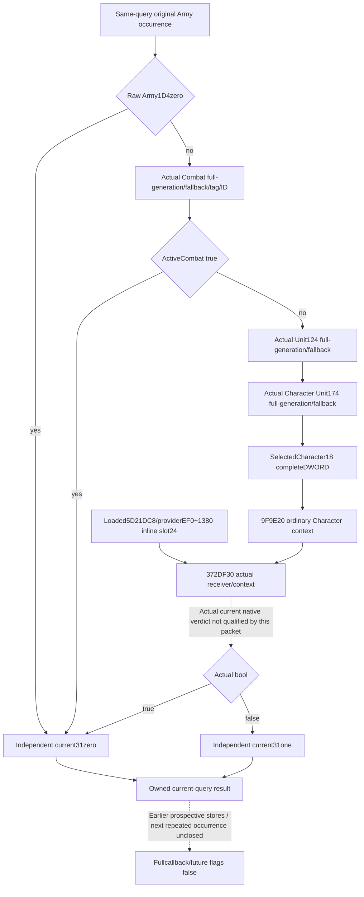

# Independent current Army31 observer — CK3 1.20.0.3

This implementation candidate supplies the last independent byte-input family following the source-closed numeric24/28 and current20/30/21 families. It reads the actual current Army1D4/Combat/owner operands and, only where demanded, evaluates the actual loaded **slot24** rule for the **selected Character18**. CachedArmy31 is retained as separate provenance. The new collector does not execute24DF3C0 or its Army stores.

The nine owned files were authored from committed `88296baf5e84805de3f6be5ba7ad236ad773b6f7`, extracted by git archive; Root's uncommitted current21 hooks were not read as a frozen baseline. The complete integrated candidate uses committed `be06a134b9a5472275e08ea452a8e3542b192fb8` in the explicitly authorized exclusive worktree `C:/codex-ck3-background/parallel-integrations-20261006/current31`, with all eight actual shared hooks connected. Root's `Z:/gb0` source remains untouched by this integration. Exact game identity is CK3 **1.20.0.3 Crozier / Steam25652598**, inherited EXE SHA `94B55397ABB687A3DCD436805A5D885E6BE90FA6C693FEB44A9E3BBEEADE02A6`, without new hash or EXE reads.

The original implementation stage was **research / implementation candidate, qualification pending**. Its independent current31 input subsequently reached **static-ready** through g104 FIRST(7 complete wholequery scenes/14 occurrences; native and sole full-Service GREEN). The October7 optional [actual Rule24 source-pin extension](army-current-rule24-source-pins-observer-12003.md) is a new source candidate, with its joint FIRST NOTRUN; current31 FIRST is not repeated. This package performs no build, native CTest, Python import/test, old wire replay, game/SDK/Steam/process/pipe operation or mutation of Root's main source. The eight shared integration files are connected only in the exclusive candidate worktree. Root owns adoption, compilation, the first new fixtures/consumer execution, paused verification and publication.

## Production inputs and readonly ABI

The held complete669-byte24DF3C0 callback compares rawArmy1D4 at24DF59F and writes31zero on equality. Nonzero1D4 calls held81-byte24E8360 at24DF5B2. Its actual activeCombat resulttrue also writeszero. False alone selects actual Unit/Character and calls1D65B00 at24DF635 with ECX24, EDXselectedCharacter18 and R8null. Actualruletrue writeszero; false writesone.

The raw Combat implementation preserves the complete24E8360 leaf: registry slot5D1DE70, actual fallback5D1DE18, Army128 fullDWORD, unsignedlow24/capacity2C/rows20/stride10/wholeobjectID8 generation match, then selectedmagicC==Comb and selectedID8!=FFFFFFFF. Null Combat store skipsArmy128; wrongmagic skips the later validity-ID read. FullID0 is legal. An unread demanded tag/ID is unknown, never fabricatedfalse.

Unit uses store5D1E380/fallback5D1E378, Army124 and wholeUnitID10 equality. Character uses store5C67568/fallback5C67570, Unit174 and wholeCharacterID18 equality. NullUnit store skipsArmy124; nullCharacter store skipsUnit174. The source then always supplies **selectedCharacter18** to the rule. It may differ from Unit174 on generation mismatch/fallback;0, high-bit andFFFFFFFF bits are preserved without caller-side positive-ID or magic admission.

The held complete229-byte1D65B00 wrapper confirms actualProviderEF0 plus selector*D0. Selector24 means **array+1380 inline receiver**, not a pointer-list entry or Rule43. The collector directly reads loadedprovider slot5D21DC8 and actualproviderEF0; missingprovider/array remains unavailable. It avoids1D65660's null diagnostic branch.

The exact ordinary APIs are `void*9F9E20(void*,const int32_t*)`, `void87E0E0(void*)` and `bool372DF30(const void*,void*)`. Reuse aligned0x168 owned scope storage and its actual returned context pointer. After successful construction, source kind4/subtype0/zero-extended completeDWORD payload8 are recorded as `9F9E20_normal_return`; token4..7 is not fabricated. Actual nativefalse includes current root-validation/applicability rejection and is a valid verdict.

## Candidate files and same-query seam

The nine owned files are the DTO, serializer, collector header, new native fixture, own CMake fragment, strict contract, pure projection, sole Service compound and this topic. DTO and signature/scene contract were frozen before implementation at `FINAL-DTO-SCENES-SIGNATURES.json` in the external packet.

Public binding/collector APIs are `BindCurrentArmyFlag31Inputs12003(base,sha)` and `ReadCurrentArmyFlag31Inputs12003(bindings,same_query_refresh)`. The family is `ArmyCurrentFlag31InputsV1`; the optional whole-row member is `current_army_flag31_inputs_v1`. The collector borrows only selected Army objects within the existing query callback, owns all resulting DTO data, copies the original roster and retains duplicate physicalArmy occurrences. Association requires native_index, raw fullDWORD and actual selected object identity matching the genuine same-query refresh capture.

The integrated owning callback adds the family beside20/21, captures it once, and distributes that owned family unchanged to both requested scope rows. The actual exact-build binder is installed at the adapter tail when `result.armies.enabled`; capability descriptor construction remains unchanged. Existing native revision/date and current-query context provide provenance. Independent current31 readiness does not depend on numeric24/28 or current20/21 ready flags, and does not raise `actual_refresh_execution_ready`, `actual_next_occurrence_ready`, `full_callback_ready`, `full_daily_assault_ready` or `full_monthly_ready`.

The Python strict leaf accepts the frozen closed DTO and checks source-declared readiness with the pure inverse. Pure projection makes no native calls/writes; actual cached31 remains separate from derivedcurrent31. Missing demanded readings, context or native evaluation have concrete reasons and null derived values. Availablezero and nativefalse remain distinct from unavailable. The actual slot24 evaluator could transitively read state changed by prospective preceding callback stores; the current-frame verdict is not a changed-stage or future result.

## Seven FIRST whole-query scenes

The native fixture uses genuine `ReadArmyStrengthsForScope` and `AppendArmyStrengthV1`, independently supplies real query-strength source data for20/40 soldiers and rawAIpower4000000, and captures the production post-admission family through Root's actual shared hook. Its global original roster contains two repetitions of the same high-bit ArmyID. Two requested subject scopes assert identical once-captured global inputs. Every exported sample is a complete production row.

The fixture intentionally uses synthetic world, bindings and ordinary constructor/evaluator/destructor callbacks. It checks actual inline slot24 receiver, selectedCharacter18 fullDWORD, temporary scope lifecycle, demand/order/fallback distinctions and unchanged world data. It does not execute the EXE's loaded predicate, claim actual slot24 truth or borrow any old compiled wire.

| Frozen scene | Independent result |
| --- | --- |
| source-zero-1d4-undemanded | 0; later fields/callbacks unused |
| active-combat-fullgen0-undemanded | 0; actual CombatID0 active, owner/rule unused |
| inactive-combat-wrong-magic-rule24-true | 0; nativecurrentruletrue, full rootFE000002 |
| inactive-combat-sentinel-rule24-false | 1; actualfallback Combat sentinel and rawUnit/CharacterID0 |
| null-stores-character-fallback-sentinel-rule24-false | 1; actual Character fallback18FFFFFFFF, Unit174 undemanded |
| missing-rule-evaluator-callable | Unknown; generation-mismatchfallback18=80000000 prefix retained |
| missing-demanded-combat-magic | Unknown; absenttag cannot become activeCombatfalse |

The CTest target is `xar_bridge_ck3_12003_army_flag31_inputs_test`; its `--wire-dir` writes `ck3_12003_army_flag31_inputs_wire.json` with seven complete native rows and14 original occurrences. One new compound in `test_army_current_flag31_service_12003.py` requires `XAR_ARMY_FLAG31_WIRE`, copies each whole row unchanged into the actual Service response and consumes strict → full Service → pure. There is no additional builder file or synthetic whole-row fallback. The Service frame42/native7/date10000 transport is explicitly synthetic. `XAR_ARMY_FLAG31_CASE_OUTPUT` records resulting outputs.

Root's exact shared snippets and first-producer/consumer commands are in external `ROOT-GLUE-AND-FIRST-WIRE-RECIPE.md`. This packet leaves their execution to Root: native first-case count0, sole Service-method executions0, paused samples0, newgame days0. Existing current20/current21 qualifications are unchanged.

## Remaining qualification

Root must adopt the coherent integrated candidate, build the production runtimes plus the one new fixture, execute the first new CTest once, then run the one sole Service compound against those actual complete wires. A later actual paused query must independently confirm the current31 source/root/receiver and native result before assigning production-live primitive. Completecallback, repeated occurrence, future transition and monthly/daily dispatch remain separate unfinished capabilities. Cached exact source costs remain unchanged: new EXE code0, metadata0, whole EXE hashes0.

Oct6/W41 completion, necessity, inputs, exact artifact paths, pending readiness and residuals are delivered externally for Root's report merge; this integrated source candidate does not edit shared reports, push or claim first qualification.

## October7 samecapture optional source pins

The new occurrence field rule24_source_pins_v1 is optional; old wire absence preserves the existing derive/readiness. Metadata captures real receiver vptr, actual58/60/C8 identities and modeBYTE with33B once per query/actual receiver, borrowing the existing provider/array. Pins are read before the existing context/evaluator gate and never invoke a captured target. Pure adds rule24_source_pins_projection_v1 only when the native capsule exists. Missingmode/C8 yields partial pin metadata without invalidating a genuinely available current31 verdict. [Source/ABI and next frontier](army-current-rule24-source-pins-observer-12003.md) retains actual-loaded-callee unknowns; no historicalRule43 replacement or future/fullcallback claim.

The original sections above retain their pre-FIRST counts as historical source-stage records. Actual g104 FIRST receipts are at Z:/ck3_mod_rewrite_process_assets/g2-parallel-20261006/army-current31/implementation-head88296baf/ROOT-FIRST-g104-DELIVERY.json. The new14scene combined fixture/sole consumer remain NOTRUN for Root joint.
