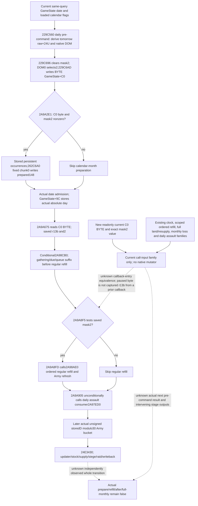

# Current calendar-month preparation/refill call input — exact1.20.0.3

This source-first package identifies one actual call input absent from Root's
frozen g104 source `71b729f0cc4894331f1dadb89155920fccd42a00`: the **BYTE** at
`GameState+C0`, specifically mask `2`. It does not propose another refill,
current supply rate, loss budget or roster reconstruction. Exact build/SHA
`1.20.0.3 / Steam25652598 / 94B55397ABB687A3DCD436805A5D885E6BE90FA6C693FEB44A9E3BBEEADE02A6`
are reused metadata; no EXE byte or hash was read.

The native Mermaid below was frozen before candidate code in
[NATIVE-TREE.mmd](Z:/ck3_mod_rewrite_process_assets/g2-parallel-20261006/army-supply-tick/followups/monthly-supply/NATIVE-TREE.mmd).
Source/implementation order and scope were frozen in
[SOURCE-FIRST-PLAN.json](Z:/ck3_mod_rewrite_process_assets/g2-parallel-20261006/army-supply-tick/followups/monthly-supply/SOURCE-FIRST-PLAN.json).
All source-closed edges are cache-derived static evidence, and unfinished
frame/callback/actual-outcome edges are dashed.

The cached calendar pre-command `229C560` calculates tomorrow's native date,
looks up native day-of-month, clears mask2 at `229C696`, selects2 for DOM0, and
stores the byte at `229C6AD`. The preparation caller tests exactly
`test byte ptr [GameState+C0],2` at `2A9A2E1`; zero skips the entire ordered
persistent `262C6A0` loop. Post-date `2A9A675` reads that byte and saves only
mask2 in `r13b`. The saved value gates cleanup at `2A9A68D` and, after gathering
and earlier queue work, regular refill `2A9A8FD -> 2A98AE0`. It then calls daily
assault `2A9A905 -> 2A97ED0` without this month-first gate. Neither stock supply
dispatch nor daily assault loss can be suppressed merely because this mask is0.

Evidence is the cached exact-build `gamestate-calendar-pre-callee.asm.txt`,
`army-pre-stage-entry.asm.txt` and `neighbor-manager-daily-entry.asm.txt` under
`Z:/ck3_mod_rewrite_process_assets/g2-resume-20261004/army-monthly-update-order-v61/source-clock-new-spans/`.
Canonical source order and previously qualified scope are reused from
`Z:/gb0/docs/ck3-native-ai/{army-monthly-update-order-12003.md,army-monthly-manager-prepared-stage-inputs-12003.md,army-ordered-regular-refill-projection-plan-12003.md,army-monthly-supply-stock-assembly-inputs-12003.md}`.

The g104 timing DTO already provides current date/day/bucket/success/grace.
Its scoped ordered refill already supplies matching manager occurrence positions
and repeats, complete seven physical chunks, observed prepared148 and independent
predicate/cleanup context. Selected monthly assembly and full land/resupply,
Province usage, month/daily loss and current20/21 remain their existing inputs.
None publishes this raw calendar byte or actual call gate. That specific absence,
together with both native caller tests, is the necessity for an additive observer.

The smallest observer publishes `current_month_first_refill_call_inputs_v1`
on the existing Strength row: subject Unit/CArmy identities, raw unsigned8
calendar flags and `(raw & 2) != 0`, plus finite readiness/reason. Name the
mask explicitly: mask2 is mathematical bit index1, not index2/mask4. Existing
same-query clock/source metadata supplies the date; duplicating a new date or
recalculating the already qualified calendar clock is unnecessary.

This raw byte determines only the branch **if supplied as the coherent caller
entry value**. A paused query does not observe a prior callback's saved register
`r13b`, identify which preparation already executed, or freeze the next
`229C560` result. Actual preparation/refill/after and full-monthly flags stayfalse.
The observer removes one real monthly call-input gap; it does not by itself
deliver a whole monthly transition or a continue-versus-leave battle policy.
Those consumers still require their source-defined stage frame and independent
actual before/after evidence. Pending, detachment and current31 remain other
owners and are not modified by this packet.

Status at source freeze: `research`; candidate source and Root FIRST fixture
come next. New EXE reads/hashes, tests/imports/builds, CK3/SDK/process/Git and
shared tree writes are0. Root owns adoption, qualification, reports and push.

The subsequent candidate is now **SOURCE_PREPARED / NOTRUN** in this external
packet. It includes the dependency-free DTO, exact-build binder/readonly BYTE
reader, serializer, strict normalizer, actual whole Strength native fixture,
CMake FIRST target and one new actual-Service consumer method. No numerical
projection or policy is added. The shared-hook patch is supplied for Root's
integration, and this lane has not applied it to a shared source tree.

Six FIRST fixture rows use independent literal flags0/1/2/3/255 and an unavailable
GameState. For all readable cases the same synthetic date is1000, so a calendar
reconstruction cannot stand in for the changing observed byte. Adjacent C1/C2
bytes are255: the payload must remain the exact single unsigned8 C0 value.
The unavailable row retains its independently available original Strength
aggregates and null new operands rather than inventing flag0. The fixture calls
the actual `ReadArmyStrengthsForScope` and `AppendArmyStrengthV1`, without a
direct-leaf transplant. The one new Python consumer calls the actual service
constructor/query and strict normalizer on the six unchanged whole native rows.
Only its required snapshot/capability/envelope metadata is explicitly synthetic.
Original scalars, nulls, readiness and raw new-family fields remain unchanged;
all actual preparation/refill/after/full-monthly flags stayfalse.

No native target, Python method, import or build has run. No wire currently
exists by virtue of this preparation. Root must preserve FIRST outcomes and
source identity before any qualification claim. A paused production capture and
actual before/after monthly stage remain separate future work.
