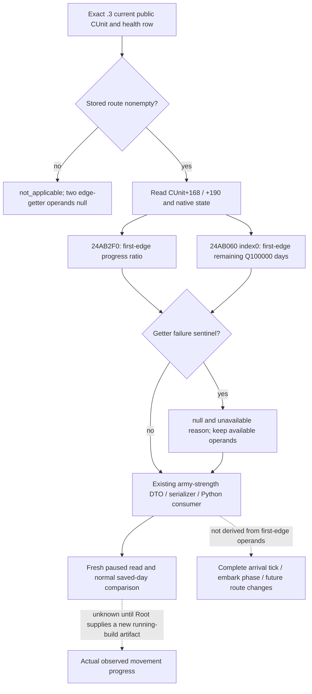

# CK3 1.20.0.3: current first-edge army movement progress

2026-10-04. Exact build **1.20.0.3 / Steam 25652598**, EXE SHA-256
`94B55397ABB687A3DCD436805A5D885E6BE90FA6C693FEB44A9E3BBEEADE02A6`.

Root's ordinary Robert campaign R0029 observed new army301989997 still in2619
with committed route `[8651,1038,472]` after eight normally saved calendar days.
Enemy268435597 likewise remained in510 on its committed route to470. Current
province and route alone cannot distinguish accumulated first-edge travel from
a stalled march. These observations establish an input need; they do not
establish a movement failure or authorize a speculative redirection.

The native tree was published before this observer in
[committed march timing](army-march-remaining-timeline-12003.md) and
[native movement speed](army-movement-speed-composition-12003.md). Their exact
.3 span pins are reused. The existing route-contact literal already publishes
rounded committed-route arrival dates, whereas the reinforcement-assignment
query's first-edge duration requires an army-AI coordinator binding. The new
fields directly read the selected CUnit through the existing
`ck3_query_army_strengths`; they require no AI assignment or new MCP tool.

## Closed native inputs

| Field | Exact .3 source | Meaning |
|---|---|---|
| `unit_state_raw` | CUnit's existing native state | Current state enum, not an inferred embark phase |
| `accumulated_movement_weight_raw` | CUnit+0x168, signed64 | Accumulated movement-weight on the committed first edge; not elapsed days |
| `cached_edge_speed_raw` | CUnit+0x190, signed64 | Native cached edge-rate value; not a whole-route speed forecast |
| `normalized_edge_progress` | `0x24AB2F0(unit,out)` | Signed64 native first-edge ratio, scale100000; preserve the native value without clamping |
| `first_route_edge_remaining_duration` | `0x24AB060(unit,out,0)` | Signed64 first-edge remaining duration, scale100000 days |

`0x24AB2F0` can return native0 for an absent route or retreat-state1. Route
absence is published as `not_applicable` with null edge-getter operands, while a
moving army's actual raw0 remains a legal observation. Both getters' failure
sentinel is **positive4294967295**, not signed-1. A failed or absent
getter retains null and an unavailable reason; it does not become a zero-day
edge. Negative signed values, if returned normally, retain their native meaning.



## Existing query and additive response

After a fresh paused snapshot, call the existing
`ck3_query_army_strengths(army_ids=[301989997,268435597], expected_revision=<fresh>)`.
Each existing health row can additionally contain `current_movement_progress`:

```json
{
  "status": "available",
  "source": "native_current_route_edge",
  "unit_state_raw": 7,
  "accumulated_movement_weight_raw": 0,
  "cached_edge_speed_raw": 0,
  "normalized_edge_progress": {"raw": 0, "scale": 100000},
  "first_route_edge_remaining_duration": {"raw": 0, "scale": 100000},
  "unavailable_reason": null
}
```

The example illustrates legitimate raw0 shape only; it is synthetic and does
not report Robert's actual progress or speed. Optional absence preserves old
responses. Within an observed block, null remains distinct from0. Its status
does not change army controllability, command eligibility or existing readiness.
The existing service and native driver already pass health rows through the
production normalizer, so their tool and action interfaces are unchanged.

## Verification and readiness

Implementation and the unique focused production-cross-layer fixture are
assembled outside the shared tree. Root alone adopts source, commits, builds
the complete native DLL and operates SDK/CK3. The two cases exercised the real
army reader, DTO and serializer and fed those emitted responses to the real
Python army-strength normalizer, **GREEN on their first actual execution**.
Assertions retain real0, missing-callback null, complete-empty-route getter
nonexecution, both positive4294967295 sentinels, signed negative duration and
old binding omission. The two required native translation units use strict
`/W4 /WX` compilation. The first compile attempt had a **HARNESS RED** from the
new test's nonexistent `Snapshot.played_character.character_id`; the fixture
corrected that one field to `played_character_id` and recompiled only the test
translation unit, reusing the already successful production army object. No
capability RED or previous matrix rerun occurred. The failure remains retained.
Final result and file pins are indexed
in `Z:/ck3_mod_rewrite_process_assets/g2-resume-20261004/movement-progress/ROOT-DELIVERY.json`.

This package adds **zero live calls, actions and gameplay days**. Until the
new observer is deployed and a fresh paused response is supplied, its boundary
is **static-ready**. A new live response can qualify
the read primitive; only independently observed progress or arrival across
normal saved days can qualify the corresponding movement loop. Existing
successful march loops remain intact. Complete ETA, exact arrival tick,
embark phase and native AI destination scoring are not supplied by this package.

## R0029 prestop: actual five-public-unit health query, 2026-10-04

The original four Sway reads preceded this distinct zero-day health frame.
Root's prestop `012-ck3_query_army_strengths.json` is bound to **native169 /
public2 / raw53252424 / paused true**, existing scope
`player-and-active-war-participants`, accepted true and partial scope status.
The request explicitly selected five public IDs. Its source version and EXE
SHA fields are null; the surrounding Root runtime is R0029 / g61 frozen f3 /
PID38372. These enclosing runtime facts are not fabricated payload fields.
The raw body was consumed once into
`Z:/ck3_mod_rewrite_process_assets/g2-resume-20261004/movement-progress/prestop-r29/RAW012-CACHED-BODY.json`;
its original160675 bytes have SHA-256
`1de1ebf31b9243ca68ef91fb8510de899382b3466d4680f49a7ffec70189b079`.

| Public CUnit | Observed CArmy | Published role | Soldiers / maximum | Regiments | Supply / capacity | Monthly supply change | Attrition fraction |
|---:|---:|---|---:|---:|---:|---:|---:|
| 184549452 | 167772208 | player | 3000 / 3000 | 24 | 95.45305 / 100 | +20 | 0 |
| 301989997 | 201326670 | player | 3693 / 3884 | 41 | 300 / 300 | 0 | 0 |
| 285212904 | null | player | null / null | null | unavailable | unavailable | unavailable |
| 268435597 | 184549476 | active_war_enemy | 2459 / 4702 | 41 | 300 / 300 | 0 | 0 |
| 100663351 | null | active_war_enemy | null / null | null | unavailable | unavailable | unavailable |

All displayed supply, capacity, monthly change and attrition values divide
their actual signed raw value by the published100000 scale. The unavailable
rows report `native_carmy_not_found`; they are neither observed zero-soldier
armies nor independently observed new CArmy formations. No soldiers total is
constructed from five public IDs. This health response does not publish unit
kind, exact army/fleet type or owner CharacterID, so the role labels cannot
prove an owner identity or marine/land association.

The deployed g61 `ck3_12002_army.cpp` health reader uses CUnit+0x178 to resolve
CArmy (`Strength`, lines207–211). The already published
[movement speed tree](army-movement-speed-composition-12003.md) separately
describes a carrier path through CUnit+0x17C, CFleet+0x1C. That existing source
distinction explains the limit of this health path; it does not prove that the
two new public IDs are fleet shadows, new armies, replacements or duplicates.
No new ABI audit, bridge code or test is required for this file consumption.

The `current_movement_progress` block is **absent in all five rows**, as expected
for the running R0029 f3 DLL. The new progress implementation committed by Root
as `b513f020` remains **static-ready** pending its new DLL and paused observation;
this receipt does not promote it to live. Existing health observations remain
production-live primitives with their partial public-ID coverage. Root's
enclosing calendar totals are4504 / resumed1351 / Oct4+479; this zero-day
consumer adds no query, action or day credit. The reusable cache, summary,
report fields and owned one-topic patch are indexed in this lane's
`prestop-r29/ROOT-DELIVERY.json`.

## R0030: first actual paused movement-progress primitive, 2026-10-04

This new frame supersedes the preceding predeployment readiness boundary for
the selected available movement-progress inputs. Root deployed the unified
g62/d1 source as **R0030**, execution
`72457e9f-d8f2-4350-b08c-0f5683d37e5b`, native PID120956, DLL SHA-256
`91cc62d12eb7839582254fce443bf5dea8c5518402867f2cab28b27cbc6938b7`,
environment SHA-256
`b17543f45334043db6725c4183ae3ab2f59fa7645de4ec7443ffe303b7eb6a29`.
The original four Sway queries ran first, before any advance. The subsequent
`012-ck3_query_army_strengths.json` selected exactly public IDs184549452,
301989997 and268435597; all three health rows are available. The query's
overall available result retains `scope_status=partial` for the wider scope;
unrequested public IDs are not added to this receipt's health coverage.

The actual source frame is **native3 / public2 / raw53252424 / paused true**.
Payload version/EXE fields remain null; the deployment envelope above supplies
the running identity rather than fabricating those fields. The original body
was consumed **once**,161205 bytes, SHA-256
`ac45d9b15b54c99351bb99ae9b5d6b5ff18517f810942584513f09bc475dd1bb`.
Its frozen cache and parsed summary are indexed in
`Z:/ck3_mod_rewrite_process_assets/g2-resume-20261004/movement-progress/first-live-r30/ROOT-DELIVERY.json`.

| Public CUnit / CArmy | Actual state raw | Movement status | Accumulated movement-weight raw | Cached edge-speed raw | Native progress raw / scale | First-edge remaining raw / scale |
|---|---:|---|---:|---:|---|---|
| 184549452 / 167772208 | 1 | not_applicable | 0 | 0 | null | null |
| 301989997 / 201326670 | 4 | available | 451428 | 0 | 45142 / 100000 | 548572 / 100000 days |
| 268435597 / 184549476 | 4 | available | 7350000 | 0 | 95454 / 100000 | 10144 / 100000 days |

All three `unavailable_reason` fields are null. The old regular army's empty
route correctly publishes not_applicable and null edge-getter operands instead
of a zero remaining-time promise. New army301989997 has **45.142%** native
first-edge progress and **5.48572 native days** remaining on that first edge.
Root's enclosing snapshot places it in1038 with current committed route `[472]`;
the health block itself does not serialize that path. Enemy268435597 has
**95.454%** native first-edge progress and **0.10144 native days** remaining.
The two cached edge-speed raw0 values are actual cache contents, not proof of
zero current effective speed, a stuck army or missing getters. Accumulated
movement-weight is not elapsed time.

Selected health facts remain: old army3000/3000 soldiers and24 regiments;
new player army3693/3884 and41; enemy2459/4702 and41. Supply/capacity are
95.45305/100,300/300 and300/300 respectively; current attrition fraction is
observed0 in all three. These are current observations, not battle win odds.

The new native reader, DTO, serializer and existing production Python consumer
now have **production-live primitive** evidence for both moving selected
armies, with the independent old-empty-route not_applicable branch also
observed. No additional callback binding or schema field is missing for this
first-edge decision. The observed5.48572-day operand can inform a bounded
normal-day window with independent arrival/contact re-observation; it is not
an exact completion tick or a promised whole-route ETA. Only a later real
advance and independently observed progress or arrival can qualify a new
movement-progress loop. Exact arrival tick, complete future ETA, explicit
embark phase and AI destination scoring remain outside this receipt.

Root's closed SDK59491 completed a same-date normal SAVE after these original
four queries, health, occupation and planning reads. Date53252424 and4504
total saved calendar days are unchanged. This file-only consumer adds **0 SDK
calls,0 actions,0 days and0 tests**, and leaves the original R0029 body untouched.
The earlier focused HARNESS RED and successful actual two-case execution remain
their own retained evidence; they were not rerun for this live receipt.

## R0030 six normal saved days: actual landfall and empty-route verification

The next distinct health response is Root's
`actual-r30-landfall-six-siege-current-operands-01/004-ck3_query_army_strengths.json`.
It was consumed once into the `movement-progress/landfall-six-r30` cache:
160955 original bytes, SHA-256
`ad1df52ea5bfaa672c02f2d7768b1bd8ab5af7e9658447a894ce524378cfc152`.
All three selected health rows are available at **native31 / public2 /
raw53252568 / paused true**. The enclosing scope remains partial. The prior
R0030 first frame is reused through its frozen parsed cache, with no repeat
read of the original packet. The observed date difference is
53252424→53252568, **144 raw hours / six calendar days**, and Root reports
these as six real normal saved days.

| Public CUnit / same CArmy | Soldiers / maximum / regiments | Supply / capacity | Current monthly supply | Current attrition fraction | Movement state/status | Cache raw / accumulated raw |
|---|---|---|---:|---:|---|---|
| 184549452 / 167772208 | 3000 / 3000 / 24 | 95.45305 / 100 | +20 | 0 | 1 / not_applicable | 525000 / 0 |
| 301989997 / 201326670 | 3693 / 3884 / 41 | 300 / 300 | -1.81818 | 0.01 | 3 / not_applicable | 100000 / 0 |
| 268435597 / 184549476 | 2459 / 4702 / 41 | 300 / 300 | 0 | 0 | 4 / available | 3450000 / 6750000 |

All three troop counts, maxima, regiment counts and supplies match the first
R0030 frame. New army301's current attrition changed from raw0 to
raw1000/100000 (**0.01**), and monthly supply change from raw0 to
raw-181818/100000 (**-1.81818**). Those current operands do not establish any
future casualty count or elapsed supply loss. Its state is now3, sieging;
movement is not_applicable with **both edge getters null**, accumulated0 and
cached100000. Old regular army184 also retains not_applicable/null while its
cache becomes525000; a cache value is an independent observed operand and
does not create an active edge.

Root independently observed301 at **province472**, sieging/code3 with a
**complete empty route**. Province and path are enclosing snapshot evidence,
not newly invented fields in this health response. The prior first-edge
5.48572-day estimate remains a historical decision input. Actual arrival is
established by the later paused location/state/route observation, rather than
by subtracting six days from that estimate or setting its value to zero.

Enemy268's current first-edge progress is raw42993/100000 (**42.993%**), and
remaining duration raw259420/100000 (**2.5942 native days**), with no
unavailable reason. The first frame's95.454% and0.10144-day values described
that earlier first edge. Across a six-day march, edge-local accumulator and
progress can reset or refer to another edge; these two responses do not
identify a common edge or prove backward travel, a stall or a duration
forecast failure. The current values inform its current edge only.

The first available native inputs → Root's bounded normal-day operation →
independently observed472 landfall → current empty-edge not_applicable/null
form a **finite production-live movement/arrival verification loop**. Normal
save-pair sealing and the six-day calendar credit belong to Root's day ledger;
this consumer adds **zero days**. This scope establishes arrival and current
sieging state. It does not establish a siege completion, occupation change,
battle victory or complete war. Root's total4510 is supplied as pending ledger
seal; natural succession remains0. The file-only consumer performed0 SDK
calls,0 window operations,0 tests and0 shared/Git changes. The one-topic
append, cache comparison and Oct4/W40 report fields are indexed at
`Z:/ck3_mod_rewrite_process_assets/g2-resume-20261004/movement-progress/landfall-six-r30/ROOT-DELIVERY.json`.
