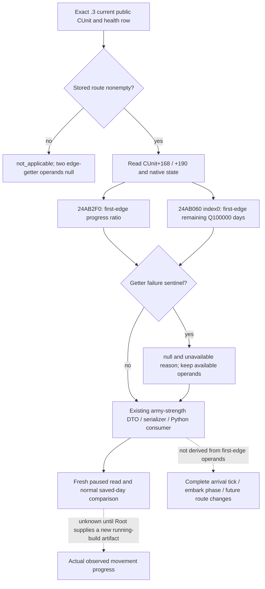

# CK3 1.20.0.3: current first-edge army movement progress

2026-10-04. Exact build **1.20.0.3 / Steam 25652598**, EXE SHA-256
`94B55397ABB687A3DCD436805A5D885E6BE90FA6C693FEB44A9E3BBEEADE02A6`.

Root's ordinary Robert campaign R0029 observed new army301989997 still in2619
with committed route `[8651,1038,472]` after eight normally saved calendar days.
Enemy268435597 likewise remained in510 on its committed route to470. Current
province and route alone cannot distinguish accumulated first-edge travel from
a stalled march. These observations establish an input need; they do not
establish a movement failure or authorize a speculative redirection.

The native tree was published before this observer in
[committed march timing](army-march-remaining-timeline-12003.md) and
[native movement speed](army-movement-speed-composition-12003.md). Their exact
.3 span pins are reused. The existing route-contact literal already publishes
rounded committed-route arrival dates, whereas the reinforcement-assignment
query's first-edge duration requires an army-AI coordinator binding. The new
fields directly read the selected CUnit through the existing
`ck3_query_army_strengths`; they require no AI assignment or new MCP tool.

## Closed native inputs

| Field | Exact .3 source | Meaning |
|---|---|---|
| `unit_state_raw` | CUnit's existing native state | Current state enum, not an inferred embark phase |
| `accumulated_movement_weight_raw` | CUnit+0x168, signed64 | Accumulated movement-weight on the committed first edge; not elapsed days |
| `cached_edge_speed_raw` | CUnit+0x190, signed64 | Native cached edge-rate value; not a whole-route speed forecast |
| `normalized_edge_progress` | `0x24AB2F0(unit,out)` | Signed64 native first-edge ratio, scale100000; preserve the native value without clamping |
| `first_route_edge_remaining_duration` | `0x24AB060(unit,out,0)` | Signed64 first-edge remaining duration, scale100000 days |

`0x24AB2F0` can return native0 for an absent route or retreat-state1. Route
absence is published as `not_applicable` with null edge-getter operands, while a
moving army's actual raw0 remains a legal observation. Both getters' failure
sentinel is **positive4294967295**, not signed-1. A failed or absent
getter retains null and an unavailable reason; it does not become a zero-day
edge. Negative signed values, if returned normally, retain their native meaning.



## Existing query and additive response

After a fresh paused snapshot, call the existing
`ck3_query_army_strengths(army_ids=[301989997,268435597], expected_revision=<fresh>)`.
Each existing health row can additionally contain `current_movement_progress`:

```json
{
  "status": "available",
  "source": "native_current_route_edge",
  "unit_state_raw": 7,
  "accumulated_movement_weight_raw": 0,
  "cached_edge_speed_raw": 0,
  "normalized_edge_progress": {"raw": 0, "scale": 100000},
  "first_route_edge_remaining_duration": {"raw": 0, "scale": 100000},
  "unavailable_reason": null
}
```

The example illustrates legitimate raw0 shape only; it is synthetic and does
not report Robert's actual progress or speed. Optional absence preserves old
responses. Within an observed block, null remains distinct from0. Its status
does not change army controllability, command eligibility or existing readiness.
The existing service and native driver already pass health rows through the
production normalizer, so their tool and action interfaces are unchanged.

## Verification and readiness

Implementation and the unique focused production-cross-layer fixture are
assembled outside the shared tree. Root alone adopts source, commits, builds
the complete native DLL and operates SDK/CK3. The two cases exercised the real
army reader, DTO and serializer and fed those emitted responses to the real
Python army-strength normalizer, **GREEN on their first actual execution**.
Assertions retain real0, missing-callback null, complete-empty-route getter
nonexecution, both positive4294967295 sentinels, signed negative duration and
old binding omission. The two required native translation units use strict
`/W4 /WX` compilation. The first compile attempt had a **HARNESS RED** from the
new test's nonexistent `Snapshot.played_character.character_id`; the fixture
corrected that one field to `played_character_id` and recompiled only the test
translation unit, reusing the already successful production army object. No
capability RED or previous matrix rerun occurred. The failure remains retained.
Final result and file pins are indexed
in `Z:/ck3_mod_rewrite_process_assets/g2-resume-20261004/movement-progress/ROOT-DELIVERY.json`.

This package adds **zero live calls, actions and gameplay days**. Until the
new observer is deployed and a fresh paused response is supplied, its boundary
is **static-ready**. A new live response can qualify
the read primitive; only independently observed progress or arrival across
normal saved days can qualify the corresponding movement loop. Existing
successful march loops remain intact. Complete ETA, exact arrival tick,
embark phase and native AI destination scoring are not supplied by this package.

## R0029 prestop: actual five-public-unit health query, 2026-10-04

The original four Sway reads preceded this distinct zero-day health frame.
Root's prestop `012-ck3_query_army_strengths.json` is bound to **native169 /
public2 / raw53252424 / paused true**, existing scope
`player-and-active-war-participants`, accepted true and partial scope status.
The request explicitly selected five public IDs. Its source version and EXE
SHA fields are null; the surrounding Root runtime is R0029 / g61 frozen f3 /
PID38372. These enclosing runtime facts are not fabricated payload fields.
The raw body was consumed once into
`Z:/ck3_mod_rewrite_process_assets/g2-resume-20261004/movement-progress/prestop-r29/RAW012-CACHED-BODY.json`;
its original160675 bytes have SHA-256
`1de1ebf31b9243ca68ef91fb8510de899382b3466d4680f49a7ffec70189b079`.

| Public CUnit | Observed CArmy | Published role | Soldiers / maximum | Regiments | Supply / capacity | Monthly supply change | Attrition fraction |
|---:|---:|---|---:|---:|---:|---:|---:|
| 184549452 | 167772208 | player | 3000 / 3000 | 24 | 95.45305 / 100 | +20 | 0 |
| 301989997 | 201326670 | player | 3693 / 3884 | 41 | 300 / 300 | 0 | 0 |
| 285212904 | null | player | null / null | null | unavailable | unavailable | unavailable |
| 268435597 | 184549476 | active_war_enemy | 2459 / 4702 | 41 | 300 / 300 | 0 | 0 |
| 100663351 | null | active_war_enemy | null / null | null | unavailable | unavailable | unavailable |

All displayed supply, capacity, monthly change and attrition values divide
their actual signed raw value by the published100000 scale. The unavailable
rows report `native_carmy_not_found`; they are neither observed zero-soldier
armies nor independently observed new CArmy formations. No soldiers total is
constructed from five public IDs. This health response does not publish unit
kind, exact army/fleet type or owner CharacterID, so the role labels cannot
prove an owner identity or marine/land association.

The deployed g61 `ck3_12002_army.cpp` health reader uses CUnit+0x178 to resolve
CArmy (`Strength`, lines207–211). The already published
[movement speed tree](army-movement-speed-composition-12003.md) separately
describes a carrier path through CUnit+0x17C, CFleet+0x1C. That existing source
distinction explains the limit of this health path; it does not prove that the
two new public IDs are fleet shadows, new armies, replacements or duplicates.
No new ABI audit, bridge code or test is required for this file consumption.

The `current_movement_progress` block is **absent in all five rows**, as expected
for the running R0029 f3 DLL. The new progress implementation committed by Root
as `b513f020` remains **static-ready** pending its new DLL and paused observation;
this receipt does not promote it to live. Existing health observations remain
production-live primitives with their partial public-ID coverage. Root's
enclosing calendar totals are4504 / resumed1351 / Oct4+479; this zero-day
consumer adds no query, action or day credit. The reusable cache, summary,
report fields and owned one-topic patch are indexed in this lane's
`prestop-r29/ROOT-DELIVERY.json`.
