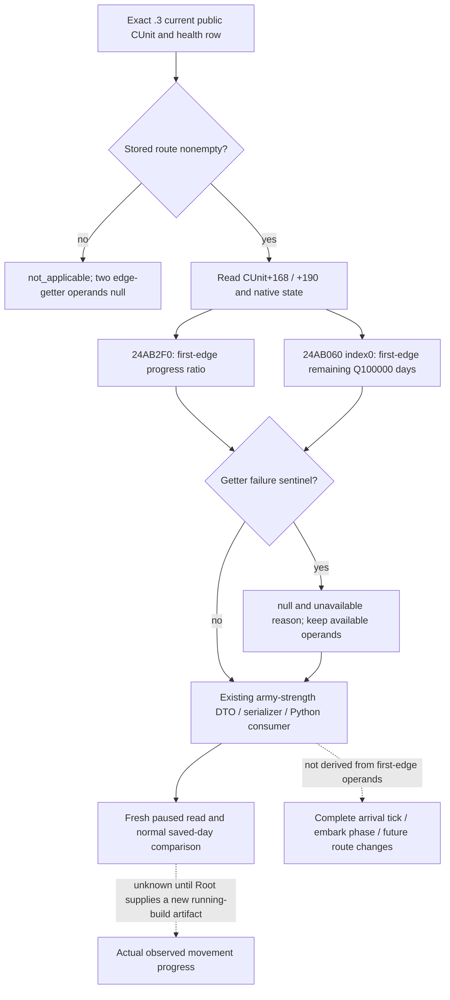
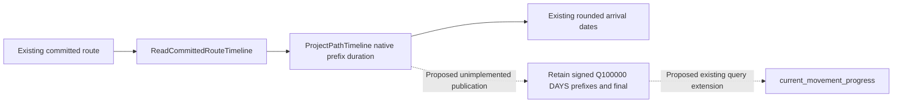
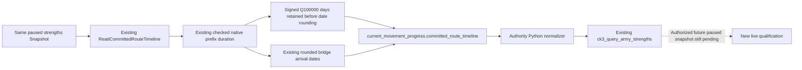

# CK3 1.20.0.3: current first-edge army movement progress

2026-10-04. Exact build **1.20.0.3 / Steam 25652598**, EXE SHA-256
`94B55397ABB687A3DCD436805A5D885E6BE90FA6C693FEB44A9E3BBEEADE02A6`.

Root's ordinary Robert campaign R0029 observed new army301989997 still in2619
with committed route `[8651,1038,472]` after eight normally saved calendar days.
Enemy268435597 likewise remained in510 on its committed route to470. Current
province and route alone cannot distinguish accumulated first-edge travel from
a stalled march. These observations establish an input need; they do not
establish a movement failure or authorize a speculative redirection.

The native tree was published before this observer in
[committed march timing](army-march-remaining-timeline-12003.md) and
[native movement speed](army-movement-speed-composition-12003.md). Their exact
.3 span pins are reused. The existing route-contact literal already publishes
rounded committed-route arrival dates, whereas the reinforcement-assignment
query's first-edge duration requires an army-AI coordinator binding. The new
fields directly read the selected CUnit through the existing
`ck3_query_army_strengths`; they require no AI assignment or new MCP tool.

## Closed native inputs

| Field | Exact .3 source | Meaning |
|---|---|---|
| `unit_state_raw` | CUnit's existing native state | Current state enum, not an inferred embark phase |
| `accumulated_movement_weight_raw` | CUnit+0x168, signed64 | Accumulated movement-weight on the committed first edge; not elapsed days |
| `cached_edge_speed_raw` | CUnit+0x190, signed64 | Native cached edge-rate value; not a whole-route speed forecast |
| `normalized_edge_progress` | `0x24AB2F0(unit,out)` | Signed64 native first-edge ratio, scale100000; preserve the native value without clamping |
| `first_route_edge_remaining_duration` | `0x24AB060(unit,out,0)` | Signed64 first-edge remaining duration, scale100000 days |

`0x24AB2F0` can return native0 for an absent route or retreat-state1. Route
absence is published as `not_applicable` with null edge-getter operands, while a
moving army's actual raw0 remains a legal observation. Both getters' failure
sentinel is **positive4294967295**, not signed-1. A failed or absent
getter retains null and an unavailable reason; it does not become a zero-day
edge. Negative signed values, if returned normally, retain their native meaning.



## Existing query and additive response

After a fresh paused snapshot, call the existing
`ck3_query_army_strengths(army_ids=[301989997,268435597], expected_revision=<fresh>)`.
Each existing health row can additionally contain `current_movement_progress`:

```json
{
  "status": "available",
  "source": "native_current_route_edge",
  "unit_state_raw": 7,
  "accumulated_movement_weight_raw": 0,
  "cached_edge_speed_raw": 0,
  "normalized_edge_progress": {"raw": 0, "scale": 100000},
  "first_route_edge_remaining_duration": {"raw": 0, "scale": 100000},
  "unavailable_reason": null
}
```

The example illustrates legitimate raw0 shape only; it is synthetic and does
not report Robert's actual progress or speed. Optional absence preserves old
responses. Within an observed block, null remains distinct from0. Its status
does not change army controllability, command eligibility or existing readiness.
The existing service and native driver already pass health rows through the
production normalizer, so their tool and action interfaces are unchanged.

## Verification and readiness

Implementation and the unique focused production-cross-layer fixture are
assembled outside the shared tree. Root alone adopts source, commits, builds
the complete native DLL and operates SDK/CK3. The two cases exercised the real
army reader, DTO and serializer and fed those emitted responses to the real
Python army-strength normalizer, **GREEN on their first actual execution**.
Assertions retain real0, missing-callback null, complete-empty-route getter
nonexecution, both positive4294967295 sentinels, signed negative duration and
old binding omission. The two required native translation units use strict
`/W4 /WX` compilation. The first compile attempt had a **HARNESS RED** from the
new test's nonexistent `Snapshot.played_character.character_id`; the fixture
corrected that one field to `played_character_id` and recompiled only the test
translation unit, reusing the already successful production army object. No
capability RED or previous matrix rerun occurred. The failure remains retained.
Final result and file pins are indexed
in `Z:/ck3_mod_rewrite_process_assets/g2-resume-20261004/movement-progress/ROOT-DELIVERY.json`.

This package adds **zero live calls, actions and gameplay days**. Until the
new observer is deployed and a fresh paused response is supplied, its boundary
is **static-ready**. A new live response can qualify
the read primitive; only independently observed progress or arrival across
normal saved days can qualify the corresponding movement loop. Existing
successful march loops remain intact. Complete ETA, exact arrival tick,
embark phase and native AI destination scoring are not supplied by this package.

## R0029 prestop: actual five-public-unit health query, 2026-10-04

The original four Sway reads preceded this distinct zero-day health frame.
Root's prestop `012-ck3_query_army_strengths.json` is bound to **native169 /
public2 / raw53252424 / paused true**, existing scope
`player-and-active-war-participants`, accepted true and partial scope status.
The request explicitly selected five public IDs. Its source version and EXE
SHA fields are null; the surrounding Root runtime is R0029 / g61 frozen f3 /
PID38372. These enclosing runtime facts are not fabricated payload fields.
The raw body was consumed once into
`Z:/ck3_mod_rewrite_process_assets/g2-resume-20261004/movement-progress/prestop-r29/RAW012-CACHED-BODY.json`;
its original160675 bytes have SHA-256
`1de1ebf31b9243ca68ef91fb8510de899382b3466d4680f49a7ffec70189b079`.

| Public CUnit | Observed CArmy | Published role | Soldiers / maximum | Regiments | Supply / capacity | Monthly supply change | Attrition fraction |
|---:|---:|---|---:|---:|---:|---:|---:|
| 184549452 | 167772208 | player | 3000 / 3000 | 24 | 95.45305 / 100 | +20 | 0 |
| 301989997 | 201326670 | player | 3693 / 3884 | 41 | 300 / 300 | 0 | 0 |
| 285212904 | null | player | null / null | null | unavailable | unavailable | unavailable |
| 268435597 | 184549476 | active_war_enemy | 2459 / 4702 | 41 | 300 / 300 | 0 | 0 |
| 100663351 | null | active_war_enemy | null / null | null | unavailable | unavailable | unavailable |

All displayed supply, capacity, monthly change and attrition values divide
their actual signed raw value by the published100000 scale. The unavailable
rows report `native_carmy_not_found`; they are neither observed zero-soldier
armies nor independently observed new CArmy formations. No soldiers total is
constructed from five public IDs. This health response does not publish unit
kind, exact army/fleet type or owner CharacterID, so the role labels cannot
prove an owner identity or marine/land association.

The deployed g61 `ck3_12002_army.cpp` health reader uses CUnit+0x178 to resolve
CArmy (`Strength`, lines207–211). The already published
[movement speed tree](army-movement-speed-composition-12003.md) separately
describes a carrier path through CUnit+0x17C, CFleet+0x1C. That existing source
distinction explains the limit of this health path; it does not prove that the
two new public IDs are fleet shadows, new armies, replacements or duplicates.
No new ABI audit, bridge code or test is required for this file consumption.

The `current_movement_progress` block is **absent in all five rows**, as expected
for the running R0029 f3 DLL. The new progress implementation committed by Root
as `b513f020` remains **static-ready** pending its new DLL and paused observation;
this receipt does not promote it to live. Existing health observations remain
production-live primitives with their partial public-ID coverage. Root's
enclosing calendar totals are4504 / resumed1351 / Oct4+479; this zero-day
consumer adds no query, action or day credit. The reusable cache, summary,
report fields and owned one-topic patch are indexed in this lane's
`prestop-r29/ROOT-DELIVERY.json`.

## R0030: first actual paused movement-progress primitive, 2026-10-04

This new frame supersedes the preceding predeployment readiness boundary for
the selected available movement-progress inputs. Root deployed the unified
g62/d1 source as **R0030**, execution
`72457e9f-d8f2-4350-b08c-0f5683d37e5b`, native PID120956, DLL SHA-256
`91cc62d12eb7839582254fce443bf5dea8c5518402867f2cab28b27cbc6938b7`,
environment SHA-256
`b17543f45334043db6725c4183ae3ab2f59fa7645de4ec7443ffe303b7eb6a29`.
The original four Sway queries ran first, before any advance. The subsequent
`012-ck3_query_army_strengths.json` selected exactly public IDs184549452,
301989997 and268435597; all three health rows are available. The query's
overall available result retains `scope_status=partial` for the wider scope;
unrequested public IDs are not added to this receipt's health coverage.

The actual source frame is **native3 / public2 / raw53252424 / paused true**.
Payload version/EXE fields remain null; the deployment envelope above supplies
the running identity rather than fabricating those fields. The original body
was consumed **once**,161205 bytes, SHA-256
`ac45d9b15b54c99351bb99ae9b5d6b5ff18517f810942584513f09bc475dd1bb`.
Its frozen cache and parsed summary are indexed in
`Z:/ck3_mod_rewrite_process_assets/g2-resume-20261004/movement-progress/first-live-r30/ROOT-DELIVERY.json`.

| Public CUnit / CArmy | Actual state raw | Movement status | Accumulated movement-weight raw | Cached edge-speed raw | Native progress raw / scale | First-edge remaining raw / scale |
|---|---:|---|---:|---:|---|---|
| 184549452 / 167772208 | 1 | not_applicable | 0 | 0 | null | null |
| 301989997 / 201326670 | 4 | available | 451428 | 0 | 45142 / 100000 | 548572 / 100000 days |
| 268435597 / 184549476 | 4 | available | 7350000 | 0 | 95454 / 100000 | 10144 / 100000 days |

All three `unavailable_reason` fields are null. The old regular army's empty
route correctly publishes not_applicable and null edge-getter operands instead
of a zero remaining-time promise. New army301989997 has **45.142%** native
first-edge progress and **5.48572 native days** remaining on that first edge.
Root's enclosing snapshot places it in1038 with current committed route `[472]`;
the health block itself does not serialize that path. Enemy268435597 has
**95.454%** native first-edge progress and **0.10144 native days** remaining.
The two cached edge-speed raw0 values are actual cache contents, not proof of
zero current effective speed, a stuck army or missing getters. Accumulated
movement-weight is not elapsed time.

Selected health facts remain: old army3000/3000 soldiers and24 regiments;
new player army3693/3884 and41; enemy2459/4702 and41. Supply/capacity are
95.45305/100,300/300 and300/300 respectively; current attrition fraction is
observed0 in all three. These are current observations, not battle win odds.

The new native reader, DTO, serializer and existing production Python consumer
now have **production-live primitive** evidence for both moving selected
armies, with the independent old-empty-route not_applicable branch also
observed. No additional callback binding or schema field is missing for this
first-edge decision. The observed5.48572-day operand can inform a bounded
normal-day window with independent arrival/contact re-observation; it is not
an exact completion tick or a promised whole-route ETA. Only a later real
advance and independently observed progress or arrival can qualify a new
movement-progress loop. Exact arrival tick, complete future ETA, explicit
embark phase and AI destination scoring remain outside this receipt.

Root's closed SDK59491 completed a same-date normal SAVE after these original
four queries, health, occupation and planning reads. Date53252424 and4504
total saved calendar days are unchanged. This file-only consumer adds **0 SDK
calls,0 actions,0 days and0 tests**, and leaves the original R0029 body untouched.
The earlier focused HARNESS RED and successful actual two-case execution remain
their own retained evidence; they were not rerun for this live receipt.

## R0030 six normal saved days: actual landfall and empty-route verification

The next distinct health response is Root's
`actual-r30-landfall-six-siege-current-operands-01/004-ck3_query_army_strengths.json`.
It was consumed once into the `movement-progress/landfall-six-r30` cache:
160955 original bytes, SHA-256
`ad1df52ea5bfaa672c02f2d7768b1bd8ab5af7e9658447a894ce524378cfc152`.
All three selected health rows are available at **native31 / public2 /
raw53252568 / paused true**. The enclosing scope remains partial. The prior
R0030 first frame is reused through its frozen parsed cache, with no repeat
read of the original packet. The observed date difference is
53252424→53252568, **144 raw hours / six calendar days**, and Root reports
these as six real normal saved days.

| Public CUnit / same CArmy | Soldiers / maximum / regiments | Supply / capacity | Current monthly supply | Current attrition fraction | Movement state/status | Cache raw / accumulated raw |
|---|---|---|---:|---:|---|---|
| 184549452 / 167772208 | 3000 / 3000 / 24 | 95.45305 / 100 | +20 | 0 | 1 / not_applicable | 525000 / 0 |
| 301989997 / 201326670 | 3693 / 3884 / 41 | 300 / 300 | -1.81818 | 0.01 | 3 / not_applicable | 100000 / 0 |
| 268435597 / 184549476 | 2459 / 4702 / 41 | 300 / 300 | 0 | 0 | 4 / available | 3450000 / 6750000 |

All three troop counts, maxima, regiment counts and supplies match the first
R0030 frame. New army301's current attrition changed from raw0 to
raw1000/100000 (**0.01**), and monthly supply change from raw0 to
raw-181818/100000 (**-1.81818**). Those current operands do not establish any
future casualty count or elapsed supply loss. Its state is now3, sieging;
movement is not_applicable with **both edge getters null**, accumulated0 and
cached100000. Old regular army184 also retains not_applicable/null while its
cache becomes525000; a cache value is an independent observed operand and
does not create an active edge.

Root independently observed301 at **province472**, sieging/code3 with a
**complete empty route**. Province and path are enclosing snapshot evidence,
not newly invented fields in this health response. The prior first-edge
5.48572-day estimate remains a historical decision input. Actual arrival is
established by the later paused location/state/route observation, rather than
by subtracting six days from that estimate or setting its value to zero.

Enemy268's current first-edge progress is raw42993/100000 (**42.993%**), and
remaining duration raw259420/100000 (**2.5942 native days**), with no
unavailable reason. The first frame's95.454% and0.10144-day values described
that earlier first edge. Across a six-day march, edge-local accumulator and
progress can reset or refer to another edge; these two responses do not
identify a common edge or prove backward travel, a stall or a duration
forecast failure. The current values inform its current edge only.

The first available native inputs → Root's bounded normal-day operation →
independently observed472 landfall → current empty-edge not_applicable/null
form a **finite production-live movement/arrival verification loop**. Normal
save-pair sealing and the six-day calendar credit belong to Root's day ledger;
this consumer adds **zero days**. This scope establishes arrival and current
sieging state. It does not establish a siege completion, occupation change,
battle victory or complete war. Root's total4510 is supplied as pending ledger
seal; natural succession remains0. The file-only consumer performed0 SDK
calls,0 window operations,0 tests and0 shared/Git changes. The one-topic
append, cache comparison and Oct4/W40 report fields are indexed at
`Z:/ck3_mod_rewrite_process_assets/g2-resume-20261004/movement-progress/landfall-six-r30/ROOT-DELIVERY.json`.

## R0031 first new-PID health frame: current siege strength and empty-edge operands

Root's R0031 first original-four/query packet is a new process frame:
g63/df6e source, native PID73976, observed date **53253264**, total4539 with
zero advancement in this capture. The original four queries preceded health.
Its `012-ck3_query_army_strengths.json` was consumed once into
`movement-progress/first-cold-r31`:160567 original bytes, SHA-256
`e6e8310f4666bc021073633c085f357589277e31638319f641c032dfdc9fbd11`.
The actual health source is **native2 / public2 / paused true**, accepted and
available. Both requested and complete scope IDs are exactly184549452,
301989997 and268435597, and scope_status is now available. Payload version/EXE
fields remain null; the enclosing deployment facts above come from Root.

| Public CUnit / CArmy | Role | Soldiers / maximum / regiments | Supply / capacity | Current monthly supply | Current attrition fraction | State / movement status |
|---|---|---|---|---:|---:|---|
| 184549452 / 167772208 | player | 3000 / 3000 / 24 | 100 / 100 | +20 | 0 | 1 / not_applicable |
| 301989997 / 201326670 | player | 3657 / 3884 / 41 | 300 / 300 | 0 | 0.01 | 3 / not_applicable |
| 268435597 / 184549476 | active_war_enemy | 2459 / 4702 / 41 | 292 / 300 | +20 | 0 | 1 / not_applicable |

Every movement block publishes accumulated0, cache0, **both edge getters null**
and unavailable_reason null. Empty-edge not_applicable remains the observed
branch; raw cache0 is neither an effective movement-speed measurement nor a
missing-callback diagnosis. There is no active first-edge duration to turn into
an arrival forecast. The three CArmy identities still match the earlier caches.
Root's enclosing paused snapshot places old184 in capital2619, own301 in472
sieging, and enemy268 in470 regular with an empty route. Those locations are
not fabricated health response fields.

Current health independently confirms own301's **3657 soldiers**, matching the
3657 strength Root supplied from the rich frame at this paused date. That
matching scalar independently confirms the supplied current rich strength;
this consumer does not assert whether that rich frame preceded cold restart.
A same-date prior army-health cache was not supplied to this lane;
the lane's newest prior health cache is date53252568. It therefore does not
claim cold retention of all supply/cache fields or compare R0030 checkpoint
h7369 with a guessed R0031 save anchor. Root owns the later R0031 normal SAVE
history/hash binding.

The available historical health comparison spans53252568→53253264,
**696 raw hours /29 calendar days**, rather than zero-day restart. Over that
interval, own301 changes3693→3657 soldiers (net-36), old184 supply95.45305→100,
enemy268 supply300→292; maxima, regiment counts and all three CArmy identities
remain unchanged. Own301's current monthly supply operand is now observed0,
against the historical-1.81818. These interval changes are not attributed to
cold restart, one attrition tick or an inferred future casualty mechanism.

This receipt independently re-observes existing current health and the
empty-edge movement primitive in a new PID. The prior finite movement/arrival
loop retains its evidence; this zero-day frame does not create another loop,
siege completion or battle result. All shared source/Git/SDK/window operations
and tests remain0 for this file consumer; its day credit is0. Current cache,
historical comparison, one-topic patch and Oct4/W40 fields are indexed at
`Z:/ck3_mod_rewrite_process_assets/g2-resume-20261004/movement-progress/first-cold-r31/ROOT-DELIVERY.json`.

## R0031 current health after the new cross-month saved-day batch

The distinct post-batch raw004 army-health body was consumed once:
160615 bytes, SHA-256
`f79e96708a3eeb1267b9fbe84680c7370292df24e0351887f9847875439932ed`.
Actual source **native140 / public2 / raw53254056 / paused true**, query and
scope available, selected/scope IDs184549452,301989997,268435597, same war
117440524. Root binds this frame to actor29829/R0031/PID73976/g63-df6e and
closed SDK78632. The preceding own cached health was at53253264; the actual
interval is **792 raw hours /33 calendar days**. Root's new32-day batch has
its own baseline and daily-save ledger; this comparison does not recalculate
or add its calendar credit.

| Public CUnit / unchanged CArmy | Soldiers before→current / max / regiments | Supply / cap | Monthly supply / attrition fraction | State / movement |
|---|---|---|---|---|
| 184549452 / 167772208 | 3000→3000 / 3000 / 24 | 100 / 100 | +20 / 0 | 1 / not_applicable |
| 301989997 / 201326670 | 3657→3621 / 3884 / 41 | 300 / 300 | 0 / 0.01 | 3 / not_applicable |
| 268435597 / 184549476 | 2459→2539 / 4702 / 41 | 300 / 300 | +20 / 0 | 1 / not_applicable |

Own301's current **3621** is independent health confirmation of the generic
siege B value Root supplied. Its observed net change is-36 soldiers, while
enemy268's observed net change is+80; neither is assigned to cold restart or
to a specific monthly operation order. Current army maxima and regiment
counts are unchanged. All three current edge blocks remain not_applicable
with null progress/duration getters and accumulated0. Cache raw values are
525000,435000 and471000 respectively; those cache contents do not manufacture
an active edge or effective march-speed claim.

The current monthly-chunk cache preserves the original per-record fields:
`persistent_regiment_id`, `chunk_index`, current/maximum soldiers, `state_raw`,
`native_can_replenish`, `native_chunk_can_replenish` and persistent monthly
replenishment raw/scale. Coverage is old18424 available records/chunks;
own30128 available +13 unavailable regiment observations/chunks28;
enemy26838 available +3 unavailable/chunks38. Full native data-record counts
and their selected chunks remain distinct. First selected chunk monthly
fractions are3000/100000,3675/100000 and1275/100000, with their actual
native predicates retained. These current fractional rates and flags are
inputs, not proof that a particular monthly operation executed or a complete
per-army chunk sum. Exact source/month scheduler order is Root's existing
parallel work package; no duplicate source audit or test is introduced here.

Current health and empty-edge primitives remain live; the earlier finite
arrival loop retains its evidence. This receipt does not assert a new siege
completion or battle result. Root supplies current total4572 / resumed1419 /
Oct4+547; normal-pair sealing belongs to Root and this consumer's day credit
is0. Cached health comparison, full current replenishment sidecar, one-topic
append and Oct4/W40 fields are indexed in
`Z:/ck3_mod_rewrite_process_assets/g2-resume-20261004/movement-progress/after32-r31/ROOT-DELIVERY.json`.
No old raw body, TOP, SDK, game/window, build, test or shared/Git mutation was
performed by this consumer.

## R0031 next39 real saved days: current health delta

New raw004 was consumed once:160615 bytes, SHA-256
`96787fbd57106c29dc59f3cfa777a52ebdfa33764cba163a199b43b8157e735f`.
Actual frame **native300 / public2 / raw53254992 / paused true**, query/scope
available, same three CArmy identities and war117440524. Root binds the frame
to actor29829/R0031/PID73976/g63-df6e and closed SDK93053. Prior cached
53254056→53254992 is **936 hours /39 days**; initial cold53253264→current
spans72 days. The failed40th `state_changed` planning guard added no advance.

| Public CUnit / CArmy | Soldiers prior→current / maximum / regiments | Supply / cap | Monthly supply / attrition fraction | State |
|---|---|---|---|---:|
| 184549452 / 167772208 | 3000→3000 / 3000 / 24 | 100 / 100 | +20 / 0 | 1 |
| 301989997 / 201326670 | 3621→3585 / 3884 / 41 | 300 / 300 | 0 / 0.01 | 3 |
| 268435597 / 184549476 | 2539→2692 / 4702 / 41 | 300 / 300 | +20 / 0 | 1 |

Current own3585 independently matches Root's generic siege B3585. Net own-36
and enemy+153 are real interval stock differences; no cold-restart loss or
specific monthly causal order is inferred. All movement blocks remain
not_applicable with null edge getters, accumulated0 and actual cache raw
525000/435000/471000. These caches do not create an active route.

Per-regiment metadata coverage remains24/24 available for old184,
28 available/13 unavailable for own301,38/3 for enemy268. The enemy's first
selected persistent record1408/chunk0 now publishes51/73 soldiers, both
replenishment predicates true, and monthly fraction**2775/100000**, versus
the prior cached49/73 and1275/100000. Own first906/chunk1 remains44/44,
true/false,3675/100000; old first33572591 remains300/300,false/false,
3000/100000. These are current predicates and rates, not executed month order
or full native data-array coverage.

Root's sole39-day ledger supplies total4611 / resumed1458 / Oct4+586;
this consumer adds0 days and leaves normal-save binding to Root. Current
primitives and the earlier finite arrival loop retain their evidence, with no
new siege completion or war-result claim. Current cache, month sidecar,
one-topic append and Oct4/W40 fields are indexed at
`Z:/ck3_mod_rewrite_process_assets/g2-resume-20261004/movement-progress/after39-r31/ROOT-DELIVERY.json`.
This consumer performs0 SDK/window/game/build/test/Git/shared operations,
0 new agents and0 old-raw reads.

## R0031 final fresh8 saved days: independently observed current health

New raw004 was consumed once:160615 bytes, SHA-256
`aa8ef9c717e6bd7d4493f36be20b2ef863d7ccc2d17a2021ba2e6a27d968e409`.
Actual **native335 / public2 / raw53255184 / paused true**, query/scope
available, same three CArmy identities and war117440524. Root binds this
frame to actor29829/R0031/PID73976/g63-df6e and closed SDK21794.
The prior cached53254992→current53255184 interval is **192 hours /8 days**.

| Public CUnit / CArmy | Soldiers prior→current / maximum / regiments | Supply / cap | Monthly supply / attrition fraction |
|---|---|---|---|
| 184549452 / 167772208 | 3000→3000 / 3000 / 24 | 100 / 100 | +20 / 0 |
| 301989997 / 201326670 | 3585→3550 / 3884 / 41 | 300 / 300 | 0 / 0.01 |
| 268435597 / 184549476 | 2692→2692 / 4702 / 41 | 300 / 300 | +20 / 0 |

Current health3550 independently confirms Root's generic siege B3550;
own net-35 is observed stock change across these eight days. No month-order
cause or future loss is deduced. Movement remains not_applicable/null with
states1/3/1, accumulated0 and caches525000/435000/471000.
Current replenishment coverage remains24 available, own28/13 and enemy38/3;
**in this fresh8 frame**, all own13 and enemy3 unavailable records explicitly
say `army_regiment_first_record_absent`. This new reason summary is not
retroactively assigned to the previous frame, and metadata absence is not a
regiment-death observation. Both41-regiment army counts remain unchanged.
First selected monthly fractions
remain3000/3675/2775 over100000. New army timing observers under construction
are outside this deployed g63 receipt and are not promoted to live here.

Root supplies final day-TOP normal **h7626**,96635572 bytes, SHA-256
`ec4e1b0d3bcd19665c598a23b4d2250adeacadf2bdb511afb907974449c9d996`,
total4619 / resumed1466 / Oct4+594 / natural0. That normal anchor is Root's
supplied day-TOP evidence, not a TOP parsed by this consumer or a guessed
checkpoint for the query capture. This consumer adds0 days,0 queries and0
tests, preserving existing primitives and the prior finite arrival loop.
Current cache, month sidecar and Oct4/W40 fields are indexed at
`Z:/ck3_mod_rewrite_process_assets/g2-resume-20261004/movement-progress/final-fresh8-r31/ROOT-DELIVERY.json`.

### 2026-10-05：完整已提交路线的未舍入时长施工入口

用户独占CK3期间，仅复用exact 1.20.0.3 / Steam25652598 / EXE SHA `94b55397abb687a3dcd436805a5d885e6be90fa6c693feb44a9e3bbeeade02a6` 的已有小缓存与g78/v73源码。当前strengths发布的是首段progress；现成 `ReadCommittedRouteTimeline`（`ck3_12002_routes.hpp:69` / `.cpp:1914`）已读取整条committed path，却只输出province IDs和舍入后的arrival dates。文件名12002不是ABI版本证据，本合同依既有exact.3绑定。

`ProjectPathTimeline`的500–518行先取得signed int64 `path_duration_raw`，512行有checked `total_duration_raw=base_duration_raw+path_duration_raw`，516行才转日期。committed/active分支base=0，已绑定native24AADA0已扣当前首段progress，不能再扣CUnit accumulated weight。最小后续施工是在该append点保留逐prefix原生Q100000 DAYS及末prefix的整路线remaining，并增量挂进现有`current_movement_progress`；日期和raw/100000×24的hours仍单列bridge投影，不从日期差反推原始时长、不新造native getter或独立MCP。



现contact-horizon实际要求非空且完整hostile集合，不能作为无敌军参数的通用整路线ETA口；复用内部provider即可。empty-route返回true+空数组与失败clear/false分开，合法0时长保留。native预测不保证之后路线/统帅/速度不变，也不证明实际到达；新字段尚未实现或验收，本轮只`research`，游戏日/SDK/编译测试均0。

施工合同：`Z:/ck3_mod_rewrite_process_assets/g2-resume-20261005/background-user-session-round02/movement-eta/SOURCE-CONTRACT.md`，5978 B / SHA `622c7bd4d4e781ffbd69921b00a56148cd5927c96a2dca975aacab5710f5b546`；完整交付`ROOT-DELIVERY.json`，8648 B / SHA `c32f1172670ce520cf54c4e1d217e96e8d8036c619a5a8cdb64330b2c03e5bdf`。未来实施只需该新增生产reader→serializer→registered MCP的必要资格，并在用户再授权后取得真实paused route，不重跑旧已通过检查。

### 2026-10-05：后台实现完整 committed-route remaining，Python 消费链 GREEN

休假接手任务中用户再次明确保留 CK3 给自己游玩。本包只在隔离源码树实现和运行一次离线 Python consumer 验证，没有启动、attach、查询或操作 CK3、Steam、桌面，没有调用 SDK、native 编译或增加正常保存日。上节的“尚未实现”是此前研究封存截点；本节为新增实现边界，旧 v73/R0046 不因此获得新字段。

`ReadCommittedRouteTimeline` 增量接受可选 `vector<int64_t>*`，原五参数调用方继续可编译。`ProjectPathTimeline` 在每个省份与日期 append 的同一点保留已有 checked `total_duration_raw`，保持 signed Q100000 DAYS；committed base 仍为 0，**24AADA0 已减首段 progress，因此没有再减 CUnit+168**。既有 native sentinel、单调性、范围与日期转换判定照常使用；失败 wrapper 清空所有三个向量，不能发布前面成功的半条路线。合法 0 仍保留；合法空 route 无 getter 调用，区分为 not_applicable。

既有 strengths adapter 在其同一 paused Snapshot 的 baseline read 后调用 `AttachCommittedRouteTimelineToArmyRows`，不向敌军 contact wrapper 塞入空集合、不建立独立 MCP。新增 `movement_routes` 只由 exact .3 adapter 绑定，复用已审阅 `BindRouteImage` 地址图；旧 .2 producer 继续省略该 observer。所有新字段位于已有 `current_movement_progress.committed_route_timeline`：

| 字段 | 发布意义 |
| --- | --- |
| `status` / `source` | available / not_applicable / unavailable；source 固定 `native_committed_route`。它独立于现有首段 getter 的 status。 |
| `native_duration_scale` | 固定 100000，单位是 DAYS，不是 movement weight 或 native HOURS。 |
| `committed_route_province_ids` | 现有 provider 顺序，无添加起点、无新规划路径。 |
| `native_route_prefix_remaining_days_q100000` | 每个 committed prefix 的未舍入原生预测。 |
| `native_full_route_remaining_days_q100000` | 非空路线最后一个 prefix；合法 0 为 0，空/失败为 null。 |
| `projected_route_arrival_date_raws` | 原有 rounded bridge 日期预测，与 native durations 分列。 |
| `unavailable_reason` | 成功/合法空为 null；失败给具体 observer reason。 |

成功非空时三个数组等长，final 等于末 prefix。空时数组 `[]`、final null；失败时数组与 final 均 null，不冒充空或 0。Python authority normalizer 允许旧 edge-only shape，保留新 duration signed int64、合法 0、数组对齐及来源；native_driver/service/MCP 三条消费入口复用该 authority，不需复制 mapper。该日期或时长是当前路线预测，仍不证明实际未来抵达、后续速度/统帅/路线稳定性或新的 movement loop。



本包只运行一次 `py -B -O ck3_autonomous_player/native_bridge/research/fixtures/run_committed_route_timeline_mcp_fixture.py --projection-root Z:/gb1 --output-dir Z:/ck3_mod_rewrite_process_assets/g2-resume-20261005/background-maintainer-resume-20261005/movement-eta/python-registered`：**GREEN / exit 0**。四个新增 synthetic consumer cases（两段 fractional prefix、合法 0、合法空、失败 null）实际经过 registered MCP → service → driver → authority normalizer，并核旧 edge-only 兼容、paused 时间不变。fixture transport/hello/paused Snapshot 都是合成输入，无真实 pipe/game 查询；`RESULT.json` 与 `registered-route-results.json` 同目录记录实际调用链与结果。资格为 **consumer-static-ready**；本包尚未编译原生实现，不能称完整 native static-ready 或任何 live。

新增原生 focused target `xar_ck3_12003_committed_route_timeline_test` 将 production `ReadArmyStrengths` → `AttachCommittedRouteTimelineToArmyRows` → production serializer 串起 owned-memory/native-callback fixture；保留非零 accumulated progress 并检查两个 raw prefixes 未二次扣减、getter 调用恰好两次、后段 sentinel 失败清空全部输出、合法零/空、旧 disabled adapter 省略。CTest `xar_ck3_12003_committed_route_timeline_four_cases` 生成四份真正 production-serialized packets，`xar_ck3_12003_committed_route_timeline_registered_mcp` 再消费这些原件。交给唯一整合者低并发构建/运行一次；本包未执行该 native target。后续在用户明确允许实机后，还需现有 registered query 对真实 paused committed route 的一次读回；旧 fractional 首段、v73 strict64 与旧 live artifact 不替代这些新增资格。
