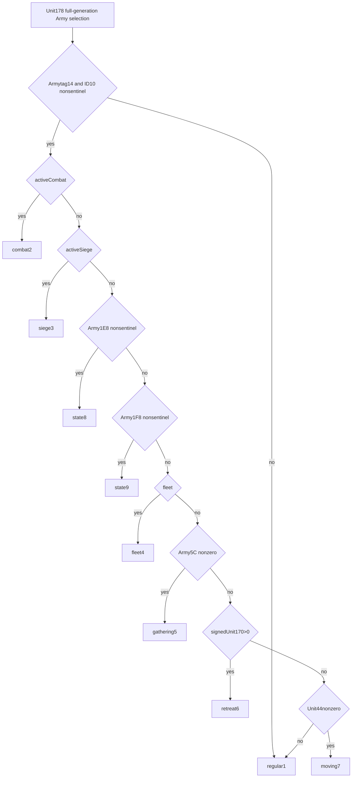

# Native current Unit state mapping —1.20.0.3

The October6 finite source increment captures complete D19140[D19140,D19270),304B/SHA7fe02381e68495d89f4d1ec5576e34a6274e951f9f5196ec8a56271960eaa02d, for the held exact1.20.0.3 build. The October7 implementation package adopts this knowledge; it does not invoke or change this getter. [Actual822B cost receipt](Z:/ck3_mod_rewrite_process_assets/g2-parallel-20261006/army-current31/next-current-status/state-getter-d19140-source/SOURCE-READ-RECEIPT.json) records304code+518metadata, no neighbor/fullfile/newhash.

The complete function contains no Army31/1D4/Rule24/20/21/30 access. Unit178 selects full-generation Army through5D1DE48/fallback5D1DE50. Wrong Armytag14 or sentinelID10 returns regular1 immediately before Unit170/route. Valid Army priority is:
combat2→siege3→Army1E8nonsentinel8→Army1F8nonsentinel9→fleet4→Army5Cnonzero gathering5→signedUnit170>0 retreat6→Unit44nonzero moving7→regular1.
Negative5C is still nonzero. Unit44 is a nonzero test. Fleet/gather may mask semanticretreat6 while the independent signed170 still records retreat.

Existing strategy explicit retreating Boolean precedence is consistent with this source. **Regular and current31 are not CanMove predicates.** The source-sealed selectedArmy+mandatorytargetProvince native pre-route move-readiness proposal remains [external](Z:/ck3_mod_rewrite_process_assets/g2-parallel-20261006/army-current31/next-current-status/NEXT-READONLY-CAPABILITY.json). Root's actual route preview succeeded; this package adds no movement gate or new policy. That proposal stops before pathbuild and never claims fullmove. Current implementation is limited to [Combat role/phase](army-current-combat-roles-phase-observer-12003.md) and [loaded Rule24 pins](army-current-rule24-source-pins-observer-12003.md).
