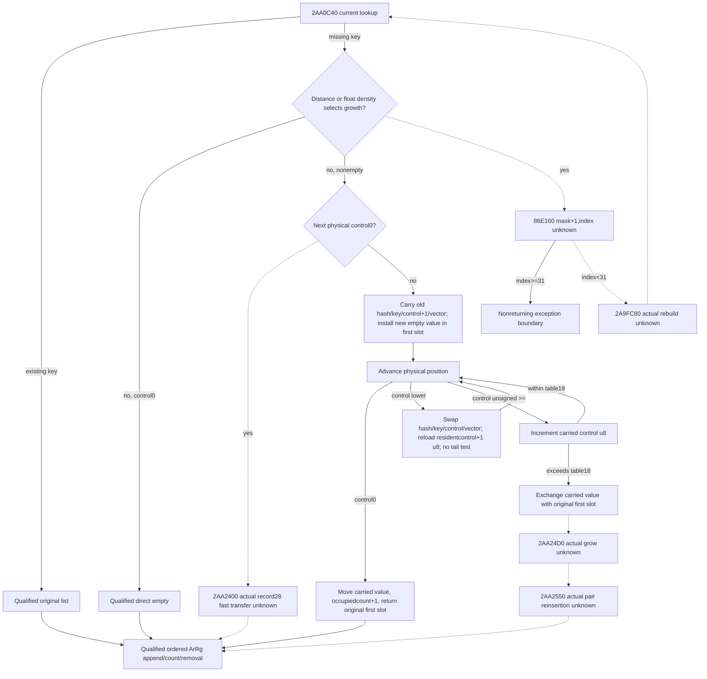
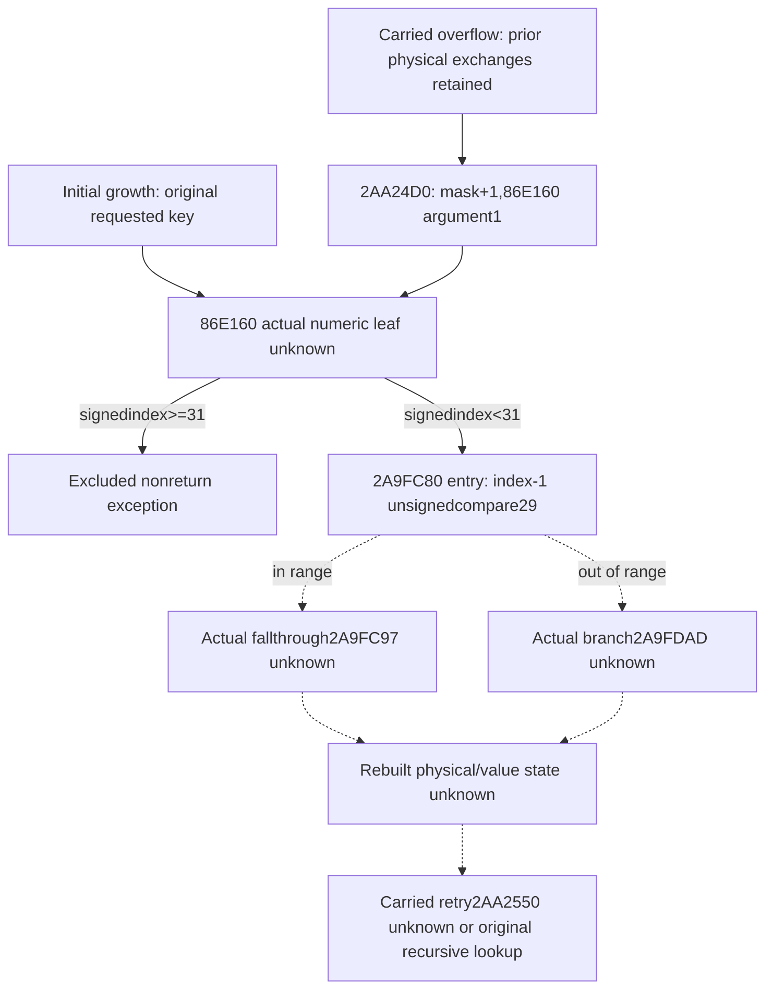
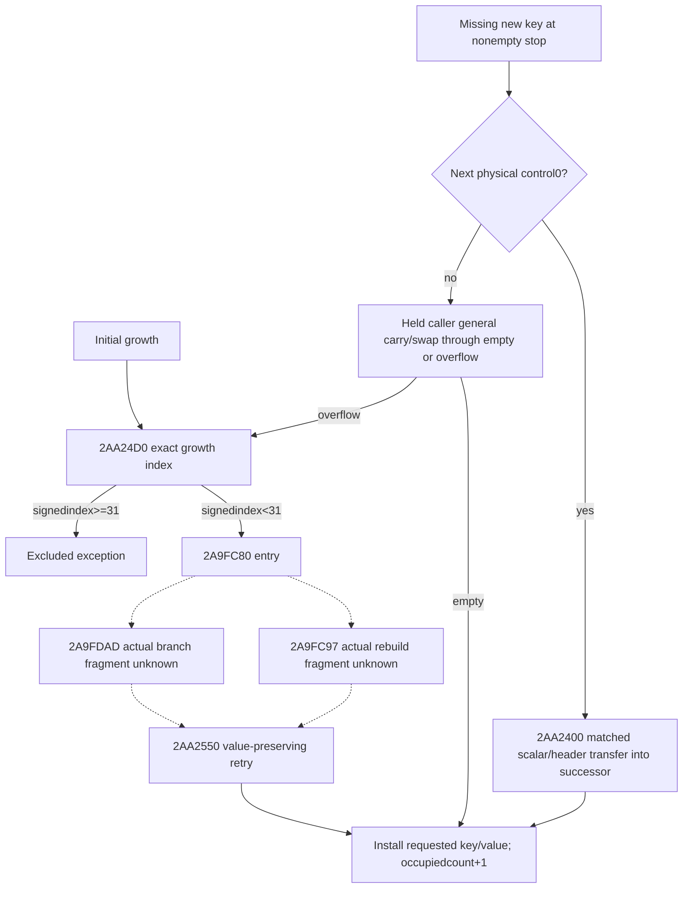
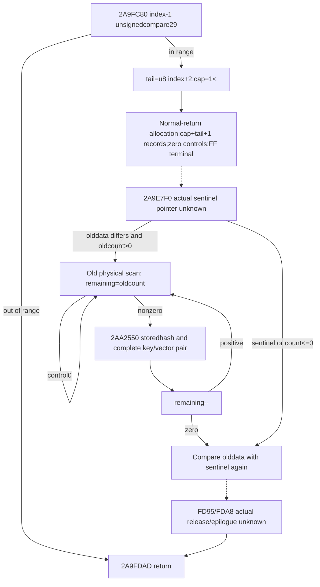
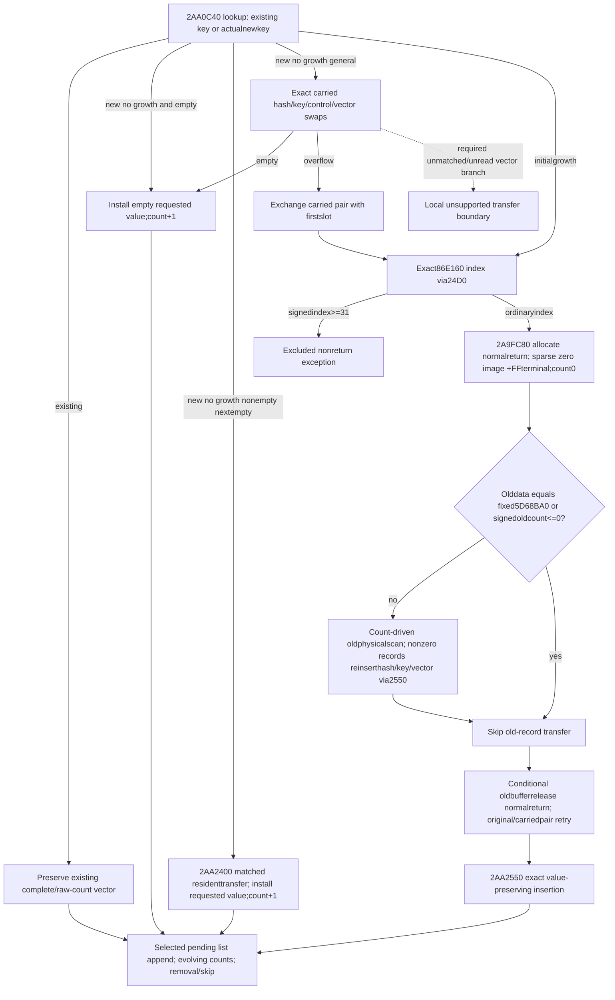

# Actual current pending-table new-key carry and growth (1.20.0.3)

Source-only work started after publication `97192b2054beac4971f0e827abdc9d353ab4756a`. The qualified [current pending-update family](army-current-pre-date-pending-update-inputs-12003.md) supports an existing key and a direct empty slot; this new tree covers the actual remaining new-key suffix of `2AA0C40`. It does not execute `2A92320`, change that model or grant full pre-date/tomorrow readiness.

The exact pin is Steam25652598 / CK3 `1.20.0.3`, EXE SHA-256 `94b55397abb687a3dcd436805a5d885e6be90fa6c693feb44a9e3bbeeade02a6`. A finite source-first plan is frozen at `Z:/ck3_mod_rewrite_process_assets/g2-background-round23-20261006/current-pending-new-key-source/SOURCE-FIRST-PLAN.md`. The only caller body read so far is the already held round21 `SOURCE-02AA0C40.asm.txt`, `[2AA0C40,2AA0FC6)`,902 bytes / existing raw SHA `11a663e81dab42de0e27f606a05971e6209059dd8fee0fbdfef66d6da51216f9`. New EXE reads and rehashes are zero.

## Actual caller tree and value order

The receiver is primary `+130`: relative table data `+8`, signed occupied count `+10`, raw mask `+14`, unsigned maximum-distance byte `+18`, binary32 threshold bits `+1C`. Records have stride `28` hex: stored hash DWORD `+0`, unsigned control `+4`, Army full key DWORD `+8`, and one DWORD-reference vector at `+10`. The vector layout is data pointer `+0`, capacity DWORD `+8`, signed count `+C`, allocator pointer `+10`; pending record allocator is therefore record `+20`.

The existing-key/direct-empty entry facts keep their earlier source credit. For a lower-distance nonempty stop, `2AA0D0B` increments the resident control byte. If the immediately following physical control is zero, `2AA0D1A` calls the distinct actual pending-record helper `2AA2400` with RCX=next record, EDX=resident control+1 and R8=current record. Its body is not held in the scoped cache inventory; this path cannot be replaced by `2AA2450`'s different record type.

If the next control is nonzero, `2AA0D85` saves the old hash/key and incremented control in a carried stack record. Its vector begins literal-empty with source allocator `54DEB68`, then `C85A90` receives the old resident vector. The original physical slot is overwritten with the requested hash/control/key and an empty pending vector; this first slot becomes the return candidate R14. Held same-allocator header transfers provide the complete logical value movement; different/unread required allocator branches retain their existing local source-quality boundary. No allocator implementation is reopened.

At `2AA0E30` physical position advances by one record. A zero control completes the carry: write saved hash/control/key, initialize the destination vector, move the carried vector with `C85A90`, increment the occupied count exactly once and return the original first slot with inserted=true. For a nonzero resident, control lower than the carried byte selects the scalar swap plus `C8EAA0` vector-header swap at `2AA0E70`. It reloads the old resident control from the carried temporary, increments it modulo256 and immediately advances again, with no maximum-distance test on that arm. The unsigned resident-control `>=` arm leaves that resident's hash/key/vector unused, increments the carried byte, then compares it with table `+18` at `2AA0E85`.

On that latter overflow, `2AA0E8A..2AA0EBB` exchanges the carried scalar/vector values with the original first slot, then calls actual `2AA24D0` at `2AA0EC3`. It reinserts the carried hash/key-value pair through `2AA2550` at `2AA0ED7` and copies that returned selection to the caller output. Prior physical exchanges matter to this growth entrance. Its exact rebuild/reinsert semantics remain unclosed until those actual callees are read.

Initial growth instead enters `2AA0F5D`: increment ECX from the raw mask, call `86E160` with EDX=1, reject signed returned index>=31 through the nonreturning exception path, otherwise call `2A9FC80(table,index)` and recursively call `2AA0C40` with the original hash/key. This is a separate entrance from the carried-overflow rollback path. The ordinary numeric/growth leaf is required; exception formatting/throwing and allocator/CRT internals remain outside this functional package.

## Minimum current readonly operands and cache boundary

The published `ArmyPreDatePendingSetupV1` captures current lookup controls/keys through its first stop, existing-key list references, and insertion count/mask/max-distance/threshold. It does not capture the stopped resident's stored hash or vector/witness, next physical controls, lower-distance swap values, or a complete rebuild input. Those are real operands of this suffix, not a missing permission predicate. Existing roster/context/ArRg append inputs and native/global readiness can remain independent.

For a matched ordinary general no-growth branch, extend the same-query pending physical frame with the stopped resident hash/full key/vector and actual allocator witness, then demand physical controls through empty completion. Only residents that swap require their scalar values and vector/witness; the `>=` continuation arm must not require unused values. Preserve all list duplicates and counts. A projection should stage one new-key operation privately and commit its physical/list image only on source-supported completion, keeping the prior completed original Army prefix if a demanded operand or actual growth branch is unavailable. This is the eventual pure entrance, not an implementation in this source package.

Growth's minimum physical extent/rebuild operands are provisional until the exact rebuild bodies close; do not fabricate a complete table from the occupied count or reuse standalone end-marker semantics. The current eight-wire observer and model remain unchanged. Cached metadata proves only `2AA24D0..2AA250C` (60B, unwind5109524) and `2A9FC80..2A9FC97` (23B, unwind510CC5C). The named packet inventories contain no body for them, `2AA2400`, `2AA2550` or `86E160`; the latter three also lack exact metadata in the four checked cache files. This is a finite scoped cache miss, not a universal artifact-absence claim.

The new suffix is currently `research`: the matched general nonoverflow caller order is source-closed, while actual fast transfer, growth/rebuild/reinsert bodies remain the necessary frontier. `CACHE-MISS-READ-PLAN.md` records the finite direct-callee request; no frozen executable is opened before Root approval. No model/code, shared reports/CMake, tests/builds, game/process/Steam/UI/SDK/pipe operations or child push occurs here.

## Approved Stage A and exact remaining frontiers

Root approved the frozen Stage A request after source-plan commit `dc5a1045`. The first read captured83Bcode +8Bunwind +216Bcache-missing pdata:307 actual bytes,307 unique, zero duplicate file-read bytes. `STAGE-A-READ-RECEIPT01.json` retains the actual bytes, metadata probes, cache reuse and first code hashes. Whole-EXE scans/hashes and allocator/exception/downstream body reads stayed zero.

Actual `2AA24D0..2AA250C` closes the ordinary wrapper: read table mask `+14`, increment wrap32, call `86E160` with EDX=1, compare returned EAX signed against31; index<31 tail-jumps to `2A9FC80(table,index)`. Thus carried-overflow growth and initial growth use the same actual rebuild entrance, while their prior physical table/value state differs. The nonreturning exception branch stays outside this ordinary package.

The recorded `2A9FC80..2A9FC97` span is only an entry fragment: it computes index-1, unsigned-compares29, branches to `2A9FDAD` or falls through `2A9FC97`. A metadata extent ending at a fallthrough instruction boundary does not establish full rebuild semantics. Both actual reached continuations remain explicit source frontiers.

Metadata-only exact lookup located `2AA2400..2AA2445`69B/unwind5135C74 and `2AA2550..2AA2883`819B/unwind5136288. `86E160` has no runtime-function record at its exact entry; held search probes bound its pdata-free gap between preceding end86E13B and next start86E1D0. The numeric direct entry needs at most112 instruction bytes through a real return, without reading preceding86E150 or the following function. Those bodies and the two rebuild continuation metadata records are the finite Stage B request in `STAGE-B-SOURCE-FIRST-PLAN.md`. Their semantics are still unknown; no model or new observer is designed from guessed growth capacity or physical scan extent.

## Approved Stage B: matched value transfer and growth index

Root approved Stage B after reading that finite plan. Its first capture used1000Bcode +8Bunwind +36Bnew pdata:1044 actual/unique bytes, zero duplicate file reads. Cumulative Stage A+B new reads are1351 bytes. `STAGE-B-READ-RECEIPT01.json` preserves actual reads, first code hashes, metadata reuse and each independently decoded exact address. There were no new test/build/game operations or source-read failures.

Actual `2AA2400` copies resident hash and key into the immediately empty next record, writes its incremented control, initializes that destination's vector to literal-empty with allocator54DEB68, then calls held `C85A90(destination+10,resident+10)`. On the matched normal-return branch, the complete ordered resident references and raw header move to that successor; the source vector becomes empty. The caller then installs the new key/value in its original first slot. This proves the missing fast path without borrowing another record type.

Actual `2AA2550` is the value-preserving insertion retry: its R9 pair carries keyDWORD at `+0` and a complete DWORD-reference vector at `+8`. Existing-key selection returns inserted=false. A direct empty or shifted slot receives the input vector through `C85A90`; general collisions preserve all scalar/vector exchanges, including the unsigned control comparison, reloading the displaced resident control after a lower-distance swap, byte increment and the asymmetric maximum-distance test. Empty completion increments occupied count once and returns the first selected slot. Overflow exchanges its carried pair with that first slot, invokes actual `2AA24D0`, then recursively retries `2AA2550` with the carried value. Initial retry growth instead invokes `86E160`/`2A9FC80` before recursively retrying the original pair. Required matched transfers empty the moved temporary; allocator cleanup internals stay outside this source package.

The pdata-free numeric leaf `86E160..86E1D0` was captured contiguously through both actual returns,112B. With the actually used second argument1, it returns3 when wrap32(mask+1) interpreted signed is<=1; otherwise its BSR/shift arithmetic yields `max(3,ceil(log2(signed(mask+1)))+1)`. Signed returned index>=31 takes the already identified nonreturning exception boundary. Raw mask, byte distance/count and binary32 density remain the actual caller operands; no guessed capacity rule replaces them.

Stage B metadata locates the actual rebuild fragments `[2A9FC97,2A9FD95)`254B/unwind529D904 and `[2A9FDAD,2A9FDB3)`6B/unwind529D938. Their bodies remain unread. `STAGE-C-SOURCE-FIRST-PLAN.md` freezes260 code bytes plus8 header bytes, with independent fragment decoding and no intervening-hole capture. Growth's physical extent, rehash/reset semantics and full current-query collector plan remain the concrete next frontier. The ordinary matched no-growth transfer tree is source-closed; its new observer/model is still unimplemented and research-only.

## Approved Stage C: actual count-driven rebuild

The approved first Stage C capture used260Bcode +8Bunwind:268 actual/unique bytes, no duplicate reads; cumulative A+B+C1619B. Each actual fragment was decoded separately, with no concatenated holes. Both headers have CHAININFO; their exact unread chain-record locations529D918 and529D93C remain in `STAGE-C-READ-RECEIPT01.json`. No chained metadata or allocator implementation was opened.

In the in-range index branch, actual `2A9FC97` sets table `+18` to index+2 modulo256, computes capacity `1<<index` in32 bits, saves old data/occupiedcount and stores mask=capacity-1. It resets occupied count to0 before the table allocator's normal-return allocation request: `(capacity+new_tail+1)*40` bytes, alignment8. It publishes the returned data pointer, zeroes each control byte for physical slots `[0,capacity+tail)`, then writes controlFF at slot `capacity+tail`. Hash/key/vector bytes in empty slots are not initialized or consumed by this phase. Source-defined allocation failure/implementation is outside the declared normal-return model.

The old-buffer value transfer is count-driven: compare original data with the pointer returned by actual `2A9E7F0`, then require signed old occupied count>0. Start at physical old slot0 and continue until that many nonzero control records have been consumed. A zero control advances one record without reducing the remaining count. Each nonzero control uses its stored hash and pair at key/vector `+8` as input to held `2AA2550`, then decreases remaining count once. There is no mask bound or end-marker termination in this loop. Matched moves empty old record vectors; their conditional allocator cleanup is an ordinary implementation boundary. Repeated list references and physical reinsertion order remain observable values.

After rehash, another `2A9E7F0` comparison selects the old-buffer release suffix. Both its fallthrough `2A9FD95` and branch `2A9FDA8` are inside already held exact metadata `[2A9FD95,2A9FDAD)`24B/unwind529D924; that body is not read yet. The out-of-range branch fragment `2A9FDAD..2A9FDB3` restores the entry stack and returns without executing the rebuild body. The actual direct sentinel getter's body/extent is a separate cached-source frontier, not replaced by an assumed global pointer.

Growth's minimum same-query raw frame is now concrete: the existing signed occupied count/mask/tail/binary32 threshold; actual current-data sentinel equality; old physical controls through the count-driven consumed-record prefix; stored hash/full key/complete ordered references and required matched allocator witness for every consumed nonzero record. Empty controls do not require unused scalar/vector bytes. Allocate the derived empty private image, replay old nonzero records in native physical order with held value-preserving insertion, then retry the selected carried/original pair. No second query or guessed mask/end-bounded scan may substitute for that prefix. Same-capture nonphysical Army/ArRg inputs and normal allocator return stay explicit conditions; no table allocator identity gate is necessary for the logical allocation image.

`STAGE-D-SOURCE-FIRST-PLAN.md` freezes the actual24B epilogue +4Bheader and sentinel metadata-only lookup at most216B before any further read. The sentinel and epilogue remain source frontiers; the new growth observer/model is unimplemented. Existing bounded current static qualification, actual callback/tomorrow/fullmonthly/live=false and zero test/build/game/shared edits remain unchanged.

## Approved Stage D: release boundary and actual pointer-helper extent

The approved first Stage D used24Bcode +4Bheader +48Bcache-missing pdata:76actual/unique bytes, no duplicate file reads; cumulative A+B+C+D1695B. The actual epilogue takes RCX=table allocator `+20`, RDX=original old buffer, R8D=alignment8 and calls vtable `+10`, then restores RBP before the already held return fragment. This closes the normal-return control/value path without reopening allocator implementation. Its CHAININFO location529D928 is retained and unread, like the earlier two chain records.

The actual `2A9E7F0` pointer helper has exact runtime-function extent `[2A9E7F0,2A9E84D)`93B/unwind5109524. Its unwind header is already held from Stage A and can be reused. `STAGE-E-SOURCE-FIRST-PLAN.md` freezes only93 new code bytes. The helper's body is not yet read, so neither its actual returned pointer nor readonly-call suitability is presumed; the future observer should use the proven raw value/constant rather than invoking any initialization side effect. Existing current qualification and implementation remain frozen.

## Final ordinary tree and readonly implementation entrance

Approved Stage E captured the actual93B helper once, contiguously, with zero new metadata: all stages total1460code +28unwind +300pdata =1788 actual/unique bytes, zero duplicate file-read bytes. A reader-script syntax RED occurred before execution, retained as `STAGE-E-PARSE-RED01.json` plus its original script; only lexical spacing was corrected, and the actual93B source capture was executed once. Earlier shell-plan quoting RED remains retained. No tests/native builds/old wire replays or game operations occurred.

The actual helper always returns imagebase+`5D68BA0`. It includes TLS-epoch/static initialization using guard`5D68B94`; initialization writes control0 at`5D68BA4` and controlFF at`5D68BCC`, then returns the same fixed address. CRT initialization calls`4223AA4/4223A44` remain normal-return boundaries and are not followed. A readonly observer compares captured table data directly with imagebase+`5D68BA0`; it must not invoke this helper or its initialization path. This closes the final functional pointer equality without extra live state or allocator work.

The ordinary matched normal-return source tree is now closed. `MINIMAL-IMPLEMENTATION-PLAN.md` proposes one nine-file extension of the existing family: same-query physical raw frame/constant equality and count-driven prefix, strict additive normalization, independent record28 pure placement/rebuild helper, minimal existing projection call, one new nonempty production-service compound and one new native fixture. Growth uses sparse derived empty images; it does not allocate a Python array proportional to native capacity. Source-defined mismatched transfer/nonreturn exception or real unread inputs keep a continuous completed conditional prefix. Raw counts stay independent of unread individual reference IDs where the branch only needs count.

No implementation is part of this source delivery. New suffix readiness is `research/source-closed`, while the earlier existing-key/directempty bounded static qualification remains unchanged. Actual pre-date callback, future evolving nonphysical context, tomorrow, full daily/monthly and live stayfalse. Root reviews the frozen concrete plan before code and owns formal qualification, shared reports and publication.

## Current-query carry/growth candidate

After Root reviewed and approved the nine-file plan, implementation started in a fresh C sparse view of `919df711ab24acc43669a2d3e2736bead0ccd6ab`; the prior source tree remains preserved. Schema/API and nonempty expected arithmetic were sealed before code in round24 `current-pending-carry-growth/SCHEMA-API-FIRST-PLAN.md` and `PRESEALED-EXPECTED-ARITHMETIC.json`. No source bytes were recaptured: the source-only1788 unique bytes and both parser/shell RED histories are reused.

The same current-pending family gains optional `pending_table_frame_v1`. Its readonly sampler uses the existing exact-build binding and manager130, compares observed data with the proven5D68BA0 constant and publishes actual controls/scalars/vector headers/ordered references with expected54DEB68 equality. It shares per-slot reads and same-query roster observations, captures current control coverage including terminalFF separately from the independent oldcount-driven nonzero prefix, and publishes partial raw values. Empty/terminal unused payload is not demanded. Neither the mutator, pointer initializer nor allocation executes; old member prefixes/native readiness remain independent.

New `army_pre_date_pending_placement_12003.py` supplies the record28 sparse physical kernel. The existing projection privately stages one placement per selected original Army occurrence, uses evolving state for repeats, invokes the existing ArRg append/count-equality/removal/skip arms and commits only a completed operation. It implements fastshift, two-value carry swaps, byte/unsigned asymmetry, first-slot exchange on carry overflow, actual index arithmetic and count-driven storedhash/value rehash. An absent legacy frame retains the existing/directempty path. Outputs distinguish count/removal readiness from the actual changed physical lists' complete values; unread IDs remainunknown and unused untouched lists do not disable independent known output. Future native pointers/capacity after reserve/append are not claimed.

The candidate is unqualified. ONE new complete-service compound and NEW native fixture `xar_bridge_ck3_12003_pre_date_pending_carry_growth_test` (eight compiled-wire cases, actual `--wire-dir` CLI) are authored for Root's first coherent production qualification. Existing original tests/wires/CTest are not replayed. No child tests, native builds, local game/Steam/process/UI/SDK/pipe operations, shared hook/CMake/report edits or push occurs here. Conditional observed-current fixed nonphysical context and normal-helper return remain explicit; actual callback/tomorrow/fullmonthly/live readiness staysfalse.
