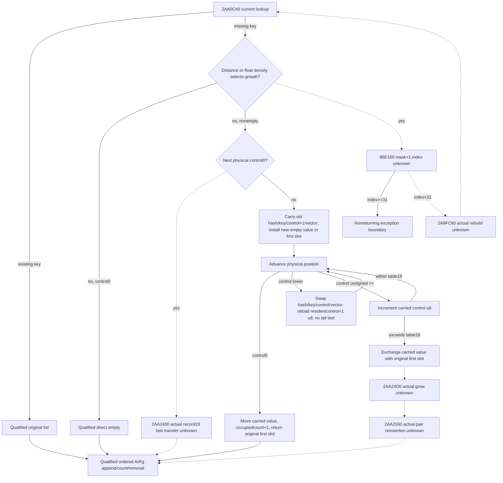
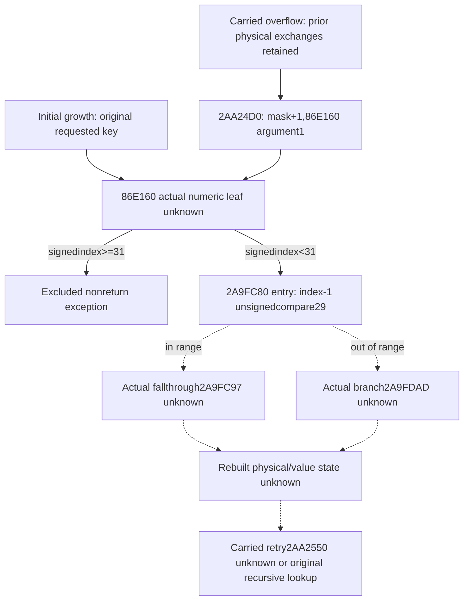

# Actual current pending-table new-key carry and growth (1.20.0.3)

Source-only work started after publication `97192b2054beac4971f0e827abdc9d353ab4756a`. The qualified [current pending-update family](army-current-pre-date-pending-update-inputs-12003.md) supports an existing key and a direct empty slot; this new tree covers the actual remaining new-key suffix of `2AA0C40`. It does not execute `2A92320`, change that model or grant full pre-date/tomorrow readiness.

The exact pin is Steam25652598 / CK3 `1.20.0.3`, EXE SHA-256 `94b55397abb687a3dcd436805a5d885e6be90fa6c693feb44a9e3bbeeade02a6`. A finite source-first plan is frozen at `Z:/ck3_mod_rewrite_process_assets/g2-background-round23-20261006/current-pending-new-key-source/SOURCE-FIRST-PLAN.md`. The only caller body read so far is the already held round21 `SOURCE-02AA0C40.asm.txt`, `[2AA0C40,2AA0FC6)`,902 bytes / existing raw SHA `11a663e81dab42de0e27f606a05971e6209059dd8fee0fbdfef66d6da51216f9`. New EXE reads and rehashes are zero.

## Actual caller tree and value order

The receiver is primary `+130`: relative table data `+8`, signed occupied count `+10`, raw mask `+14`, unsigned maximum-distance byte `+18`, binary32 threshold bits `+1C`. Records have stride `28` hex: stored hash DWORD `+0`, unsigned control `+4`, Army full key DWORD `+8`, and one DWORD-reference vector at `+10`. The vector layout is data pointer `+0`, capacity DWORD `+8`, signed count `+C`, allocator pointer `+10`; pending record allocator is therefore record `+20`.

The existing-key/direct-empty entry facts keep their earlier source credit. For a lower-distance nonempty stop, `2AA0D0B` increments the resident control byte. If the immediately following physical control is zero, `2AA0D1A` calls the distinct actual pending-record helper `2AA2400` with RCX=next record, EDX=resident control+1 and R8=current record. Its body is not held in the scoped cache inventory; this path cannot be replaced by `2AA2450`'s different record type.

If the next control is nonzero, `2AA0D85` saves the old hash/key and incremented control in a carried stack record. Its vector begins literal-empty with source allocator `54DEB68`, then `C85A90` receives the old resident vector. The original physical slot is overwritten with the requested hash/control/key and an empty pending vector; this first slot becomes the return candidate R14. Held same-allocator header transfers provide the complete logical value movement; different/unread required allocator branches retain their existing local source-quality boundary. No allocator implementation is reopened.

At `2AA0E30` physical position advances by one record. A zero control completes the carry: write saved hash/control/key, initialize the destination vector, move the carried vector with `C85A90`, increment the occupied count exactly once and return the original first slot with inserted=true. For a nonzero resident, control lower than the carried byte selects the scalar swap plus `C8EAA0` vector-header swap at `2AA0E70`. It reloads the old resident control from the carried temporary, increments it modulo256 and immediately advances again, with no maximum-distance test on that arm. The unsigned resident-control `>=` arm leaves that resident's hash/key/vector unused, increments the carried byte, then compares it with table `+18` at `2AA0E85`.

On that latter overflow, `2AA0E8A..2AA0EBB` exchanges the carried scalar/vector values with the original first slot, then calls actual `2AA24D0` at `2AA0EC3`. It reinserts the carried hash/key-value pair through `2AA2550` at `2AA0ED7` and copies that returned selection to the caller output. Prior physical exchanges matter to this growth entrance. Its exact rebuild/reinsert semantics remain unclosed until those actual callees are read.

Initial growth instead enters `2AA0F5D`: increment ECX from the raw mask, call `86E160` with EDX=1, reject signed returned index>=31 through the nonreturning exception path, otherwise call `2A9FC80(table,index)` and recursively call `2AA0C40` with the original hash/key. This is a separate entrance from the carried-overflow rollback path. The ordinary numeric/growth leaf is required; exception formatting/throwing and allocator/CRT internals remain outside this functional package.

## Minimum current readonly operands and cache boundary

The published `ArmyPreDatePendingSetupV1` captures current lookup controls/keys through its first stop, existing-key list references, and insertion count/mask/max-distance/threshold. It does not capture the stopped resident's stored hash or vector/witness, next physical controls, lower-distance swap values, or a complete rebuild input. Those are real operands of this suffix, not a missing permission predicate. Existing roster/context/ArRg append inputs and native/global readiness can remain independent.

For a matched ordinary general no-growth branch, extend the same-query pending physical frame with the stopped resident hash/full key/vector and actual allocator witness, then demand physical controls through empty completion. Only residents that swap require their scalar values and vector/witness; the `>=` continuation arm must not require unused values. Preserve all list duplicates and counts. A projection should stage one new-key operation privately and commit its physical/list image only on source-supported completion, keeping the prior completed original Army prefix if a demanded operand or actual growth branch is unavailable. This is the eventual pure entrance, not an implementation in this source package.

Growth's minimum physical extent/rebuild operands are provisional until the exact rebuild bodies close; do not fabricate a complete table from the occupied count or reuse standalone end-marker semantics. The current eight-wire observer and model remain unchanged. Cached metadata proves only `2AA24D0..2AA250C` (60B, unwind5109524) and `2A9FC80..2A9FC97` (23B, unwind510CC5C). The named packet inventories contain no body for them, `2AA2400`, `2AA2550` or `86E160`; the latter three also lack exact metadata in the four checked cache files. This is a finite scoped cache miss, not a universal artifact-absence claim.

The new suffix is currently `research`: the matched general nonoverflow caller order is source-closed, while actual fast transfer, growth/rebuild/reinsert bodies remain the necessary frontier. `CACHE-MISS-READ-PLAN.md` records the finite direct-callee request; no frozen executable is opened before Root approval. No model/code, shared reports/CMake, tests/builds, game/process/Steam/UI/SDK/pipe operations or child push occurs here.

## Approved Stage A and exact remaining frontiers

Root approved the frozen Stage A request after source-plan commit `dc5a1045`. The first read captured83Bcode +8Bunwind +216Bcache-missing pdata:307 actual bytes,307 unique, zero duplicate file-read bytes. `STAGE-A-READ-RECEIPT01.json` retains the actual bytes, metadata probes, cache reuse and first code hashes. Whole-EXE scans/hashes and allocator/exception/downstream body reads stayed zero.

Actual `2AA24D0..2AA250C` closes the ordinary wrapper: read table mask `+14`, increment wrap32, call `86E160` with EDX=1, compare returned EAX signed against31; index<31 tail-jumps to `2A9FC80(table,index)`. Thus carried-overflow growth and initial growth use the same actual rebuild entrance, while their prior physical table/value state differs. The nonreturning exception branch stays outside this ordinary package.

The recorded `2A9FC80..2A9FC97` span is only an entry fragment: it computes index-1, unsigned-compares29, branches to `2A9FDAD` or falls through `2A9FC97`. A metadata extent ending at a fallthrough instruction boundary does not establish full rebuild semantics. Both actual reached continuations remain explicit source frontiers.

Metadata-only exact lookup located `2AA2400..2AA2445`69B/unwind5135C74 and `2AA2550..2AA2883`819B/unwind5136288. `86E160` has no runtime-function record at its exact entry; held search probes bound its pdata-free gap between preceding end86E13B and next start86E1D0. The numeric direct entry needs at most112 instruction bytes through a real return, without reading preceding86E150 or the following function. Those bodies and the two rebuild continuation metadata records are the finite Stage B request in `STAGE-B-SOURCE-FIRST-PLAN.md`. Their semantics are still unknown; no model or new observer is designed from guessed growth capacity or physical scan extent.
