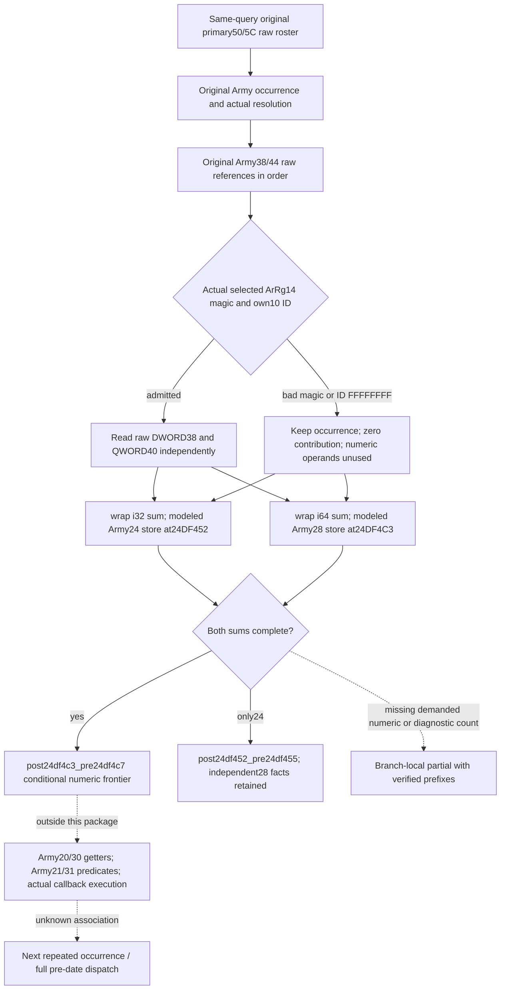

# Current post-admission numeric refresh inputs, 1.20.0.3

The optional `current_post_admission_refresh_inputs_v1` family supplies the original Army/ArRg occurrence stream needed to model the two numeric writes in `24DF3C0`. It closes the missing QWORD `ArRg+40` operand for every admitted occurrence, including occurrences whose `ArRg+38` is positive. The pure result reaches `post24df4c3_pre24df4c7` when both sums are complete; it does not invoke the native callback or describe a subsequent roster occurrence.

The source prerequisite is [the exact callback ledger](army-pre-date-character-prefix-and-post-admission-callback-12003.md). The game pin remains 1.20.0.3 / Steam build 25652598 / EXE SHA-256 `94b55397…02a6`. The source packet at `Z:/ck3_mod_rewrite_process_assets/g2-background-20261006/pre-date-character-prefix-post-admission-source/phase-two-24df3c0-body/` contains the complete 669-byte `[0x24DF3C0,0x24DF65D)` body, raw SHA-256 `942f9e6dea3a26a7015d75bc8b350b3aa85e0905cc278424a4915a1102766c3a`. Its preceding exception-bound lookup read 160 metadata bytes separately. This implementation reuses that evidence and reads zero additional EXE bytes.

## Reader and transport

`ReadCurrentPostAdmissionRefreshInputs12003(bindings, same_query_roster, same_query_pending, same_query_table)` copies the already captured complete original roster. It reuses original Army references and raw `ArRg+38` observations only when their requested ID and actual selected identity match. An internal query-local resolver cache materializes the selected objects with the established generation/fallback resolver; output occurrences are never deduplicated. The new reader always demands `ArRg+40` for admitted occurrences. Existing daily-loss fields that intentionally omit `+40` for positive `+38` retain their meaning.

The ArRg registry is `5D1F340`, with fallback `5D1F338`; selection uses the complete requested DWORD ID. Rejected selected magic does not demand the fallback object's own full ID or numeric fields. A valid magic requires the actual own full ID before admission. A complete count zero skips unused data and resolves no elements. A negative count remains a diagnostic partial rather than an empty list.

The native DTO preserves raw Army/ArRg references, selected identities and fallback facts, raw numeric values and independent `numeric_24_inputs_ready` / `numeric_28_inputs_ready`. It also retains observed Army `24/28/20/21/30/31` caches separately. Those caches neither substitute for missing operands nor gate a legal zero-vector projection. The new binding belongs at the end of `ArmyBindings`, preserving existing aggregate initializer positions.

## Pure consumer and service seam

`normalize_current_post_admission_refresh_inputs_v1` validates the native shape, original occurrence correspondence and source-demand readiness. `project_current_post_admission_refresh_12003` derives wraparound sums, independent per-occurrence contributions and known prefixes. Missing `+40` preserves a complete `Army+24` projection; missing `+38` preserves independently complete `Army+28` facts without advancing the continuous frontier past the first write.

The proposed complete service result contains `current_post_admission_refresh_inputs_v1: [{army_id, projection}]`, alongside the unchanged raw leaf within each ArmyStrength row. The supplied entrance is observed current input for a conditional callback model. `actual_refresh_execution_ready`, `actual_next_occurrence_ready`, `full_callback_ready`, `full_daily_assault_ready`, `full_monthly_ready` and future-tick claims remain false. No native merger, callback, effect or refresh store executes.

## Qualification and next inputs

Eight exclusive implementation/fixture files are prepared, plus this topic. Root owns the minimal shared query, serializer, normalizer and service hooks. The new native target is `xar_bridge_ck3_12003_current_post_admission_refresh_test`, linked to the actual `xar_ck3_12002_runtime`; its only source is `src/ck3_12003_post_admission_refresh_test.cpp`. Nine new whole-Strength frames cover ordered repeats and signed wrap operands, wrong-generation fallback, rejected magic/sentinel, legal zero values, a zero Army vector, missing positive-row `+40`, independently ready `+28`, negative count and a zero original roster. Additional assertions verify matching captured-reference reuse and rejected-magic demand without producing extra frames.

The FIRST new complete-service compound passed once on 2026-10-06 at 17:42:34–17:42:38 Asia/Shanghai, using Root's coherent immutable source `820d6d511981e62adb1d09e5b7cb30ec06a793ea` at `C:/codex-ck3-background/post-admission-refresh-service/source01`. The single method exercised four input variants through the actual `GameplayBridgeService.query_army_strengths`: nonempty physical repeats/fallback/signed wrap; missing demanded `+40` preserving complete `+24`; count zero with unused data; and diagnostic negative count. It asserted that the original whole-query availability, strength and native readiness remained unchanged. The unittest body reported 0.014 seconds; the fresh Python process took 3.6116393 seconds including imports. No old test was rerun.

The FIRST receipt is `Z:/ck3_mod_rewrite_process_assets/g2-background-20261006/current-post-admission-refresh-inputs/first-source-service01/FIRST-SERVICE-COMPOUND-RECEIPT.json`; all four actual service outputs are preserved in `ACTUAL-SERVICE-OUTPUTS.json`, SHA-256 `ae870301321b725c961bdcfbbd53f5fff941a89f8546f075b01403aaeb27ace1`. This source-shaped complete-service case was not rerun for native qualification.

Root's corrected formal `g100` native batch at `551f1a008afdb746a67f63f3cd51d6ce24558c32` completed GREEN in 126.056244 seconds, with 597 actual TUs / 594 unique TUs / 1347 source inputs, 65 features ON and 50 OFF, and zero generated-source or object reuse credit. The batch's FIRST three new CTests passed in 0.6709783 seconds, including this package's new production reader fixture. The build receipt and CTest receipt are in `C:/codex-ck3-background/refresh-prefix-mapper-batch/strict02-production-namespace/`. Root retained the original production include-namespace build RED and applied a minimal shared namespace correction; this fixture and the numeric kernel did not change.

The FIRST nine actual whole-Strength wires passed through the complete immutable production service once on 2026-10-06 at 18:16:40–18:16:43 Asia/Shanghai, in 2.744822 seconds. Actual service, strict normalizer and projection imports came from `C:/codex-ck3-background/refresh-prefix-mapper-batch/g100-source-repair01`. The consumer used the full venv with `-B -X utf8` and no optimization flag. All nine output frames, their raw-wire hashes, unchanged original strength/native readiness and declared conditional stage limits are preserved in `Z:/ck3_mod_rewrite_process_assets/g2-background-20261006/current-post-admission-refresh-inputs/first-native-whole-wire01/FIRST-COMPILED-SERVICE-CONSUMER-RECEIPT.json`. The emitted frames also qualify independently complete `+28` when `+38` is unreadable, without advancing the continuous frontier past the missing first sum.

The readonly producer and complete-service pure consumer are now static-ready with actual compiled offline fixture evidence. Each fixture frame is independent; there is no coherent-live, real paused snapshot, actual callback execution, next-repeat, future-tick or full daily/monthly credit. Local game operations, lane native builds and lane CTest executions remain zero. No previously successful source case or old wire was repeated. Source-shaped service evidence and compiled-native service evidence retain separate receipts.

The shortest remaining callback inputs begin at the actual `2C4B840` and `2C4AB70` flag getters after this numeric frontier, followed by `24E3FE0` and the actual selector-24 rule verdict. Those source lanes are independent of these numeric operands. Full callback execution, earlier Character/Unit preparation, outer dispatch association and next-repeat state require their own closed transitions; this package does not generalize a direct numeric store into those effects.
