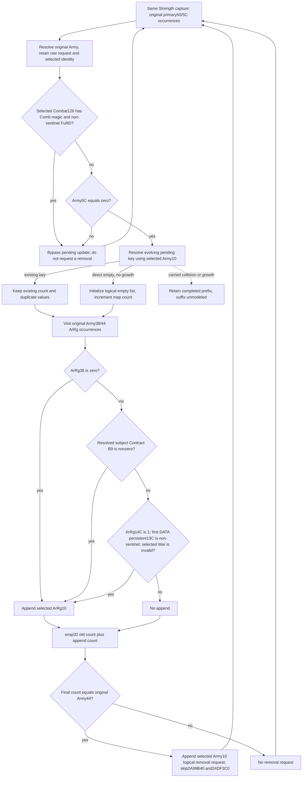

# Current pre-date pending-update operands and ordered projection (1.20.0.3)

The optional Strength leaf `current_pre_date_pending_update_inputs_v1` publishes the current operands of the earlier `2A99DC0 → 2A92320` branch. The new pure result `same_input_conditional_current_pre_date_pending_update_v1` projects list/count changes, logical removal append requests and admission skips in the original Army occurrence order. The bridge does not invoke the native mutator. Current standalone `2A99B40` admission remains an independent observed-current result.

The source prerequisite is [the pre-date pending-update tree](army-pre-date-roster-pending-update-12003.md), exact Steam build 25652598 / 1.20.0.3, frozen executable SHA-256 `94b55397abb687a3dcd436805a5d885e6be90fa6c693feb44a9e3bbeeade02a6`. This implementation performs no new EXE reads. Its upstream interface dependency is the original-roster observer commit `963ff7f11563c05f909374b82ec6c2c42be2fbfa`.

## Readonly transport

The header-only collector `ck3_12003_pre_date_pending_update.hpp` reuses same-query original roster references, already captured pending probes/list values when available, and the original removal queue. It resolves Army, Combat, ArRg, subject contract, persistent regiment and War through their exact-build storage/fallback slots. Raw request IDs, selected full IDs and object identities remain separate. It samples the mutator's actual stop record; a pending miss does not demand the standalone admission end-marker read.

Per original occurrence the leaf captures demanded Combat magic/full ID, Army5C, selected pending key, ordered physical probes, an existing list or insertion count/tail/float threshold, original Army38/44 references and the source-required ArRg fields. A valid Combat or nonzero Army5C terminates the pending observer branch without reading unused pending inputs. The source operands retain null for an unread value and preserve legal zero. The source's first-DATA pointer dereference is independent of ArRg2C.

`army_pre_date_pending_update_contract.py` normalizes the optional leaf with the existing reference and full-generation resolution contracts. It preserves duplicate original references and checks their index/raw-ID correspondence. It does not change any prior leaf's schema or readiness.

## Conditional value semantics

`project_current_pre_date_pending_update_v1(row)` holds the capture's nonphysical context fixed and assumes normal helper return. It performs zero native calls and zero writes. Existing pending values and counts survive the capacity-reserve operation. Each completed Army occurrence appends its selected ArRg IDs in source order, preserves repeated IDs and compares the resulting signed wrapped count with that Army's original ArRg count. A repeated original Army observes the evolving pending list produced by its earlier occurrence.

For original roster `[A,A]`, initial pending count `0`, Army44 `2` and one selected ArRg per occurrence, the counts are `0 → 1 → 2`; only the second occurrence requests removal. With original queue `[99,99]` and selected Army ID `13`, the conditional queue is `[99,99,13]`. The first occurrence's pending state is retained if a required operand becomes unavailable on the second occurrence. Count/removal readiness is independent of whether all old list IDs or the old removal queue were readable; incomplete values remain null rather than fabricated empty lists.

The source-closed direct-empty branch uses little-endian DWORD FNV, signed wrapped map-count increment, binary32 count/mask division and the raw threshold comparison. A logical inserted key is visible to later original occurrences. Actual carried collisions and growth stop this package's continuous completed prefix. Their concrete next consumer is `2AA0C40`'s carry/growth suffix; the existing daily-assault table placement kernel is a different table and is not substituted.

## Candidate validation and scope

The new production-service compound has eleven newly authored cases: existing `[A,A]`, nonempty duplicate old values, direct-empty insertion, all seven source ArRg arms, a later missing Contract operand, an actual carried collision, Combat and Army5C bypasses, known-empty roster with an unread old queue, missing manager and legacy current strength. Independent expected arithmetic is sealed before its first execution. At this candidate commit the compound has not run: Root must first integrate the minimal shared hooks into one coherent production source view.

The new native fixture is `ck3_12003_pre_date_pending_update_test.cpp`, suggested target `xar_bridge_ck3_12003_current_pre_date_pending_update_test`. It uses actual `ReadArmyStrengthsForScope` and the production five-argument Strength serializer, with eight new byte-backed wires. It links the existing `xar_ck3_12002_runtime`; there is no new collector translation unit. Its CTest recipe supplies the required `--wire-dir`. The child has neither compiled nor executed it.

External packet: `Z:/ck3_mod_rewrite_process_assets/g2-background-round22-20261006/current-pre-date-pending-update/`. It contains the frozen plan, hook-only integration patch, independent expected arithmetic, native recipe and delivery/report fields. Tool path/quoting/encoding REDs are retained separately from test or capability outcomes.

This is an authored candidate for conditional current-context pending list/count/removal values. Native observation and production-service qualification remain pending their first receipts. Earlier tomorrow-context preparation, the remaining Character/Unit prefix, postadmission `24DF3C0`, actual allocator completion, full pre-date callback and future evolving state remain outside this output. `actual_pre_date_callback_ready`, `actual_tomorrow_roster_ready`, `full_daily_assault_ready` and `full_monthly_ready` remain false. Local game operations, old test/wire replays and native builds are zero.

## First production-service qualification

Root adopted candidate `c082106f` as `54cb` and integrated the actual readonly sampler, Strength serializer, strict normalizer and per-row service hook. The first complete-service test used the immutable coherent source `C:/codex-ck3-background/pre-date-pending-service/source01` at `15b190233f544271984c8deb5014a9a1cc099960`. It called only `test_pre_date_pending_update_service.PreDatePendingUpdateServiceTests.test_real_ordered_pending_counts_then_removal_requests_and_independent_current`; no old test method or wire was dispatched.

Attempt01 was an import-collection harness RED in `0.7943713` seconds: the sparse view omitted `tools/build_release`, so zero of eleven cases ran. Root materialized `tools` and `workshop` with `git sparse-checkout add` in the same immutable source view, without changing its commit or production code, then authorized retry of the previously unexecuted cases. Attempt02 was GREEN at `2026-10-06T08:47:39.132929+00:00`: one method, eleven newly executed service cases, `0.040` seconds reported by unittest and `2.7556847` seconds for the outer process. The original RED remains preserved.

The real route demonstrated `[A,A]` pending counts `0 → 1 → 2`, second-occurrence removal/skip, preserved nonempty duplicate old values, direct-empty insertion followed by the evolving existing key, all seven raw Contract/persistent/War arms, retained completed prefix after a later missing operand, explicit carried-collision partial, Combat/Army5C bypasses, known zero versus missing context and legacy current-strength independence. Every payload remained unchanged; global/native readiness and current soldiers `160` were preserved. There were zero native mutator calls or writes.

Receipts are `FIRST-SERVICE-ATTEMPT01.json`, `FIRST-SERVICE-ATTEMPT02.json`, `FIRST-SERVICE-CASES02.json` and `FIRST-SERVICE-QUALIFICATION.json` in the external round22 packet. The qualification receipt is `4695` bytes / SHA-256 `5dcad633432ee05ad533aec0b91cd04225c14fe7db3cd605d10a95e82f34a6a6`; `SERVICE-QUALIFICATION-OCT6-W41-FIELDS.json` supplies the daily and weekly delta. The separate native-consumer preparation path harness RED is retained in `FIRST-NATIVE-CONSUMER-PREP-HARNESS-RED.json` and executed no cases.

The conditional current-context pending projection is now `static-ready` through the full production-service fixture. The raw native observer remains a candidate until Root's first g99 compilation/fixture and the new eight-wire service consumer. `consume_first_native_wires.py` is prepared but unexecuted; it uses only the immutable source Root will name. This qualification adds no actual callback, tomorrow, full daily-assault/monthly or live readiness. New EXE reads, native builds and local game operations remain zero.

## First g99 compiler RED and fixture correction

Root's first fresh native attempt stopped after `117.416104` seconds. The sole new pending-fixture compiler error was MSVC `/WX` `C4389/C2220`: line391 compared `std::optional<std::uint32_t>` War magic with signed literal `0`, instantiating `std::operator==<uint32_t,int>`. The source operand, native collector and immutable producer `bff1f2e5` were unchanged. The fixture expectation now uses unsigned literal `0U`; no runtime behavior or arithmetic changed.

The first full-build RED remains at `C:/codex-ck3-background/pre-date-inputs-batch/strict01/BUILD-STDOUT.log`, line635. Root will finish the original runtime graph and independent dated fixture, then compile only the corrected pending CPP against the original headers/library. This child performed no compilation, CTest or wire consumption. Zero CTests had run at the failed full-build boundary, so this correction grants no native observation or service-wire qualification.

The only-corrected-CPP attempt `pending-fixture-repair01` exposed the next instance of the same `std::operator==<uint32_t,int>` warning at line396. A single pass over this assertion block (lines378–399) found the two old-removal raw-ID comparisons with signed literal `99`; both now use `99U`. Other comparisons of this exact optional DWORD type in the block already use unsigned constants. The first full-build RED and repair01 RED remain distinct, the producer is unrecompiled, and no CTest or wire consumer has run. Root's attempt02 will compile only this corrected fixture CPP.

Root's `pending-fixture-repair02` exposed the same template instantiation at line454 in the Army5C-bypass case. Root therefore authorized one pass over comparison assertions in this new fixture only. That pass found this final signed literal for the exact optional DWORD type: `combat_magic_0c_raw_u32 == 0` now uses `0U`. All other comparisons of this type use unsigned literal suffixes or typed DWORD variables/constants. No production/header files changed and no other fixture was examined. Original strict01, repair01 and repair02 REDs remain preserved; Root's only-CPP attempt03 and subsequent first fixture/wire qualification are still pending.

## First compiled readonly-family and whole-service qualification

The production collector, original include tree, runtime library and Python service remain pinned to immutable `bff1f2e57ac765e94dbb5ecbac5cbb26ac078f01` at `C:/codex-ck3-background/pre-date-inputs-batch/g99`. The corrected fixture CPP is separately pinned to Root `0d9ce8a7eeb0875311d7efc5195049403af4713f`; it was compiled against those original headers/library, without rebuilding production. Root completed the original runtime graph in `2.939789` seconds after preserving the first `117.416104`-second full compiler RED and the two fixture-only compiler REDs. The first corrected new CTest was GREEN (`1` test, `8` wires) at `2026-10-06T09:06:15.454949+00:00`, `0.146617` seconds. Its receipt is `pending-fixture-repair03/CORRECTED-NEW-CTEST.json` under the Root batch.

The eight actual whole-Strength wires then traversed the immutable strict normalizer, full `GameplayBridgeService.query_army_strengths` hook and the pure pending kernel. Consumer attempt01 retained two GREEN cases and a direct-empty expectation harness RED after three actual dispatches (`1.9835208` seconds). The failed raw wire has original Army44 `1` and one selected ArRg, so `0 + 1 == 1` correctly produces removal queue `[0x22000001]` and skip index `[0]`. The consumer had incorrectly assumed the fixture's default Army44 `2`; only its direct-case expected queue/remove/skip values changed. Production, native inputs and parser/kernel outputs were untouched. `FIRST-NATIVE-DIRECT-EMPTY-FAILED-RAW.json`, the original consumer snapshot and `FIRST-NATIVE-DIRECT-EXPECTATION-CORRECTION.json` retain that diagnosis.

Necessary attempt02 reused the exact two passed outputs with `--previous01`, dispatched only the failed direct case and five previously unexecuted cases, and was GREEN for all eight at `2026-10-06T09:08:25.372633+00:00` (`0.4492227` seconds). There were nine actual service dispatches for eight distinct compiled wires, including the one justified failed-case retry; no passed case, earlier service11 method, old wire, native fixture or CTest was replayed.

New compiled checks demonstrated repeated Army pending counts `0 → 1 → 2` and second-occurrence removal, mixed native append arms `[A,B,E,F]`, direct-empty `0 → 1 == Army44(1)` removal, known-empty versus missing GameData, source-defined Combat/Army5C bypasses, and actual wrong-generation fallback using selected Army `0x22000003` / ArRg `0x2B000009` IDs. Every case preserved current `160`, maximum `240`, AI base power raw `300000`, and the existing native readiness. The observer/conditional projection performed zero native mutator calls and writes.

The sealed external `FIRST-NATIVE-WIRES-QUALIFICATION.json` is `12712` bytes / SHA-256 `c2ce5cd2a7af837130a10682d6c957fa2075706f0c2e4b486a1fa92c7973ce4e`. It preserves actual returned values, module origins, both consumer attempts and Root's reused wire pins (`116090` unique input bytes). `NATIVE-QUALIFICATION-OCT6-W41-FIELDS.json` supplies the report delta. The initial `cmd type` metadata path syntax RED is recorded separately; the actual corrected CTest receipt was read once through Python.

The raw readonly leaf and conditional current-context pending list/count/removal/skip output are now **bounded static-ready** on exact `.3` compiled byte fixtures through the complete service. This adds no actual paused snapshot, future/evolving full callback, tomorrow roster, carried-collision/growth suffix, complete daily-assault/monthly or live credit. New EXE reads, old tests/wires, child native builds and local game operations remain zero.
