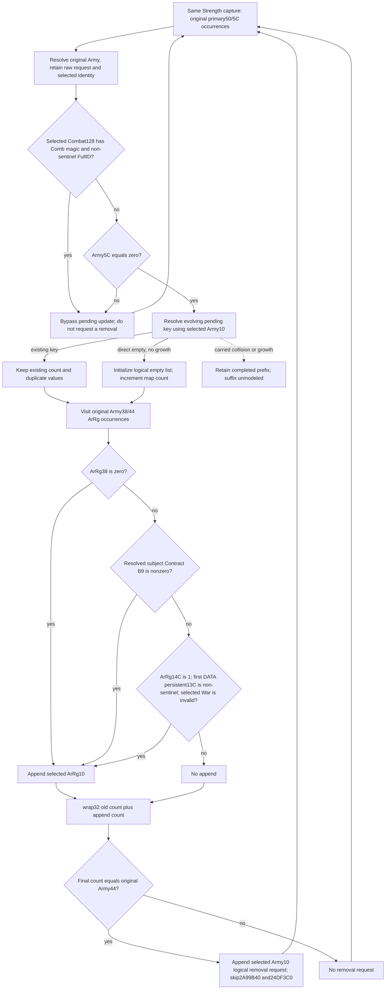

# Current pre-date pending-update operands and ordered projection (1.20.0.3)

The optional Strength leaf `current_pre_date_pending_update_inputs_v1` publishes the current operands of the earlier `2A99DC0 → 2A92320` branch. The new pure result `same_input_conditional_current_pre_date_pending_update_v1` projects list/count changes, logical removal append requests and admission skips in the original Army occurrence order. The bridge does not invoke the native mutator. Current standalone `2A99B40` admission remains an independent observed-current result.

The source prerequisite is [the pre-date pending-update tree](army-pre-date-roster-pending-update-12003.md), exact Steam build 25652598 / 1.20.0.3, frozen executable SHA-256 `94b55397abb687a3dcd436805a5d885e6be90fa6c693feb44a9e3bbeeade02a6`. This implementation performs no new EXE reads. Its upstream interface dependency is the original-roster observer commit `963ff7f11563c05f909374b82ec6c2c42be2fbfa`.

## Readonly transport

The header-only collector `ck3_12003_pre_date_pending_update.hpp` reuses same-query original roster references, already captured pending probes/list values when available, and the original removal queue. It resolves Army, Combat, ArRg, subject contract, persistent regiment and War through their exact-build storage/fallback slots. Raw request IDs, selected full IDs and object identities remain separate. It samples the mutator's actual stop record; a pending miss does not demand the standalone admission end-marker read.

Per original occurrence the leaf captures demanded Combat magic/full ID, Army5C, selected pending key, ordered physical probes, an existing list or insertion count/tail/float threshold, original Army38/44 references and the source-required ArRg fields. A valid Combat or nonzero Army5C terminates the pending observer branch without reading unused pending inputs. The source operands retain null for an unread value and preserve legal zero. The source's first-DATA pointer dereference is independent of ArRg2C.

`army_pre_date_pending_update_contract.py` normalizes the optional leaf with the existing reference and full-generation resolution contracts. It preserves duplicate original references and checks their index/raw-ID correspondence. It does not change any prior leaf's schema or readiness.

## Conditional value semantics

`project_current_pre_date_pending_update_v1(row)` holds the capture's nonphysical context fixed and assumes normal helper return. It performs zero native calls and zero writes. Existing pending values and counts survive the capacity-reserve operation. Each completed Army occurrence appends its selected ArRg IDs in source order, preserves repeated IDs and compares the resulting signed wrapped count with that Army's original ArRg count. A repeated original Army observes the evolving pending list produced by its earlier occurrence.

For original roster `[A,A]`, initial pending count `0`, Army44 `2` and one selected ArRg per occurrence, the counts are `0 → 1 → 2`; only the second occurrence requests removal. With original queue `[99,99]` and selected Army ID `13`, the conditional queue is `[99,99,13]`. The first occurrence's pending state is retained if a required operand becomes unavailable on the second occurrence. Count/removal readiness is independent of whether all old list IDs or the old removal queue were readable; incomplete values remain null rather than fabricated empty lists.

The source-closed direct-empty branch uses little-endian DWORD FNV, signed wrapped map-count increment, binary32 count/mask division and the raw threshold comparison. A logical inserted key is visible to later original occurrences. Actual carried collisions and growth stop this package's continuous completed prefix. Their concrete next consumer is `2AA0C40`'s carry/growth suffix; the existing daily-assault table placement kernel is a different table and is not substituted.

## Candidate validation and scope

The new production-service compound has eleven newly authored cases: existing `[A,A]`, nonempty duplicate old values, direct-empty insertion, all seven source ArRg arms, a later missing Contract operand, an actual carried collision, Combat and Army5C bypasses, known-empty roster with an unread old queue, missing manager and legacy current strength. Independent expected arithmetic is sealed before its first execution. At this candidate commit the compound has not run: Root must first integrate the minimal shared hooks into one coherent production source view.

The new native fixture is `ck3_12003_pre_date_pending_update_test.cpp`, suggested target `xar_bridge_ck3_12003_current_pre_date_pending_update_test`. It uses actual `ReadArmyStrengthsForScope` and the production five-argument Strength serializer, with eight new byte-backed wires. It links the existing `xar_ck3_12002_runtime`; there is no new collector translation unit. Its CTest recipe supplies the required `--wire-dir`. The child has neither compiled nor executed it.

External packet: `Z:/ck3_mod_rewrite_process_assets/g2-background-round22-20261006/current-pre-date-pending-update/`. It contains the frozen plan, hook-only integration patch, independent expected arithmetic, native recipe and delivery/report fields. Tool path/quoting/encoding REDs are retained separately from test or capability outcomes.

This is an authored candidate for conditional current-context pending list/count/removal values. Native observation and production-service qualification remain pending their first receipts. Earlier tomorrow-context preparation, the remaining Character/Unit prefix, postadmission `24DF3C0`, actual allocator completion, full pre-date callback and future evolving state remain outside this output. `actual_pre_date_callback_ready`, `actual_tomorrow_roster_ready`, `full_daily_assault_ready` and `full_monthly_ready` remain false. Local game operations, old test/wire replays and native builds are zero.
