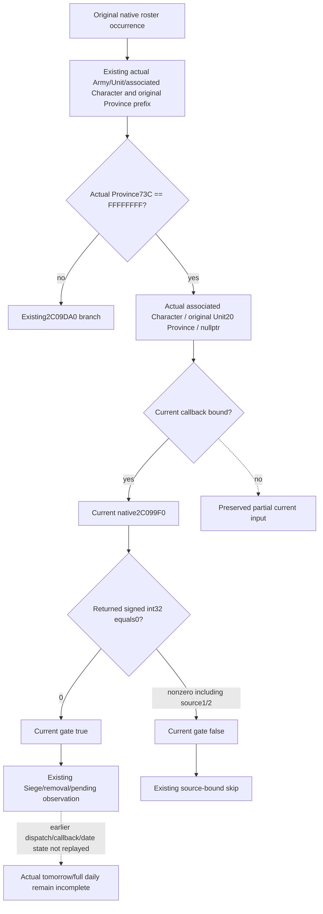

# Current Province73C sentinel classification — CK3 1.20.0.3

Source entry and actual evidence date: **2026-10-06**. Implementation topic/ABI authorship and handoff: **2026-10-07 / W41**, after the local midnight rollover. The candidate closes one concrete current-input construction gap from the original actual Army007 query: `province_73c_requires_2c099f0_inputs`. It adds the actual current integer returned by exact `2C099F0(Character, Province, nullptr)` to the existing admission gate. Its native caller accepts exactly classification0. Every returned signed32-bit value is preserved, and the source-derived gate is exactly `raw == 0`. An unbound callback remains partial.

**This topic is source-only. Tests and builds are not run by this lane. The new production branch is not live-qualified.** Parent owns integration and first qualification. The original immutable Army007 is retained as the successful restored actual ArmyStrength query with partial current admission, rather than rewritten as a later complete result.

## Actual evidence and chosen construction entry

Existing source base is `71b729f0cc4894331f1dadb89155920fccd42a00`, isolated at `C:/codex-ck3-background/province73c-current-classifier/source01`. CK3 exact build is **1.20.0.3 / Steam25652598**, bound to the already held executable SHA `94B55397ABB687A3DCD436805A5D885E6BE90FA6C693FEB44A9E3BBEEADE02A6`. This continuation performs no new executable reads, metadata reads, hashes or body captures.

The parent captured the original actual `007-first-actual-army-query-cap64.json` once and sealed small projections. This lane reads those small caches only:

- `r0051-army-cap64-production-qualification/ACTUAL007-SCHEMA-AND-SCALARS.json`
- `r0051-army-cap64-production-qualification/front-half/ACTUAL-FAMILY-PROJECTION.json`
- `r0051-army-cap64-production-qualification/back-half/ACTUAL-FAMILY-PROJECTION.json`

The original actual query completed on2026-10-06 at15:30:37 UTC /23:30:37 Asia/Shanghai; it began at15:29:48 UTC /23:29:48 local. These Oct6 observations precede the Oct7 implementation authorship. The actual actor is Robert29829. The selected player Army is218104048, native CArmy67109093, with1833/2367 soldiers,39 regiments and supply10000000 at scale100000. The selected row carries the whole original native roster admission observation:458 stored occurrences. The cache records296 recursive `province_73c_requires_2c099f0_inputs` reason nodes and2 remaining `2c09640_remaining_relation_predicates_unclosed` nodes. These are recursive reason counts, not established distinct Army-occurrence counts. They must not all be attributed to Robert's own original occurrence.

The current flag20, flag21, condition30 and dated-append families are already ready in this actual query. Current date53288232 and tomorrow low53288256 came from the same-query army clock. No date argument is missing from the selected classifier call. Callback execution, the next evolving occurrence, tomorrow roster, full daily assault and full monthly behavior remain incomplete.

## Held native source before observer design

The [original-roster admission source tree](army-daily-assault-roster-admission-12003.md) records the exact chain `2A99B40 → 24E8560 → 2C16690`. Existing `daily_assault_roster_detail::Gate` has already:

1. Selected the original Army and Unit, and read the original Unit20 Province pointer.
2. Passed the native Unit18, Unit170, Province788/850 and associated Army1D4/1EC prefix.
3. Resolved the associated Army124 to a separate Unit, then Unit174 to the actual selected Character.
4. Read actual Province73C.

At the current producer's sentinel branch, `Province73C==FFFFFFFF` returns `province_73c_requires_2c099f0_inputs`. The native2C16690 instead calls `2C099F0` with that selected associated Character, the original actual Province and literal third argument0, then returns exactly `EAX==0`.

The complete567-byte classifier body is already held at `daily-assault-roster-admission/gate24e8560-source/SOURCE-02C099F0.{json,asm.txt}`: exact range `[02C099F0,02C09C27)`. This lane reuses its previous closure without rereading the body. Its normal outputs are:

| Native return | EAX classification | Native caller gate |
| --- | --- | --- |
| `02C09C11` | 0 | true |
| `02C09BB3` | 1 | false |
| `02C09C26` | 2 | false |

Internally it selects a Title through Province738 and Title registry05D1DAF8/fallback05D1DAE0, obtains Title128 holder or conditional type/parent holder, resolves the actual Character, and follows current pointer/common-War/hierarchy branches. It calls the existing exact current2C090F0 helper when demanded. The source has no date argument/load and does not call247D030. Title construction is input provenance for this actual native classifier; this minimum current observer does not add another Title raw collector or claim a full raw hierarchy replay.



## Frozen minimum ABI and gate fields

The ABI observes a full32-bit return. It never casts the classifier to a bool:

```cpp
using CurrentProvince73cClassification =
    std::int32_t (*)(const void *, const void *, const void *);
// Exact .3 current binding at base + 0x2C099F0.
get_current_province73c_classification(
    first_character.object, *province, nullptr);
```

RCX is the actual selected associated Character. RDX is the original actual Unit20 Province. R8 is null, the exact caller's optional War selector. Existing `BindCurrentDailyAssaultRosterAdmission12003` already flows through the adapter; the exact callback is added in its owned header under the existing exact .3 binding. No additional shared query hook is required.

Parent froze five added fields in the existing AdmissionGate:

| Field | Contract type | Default | Current meaning |
| --- | --- | --- | --- |
| `native_2c099f0_character_identity` | identity? | null | Actual selected RCX Character identity. |
| `native_2c099f0_province_identity` | identity? | null | Original actual RDX Province identity. |
| `native_2c099f0_third_argument_is_null` | bool? | null | True for this constructed literal null R8. |
| `native_2c099f0_returned` | bool | false | Getter returned normally. |
| `native_2c099f0_classification_raw_i32` | i32? | null | Actual returned EAX, retaining its signed32-bit value. |

There is no new top-level family or schema version. Earlier decisive skips and the non-sentinel branch leave the extension undemanded. The current observer belongs at the existing Gate sentinel branch and uses the query's existing once-sampled whole-roster admission family; it adds no second roster traversal.

The strict consumer matches the observed Character identity to `associated_character_resolution.object_identity` and the Province identity to `original_unit_province_identity`, then requires the null third argument and an observed native return. It derives the gate by comparing that actual signed32-bit integer directly with0. The captured source has0/1/2 normal return paths, but no extra value-domain gate is introduced. No invented Boolean fills a missing native result.

The agreed unbound reason is `province_73c_2c099f0_getter_unbound`. The direct ABI has no explicit read-failure or nonreturn value; existing whole-mailbox exception behavior is unchanged. Entire extension absence in an older producer retains the original missing-input result; a partial extension is not a coherent five-field transport. This is source-family compatibility, not a new game action restriction.

## Readiness boundary and first qualification handoff

A qualified actual callback can close this reached **current standalone2A99B40 admission** branch. It does not prove the earlier dispatcher or callback mutations, future refreshed flags, tomorrow roster or full daily/monthly simulation. Non-sentinel2C09640 remaining predicates retain their independent gap.

Native child owns the binding, DTO/serializer, callback and new fixture source. Service child owns strict normalization, pure current derivation and new compound source. The coordinating agent owns this source candidate and its single English commit. Root owns shared integration, first targeted build/tests and later paused actual qualification. This topic and external ABI/source-contract belong to the source lane. No test success, native compilation or new live result is asserted here.

The concrete first qualification should pass actual selected callback arguments through the production collector, whole ArmyStrength serialization and real service normalization once. It must preserve classifier0/1/2, the unbound partial outcome, every returned signed32-bit value, original stored occurrences, and the existing later Siege/removal/pending branch. A later actual paused artifact must be new evidence; immutable original Army007 stays historically partial.

The frozen unique native target and CTest are `xar_bridge_army_province73c_current_classifier_v1_fixture`, with five whole packets:0,1,2, unbound and not-demanded. The owned CMake module declares this `EXCLUDE_FROM_ALL` target and its targeted CTest; Root integrates the single include line. After the first new CTest emits the five wires, run the standalone consumer once. It shares the unit method's same compound, so do not also run that method separately. Neither native execution nor Service consumption has run in this source lane.

External implementation packet: `Z:/ck3_mod_rewrite_process_assets/g2-background-20261006/province73c-current-classification/`. Initial actual-gap delivery and source-first plan remain at `r0051-army-cap64-production-qualification/province73c/`. The original metadata-only2C099F0 harness RED remains preserved in its original gate source packet.

This source lane adds0 EXE bytes,0 hashes,0 captures,0 tests/builds,0 game/SDK/process-inspection/pipe/UI/Steam operations, and0 Git operations. It never rereads the huge Army007 file and does not edit shared main/report indexes.
