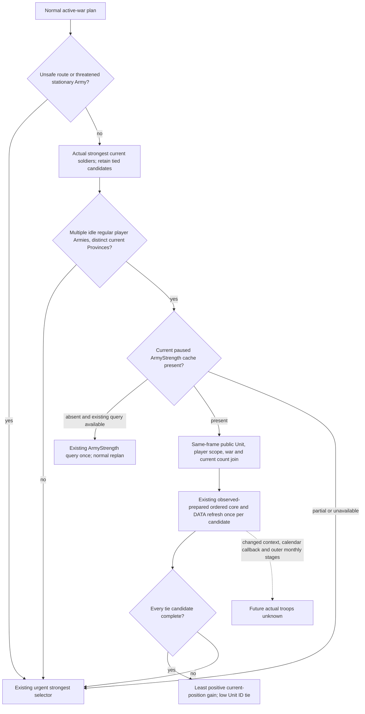

# Current replenishment in the normal Army selector — 1.20.0.4

Source plan frozen on 2026-10-08, ISO week 41, before policy implementation. Base: `a59b2df4a2b3ab6a951bfdc4f12845faf27439d7`. Exact game identity: CK3 1.20.0.4, Steam 25734779, executable SHA-256 `98702F88A547CDE2EAF29A85F93B85F68EE4CF8148336A4F7AFAEB75319DD518`. This package reads no executable bytes and performs no game or process operations.

Normal quiet pursuit currently selects the strongest controlled Army, then the lowest public Unit ID. The existing same-frame ArmyStrength query supplies current soldiers and the scoped ordered refill inputs, but this selector does not consume replenishment. The bounded counter-policy will retain actual current soldiers as the primary rank. Among equally strong idle player Armies in an active war, it will dispatch the Army with the smaller known positive current-position refill opportunity. The other Army keeps its productive current position. This is our opportunity-cost tie policy; the source below does not establish a native AI tie ranking or prove that moving will eliminate replenishment.

## Native tree and input ledger

The [ordered refill source](army-ordered-regular-refill-projection-plan-12003.md) distinguishes observed prepared `+148`, the complete ordered seven-slot request buffer, signed ADD/cleanup, and the subsequent raised DATA refresh. The adopted pure entrance `project_scoped_observed_prepared_ordered_refill` reuses that calculation and the ordinary/Character refresh branch. The [actual4 position source](army-next-route-replenishment-position-condition-12004.md) closes current Unit position and directional owner/holder admission; it explicitly does **not** make moving state 7 a blanket no-refill rule. Existing actual4 source and Root Runtime32 qualification are reused; old qualification is not executed here.

| Input | Existing production source | Consumption / limit |
| --- | --- | --- |
| Player control and actual current soldiers | `controllable_armies` and normal `player_armies` | Keep actual current soldier rank; do not replace it with projected troops. |
| Active war identity | Current `active_wars`; Strength `war_ids` and `scope_role=player` | Only current player rows belonging to a visible active war. |
| Same paused frame | NativeDriver `_army_strength_cache_for_snapshot`: snapshot ID, native revision, connection generation and episode binding; emitted queried snapshot/revision | Consume its normalized cache only. No second query or cross-frame row join. |
| Current position / prepared cache / full seven physical contexts | Strength `scoped_ordered_refill_inputs_v1` | Reuse the shared observed-prepared wrapper once per tied candidate, without copying the core. |
| Raised current/max refresh | Strength complete DATA, actual `native_loss_writer_skipped`, current regiment rows | Require both core and raised current/max readiness. Missing permission is not false or zero. |
| Current-position opportunity | Complete conditional raised current minus observed raised current | Clamp only the **ranking benefit** to zero; retain signed native result and its delta in the ledger. It is not a time forecast. |
| Fresh preparation / first-route destination alternative | Separate published leaves | Not consumed by this current selector. No observed `+148` replacement or future arrival claim. |
| Mobilization reserve / current default raise target | Separate `player-default-raise-legality-12003.md` / `war-mobilization-12003.md` | This tie selector issues no raise/disband commands. A new mobilization policy needs its actual4 target and reserve observation independently. |

## Owned implementation seams and sole qualification plan

New `current_replenishment_army_selector_v1.py` owns the pure rank and its input ledger. `strategy.py` quiet pursuit selection and the existing ArmyStrength-query condition receive narrow hooks. Unsafe/threatened selection, movement waits, siege relief, merge recovery, combat ingress, Native readers and Service schema are unchanged. Different current Provinces avoid taking over existing same-Province consolidation.

One new compound will pass typed current rows through the real `GameplayBridgeService.plan_turn` normal planner: equal current troops but known positive refill versus legal zero; a stronger actual Army remains primary; missing permission keeps the original low-ID tie; source inputs stay unchanged. Distinct actual persistent identities and nonoverlapping manager occurrences are retained across the two fixture rows. It will also prove the query request and the native signed delta/source basis. This package authors that compound and the sole FIRST argv, **SOURCE_NOTRUN**. Root executes it once and retains any real RED. No old tests or native fixtures are rerun.

Readiness is **research / source candidate**, not static-ready or live. Actual refill, actual post-stage state, full monthly simulation and a changed-context future forecast remain unclaimed. The next production outcome check is the selected Army and unchanged held Army in a same-frame normal active-war plan; it requires Root's current paused snapshot and action verification.
