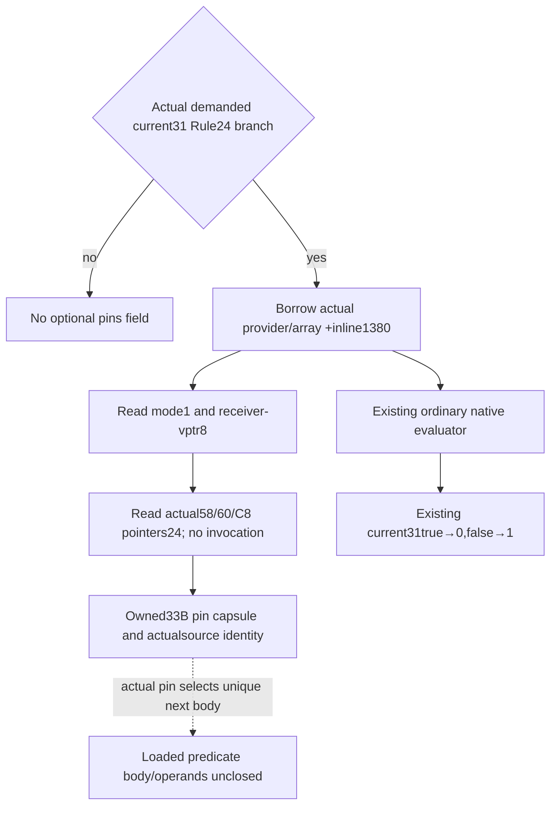

# Current31 actual Rule24 source pins —1.20.0.3

October6 source research closed the ordinary Rules shell; October7 implements the next demanded loaded-pin capsule. Exact build/source match the [Combat observer](army-current-combat-roles-phase-observer-12003.md). Existing independent current31 FIRST was doubleGREEN(7newwholequery scenes/14occurrences) and static-ready; it is not rerun. This new metadata observer is research and FIRST NOTRUN.

Only actual1D4nonzero/nonactiveCombat selects Characterroot18 and actual inlineRule24. Provider is QWORD module+5D21DC8; array is provider+EF0; inline receiver=array+1380. The observer borrows these actual pointers already held by the current31 collector. It adds actual modeBYTE at5D1DADC, receiverQWORDvptr and vtableQWORD slots58/60/C8: **33B** per actual receiver per query, no extra provider/array16B. Query-local cache copies the owned capsule, including partial captures, to repeated occurrences. It captures before the existing context/evaluator binding gate, so pin availability does not replace the current31 native verdict.

Held372DF30(232B) copies actual mode into evaluationState;372E020(1070B) validates the actual kind4 root through loaded registry countC/data+140 or fallback54F5310 descriptor+10;372B4E0(144B) checks actual58 expectedScope and conditional60 mask, then conditionalC8 predicate. Root rejection and applicability rejection are nativefalse, hence current31=1. Historical Rule43 vtable/targets cannot identify current slot24.

Native API is ReadCurrentRule24SourcePins12003(bindings,actual_inline_receiver). Binding fields are rule_source_mode_slot,rule_source_module_base and held SizeOfImage102518784(0x61C5000). Read statuses distinguish a failed copy, observedpointer0 and an externaltarget. Captured function0 retains identity/read_readytrue; outside-module target retains identity with RVAnull. A null vptr captures9B and leaves callbacks undemanded; it is a partial inventory, not false predicate. MissingC8 is33requested/25captured; missingmode is33/32. All capsule nativecalls/writes are0.

Existing current31 occurrence gets optional rule24_source_pins_v1. Serializer omits it when undemanded. Strict accepts old packets without it; old current31 derive/readiness never depends on pins. When present the pure occurrence adds rule24_source_pins_projection_v1 with the same query provenance. Existing full Service current31projection exposes it; no second MCP/family is added.

The new sole14scene whole-Service compound verifies availablemode0/mode4/externalidentity, missingC8/mode metadata and absentpins on10activeCombat scenes. Old-shape compatibility only removes the newoptionalfield from copies of the NEW compiled current31leaf before direct normalize/project. It does not import an oldtest, replay an oldwire, fabricate a whole baseline or transplant a nativeleaf. FIRST belongs to Root joint and remains0 here.

Actual loaded Rule24 callbacks/mode/root descriptor remain unobserved in a genuine game frame. [The standalone49B/root optional69B recipe](Z:/ck3_mod_rewrite_process_assets/g2-parallel-20261006/army-current31/next-current-status/rules-source/ROOT-PAUSED-PIN-REQUEST.json) remains a Root-only next observation entrance; the implemented samecaptureincrement is33B. Only actual pins justify later unique functionbody reads. This extension does not raise refresh/future/fullcallback/daily/monthly/live readiness. New EXEread/hash/test/build/game0.
