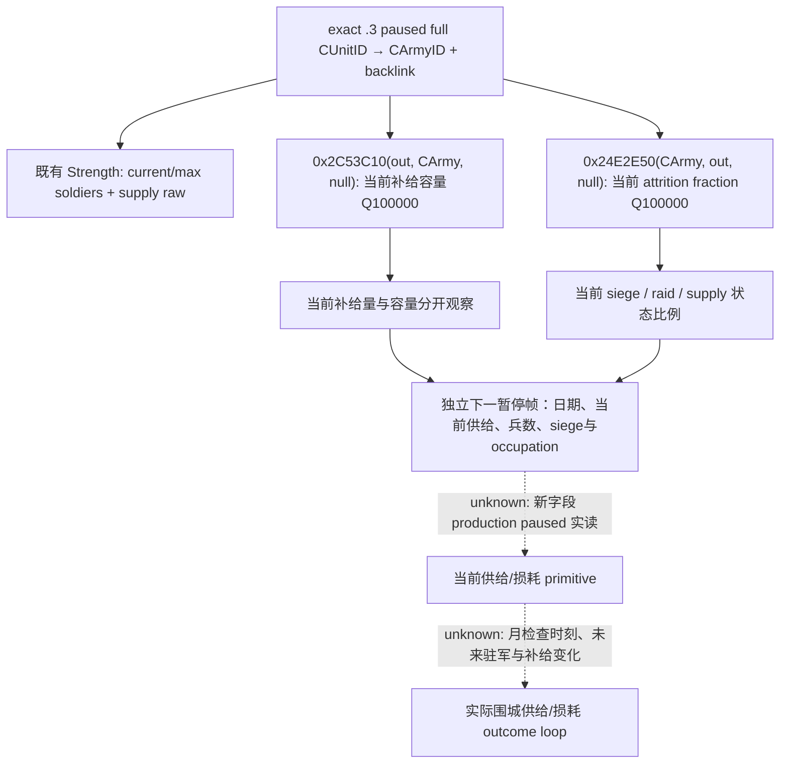
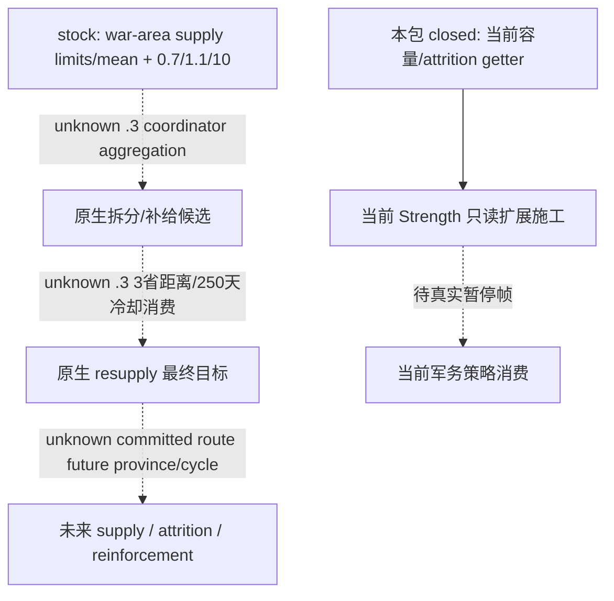

# CK3 1.20.0.3 当前军队补给容量与损耗率原生入口

冻结 CK3 1.20.0.3 / Steam build25652598；EXE SHA-256 `94B55397ABB687A3DCD436805A5D885E6BE90FA6C693FEB44A9E3BBEEADE02A6`。本页是离线静态调用链证据；没有 SDK、进程读取、游戏函数执行或新增游戏天。

既有 `current_supply_raw`/Q100000 来自已闭合 `CArmy+0x180`，本次不重复它。新增入口来自当前原版 `gui/window_army.gui` 的真实注册链：

| 所需值 | 注册链及 native getter | Microsoft x64 调用签名 | 输出语义 |
|---|---|---|---|
| 当前补给容量 | `GetFullSupplyCapacity` string `0x454A9D8` → 注册 `0x1CEBD3`/callback `0x1350A80` → `0x13466C0` → `0x2C53C10` | `int64_t* fn(int64_t* out, CArmy* army, void* optional_breakdown)`；`optional_breakdown=nullptr` | 输出 signed64 Q100000。GUI 最后向零除100000，桥应保留 raw。不是常数100、不是最高兵数。 |
| 当前 army attrition 比例 | `GetArmyAttritionPercentage` string `0x44E3C70` → 注册 `0x95F63`/callback `0xCFA420` → `0x24E2E50` | `int64_t* fn(CArmy* army, int64_t* out, void* optional_breakdown)`；`optional_breakdown=nullptr` | 输出 signed64 Q100000 fraction；0.01 对应1000、界面按百分数格式化。不是当前死亡人数。 |

容量 helper 使用 `CArmy+0x120` commander FullID 读取角色 modifier；其核心为 `(FULL_SUPPLY + modifier[0x1D3]) * (1 + modifier[0x1D4])` 的原生 fixed 运算，分支无有效统帅时返回 loaded FULL_SUPPLY。`0x2C53E33` 检查可选详情指针；null 跳 `0x2C540EC`，绕过 string/detail append。写入仅 caller-owned `out`。不能在客户端固定100或读取统帅modifier后自己重算。

损耗 getter 的 GUI callback `0xCFA432` 显式 `xor r8d,r8d`，`0xCFA435` 提供 caller-owned8字节 out。`0x24E2E50` 先计算供给状态基础比例，检查舰队/grace 条件及符合资格的当前兵团，再叠加当前 raiding 与 `CArmy+0x1E8 != -1` 的 active siege 项；`0x24E2FB9` 写 out，`0x24E2FBD` 的 null guard 跳 `0x24E32B3` 绕过 breakdown。此值可用于当前围城继续观察；真实人数净变化仍不能直接归因损耗。

调用沿现有 army-strength owning-thread mailbox，在同一暂停 snapshot identity上解析完整 CUnit/CArmyID，保留 backlink。仅 `.3` exact adapter 赋新 getter；本包没有证明 `.2` 的新地址/ABI，不能因 `.3` 原基础适配映射到 `.2` 就给 `.2` 安装这些指针。旧 `.2` optional 指针为空，新字段保持未观测。current/max soldiers 与 supply 的既有 available 行仍可独立使用。

补给变化已定位另一个正常纯数值入口 `GetTruncatedSupplyChange → 0xD1B3C0 → 0xD12100 → 0x24E51A0(CArmy,out,current CProvince,null)`。该函数需要真实 current Province、realm/hostile/limit、舰队/grace与统帅等输入；本次仍研究，不把 stock 的每check +20 / loss5..10当作Robert当日实际变化。补员率与raise储备由独立 army_reinforcement_raise lane维护；不与 battle reinforcement加入时刻混淆。

已有原生围城继续树 [war-relief-siege-native-ai-12003.md](war-relief-siege-native-ai-12003.md) 的当前unit围同省 +500、continue +80，以及打断围城比例条件复用；本包没有完成全部 supply AI目标排序，也不让该质量差距成为普通围城前置门禁。

## stock 原生 AI 输入与未闭合分支

当前 stock 的 `MIN_SUPPLY_COMPARED_TO_AVERAGE_SUPPLY_FACTOR=0.7` 是战争区域最低可用补给与平均补给的比较输入，`SUPPLY_LIMIT_SPLIT_SIZE_PADDING=1.1` 是拆分 padding，`ARMY_SIZE_COMPARED_TO_SUPPLY=10` 是 stack 承受比；这些数值描述省级 supply limit，不能代替 CArmy 当前补给量或容量。`RESUPPLY_MAX_DISTANCE=3` 和 `RESUPPLY_COOLDOWN_DAYS=250` 是当前原版 resupply 数据输入；其 .3 最终 resupply 目标选择消费链尚未由本次闭合。

上述 unknown 是质量与逆向入口：需要精确模仿 AI resupply 时，沿 AI define 名称注册槽与当前 army coordinator 的 resupply caller 定位，冻结当前省 supply limit、CArmy状态及真实 committed route，再给既有查询补同帧输入。当前普通 siege 观察可先使用既有 supply/current soldiers和新的容量/attrition数值，不能因完整未来预测未闭合停止实机。

`NSiege.MONTHLY_ATTRITION=0.01` 是 stock 的月围城损耗项，供应状态损耗表为0/0/0.05；真实军队 getter含动态资格与其它当前项，不能按常量对Robert人数直接扣除，也不能把两暂停帧净少人数归因为围城死亡。正常围城的当日工作量/剩余天数与此月率分开处理。

证据统一在 `Z:/ck3_mod_rewrite_process_assets/g2-resume-20261003/army-supply-attrition/native-tree/`：`FOCUSED-ABI-PROOF.json` 保存14个指令检查、EXE identity与stock/复用source哈希；`function-2c53c10.txt`、`function-24e2e50.txt` 保存 getter完整边界和 SHA；`supply-getter-registrations.json/.txt` 保存真实名称及注册链。本次仅一次focused离线核对，无游戏重跑、无新测试或live信用。实现、focused production-reader fixture与实机结果由各自owner追加。

## 两字段现有军力查询增量：static-ready

已完成外置候选，在既有 `ck3_query_army_strengths` / `query-army-strengths-v1` 增加 `current_supply_capacity_raw/scale` 与 `current_attrition_fraction_raw/scale`，保持 current_supply既有字段与公开capability/flag不变。仅 exact `.3` adapter安装已闭合的新getter，`.2`保持未观测；同暂停帧完整CUnit/CArmy身份与backlink闭合后才调用。比例是当前原生fraction，不是当前死亡人数或未来army净损失。

第一focused attempt **GREEN**：C++20 `/O2 /DNDEBUG /W4 /WX` 直接编译生产 `ck3_12002_army.cpp` 与现有army测试，复用桥的共享 `AppendArmyStrengthV1`，将6个C++生产reader输出案例交给投影的Python `war_contract.py`，以 `-B -O` 与显式Require/raise验证。新增fixture注入只读getter回调提供容量/损耗原始值，验证生产reader→serializer→Python的数据链；没有执行游戏EXE中的两个新getter，也没有runtime/live信用。另有3个由生产row变出的错误schema案例；`.3` adapter改动translation unit严格编译GREEN。

源码与fixture原始交付：[projection-fixture/ROOT-DELIVERY.json](Z:/ck3_mod_rewrite_process_assets/g2-resume-20261003/army-supply-attrition/projection-fixture/ROOT-DELIVERY.json)，8路径patch SHA-256 `437e8239f54e92b9a6e26186bb68f961bf158c7ac54032cdf2580b350fae72e8`。同包没有SDK、游戏输入、共享源码或Git写入，没有新增游戏日。ROOT采用源码后需冻结新runtime并执行正常严格DLL构建，再在当前真实paused军团读取这两字段；不能把fixture原始值或未发布的null字段冒充当前罗贝尔值。

当前v40已有供给原始值独立实测为100、兵数2290/2461、40regiments（date53238336，public2/native7）；[CURRENT-SUPPLY.json](Z:/ck3_mod_rewrite_process_assets/g2-resume-20261003/army-supply-attrition/actual-current-supply-v40/CURRENT-SUPPLY.json)与[既有当前供给专题](m5-primary-current-army-supply-source-2026-09-16.md)保留这条production-live primitive。补给容量、损耗比例仍未由该旧DLL读取；兵数变化不作attrition或battle casualty人数。
