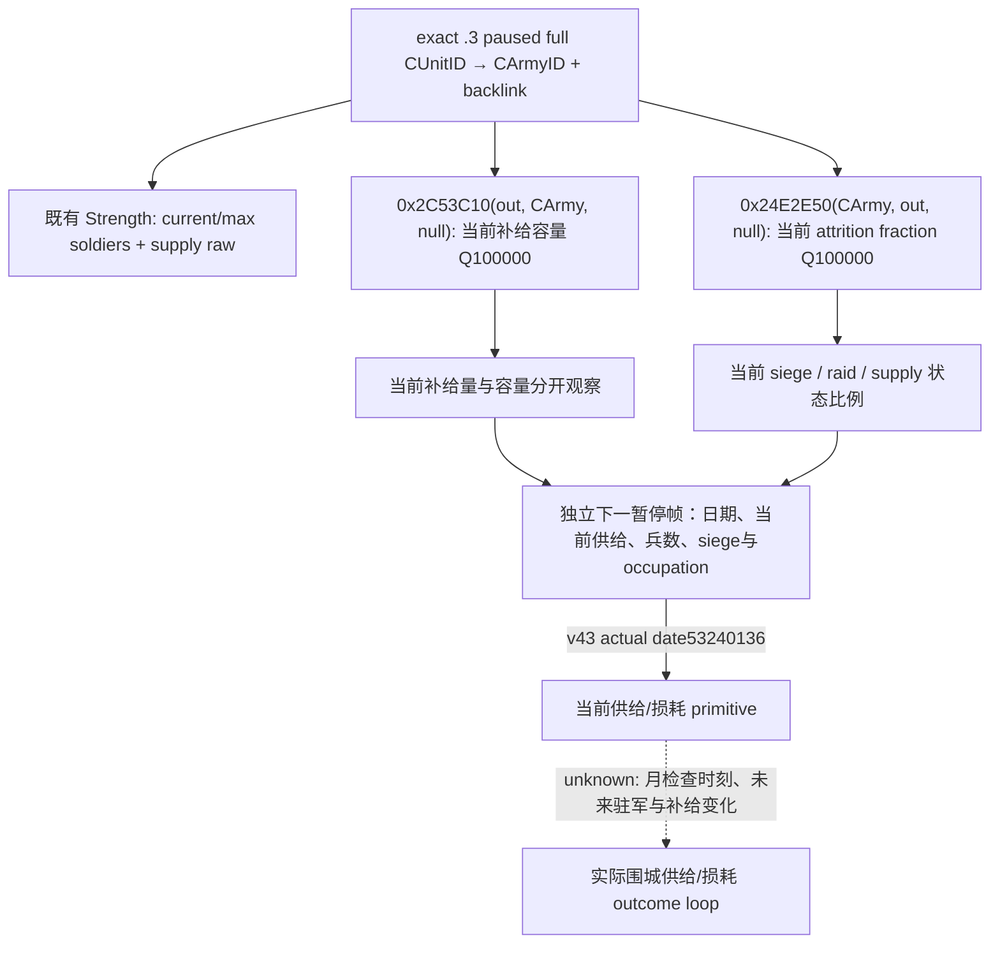
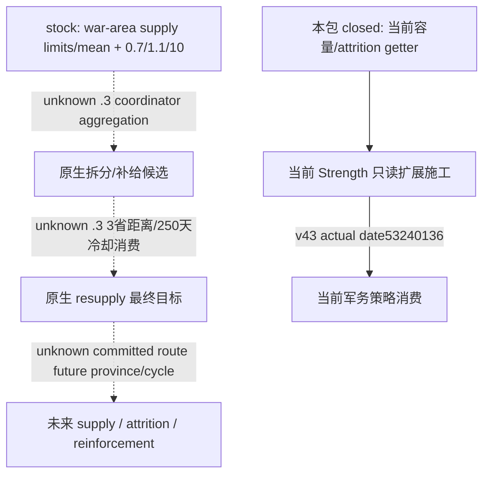
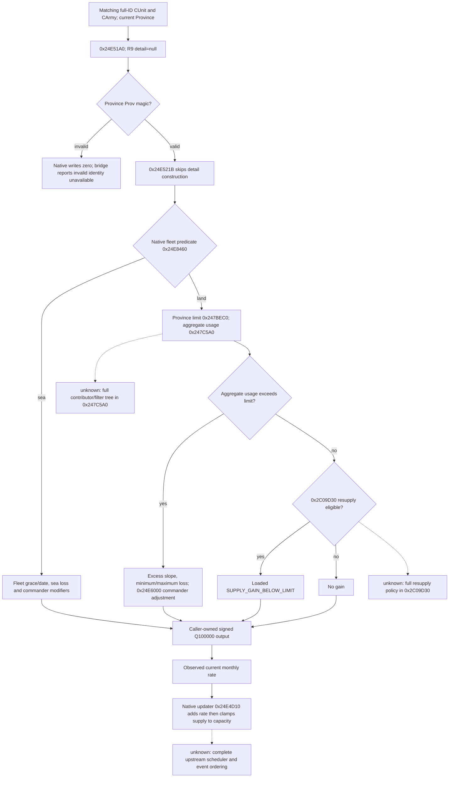
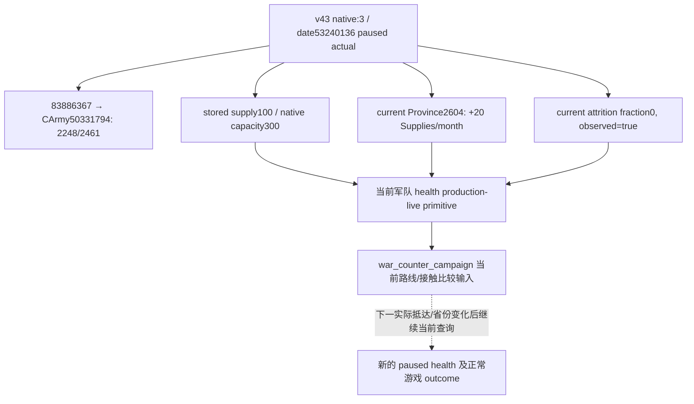
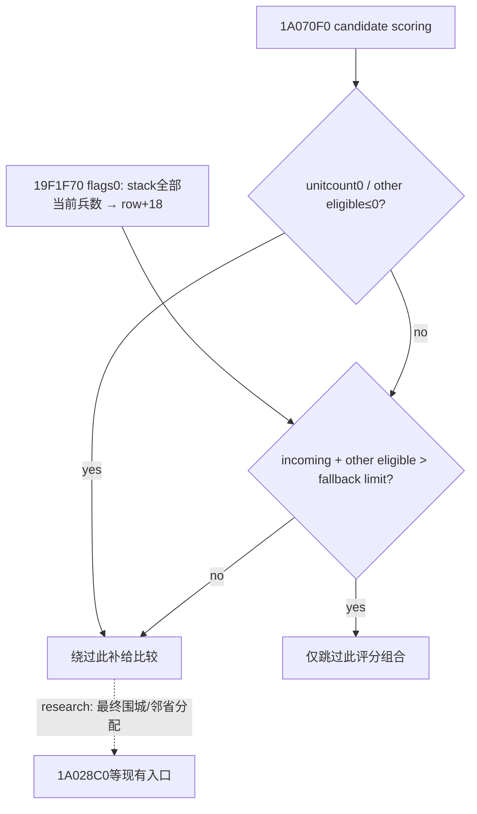

# CK3 1.20.0.3 当前军队补给容量与损耗率原生入口

冻结 CK3 1.20.0.3 / Steam build25652598；EXE SHA-256 `94B55397ABB687A3DCD436805A5D885E6BE90FA6C693FEB44A9E3BBEEADE02A6`。本页先记录离线静态调用链，末节追加2026-10-03 v43当前 paused production 实读；离线研究自身没有 SDK、进程读取、游戏函数执行或新增游戏天。

既有 `current_supply_raw`/Q100000 来自已闭合 `CArmy+0x180`，本次不重复它。新增入口来自当前原版 `gui/window_army.gui` 的真实注册链：

| 所需值 | 注册链及 native getter | Microsoft x64 调用签名 | 输出语义 |
|---|---|---|---|
| 当前补给容量 | `GetFullSupplyCapacity` string `0x454A9D8` → 注册 `0x1CEBD3`/callback `0x1350A80` → `0x13466C0` → `0x2C53C10` | `int64_t* fn(int64_t* out, CArmy* army, void* optional_breakdown)`；`optional_breakdown=nullptr` | 输出 signed64 Q100000。GUI 最后向零除100000，桥应保留 raw。不是常数100、不是最高兵数。 |
| 当前 army attrition 比例 | `GetArmyAttritionPercentage` string `0x44E3C70` → 注册 `0x95F63`/callback `0xCFA420` → `0x24E2E50` | `int64_t* fn(CArmy* army, int64_t* out, void* optional_breakdown)`；`optional_breakdown=nullptr` | 输出 signed64 Q100000 fraction；0.01 对应1000、界面按百分数格式化。不是当前死亡人数。 |

容量 helper 使用 `CArmy+0x120` commander FullID 读取角色 modifier；其核心为 `(FULL_SUPPLY + modifier[0x1D3]) * (1 + modifier[0x1D4])` 的原生 fixed 运算，分支无有效统帅时返回 loaded FULL_SUPPLY。`0x2C53E33` 检查可选详情指针；null 跳 `0x2C540EC`，绕过 string/detail append。写入仅 caller-owned `out`。不能在客户端固定100或读取统帅modifier后自己重算。

损耗 getter 的 GUI callback `0xCFA432` 显式 `xor r8d,r8d`，`0xCFA435` 提供 caller-owned8字节 out。`0x24E2E50` 先计算供给状态基础比例，检查舰队/grace 条件及符合资格的当前兵团，再叠加当前 raiding 与 `CArmy+0x1E8 != -1` 的 active siege 项；`0x24E2FB9` 写 out，`0x24E2FBD` 的 null guard 跳 `0x24E32B3` 绕过 breakdown。此值可用于当前围城继续观察；真实人数净变化仍不能直接归因损耗。

调用沿现有 army-strength owning-thread mailbox，在同一暂停 snapshot identity上解析完整 CUnit/CArmyID，保留 backlink。仅 `.3` exact adapter 赋新 getter；本包没有证明 `.2` 的新地址/ABI，不能因 `.3` 原基础适配映射到 `.2` 就给 `.2` 安装这些指针。旧 `.2` optional 指针为空，新字段保持未观测。current/max soldiers 与 supply 的既有 available 行仍可独立使用。

补给变化已定位另一个正常纯数值入口 `GetTruncatedSupplyChange → 0xD1B3C0 → 0xD12100 → 0x24E51A0(CArmy,out,current CProvince,null)`。该函数需要真实 current Province、realm/hostile/limit、舰队/grace与统帅等输入；本次仍研究，不把 stock 的每check +20 / loss5..10当作Robert当日实际变化。补员率与raise储备由独立 army_reinforcement_raise lane维护；不与 battle reinforcement加入时刻混淆。

已有原生围城继续树 [war-relief-siege-native-ai-12003.md](war-relief-siege-native-ai-12003.md) 的当前unit围同省 +500、continue +80，以及打断围城比例条件复用；本包没有完成全部 supply AI目标排序，也不让该质量差距成为普通围城前置门禁。

## stock 原生 AI 输入与未闭合分支

当前 stock 的 `MIN_SUPPLY_COMPARED_TO_AVERAGE_SUPPLY_FACTOR=0.7` 是战争区域最低可用补给与平均补给的比较输入，`SUPPLY_LIMIT_SPLIT_SIZE_PADDING=1.1` 是拆分 padding，`ARMY_SIZE_COMPARED_TO_SUPPLY=10` 是 stack 承受比；这些数值描述省级 supply limit，不能代替 CArmy 当前补给量或容量。`RESUPPLY_MAX_DISTANCE=3` 和 `RESUPPLY_COOLDOWN_DAYS=250` 是当前原版 resupply 数据输入；其 .3 最终 resupply 目标选择消费链尚未由本次闭合。

上述 unknown 是质量与逆向入口：需要精确模仿 AI resupply 时，沿 AI define 名称注册槽与当前 army coordinator 的 resupply caller 定位，冻结当前省 supply limit、CArmy状态及真实 committed route，再给既有查询补同帧输入。当前普通 siege 观察可先使用既有 supply/current soldiers和新的容量/attrition数值，不能因完整未来预测未闭合停止实机。

`NSiege.MONTHLY_ATTRITION=0.01` 是 stock 的月围城损耗项，供应状态损耗表为0/0/0.05；真实军队 getter含动态资格与其它当前项，不能按常量对Robert人数直接扣除，也不能把两暂停帧净少人数归因为围城死亡。正常围城的当日工作量/剩余天数与此月率分开处理。

证据统一在 `Z:/ck3_mod_rewrite_process_assets/g2-resume-20261003/army-supply-attrition/native-tree/`：`FOCUSED-ABI-PROOF.json` 保存14个指令检查、EXE identity与stock/复用source哈希；`function-2c53c10.txt`、`function-24e2e50.txt` 保存 getter完整边界和 SHA；`supply-getter-registrations.json/.txt` 保存真实名称及注册链。本次仅一次focused离线核对，无游戏重跑、无新测试或live信用。实现、focused production-reader fixture与实机结果由各自owner追加。

## 两字段现有军力查询增量：static-ready

已完成外置候选，在既有 `ck3_query_army_strengths` / `query-army-strengths-v1` 增加 `current_supply_capacity_raw/scale` 与 `current_attrition_fraction_raw/scale`，保持 current_supply既有字段与公开capability/flag不变。仅 exact `.3` adapter安装已闭合的新getter，`.2`保持未观测；同暂停帧完整CUnit/CArmy身份与backlink闭合后才调用。比例是当前原生fraction，不是当前死亡人数或未来army净损失。

第一focused attempt **GREEN**：C++20 `/O2 /DNDEBUG /W4 /WX` 直接编译生产 `ck3_12002_army.cpp` 与现有army测试，复用桥的共享 `AppendArmyStrengthV1`，将6个C++生产reader输出案例交给投影的Python `war_contract.py`，以 `-B -O` 与显式Require/raise验证。新增fixture注入只读getter回调提供容量/损耗原始值，验证生产reader→serializer→Python的数据链；没有执行游戏EXE中的两个新getter，也没有runtime/live信用。另有3个由生产row变出的错误schema案例；`.3` adapter改动translation unit严格编译GREEN。

源码与fixture原始交付：[projection-fixture/ROOT-DELIVERY.json](Z:/ck3_mod_rewrite_process_assets/g2-resume-20261003/army-supply-attrition/projection-fixture/ROOT-DELIVERY.json)，8路径patch SHA-256 `437e8239f54e92b9a6e26186bb68f961bf158c7ac54032cdf2580b350fae72e8`。同包没有SDK、游戏输入、共享源码或Git写入，没有新增游戏日。ROOT采用源码后需冻结新runtime并执行正常严格DLL构建，再在当前真实paused军团读取这两字段；不能把fixture原始值或未发布的null字段冒充当前罗贝尔值。

当前v40已有供给原始值独立实测为100、兵数2290/2461、40regiments（date53238336，public2/native7）；[CURRENT-SUPPLY.json](Z:/ck3_mod_rewrite_process_assets/g2-resume-20261003/army-supply-attrition/actual-current-supply-v40/CURRENT-SUPPLY.json)与[既有当前供给专题](m5-primary-current-army-supply-source-2026-09-16.md)保留这条production-live primitive。补给容量、损耗比例仍未由该旧DLL读取；兵数变化不作attrition或battle casualty人数。

## 2026-10-03 next increment: current Province monthly supply-change getter

This increment closes one native value needed for the current stationary siege. It reuses the capacity and attrition research above without repeating their checks. Readiness is **research / static-confirmed**; implementation, fixture and paused production observation remain separate milestones. No game day, SDK call, game window or policy change belongs to this artifact.

The exact image remains CK3 Steam `1.20.0.3`, build `25652598`, EXE SHA-256 `94B55397ABB687A3DCD436805A5D885E6BE90FA6C693FEB44A9E3BBEEADE02A6`. Evidence is frozen under `Z:/ck3_mod_rewrite_process_assets/g2-resume-20261003/army-supply-attrition/native-tree/supply-change-next/`; `ROOT-DELIVERY.json` pins every artifact, while `FOCUSED-SUPPLY-CHANGE-PROOF.json` records the new getter's exact instruction checks and stock hashes.

| Contract | Exact closure |
| --- | --- |
| Native numeric getter | RVA `0x24E51A0`, `.pdata` span `0x24E51A0..0x24E5FFA`, binary SHA-256 `2df6ea7faf0de9aa16969bb85bc040c558f161e911c06010e883e0463278ef36` |
| ABI | Windows x64: `int64_t* fn(CArmy* army, int64_t* out, CProvince* current_province, void* optional_detail)`; `RCX=army`, `RDX=&out`, `R8=province`, `R9=null`, `RAX=&out` |
| Value | Signed Q100000 supply units per native check; stock GUI calls this **Supplies/month**. Suggested field: `current_supply_change_monthly_raw` plus `scale=100000` |
| Selected Province | Current `CUnit+0x20`. The native GUI wrapper resolves `CArmy+0x124` to full-ID-matching CUnit, then passes that pointer at `0xD12150..0xD1216A` |
| Required identity | Existing Strength resolves public CUnit full ID and its `+0x178` CArmy full ID; require CArmy `+0x124` backlink to the same CUnit. Validate current Province against GameData `+0x140/+0x14C`, Province `+0x10` ID and `+0x85C` `Prov` magic |
| Version / thread | Assign the optional pointer only in the exact `.3` adapter. `.2` is unproved and retains null. Invoke on the same owning-thread paused Strength snapshot as the existing readers |

`GetTruncatedSupplyChange` string RVA `0x44E56C8` is registered at `0x9B5A9`, through callback `0xD1B3C0` and wrapper `0xD12100`. At `0xD12167` the wrapper sets `R9D=0`; `0xD1216A` calls the numeric getter. The wrapper's integer display is `trunc((current_raw + rate_raw)/100000) - trunc(current_raw/100000)`, not the underlying raw rate. Publish the numeric leaf rather than its truncated GUI wrapper.

The land path derives actual owner from resolved CUnit `+0x174`, commander from CArmy `+0x120`, and calls the limit getter at `0x24E5AF2` with `(Province, owner, commander, null)`. It calls `0x247C5A0` at `0x24E5B0D` with `(Province, owner, null, null)` for aggregate usage. If a caller supplies a different Province, the numeric path includes this army's eligible soldiers; this query increment passes only its matching **current** Province. Stock defines provide loss slope `0.001`, pre-commander minimum `5`, post-commander maximum `10`, and under-limit gain `20`. Use the loaded native values through the getter instead of duplicating these constants in client arithmetic.

The null-detail path initializes both detail-line pointers to zero at `0x24E5200/0x24E5208`, then skips detail construction at `0x24E521B`. Sea grace writes zero at `0x24E53E9`; the sea result writes `out` at `0x24E59E4`. The land path adjusts a local signed loss with helper `0x24E6000`; its null-detail guard `0x24E61F9` jumps to the local output write `0x24E6407`. The final detail helper `0x24E6470` skips positive-line writes (`0x24E6498`), negative-line writes (`0x24E6505`) and detail-array mutation (`0x24E656B`). The leaf adds gain and signed loss at `0x24E5E62`, writes `out` at `0x24E5E6D`, and returns that pointer at `0x24E5E70`. These selected paths write caller-owned output or local stack; query callers pass no native detail container.

`R8` cannot be null: the getter immediately dereferences Province `+0x85C`. Native GUI fallback objects are not an observation contract. An unresolved/null/stale Province must remain unavailable; a valid getter returning zero is a legal observed zero. This uses the existing reader's ordinary identity resolution, not an added policy gate.

Stock `armyview_l_english.yml:65–66` supplies the monthly unit. The native state forecast caller `0x24DE240` advances projected checks by `30` days at `0x24DE3D1`, while the real updater `0x24E4D10` adds the **whole raw rate** into CArmy `+0x180` at `0x24E4E8F`, calls the already-closed capacity getter at `0x24E4E9C`, and clamps/stores at `0x24E4EAB..0x24E4EC8`. Thus a positive rate at full capacity is possible: the getter does not promise realized next-month increase. Gathering/grace and unit eligibility checks also sit in the update consumer. Its complete upstream scheduling/event order is still unknown; no exact next-date or future siege/march forecast is claimed.

Construction entry: implementation owner adds this optional `.3` native pointer and projects raw monthly rate through **the same** `ck3_query_army_strengths` reader/serializer/Python chain, with a genuine focused fixture and then Root's paused Robert artifact. The existing two-leaf candidate proceeds independently. The remaining contributor/eligibility/scheduler branches can be studied at the named exact RVAs if a later observed decision requires them; they do not prevent reading the current native numeric rate.

## 月供给与逐chunk补员增量：static-ready

第二外置候选在上述当前容量/损耗的已冻结8源文件基础上接通既有 `ck3_query_army_strengths` 的 `current_supply_change_monthly_raw/scale` 与逐 `ArmyRegiment` 的补员当前观察；没有新增公开MCP口、runtime flag或军事动作门禁。原生补员树先落盘，完整研究专题见 [当前补员、已集结与reserve边界](army-regiment-replenishment-raised-reserve-12003.md)。

供给月变化使用真实当前 `CUnit+0x20` Province，并复用game Province数组/ID验证；getter输出signed Q100000 Supplies/month，缺少当前Province时不合成0。当前月变化率不是未来实现的净变化；updater先加delta再按capacity截断，所以满补给仍可返回正值。

补员只沿原生GUI已闭合的 **first data record** 路径：`CArmyRegiment+0x20` 的数据基址直接取`+8` persistent FullID，经原生storage/generation/magic解析真实persistent `CRegiment`，扫描其7个inline chunk并按persistent FullID与当前ArmyRegiment FullID双向匹配。`CArmyRegiment` magic `0x41725267` 与persistent `CRegiment` magic `0x52656769` 保持类型分离。保留实际native data-record count和source `native_first_record`；count大于1只观察首record关联的persistent记录，不能称全army补员、未集结reserve或全record readiness。

两个native布尔分别调用`0x262C700(CRegiment,chunk)`与`0x2657F10(chunk)`并独立保留；前者某原生分支可直接true而不经后者，客户端不自行AND。`0x262CAD0(CRegiment,out)`输出的是whole persistent Regiment的月fraction Q100000，不能聚合、替换或描述成当前fieldarmy净月补兵人数。某ArmyRegiment回链不可读时，其自身原因与空chunk保留，其他已读strength/current supply/capacity/attrition保持独立可用。

第二focused首轮 **GREEN**，三个translation unit并行 `/O2 /DNDEBUG /W4 /WX`，真正生产 `Strength` reader→同一个bridge共享serializer→投影Python `war_contract.py -B -O`，8个新增场景覆盖首record/7chunk、count>1限定、独立布尔与signed raw、缺record、FullID回链、缺当前Province和`.2`未绑定。fixture给新getter注入回调；未执行游戏EXE中的新getter，没有新live值或游戏天。第一容量/损耗旧矩阵与ABI检查没有重复。

源码交付：[replenishment-chunk-projection/ROOT-DELIVERY.json](Z:/ck3_mod_rewrite_process_assets/g2-resume-20261003/army-supply-attrition/replenishment-chunk-projection/ROOT-DELIVERY.json)，7路径delta SHA-256 `939680baaec10ed6e5b630a3f1ecfdce0039ce679300c9018a2b7971bf480323`；[原生补员ABI](Z:/ck3_mod_rewrite_process_assets/g2-resume-20261003/army-reinforcement-raise/native-replenishment/abi-lane/ROOT-DELIVERY.json)、[月供给原生ABI](Z:/ck3_mod_rewrite_process_assets/g2-resume-20261003/army-supply-attrition/native-tree/supply-change-next/ROOT-DELIVERY.json)。ROOT需要正常新runtime严格构建与paused query取得当前值。若真实record count大于1仍挡目标决策，则沿同专题继续闭合record stride与完整覆盖；局部primitive不冒充整军ready，也不成为普通围城接续的新门禁。

本包新增0游戏天、0SDK/进程读取/窗口输入，readonly旧供给100只绑定date53238336。ROOT另行已完成正常34日prefix至累计3951/h5177、围城55.108%/原生预计70天；该实际进度不代表本包新字段已live或补员/收复动作完成。

## 2026-10-03 v43 当前 paused production 实读

前文离线 research/static-ready 与旧帧资格保留为各自施工阶段和冻结日期的历史事实；本节只提升本次 v43 实际已读字段，不回填旧帧 live。

Root 新 runtime `g45/v43` 冻结源码 `8e2cfbee4981af7f80398ec09129c1cf0f3dbe54`，CK3 exact `.3` 版本及 EXE SHA 保持本页上述绑定；唯一 Robert29829 普通战役 `native-29829-2bc2d599f7f9` 继续，game PID14124 处于后台暂停。本次只消费既有生产查询文件，不启动 SDK、不运行夹具、不操作窗口、不新增游戏日。

生产叶 [016-ck3_query_army_strengths.json](Z:/ck3_mod_rewrite_process_assets/g2-resume-20261003/runtime-preparation/v43/actual-sway-new-fields-and-counter-scope-v43-01/016-ck3_query_army_strengths.json) 为 **GREEN**，SHA-256 `1f1f863e3ad77ad2ea59ad344ec1a5ae8c6178309e1e839a7c1514a04a913577`；date53240136、public revision2/native3、snapshot `native:3`、paused=true。既有 consumer 一次消费生成 [CURRENT-HEALTH.json](Z:/ck3_mod_rewrite_process_assets/g2-resume-20261003/army-supply-attrition/actual-current-health-v43/CURRENT-HEALTH.json)。同 SDK30708 已正常关闭，整批 exit1 的原因是独立 defaultRaise012 RED，不能把本叶 GREEN 写成整批 GREEN。查询叶内 version/EXE SHA 为 null，版本绑定来自 Root 已冻结的 runtime，未伪造叶内身份字段。

当前玩家 CUnit83886367 → CArmy50331794，40 ArmyRegiments，current/max2248/2461；Root 同暂停帧正常保存 h5377，save SHA-256 `1b24b41318a27a75d4148ec58d9dcad93d74ec1be4f7e31b4eec30ed6ca998e6`。本 lane 不增加该正常保存的日信用，不以暂停帧兵数差构造伤亡。

| 当前值 | observed | raw / Q100000 | 正常玩家可用含义 |
|---|---|---|---|
| stored supply | true | 10000000 → 100 | 当前军队实际持有补给。 |
| current supply capacity | true | 30000000 → 300 | 此帧原生当前容量；100 并非已满容量。 |
| current monthly supply contribution | true | 2000000 → +20 Supplies/month | 使用当前 Province2604 的原生 getter；不外推目的地或未来已实现增加。 |
| current attrition fraction | true | 0 → 0 | 当前合法原生零值；不说明此前兵数净降的原因。 |

三项新增数值从 static-ready 提升为 **production-live primitive**，且本次不是长期 null 的 schema 交付。旧 v40/v41 的 supply100 保留其当日事实，不能由旧字段推断其当日容量。本次实际容量300也不额外推断统帅具体 modifier。

2640 首都/两战 shared goal 和2635 本人 holding2103 的敌围城比较继续由 `war_counter_campaign` 消费 fresh022 enemy 与既有路线/接触查询；本包 health 只给当前2604输入。当前损耗0、月贡献+20支持继续当前移动/解围决策，不能生成目的地补给保证，也不新增等待满补给或完整未来预测门禁。native 首记录补员实际覆盖见 [补员专题](army-regiment-replenishment-raised-reserve-12003.md) 的同日追加。此 primitive 不宣称完整 resupply AI 排序、全军净补兵或 attrition outcome loop 已完成。

Root 本次协调收口的累计保存日为3992，自然继承0；本健康查询与文件整合新增0日。该计日来自 Root 总账，不由补给、兵数或月贡献推算；2248/2461 的差额不作为24小时损耗或战斗伤亡。

## 2026-10-04 R25：有限 AI 预计占用分支与真实到场军需

复用 exact 1.20.0.3 / Steam25652598 / EXE SHA `94B55397ABB687A3DCD436805A5D885E6BE90FA6C693FEB44A9E3BBEEADE02A6`，本轮闭合最小 incoming producer：`1A05398 → 19F1F70(stack,flags0) → EAX/R12D → 1A05633 row+0x18`。它遍历 stack subunit 的 lock-held CUnit，army type 解析 CArmy/regiments，再累加 `2A95740(flags0)` 的有效当前 whole soldiers；flags0不做`2A956D0` bit2资格过滤，故 incoming 是 stack 全部当前兵数，而候选省另一项才是相关己方／同战侧 eligible。公开单军3901与当前省usage都不能未经stack membership绑定替代此值。

有限评分链 `1A05200 → 1A05A62 → 1A070F0` 在候选省unitcount=0（`1A0758A/92`）或其他eligible≤0（`1A0781B/2C`）时绕过补给比较；否则`1A07832/35`相加、`1A0784E → 247BEC0`以fallback commander求limit，严格signed `>`（`1A07853/55`）仅跳过该stack/candidate评分行。玩家preview的真实commander29829上下文与该fallback上下文分列；旧2640 limit3080/usage0是preview原帧，不是将来3901已驻的用量，也不是新的到场省级实读。有限分支不推出统一禁入或必须拆军。

正常半拆现口 `ck3_execute_step("split-army-half-83886367", expected_revision=<fresh>)` 已有；提交时`296CF60(kind1,nativeCArmyID,fresh playedCharacterID,nullptr)`做最终predicate，无新adapter或named tool。`action_steps`只证明入口，实际拆分仍需fresh roster识别保留／新ID，再读strengths、各军province-supply preview与同省siege；本轮未执行半拆。AIstack membership、移除subunit后的围城反事实和最终邻省selector仍标research，继续现合法单军移动；是否拆军须结合实际消耗和保留围城质量的收益，不增加门禁。既有[目标评分树](army-target-triage-1.20.0.3.md)、[围城树](war-relief-siege-native-ai-12003.md)、[军务命令](war-mobilization-12003.md)直接复用。

Root其后SDK43780正常closed0/GREEN的独立 paused query（raw53244648，`native:491`、public2/native491、seq53）已由soleowner一次消费：`83886367/CArmy50331794` **3801/4231、reg47、supply106.97852/cap300、monthly change−4.54545、attrition fraction0.01**；gathering为not_gathering/null/readytrue。补员47行中30available、17为recordcount0 unavailable；30 observed firstrecord chunks的两个独立bool分别14T/16F与0T/30F，6行multirecord仍partial，不AND、不合成为整军月补人数。该body未发布currentprovince/currentcommander，不跨帧冒用旧preview值；3901→3801差值不造combatcasualty或唯一损失原因。负month与非零attr是新实际成本输入，query本身不授拆军、围城收益或完整loop信用。

研究树与三lane receipt：`Z:/ck3_mod_rewrite_process_assets/g2-resume-20261003/army-supply-attrition/native-ai-overcapacity-r25/ROOT-DELIVERY.json`；新health primitive：`Z:/ck3_mod_rewrite_process_assets/g2-resume-20261003/army-supply-attrition/actual-capital-arrival-health-v49/ROOT-DELIVERY.json`（raw leaf SHA `273b058597dc101cac84ff3f6d2541e058cfdc6dd9e3f99db08765a0ffbbef76`）。两phase新增SDK、测试、自然日、窗口操作、策略代码均为0；仅新actual phase原始叶消费1次，research phase原始叶消费0次。
