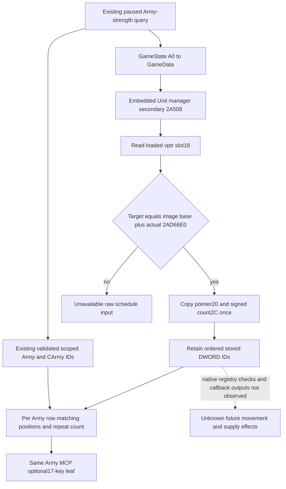

# Current Unit NewDate schedule inputs in CK3 1.20.0.4

This adds current raw Unit scheduling inputs to the existing Army-strength MCP. A raw Unit ID match marks a stored occurrence before the daily Unit stage. It does not establish that the native registry checks will accept that occurrence or that movement, arrival, supply, or attrition will change.

The target is Steam build `25734779`, CK3 `1.20.0.4`, executable SHA-256 `98702F88A547CDE2EAF29A85F93B85F68EE4CF8148336A4F7AFAEB75319DD518`. The old source is exact `.3` SHA-256 `94B55397ABB687A3DCD436805A5D885E6BE90FA6C693FEB44A9E3BBEEADE02A6`. Root owns actual executable reads and qualification. This package is source prepared; neither its native producer nor its sole Service consumer has run.

## Source and receiver ledger

The existing [next supply source](army-next-supply-effects-source24-12004.md) places the Unit stage before Combat and Army stages. Its complete old daily-method cache is `Z:/ck3_mod_rewrite_process_assets/g2-parallel-20261006/army-supply-tick/followups/disembark-entry-follow-on/unit-manager-daily-2ad6700.bin`.

Root's `Z:/ck3_mod_rewrite_process_assets/g2-parallel-20261007/next-supply-effects-source24/unit174-root-first01/FAMILY-MAP.json` and `current_unit_new_date_manager_daily_complete-DETAIL.json` close the actual `.4` complete method `[0x2AD66E0,0x2AD678E)`. The single fresh read was 174 bytes. The method loads the vector pointer from its incoming receiver at `+0x20` (`0x2AD66EA`) and signed count at `+0x2C` (`0x2AD66EE`). It forms one fixed end using count times four and visits stored IDs in their original order. Actual paired RIP operands retain Unit registry `0x5D1E380` and fallback `0x5D1E378`. Generation, Unit tag and full-ID checks precede the per-occurrence call at `0x2AD674E` to `0x24AB6B0`; the tail at `0x2AD6789` reaches `0x2A98E30`. Neither target is expanded or installed as an observer callback.

The method body alone does not identify its embedded manager receiver. The exact old outer source at `[0x22A1D50,0x22A1D64)` is four decoded instructions: load GameData through `GameState+0xA0`, add `0x2A508`, load that secondary receiver's vptr, then call slot `+0x18`. The old complete daily ASM is `Z:/ck3_mod_rewrite_process_assets/g2-resume-20261004/battle-calendar-admission-v57/pause-source/evidence/daily-date-stage-22a0d80-primary.asm.txt`, lines 831–834. Its 20-byte reference was reconstructed from held decoded instructions: `captured_raw=false`. It is not a freshly captured old executable span.

Root's unique cache-first witness at `Z:/ck3_mod_rewrite_process_assets/g2-parallel-20261007/next-supply-effects-source24/implementation-source25/unit-slot18-use-root-first01/FAMILY-MAP.json` and `current_unit_new_date_outer_receiver_slot18_use-DETAIL.json` closes the actual `.4` span `[0x22A1D30,0x22A1D44)`. The complete new decode is `0x22A1D30` load through `+0xA0`, `0x22A1D37` add `0x2A508`, `0x22A1D3E` load the vptr, and `0x22A1D41` call slot `+0x18`. The single fresh actual read was 20 bytes. Cached `.pdata` ordinal 118687 and offset `0xFD0` generated the candidate; actual decoded operands establish the source-use. Equality against the reconstructed old reference is instruction evidence, not two actual raw captures. No old vtable literal is accepted as an actual `.4` vtable alias.

## Minimal same-query observation

The exact `.4` factory returns an enabled observer binding only for the exact SHA and nonzero image base after receiver qualification. At capture, the loaded secondary vptr slot `+0x18` must point to the qualified method `image_base+0x2AD66E0`. The observer reads and compares this slot; it never invokes it. It copies the current vector once per whole `.4` Army query. No live receiver or data pointer escapes the inventory.

Both `.4` whole reader wrappers use the existing strength collector and then append `current_unit_new_date_schedule_inputs_v1`. Shared `.2`/`.3` binders leave the new binding disabled and omit the optional family. The Python normalizer accepts those older packets. With the family present, it checks the 17-key raw contract and same-row IDs. Both registered `ck3_execute_step(step="query-army-strengths-v1")` and `ck3_query_army_strengths` retain the leaf through the existing Driver, Service and MCP path.

The 17 keys are `schema_version`, `source`, `capture_boundary`, `status`, `ready`, `unavailable_reason`, `subject_army_id_u32`, `subject_carmy_id_u32`, `vector_header_count_i32`, `vector_data_present`, `subject_stored_id_positions`, `subject_stored_id_occurrence_count_i32`, `actual_unit_new_date_callback_observed`, `actual_movement_or_arrival_observed`, `earlier_stage_outputs_reconstructed`, `full_daily_supply_transition_ready`, and `full_monthly_ready`. The source is `native_current_unit_new_date_schedule_inputs_12004`; the boundary is `current_query_before_unit_new_date_stage`. The final five booleans stay false.

Raw count zero with null data is a real empty vector: positions `[]`, occurrences `0`, and raw observation ready. Failed typed attachment leaves vector operands null while preserving the original scoped Army row and known IDs. A missing CArmy subject remains concretely unavailable. Positions are raw DWORD equality positions; they preserve gaps, original order and repeated stored occurrences. They are not successful callback counts.

This closes the previously missing current Unit scheduling input needed to distinguish current movement opportunities before Army supply processing. It does not justify copying current rate or capacity into a future frame. Earlier Unit, Combat and Army stages and their tails can change associations or inputs; full daily and monthly supply transition readiness remains false.

## Root-only first qualification

The new CMake leaf is `native_bridge/cmake/current_unit_new_date_schedule_whole_12004.cmake`. Root adds its one `include` and builds target `xar_ck3_12004_current_unit_new_date_schedule_whole_test`; no shared CMake change is part of this candidate. Execute the native producer once with `--wire-dir <fresh-directory>`. Its aggregate `current-unit-new-date-schedule25-whole.json` contains original command results for `gaps_repeats`, `empty_zero`, and `typed_unavailable`, with query sequences 1–3. Each result comes from `ReadArmyStrengthsForScope12004 -> AppendArmyStrengthV1 -> Render12004BuildIdentity`; fixture-owned objects and callback stubs supply inputs, and no executable callback is invoked.

The sole new Python method is `CurrentUnitNewDateScheduleWholeService12004Tests.test_native_whole_unit_schedule_reaches_registered_service` in `tests/unit/test_current_unit_new_date_schedule_whole_service_12004.py`. Its CLI is `--source-root <frozen-tree> --native-wire <fresh-aggregate> --output-dir <fresh-directory>`. Use `Z:/ck3_mod_rewrite/tools/.venv/Scripts/python.exe -B -X utf8`. One method consumes the three compiled scenes through both registered routes with a fresh real Driver and Service per pass. Only transport, hello, paused scope and request correlation are synthetic. Business bodies are retained unchanged; actual public revision is read from `before`, independently of native revision 1 and snapshot `native:1`.

Status: research/source prepared; FIRST0. No runtime game, build, import, native producer, Service consumer, action, saved-day, or OODA credit is claimed by this source package.
