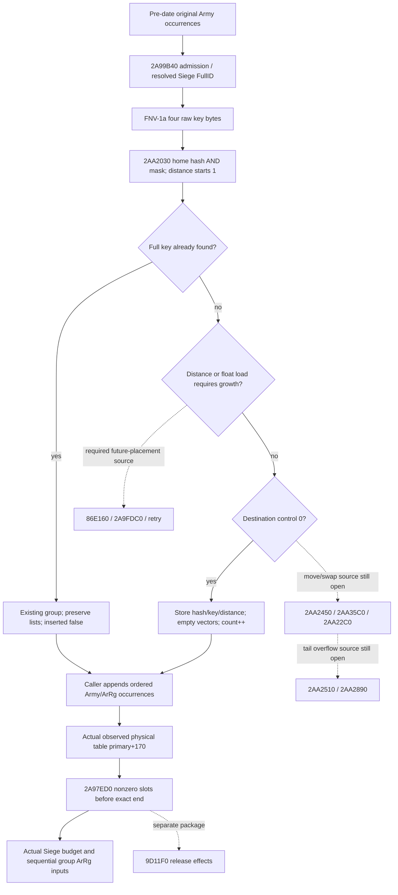
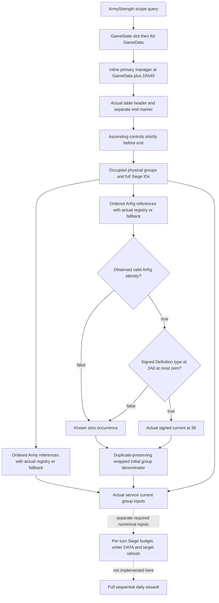

# Daily assault active-table placement and current groups — CK3 1.20.0.3

The source-first increment closes the concrete current-group observation
layout and `2AA2030`'s direct probe/insertion branches. The subsequent candidate
implements a readonly same-query collector and bounded service value for actual
occupied daily-assault groups in native physical order, including Army and ArRg
occurrences absent from a requested Army's associated subset. That releases a
current-group input gap for the daily loss model. The corrected compiled reader
and complete-service byte route are now **offline static-ready**; full sequential
daily loss remains a separate numerical dependency.
Future placement across growth remains a named numerical quality gap; it does
not prevent reading an already populated current table.

Created 2026-10-06 / ISO W41 from `066cfaa0fd3b2d91d4b5b98fd09cf2898937e67d`.
Frozen CK3 `1.20.0.3`, Steam build `25652598`, reused EXE SHA-256
`94B55397ABB687A3DCD436805A5D885E6BE90FA6C693FEB44A9E3BBEEADE02A6`.
The original source delivery had no implementation, build or test. The later
implementation and its first service test are recorded separately below. There
is no new EXE hash, game observation, policy change or live qualification.

The source-first plan and exact captures are in
`Z:/ck3_mod_rewrite_process_assets/g2-background-20261006/daily-assault-active-table-2aa2030/`.
The existing [manager prepared-stage topic](army-monthly-manager-prepared-stage-inputs-12003.md)
owns the calendar and complete `2A99B40` / `2A97ED0` caller/consumer ledger.

## Actual entry, ownership and return extent

The primary `CArmyManager` is **inline** at `GameState[5C68C50]+A0+2A540`;
there is no pointer member to dereference at GameData+2A540.
The secondary callback receiver is primary+8; the table uses the primary
receiver. Pre-date `2A9A0A1` visits the original Army roster and calls
`2A99B40`. Its admission sequence is already sealed: `24E8560`, Army+124 Unit,
Unit current Province, resolved Siege, Siege+44C, and the primary+68 removal
queue. An admitted occurrence calls `2AA2030` at `2A99C9A` with:

| ABI input | Actual value |
|---|---|
| RCX | primary+170, the table header |
| RDX | caller output storage: entry pointer at +0, inserted byte at +8 |
| R8D | 32-bit FNV-1a hash of the four little-endian raw Siege FullID bytes |
| R9 | address of the raw full DWORD Siege key |
| Return | RAX equals the output-storage address; caller consumes its entry pointer |

The FNV seed is `0x811C9DC5`, multiplier `0x01000193`; each byte XOR and
multiply wraps to DWORD. The full key, including its generation byte, is
stored and compared. The hash is not an identity or ordering substitute.

New exact target extent is `[2AA2030,2AA22BD)`, **653 bytes**, `.pdata`
record index `146917`, unwind `529DBD0` (flags 2). All direct branch targets
stay inside this extent. Normal return is `2AA22A6`; the separate capacity
diagnostic path ends with `int3` at `2AA22BC`. Its terminal diagnostic bytes
are part of the same exact function, not a request to capture a neighboring
function. No target byte is read again after the saved second attempt.

## Current-table physical fields

| Offset from primary | Offset from table | Type | Source meaning |
|---|---:|---|---|
| +178 | +8 | pointer | physical entry storage |
| +180 | +10 | signed DWORD | occupied count; incremented on new insertion |
| +184 | +14 | signed DWORD | hash mask used by placement and consumer end |
| +188 | +18 | unsigned byte | maximum permitted probe distance / physical tail extent |
| +18C | +1C | float32 bits | insertion load threshold |

Each physical record has stride **0x40**:

| Entry offset | Type | Meaning |
|---:|---|---|
| +0 | DWORD | stored full hash |
| +4 | byte | probe distance/control; 0 is unoccupied |
| +8 | DWORD | raw Siege FullID key |
| +10 / +18 / +1C / +20 | pointer / DWORD / signed DWORD / pointer | Army ID vector data / capacity / count / allocator |
| +28 / +30 / +34 / +38 | pointer / DWORD / signed DWORD / pointer | ArRg ID vector data / capacity / count / allocator |

`2AA20BD..2AA2100` directly initializes a newly empty record: stored hash,
distance and full key, null vector data, zero vector capacities/counts,
and the two allocator references. It increments table+10 and returns
`inserted=true`. An existing full-key match at `2AA2114` returns the existing
record and `inserted=false`, without clearing either vector or incrementing
the count. Caller `2A99B40` then appends every admitted Army occurrence to
entry+10. Its pending-table exclusion controls ArRg appends to entry+28.
Neither output list is globally deduplicated.

The post-date consumer uses the observed storage and computes its end slot as
`sign_extend_i32(wrap_i32(mask + zero_extend(tail_byte) + 1))`. It starts at
slot 0, skips control byte 0, checks the first nonzero slot against the end,
then processes nonzero slots in ascending physical address order. The same
skip and end comparison occurs after every processed group. The end marker
is not a group: observe its actual control byte and exclude its key/value.
This package proves the consumer's end comparison, not a particular
unobserved sentinel initializer value. A collector must not sort keys,
use insertion order, or publish only groups associated with the requested Army.

## Direct placement branches and prospective boundary

Initial home slot is `sign_extend_i32(hash & mask)` and probe distance starts
at 1. While the stored control is at least the current unsigned distance,
the code checks full-key equality; otherwise it advances one physical slot
and increments the byte distance. A miss stops where stored control is less
than the new distance.

Before inserting a miss, `2AA2086..2AA20AB` grows when either distance exceeds
table+18 or **float32(wrap_i32(count+1)) / float32(signed(mask))** is greater
than the actual float32 threshold. The denominator is the stored mask,
not an inferred capacity. A zero-control destination receives the direct
empty record described above.

A nonzero destination enters record displacement. If its immediate next
slot is empty, the caller stores the old hash/key and distance+1 there,
passes its value and the original value to `2AA2450`, then calls `2AA35C0`
with the original slot, new distance/hash and key pointer. Exact value
transfer and replacement effects remain in those uncaptured callees. Otherwise
the old record's hash/key/distance is carried in temporary storage with its
value passed to `2AA2450`; `2AA22C0` is called at lower-distance records.
The direct caller advances until an empty slot or tail-distance
overflow. The empty-slot branch writes the carried hash/key/control,
passes its value to `2AA2450`, increments occupied count, and returns the original
insertion record. On overflow, the exact direct calls are `2AA22C0`,
`2AA2510`, `2AA2890`, and the temporary release `9D11F0`.

The initial growth branch calls `86E160(mask+1,1)`, checks the returned
argument against 31, calls `2A9FDC0(table,argument)` below that threshold,
and retries `2AA2030`. The diagnostic branch has no normal result.
The move/swap/growth callees are deliberately **not captured** here:
they affect a future re-placement projection, not the actual current
occupied-table reader. They remain explicit quality gaps. No logical
dictionary can claim the resulting future physical order until these
specific effects or an actual populated stage are supplied.



## Minimum same-query collector handoff

Proposed independent optional leaf: `current_daily_assault_table_v1`, in the
existing ArmyStrength result. The producer should resolve GameData and the
primary manager once per query, then reuse this shared table capture across
requested Army rows. Existing `ReadScopedOrderedRefillInputs12003` and
`FirstRemovalCleanupSample` already have the same GameState/A0/primary
binding. Capture through a new dedicated reader, without invoking any
placement, native writer, release, expected-loss callback or tick.

Minimum transport:

- Query-provided frame/revision/build provenance and explicit stage
  `observed_current_daily_assault_table`; no invented pre-date/post-refill label.
- Header availability, raw occupied count/mask/tail/load bits, storage presence,
  and the observed end-marker control. Numeric header zero is a value.
- Physical control observations, then each occupied row's physical slot,
  native iteration ordinal, stored hash/control/raw full Siege key.
- Independent Army/ArRg vector header availability, signed counts and all raw
  DWORD occurrences in order. A count-zero vector is complete empty with no
  data dereference; a demanded positive-count vector with unavailable data
  remains partial. Preserve other complete rows/families.
- Existing raw registry resolution outcomes for every consumed Siege/Army/ArRg
  occurrence, including generation match versus actual fallback. Source uses
  Siege registry `5D1EC88` / fallback `5D1EC60` and full key+8.

For **current grouping**, all usable header/control and demanded vector bytes
make this leaf independently ready. Current occupied count zero can publish
the complete current empty group input; it says nothing about the next
pre-date population. Unknown or failed demanded reads remain actual partials,
not fabricated empty groups. Control-zero slots and the end marker do not
demand keys or vector values. Expose the raw header count separately from the
number of observed group rows; do not silently rewrite either.

For **numeric daily loss**, feed each physical group to the already sealed
`25205C0`/`247F1D0` inputs and ordered ArRg allocator/writer model. This requires
the actual group contributors, their live-held numeric fields, and any
cross-group physical aliasing that affects sequential writes. A single Army's
associated subset cannot close the manager-wide denominator. Existing full
land-rate work owns that numerical dependency. Queue append outcomes and
release effects retain their separate readiness boundaries.

Exclusive implementation files proposed for Root adoption are
`army_daily_assault_active_table_v1.inc.hpp`,
`army_daily_assault_active_table_collector_v1.inc.hpp`,
`army_daily_assault_active_table_serializer_v1.inc.hpp`, and
`battle_daily_assault_active_table_contract.py`. They can receive one minimal
existing-query hook; this source package changes no shared header or schema.
Actual names and hook ownership are to be assigned in Root's next package.

## New fixture plan, not executed

One dedicated fake-memory native reader/serializer target can cover:

1. Complete current empty table with raw zero count and observed end marker.
2. Physical group order differing from sorted FullIDs and insertion order,
   preserving full generation bytes, hash and control values.
3. Colliding distance controls and already displaced actual rows, including
   the tail region before the exact end marker.
4. Repeated Army and ArRg occurrences, independently empty vectors, and an
   occupied record whose two lists are both legally empty.
5. A demanded vector-data failure preserving other complete rows/families,
   with no data read for a zero-count vector.
6. Missing required header/control, and actual end-marker capture that never
   turns into a group. No native mutator is called by the fixture reader.

The meaningful Python consumer would use those new genuine serializer bytes
through the production normalizer and current physical-group numerical seam;
it should demonstrate why a sorted or deduplicated group stream changes the
ordered input. Build/CMake registration and any first consumer execution belong
to a later Root-authorized implementation/qualification batch. None ran here.

## Source cost, failures and remaining boundary

Unique new target code is **653 B**. The source harness incorrectly required
the last instruction to be `ret`; the legitimate diagnostic `int3` therefore
caused two harness RED exits after a complete target read. Attempt02 preserved
the full body. The correction seals it offline and performs **no third read**.
The first unpersisted read is charged, not silently removed.

Actual frozen-file I/O is **1778 B**: 1306 code B (653 twice) and 472 metadata B.
Retained unique source coverage is 653 code B plus 208 metadata B. The last
unretained 4-byte next-unwind header's unique/duplicate classification remains
unknown; total duplicate I/O is 913–917 B. Both attempts additionally
read the next `.pdata` record and its 4-byte unwind header before refusing the
unchained neighboring body; **zero neighboring code bytes** were captured.
Their extra metadata cost is retained, without inventing unretained bytes.
The source receipt describes that recovered cost derivation without claiming
that the unretained metadata bytes or their address were saved.

Readiness is **research, implementable current-table ABI**. There are no native
fixtures, compiled bytes, live inputs or full daily-assault claims in this
increment. The nearest next action is the bounded current-table producer above;
future re-placement calls, post-refill full group numeric inputs, and separate
release/late-Army suffix remain explicit. No new allocator or safety audit is
needed to obtain the current nonempty group input.

## Same-query current-table candidate, 2026-10-06 / W41

Root approved implementation after source commit `565345a2`. The dedicated
`ReadCurrentDailyAssaultTable12003` follows one actual GameState-slot/A0 capture,
takes the inline primary manager address, and reads its current table once per
`ReadArmyStrengthsForScope` query. That capture is reused across requested rows.
The new `ArmyBindings` member is appended at the tail, preserving existing
aggregate initializer prefixes. Exact .3 adapter binding installs the reader;
the .2 and wrong-build binders leave it disabled. No native mutator, callback,
placement, release, writer or tick is invoked.

Actual production files:

- DTO `army_daily_assault_active_table_v1.inc.hpp`;
- collector `army_daily_assault_active_table_collector_v1.inc.hpp`;
- serializer `army_daily_assault_active_table_serializer_v1.inc.hpp`;
- strict optional normalizer `bridge/army_daily_assault_active_table_contract.py`;
- bounded value `bridge/army_daily_assault_active_table_projection.py`.

`normalize_army_strengths` retains the optional
`current_daily_assault_table_v1` leaf. The actual
`GameplayBridgeService.query_army_strengths` returned result adds
`current_daily_assault_group_inputs_v1`, one shared-manager projection per
selected row. Original status, strength, supply and native readiness remain
unchanged. An absent legacy leaf preserves that query and reports only the
bounded current-group input as unavailable.

The final transport contains raw header values, ordered controls **strictly
before the end slot**, and a separate actual
`header.end_marker_control_raw_u8`. It excludes the end marker from both controls
and groups. Each occupied group preserves its full DWORD Siege ID, hash, control,
physical slot, native ordinal, duplicate Army/ArRg occurrences, and actual
registry-generation match or fallback outcome. Positive-count missing vectors,
failed controls and negative vector extents remain local diagnostics. Count-zero
vectors consume no data pointer. Actual table count zero remains a complete
current-empty input even if unused placement metadata is missing.

The independent numerical seam follows `2A97ED0`:

1. Resolve each original ArRg occurrence through `5D1F340` / `5D1F338`, retaining
   the actual selected fullID+10 and pointer identity.
2. Require magic+14 `41725267` and selected fullID different from `FFFFFFFF`.
   An observed invalid identity is known zero and does not demand Definition/current.
3. Read selected Definition+18 and its signed +2A0 type. Type greater than zero
   is known zero; current+38 is explicitly undemanded. Type less than or equal
   to zero demands its actual signed current+38.
4. Sum every admitted occurrence with signed DWORD wrap. Duplicate physical
   references contribute repeatedly. Missing demanded current preserves complete
   references and other groups, but does not invent a running historical prior.

Each group exposes `initial_group_denominator_ready`,
`observed_initial_eligible_current_soldiers_i32` and an occurrence ledger. Its
basis is held current data with no earlier group writes replayed. Other
Army/Siege resolution failures do not erase an independently complete ArRg
denominator. This is independently useful current grouping and initial numeric
input, not full sequential daily loss.



### First service case and post-test source corrections

One new production compound case calls the real service method through an
existing memory-route builder; it does not attach a fabricated result. Its first
executed run was **GREEN, 1 passed / 2.64 s**, at **2026-10-06 13:37:37 +08:00**
(outer 3.028766 s). It covers physical order, full IDs, duplicate wrapped sums
`[4,0,47]`, legal empty input, independent local missing values, legacy input,
and unchanged original query readiness. Existing test helpers were imported;
their old test methods were not executed.

Two earlier attempts failed during collection, before any case ran: the sparse
environment lacked `build_release`, then `ck3_workshop_mcp`. Only their concrete
import dependencies were materialized. Both RED receipts and the first actual
GREEN receipt remain in the external implementation packet.

Final static review after that GREEN corrected two source-layout mismatches:
the native draft's erroneous pointer read at GameData+2A540 was replaced with
the actual inline address; the Python control census and source builder were
aligned to native before-end controls with a separate header marker. The native
fixture now embeds manager bytes inside GameData and denies the mistaken pointer
read. The original GREEN pins predate these corrections. No successful case was
rerun; final corrected byte-contract qualification awaits the first genuine
compiled-wire consumer. This distinction is recorded in
`POST-FIRST-SERVICE-SOURCE-CORRECTIONS.json`.

### Root-owned native fixture and first wire consumer

Prepared target: `xar_bridge_daily_assault_active_table_12003_test`, from
`native_bridge/src/ck3_12003_daily_assault_active_table_test.cpp`, linked PRIVATE
to the existing **`xar_ck3_12002_runtime`**. That real target supplies production
`ReadArmyStrengthsForScope`, PUBLIC headers/dependencies and feature definitions;
the serializer is the actual inline `AppendArmyStrengthV1`. No new production TU
is required. An initial draft incorrectly named nonexistent `xar_bridge_core`;
the recipe preserves that unbuilt draft and its correction.

Nine independent fake-memory scenes are prepared: current empty, current
nonempty, missing Army vector, missing ArRg current, missing control, actual zero
end-marker, current empty with missing mask, actual null GameData, and negative
ArRg count. Each uses two scope rows and verifies a single GameState/A0/header
capture plus unchanged original whole-Army values. The complete native scene
expects physical slots `[1,3,4]`, distinct full generation IDs and independent
initial denominators `[200,30,0]`. The scenes are not one coherent live frame.

The first consumer is prepared at
`implementation/consume_first_compiled_wires.py`, with fixed external
`FIRST-COMPILED-WIRE-EXPECTATIONS.json`. It will consume only these nine new
whole-row serializer files through the real production normalizer and bounded
projection. It has **not run**. Root owns CMake registration, native build,
first CTest, actual wire directory and first-consumer authorization.

Implementation EXE read cost is **0 B**; it reuses the original source pins and
1778 B I/O ledger without rereading closed functions. Old test reruns, native
builds/CTest, game/Steam/process/SDK/pipe/UI/userdata operations are all **0**.
Readiness is an implemented source-bound candidate with a first service-path
case; corrected native transport remains pending central fixture qualification.
There is no live claim, fresh post-refill state, prospective placement result,
actual daily loss, complete manager OODA or complete Entry/person forecast.
Future allocator/growth/release and the separately owned per-turn loss/writer/
refresh plan retain their precise boundaries.

### First g92 compiled full-service attempt, retained RED

Root's immutable g92 source is
`ae7819df81a6511c70a58ba371f1e99a636f2dde`, under
`C:/codex-ck3-background/ordered-assault-table-batch/g92`.
The full fresh native build was **GREEN / 120.59862 s**, with 595 actual TUs,
590 unique TUs and 1306 source inputs, generator/reuse zero. Root's first two
new CTests were **GREEN / 2 of 2**, at 2026-10-06 05:58:47 UTC, 0.25 s native /
0.2900272 s outer. The target's nine actual whole-row JSON files are in
`strict01/cache-observers/daily-assault-active-table-wire` beneath that batch.
No child native build or CTest ran.

The first complete-service consumer imported the real service, strict normalizer
and projection from that immutable source, and used actual whole-row serializer
bytes as its backend input. Supplied paused/revision/readiness envelope fields
were explicitly offline fixture metadata. The first invocation at
2026-10-06 05:59:28–05:59:30 UTC was **RED**, before any frame completed:

```text
army_strengths[0].regiment_strengths[0].army_regiment_id
must be a non-negative int32 or null
```

The native fake-memory fixture used `0xAB000001` / `0xAB000003` as associated
ArRg IDs. Its old whole-row serializer emitted actual signed legacy IDs
`-1426063359` / `-1426063357`. That disagrees with the existing legacy field
contract, so the complete service stopped before reaching optional table
normalization. The first table itself was genuinely serialized ready-empty;
that fact does not qualify the unexecuted complete-service path.

There are **0 completed compiled scenes and 0 passed consumer checks**. The
native reader/serializer fixture target is compiled/CTest-ready, while its
complete-service byte route remains unqualified. No old passed frame, Python
case, CTest or native build was rerun, and no immutable/production source was
altered. The actual RED, wire pin and minimal three-constant fixture correction
proposal are retained in `FIRST-COMPILED-WIRE-RESULT.json`,
`FIRST-COMPILED-SERVICE-INVOCATION.json`, `FIRST-COMPILED-RED-DIAGNOSIS.json` and
`MINIMAL-LEGACY-FIXTURE-ID-FIX.patch`. The proposed fixture correction keeps
high unsigned Siege/Army/wrong-generation ArRg table keys while making only
the old associated ArRg IDs fit their existing field width. It does not widen
an unrelated production ID contract. Root owns that correction and any new
immutable fixture bytes; that first attempt supplied no complete-service GREEN.

### Corrected fixture first full-service consumption, GREEN

Root adopted the strictly fixture-only correction `093ab200` as
`b8e14d7f51e333e43cf8289979a113d8615eb01d`. Three fake associated IDs changed
from AB to 2B in two lines; the other high full DWORD Siege, wrong-generation
Army, invalid ArRg and requested wrong-generation ArRg keys remain unchanged.
Production source and its old ID contract did not change.

Root compiled only the corrected fixture (3.7464429 s) and linked it against
the **existing qualified g92 runtime library** (0.0917893 s). That library's
runtime source remains `ae7819df81a6511c70a58ba371f1e99a636f2dde`; there was no
full-runtime rebuild at the correction head. The corrected daily-assault
fixture CTest passed at 2026-10-06 06:09:18 UTC, reported case time 0.0940045 s.
The shared repair receipt also contains another owner's output repair; that
case and its wires receive no credit in this package.

The **first consumption of the nine corrected whole-row outputs** was GREEN
at **2026-10-06 14:10:10 +08:00**, **9 of 9 frames / 164 checks / 0.5269947 s
outer**. It imported the real complete `query_army_strengths` service,
normalizer and projection from immutable g92, rather than the candidate or
mutable Root source. The route used the genuine compiled row as backend input
and the service returned `current_daily_assault_group_inputs_v1` itself. The
synthetic fixture envelope's revisions, paused flag, query sequence and supplied
native readiness are explicitly fixture metadata, not actual CK3 observations.

The byte-to-service route confirms:

- Actual ascending physical slots `[1,3,4]`, full generation keys, displaced
  tail occupancy, end-marker exclusion and duplicate original references.
- Complete current empty input, including raw count zero with undemanded mask
  unavailable, without inventing a future populated stage.
- Complete initial denominators `[200,30,0]`; invalid identity and positive
  Definition type are known zero with unused numeric fields null.
- Missing Army-vector bytes retain independently ready ArRg denominators;
  missing ArRg current preserves original references and other group values.
  Missing controls/end marker and negative vector count keep their actual
  local partial reasons instead of becoming empty groups.
- Original normalized status, strength/base-power fields and supplied envelope
  readiness remain unchanged. No native writes or whole daily forecast are
  introduced by the new returned value.

Original RED and expectations were retained. Corrected expectations and result
use independent paths:
`FIXTURE-ID-FIX-COMPILED-WIRE-EXPECTATIONS.json`,
`FIXTURE-ID-FIX-COMPILED-SERVICE-RESULT.json`,
`FIXTURE-ID-FIX-COMPILED-SERVICE-INVOCATION.json`, and
`FIXTURE-ID-FIX-COMPILED-SERVICE-OUTPUT.json` under the implementation packet.
The result pins each actual corrected wire, production service modules and both
the original full-runtime and new fixture-only build receipts.

Readiness is **static-ready current grouped observation and independent held
initial numeric inputs**, with a compiled fake-memory reader/serializer and
complete production service path. These are nine independent offline frames,
not one coherent live snapshot. No successful scene, old Python case, native
build or CTest was repeated by this child. Implementation/qualification added
**0 EXE bytes** and no local CK3/Steam/process/SDK/pipe/UI/userdata operations.
The next actual daily-loss dependency is the separately owned per-turn Siege
budget, writer DATA/physical aliases and affected-target refresh input; future
table placement/growth/release remain separate. Full daily assault, fresh
prepared state, complete Entry/person/Rule43 equivalence and live qualification
are not promoted.
