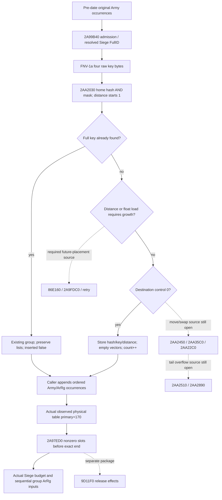

# Daily assault active-table placement and current groups — CK3 1.20.0.3

This source-only increment closes the concrete current-group observation
layout and `2AA2030`'s direct probe/insertion branches. A readonly collector
can now publish actual occupied daily-assault groups in native physical order,
including the Army and ArRg occurrences that are absent from a requested
Army's associated subset. That releases an input gap for the daily loss model.
Future placement across growth remains a named numerical quality gap; it does
not prevent reading an already populated current table.

Created 2026-10-06 / ISO W41 from `066cfaa0fd3b2d91d4b5b98fd09cf2898937e67d`.
Frozen CK3 `1.20.0.3`, Steam build `25652598`, reused EXE SHA-256
`94B55397ABB687A3DCD436805A5D885E6BE90FA6C693FEB44A9E3BBEEADE02A6`.
There is no new EXE hash, game observation, native reader implementation,
build, test, policy change or live qualification in this package.

The source-first plan and exact captures are in
`Z:/ck3_mod_rewrite_process_assets/g2-background-20261006/daily-assault-active-table-2aa2030/`.
The existing [manager prepared-stage topic](army-monthly-manager-prepared-stage-inputs-12003.md)
owns the calendar and complete `2A99B40` / `2A97ED0` caller/consumer ledger.

## Actual entry, ownership and return extent

The primary `CArmyManager` is `GameState[5C68C50]+A0+2A540`.
The secondary callback receiver is primary+8; the table uses the primary
receiver. Pre-date `2A9A0A1` visits the original Army roster and calls
`2A99B40`. Its admission sequence is already sealed: `24E8560`, Army+124 Unit,
Unit current Province, resolved Siege, Siege+44C, and the primary+68 removal
queue. An admitted occurrence calls `2AA2030` at `2A99C9A` with:

| ABI input | Actual value |
|---|---|
| RCX | primary+170, the table header |
| RDX | caller output storage: entry pointer at +0, inserted byte at +8 |
| R8D | 32-bit FNV-1a hash of the four little-endian raw Siege FullID bytes |
| R9 | address of the raw full DWORD Siege key |
| Return | RAX equals the output-storage address; caller consumes its entry pointer |

The FNV seed is `0x811C9DC5`, multiplier `0x01000193`; each byte XOR and
multiply wraps to DWORD. The full key, including its generation byte, is
stored and compared. The hash is not an identity or ordering substitute.

New exact target extent is `[2AA2030,2AA22BD)`, **653 bytes**, `.pdata`
record index `146917`, unwind `529DBD0` (flags 2). All direct branch targets
stay inside this extent. Normal return is `2AA22A6`; the separate capacity
diagnostic path ends with `int3` at `2AA22BC`. Its terminal diagnostic bytes
are part of the same exact function, not a request to capture a neighboring
function. No target byte is read again after the saved second attempt.

## Current-table physical fields

| Offset from primary | Offset from table | Type | Source meaning |
|---|---:|---|---|
| +178 | +8 | pointer | physical entry storage |
| +180 | +10 | signed DWORD | occupied count; incremented on new insertion |
| +184 | +14 | signed DWORD | hash mask used by placement and consumer end |
| +188 | +18 | unsigned byte | maximum permitted probe distance / physical tail extent |
| +18C | +1C | float32 bits | insertion load threshold |

Each physical record has stride **0x40**:

| Entry offset | Type | Meaning |
|---:|---|---|
| +0 | DWORD | stored full hash |
| +4 | byte | probe distance/control; 0 is unoccupied |
| +8 | DWORD | raw Siege FullID key |
| +10 / +18 / +1C / +20 | pointer / DWORD / signed DWORD / pointer | Army ID vector data / capacity / count / allocator |
| +28 / +30 / +34 / +38 | pointer / DWORD / signed DWORD / pointer | ArRg ID vector data / capacity / count / allocator |

`2AA20BD..2AA2100` directly initializes a newly empty record: stored hash,
distance and full key, null vector data, zero vector capacities/counts,
and the two allocator references. It increments table+10 and returns
`inserted=true`. An existing full-key match at `2AA2114` returns the existing
record and `inserted=false`, without clearing either vector or incrementing
the count. Caller `2A99B40` then appends every admitted Army occurrence to
entry+10. Its pending-table exclusion controls ArRg appends to entry+28.
Neither output list is globally deduplicated.

The post-date consumer uses the observed storage and computes its end slot as
`sign_extend_i32(wrap_i32(mask + zero_extend(tail_byte) + 1))`. It starts at
slot 0, skips control byte 0, checks the first nonzero slot against the end,
then processes nonzero slots in ascending physical address order. The same
skip and end comparison occurs after every processed group. The end marker
is not a group: observe its actual control byte and exclude its key/value.
This package proves the consumer's end comparison, not a particular
unobserved sentinel initializer value. A collector must not sort keys,
use insertion order, or publish only groups associated with the requested Army.

## Direct placement branches and prospective boundary

Initial home slot is `sign_extend_i32(hash & mask)` and probe distance starts
at 1. While the stored control is at least the current unsigned distance,
the code checks full-key equality; otherwise it advances one physical slot
and increments the byte distance. A miss stops where stored control is less
than the new distance.

Before inserting a miss, `2AA2086..2AA20AB` grows when either distance exceeds
table+18 or **float32(wrap_i32(count+1)) / float32(signed(mask))** is greater
than the actual float32 threshold. The denominator is the stored mask,
not an inferred capacity. A zero-control destination receives the direct
empty record described above.

A nonzero destination enters record displacement. If its immediate next
slot is empty, the caller stores the old hash/key and distance+1 there,
passes its value and the original value to `2AA2450`, then calls `2AA35C0`
with the original slot, new distance/hash and key pointer. Exact value
transfer and replacement effects remain in those uncaptured callees. Otherwise
the old record's hash/key/distance is carried in temporary storage with its
value passed to `2AA2450`; `2AA22C0` is called at lower-distance records.
The direct caller advances until an empty slot or tail-distance
overflow. The empty-slot branch writes the carried hash/key/control,
passes its value to `2AA2450`, increments occupied count, and returns the original
insertion record. On overflow, the exact direct calls are `2AA22C0`,
`2AA2510`, `2AA2890`, and the temporary release `9D11F0`.

The initial growth branch calls `86E160(mask+1,1)`, checks the returned
argument against 31, calls `2A9FDC0(table,argument)` below that threshold,
and retries `2AA2030`. The diagnostic branch has no normal result.
The move/swap/growth callees are deliberately **not captured** here:
they affect a future re-placement projection, not the actual current
occupied-table reader. They remain explicit quality gaps. No logical
dictionary can claim the resulting future physical order until these
specific effects or an actual populated stage are supplied.

## Minimum same-query collector handoff

Proposed independent optional leaf: `current_daily_assault_table_v1`, in the
existing ArmyStrength result. The producer should resolve GameData and the
primary manager once per query, then reuse this shared table capture across
requested Army rows. Existing `ReadScopedOrderedRefillInputs12003` and
`FirstRemovalCleanupSample` already have the same GameState/A0/primary
binding. Capture through a new dedicated reader, without invoking any
placement, native writer, release, expected-loss callback or tick.

Minimum transport:

- Query-provided frame/revision/build provenance and explicit stage
  `observed_current_daily_assault_table`; no invented pre-date/post-refill label.
- Header availability, raw occupied count/mask/tail/load bits, storage presence,
  and the observed end-marker control. Numeric header zero is a value.
- Physical control observations, then each occupied row's physical slot,
  native iteration ordinal, stored hash/control/raw full Siege key.
- Independent Army/ArRg vector header availability, signed counts and all raw
  DWORD occurrences in order. A count-zero vector is complete empty with no
  data dereference; a demanded positive-count vector with unavailable data
  remains partial. Preserve other complete rows/families.
- Existing raw registry resolution outcomes for every consumed Siege/Army/ArRg
  occurrence, including generation match versus actual fallback. Source uses
  Siege registry `5D1EC88` / fallback `5D1EC60` and full key+8.

For **current grouping**, all usable header/control and demanded vector bytes
make this leaf independently ready. Current occupied count zero can publish
the complete current empty group input; it says nothing about the next
pre-date population. Unknown or failed demanded reads remain actual partials,
not fabricated empty groups. Control-zero slots and the end marker do not
demand keys or vector values. Expose the raw header count separately from the
number of observed group rows; do not silently rewrite either.

For **numeric daily loss**, feed each physical group to the already sealed
`25205C0`/`247F1D0` inputs and ordered ArRg allocator/writer model. This requires
the actual group contributors, their live-held numeric fields, and any
cross-group physical aliasing that affects sequential writes. A single Army's
associated subset cannot close the manager-wide denominator. Existing full
land-rate work owns that numerical dependency. Queue append outcomes and
release effects retain their separate readiness boundaries.

Exclusive implementation files proposed for Root adoption are
`army_daily_assault_active_table_v1.inc.hpp`,
`army_daily_assault_active_table_collector_v1.inc.hpp`,
`army_daily_assault_active_table_serializer_v1.inc.hpp`, and
`battle_daily_assault_active_table_contract.py`. They can receive one minimal
existing-query hook; this source package changes no shared header or schema.
Actual names and hook ownership are to be assigned in Root's next package.

## New fixture plan, not executed

One dedicated fake-memory native reader/serializer target can cover:

1. Complete current empty table with raw zero count and observed end marker.
2. Physical group order differing from sorted FullIDs and insertion order,
   preserving full generation bytes, hash and control values.
3. Colliding distance controls and already displaced actual rows, including
   the tail region before the exact end marker.
4. Repeated Army and ArRg occurrences, independently empty vectors, and an
   occupied record whose two lists are both legally empty.
5. A demanded vector-data failure preserving other complete rows/families,
   with no data read for a zero-count vector.
6. Missing required header/control, and actual end-marker capture that never
   turns into a group. No native mutator is called by the fixture reader.

The meaningful Python consumer would use those new genuine serializer bytes
through the production normalizer and current physical-group numerical seam;
it should demonstrate why a sorted or deduplicated group stream changes the
ordered input. Build/CMake registration and any first consumer execution belong
to a later Root-authorized implementation/qualification batch. None ran here.

## Source cost, failures and remaining boundary

Unique new target code is **653 B**. The source harness incorrectly required
the last instruction to be `ret`; the legitimate diagnostic `int3` therefore
caused two harness RED exits after a complete target read. Attempt02 preserved
the full body. The correction seals it offline and performs **no third read**.
The first unpersisted read is charged, not silently removed.

Actual frozen-file I/O is **1778 B**: 1306 code B (653 twice) and 472 metadata B.
Retained unique source coverage is 653 code B plus 208 metadata B. The last
unretained 4-byte next-unwind header's unique/duplicate classification remains
unknown; total duplicate I/O is 913–917 B. Both attempts additionally
read the next `.pdata` record and its 4-byte unwind header before refusing the
unchained neighboring body; **zero neighboring code bytes** were captured.
Their extra metadata cost is retained, without inventing unretained bytes.
The source receipt describes that recovered cost derivation without claiming
that the unretained metadata bytes or their address were saved.

Readiness is **research, implementable current-table ABI**. There are no native
fixtures, compiled bytes, live inputs or full daily-assault claims in this
increment. The nearest next action is the bounded current-table producer above;
future re-placement calls, post-refill full group numeric inputs, and separate
release/late-Army suffix remain explicit. No new allocator or safety audit is
needed to obtain the current nonempty group input.
