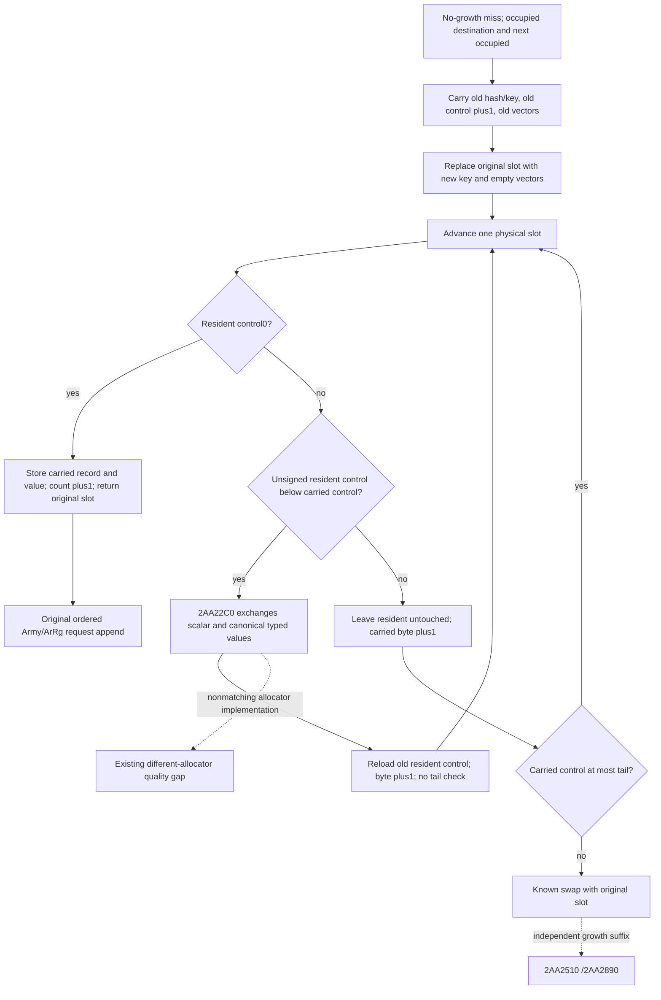

# General no-growth daily-assault carried collision — CK3 1.20.0.3

2026-10-06 / W41. This source package closes the ordinary occupied-next collision and lower-distance value exchange used by `2AA2030`. It extends the [g95 immediate-next-empty closure](army-daily-assault-future-placement-12003.md) without reopening growth, nonmatching allocator implementations or actual future admission. Exact build is1.20.0.3 / Steam25652598; reused EXE SHA `94b55397abb687a3dcd436805a5d885e6be90fa6c693feb44a9e3bbeeade02a6`.

The independent packet is `Z:/ck3_mod_rewrite_process_assets/g2-background-round20-20261006/daily-assault-carried-collision/`. Its source-first plan/Mermaid and peer cache coordination preceded the one new frozen-file capture. Current-table observation and g95's six compiled service wires are reused qualifications, not rerun evidence for this source increment.

## Exact source and ABI

Cached `.pdata` record at `5F716C8`, raw `c022aa02f123aa0200dc2905`, already gives `2AA22C0..2AA23F1`, **305B**, unwind `529DC00`. Cached PE section map is reused; no binary search, header rescan or whole EXE hash. The new unwind header is `11150800` and the complete new body SHA is `c87175ec9cc415e92bfdab89c4ed0c3bdae4f7beb76718ac789bd555dcf251ff`.

At ordinary lower-distance call `2AA21B8`, RCX is the carried temporary full record at caller stack+40; RDX is the resident physical full record. The caller ignores the helper's return value. The record has hash DWORD+0, control byte+4, Siege FullID DWORD+8, Army vector+10 and ArRg vector+28. Stride is40; vectors have data pointer+0/capacity DWORD+8/count DWORD+C/allocator pointer+10. The helper swaps defined scalar/value fields, not all raw record padding or allocator objects.

`2AA22D8..2AA22FC` exchanges both records' hash/control/full key. The six value calls then execute this exact sequence:

| Call RVA | Destination | Source | Existing closed function |
| --- | --- | --- | --- |
| 2AA2333 | Literal-empty temporary Army vector, allocator54E0570 | Carried Army | 2A9FA10 |
| 2AA2363 | Literal-empty temporary ArRg vector, allocator54DEB68 | Carried ArRg | C85A90 |
| 2AA236F | Carried Army | Resident Army | 2A9FA10 |
| 2AA237C | Carried ArRg | Resident ArRg | C85A90 |
| 2AA2388 | Resident Army | Temporary old-carried Army | 2A9FA10 |
| 2AA2395 | Resident ArRg | Temporary old-carried ArRg | C85A90 |

When both records use the already observed canonical Army54E0570/ArRg54DEB68 allocators, the held Army move and ArRg same-allocator header swap exchange the complete logical ordered vectors. Duplicate DWORD occurrences, capacity/count/data headers and full key generations survive. Allocator identities stay at their matching receivers. Both temporaries end with null data; direct temporary cleanup tests skip the virtual callbacks. No new allocator/CRT callee closure is necessary. Nonmatching or unread required allocator witnesses retain the existing branch-local unmodeled boundary, rather than claiming a generic transfer implementation.

## Carried-loop control and final return

The cached caller first reads old control at `2AA20B1` and selects its value pointer at `2AA20B5` (`RDX=old+10`). At `2AA2122`, it increments that byte before testing next control. In the occupied-next family, `2AA2162/66/6D` stores old hash, **u8(old control+1)** and old key in the temporary record; `2AA2176` moves old vectors into it. `2AA2189` replaces the original destination with the new hash/control/key and logical-empty vectors. The original insertion pointer is retained separately.

The source then advances by40 to each next physical slot, never applying mask modulo to this advance:

1. Control0: `2AA2216..2AA222F` writes carried hash/control/key and moves its value into that slot. `2AA223A` releases the now-empty carried temporary. `2AA223F` increments occupied count once with DWORD wrap; output points to the original insertion slot and inserted=true. Only then the existing caller appends its original Army/eligible ArRg occurrences.
2. Resident control **unsigned less than** carried distance: call `2AA22C0`, installing the carried record at that slot and taking its previous resident into the temporary. `2AA21BD` reloads the temporary's swapped-in **old resident control**, increments it as a byte and jumps unconditionally to the next physical slot. There is no tail comparison on this arm.
3. Resident control **unsigned greater than or equal to** carried distance: leave that resident's scalar/value fields untouched. Increment the existing carried byte, then compare it with table+18; `<=tail` advances again. `>tail` exchanges the temporary with the original insertion record at `2AA21DD`, then calls `2AA2510/2AA2890`. That growth/overflow suffix stays independent.

The native asymmetry must remain in the model: neither incrementing the pre-swap distance nor inserting one common tail check after both arms reproduces the caller. The swap arm uses the old resident's distance. No occupied-count change or request append occurs for each intermediate exchange.

## Minimum pure integration and new service case

No new observer, transport, binding, collector or service field is needed for matched ordinary chains. Qualified g95 already provides each demanded physical control, hash/full key, duplicate ordered vector and actual allocator witness. The current API is `simulation/army_daily_assault_placement_12003.py::project_daily_assault_placement_prefix_12003(normalized_table, requests, *, input_stage)`, using the existing explicit stage and typed request classes. Actual original-roster/admission observation remains the entry owner's separate package.

Replace only the existing `general_carried_collision_unmodeled` stop with this source-closed logical chain. Demand initial carried values and the scalar/value/witness inputs only for residents that actually swap. The unsigned `>=` arm does not read or move that resident's vectors or allocators, so an unused missing witness must not block it. The new literal temporary and replacement allocator facts remain explicitly source-derived; observed witnesses retain their original provenance.

Work on one request's private physical state until a supported empty-slot completion. Commit that completed request into the continuous prefix exactly once. If the chain reaches a demanded missing value/witness, nonmatching allocator or actual overflow suffix, retain the previous completed prefix and mark this request partial; later requests stay not reached. This prefix is a conditional logical image, not an actual partially executed native postimage. Preserve observed current readiness and independent group/reference readiness; do not skip an unsupported request and resume later ones.

The meaningful NEW complete-service compound will use the actual service/normalizer route and supplied conditional requests. With mask7, tail4 and float threshold1.0, initialize slots0..3 with keys `[5,4,7,6]`, control1 and canonical witnesses; FNV homes are `[0,1,2,3]`. Insert key13 (home0): probe to slot1/distance2, carry key4 at2; swap with key7 at slot2, then with key6 at3; finish at empty4. Result keys `[5,13,4,7,6]`, controls `[1,2,2,2,2]`, count5. Each old moved value contains nonempty repeated Army/ArRg IDs. Then key4 hit appends duplicates and key2 direct-empty inserts at7, yielding slots `[0,1,2,3,4,7]` and count6.

Variants in that one new compound cover unsigned-equal/no-swap before a lower-distance exchange, an unused witness on that arm, overflow after increment on that arm, a demanded later resident witness/value failure, and a completed earlier request preserved with later requests not reached. The equality example uses key12/home1/control2 at slot2: it remains at2 while carried key4 reaches slot3/control3. No existing successful Python case, g95 wire or unchanged native runtime needs rerunning. Root has authorized this future pure extension after the source commit; implementation/testing is a separate commit and receipt.

## Cost, failures and readiness

One frozen read attempt consumed305 new code bytes+4 metadata bytes=**309 actual/unique bytes**, duplicate0. Cached exact `.pdata`, section map, carried caller and typed vector helpers are reused. The retained body was complete before two cached-JSON formatting failures (`bytes` versus `hex`, then `body_sha256` versus `sha256`). Both harness REDs are recorded; only offline cached-assembly conversion was repaired, with no body reread. SOURCE-02AA22C0.json/bin/asm, cached caller/ABI receipts and POST-CAPTURE-CALLER-HARNESS-RED.json preserve the attempts.

Readiness at this source seal is **research / source-closed implementable matched general no-growth collision**. The continuous ordinary-collision pure prefix is not yet implemented or newly tested here. Growth/overflow, different-allocator branches, actual prior callback/admission association, complete next table/daily/monthly and live remain unclaimed. There were no local CK3/Steam/process/SDK/pipe/UI/profile/workshop operations, tests, builds or old wire replay.

## Implemented pure extension and FIRST new service compound

Root authorized implementation only after source commit `cef87e98`. The existing simulation API now supports the matched general carried family. A private per-request copy-on-write group/control image records each physical advance, lower-distance exchange and unsigned >= continuation. Empty completion commits the new physical image; count/append occur once. Unsupported overflow or demanded value/allocator failure retains the previous completed prefix, with later requests not reached. The native lower-arm resident-control reload/byte increment/no-tail comparison is preserved; the other arm leaves resident values/witnesses unused and applies its actual tail comparison. No service, collector, binding or CMake change was needed.

The ONE NEW full-service compound passed on its FIRST execution at `2026-10-06T07:35:19.200517+00:00`,1 method /6 distinct source-shaped table subcases,0.023s test/3.226912200s complete process. The real production `query_army_strengths` route and normalizer supplied the table and existing allocator witnesses. Two exchanges of nonempty repeated Army/ArRg values followed by hit/direct-empty produce slots[0,1,2,3,4,7],keys[5,13,4,7,6,2],controls[1,2,2,2,2,1],count6. The equality variant proves an unused unread witness does not block the >= arm and next carried controls3 then2. Actual overflow, late allocator mismatch/unread and missing resident vectors retain the earlier key5 hit without applying a half-completed request. Original strength/readiness and observed table remain unchanged.

This is `static-ready` for the pure conditional matched general no-growth prefix with already qualified g95 witness inputs. It does not upgrade actual callback/admission, full future table, full daily/monthly or live. Expectations were frozen in FIRST-NEW-SERVICE-EXPECTATIONS.json; first-new-service-compound01 preserves receipt/output/stdout/stderr. No new test RED occurred, and no successful prior test method or g95 wire was executed again. Only source-shaped fixture builder functions were reused. The original309B capture and two cached-format harness REDs remain separately charged; implementation adds0 EXE bytes, native builds or game operations. Next dependencies are the independently owned actual roster/admission input and source-specific growth/different-allocator families.
