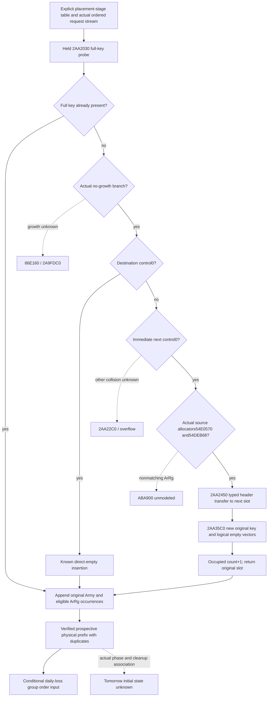

# Future daily assault physical placement — CK3 1.20.0.3

The immediate-next-empty collision family is source closed on normal return
when the old Army and ArRg vector allocators match the source static allocators.
It moves the complete old group to the next physical slot, replaces the original
slot with the new Siege key and empty logical vectors, and increments occupied
count once. Ordered DWORD occurrences and duplicates survive the move. This
unlocks a bounded prospective physical group sequence; it does not establish
tomorrow's actual initial state or a complete daily assault tick.

Frozen build: CK3 1.20.0.3 / Steam25652598, reused EXE SHA
94B55397ABB687A3DCD436805A5D885E6BE90FA6C693FEB44A9E3BBEEADE02A6.
No game, Steam, process, SDK, pipe, UI, user-data or live-pointer operation,
native build, test or compiled-wire replay occurred in this source package.
The qualified current grouping service remains unchanged. Its existing
qualification is documented in [the current-table topic](army-daily-assault-active-table-placement-12003.md).

## Actual source order

The cached pre-date callback uses secondary=primary+8. Its original Army roster
is secondary+48/+54, therefore primary+50 data/+5C count, in stored DWORD order.
At 2A9A0A1 it calls 2A99B40 with RCX=primary and RDX=the resolved Army.
That caller applies the actual 24E8560 admission, Unit/Province/Siege44C source,
removal queue68 exclusions and pending130 exclusions before appending original
Army and eligible ArRg occurrences. A requested Army subset is not the original
roster. Earlier/per-Army callback effects are not replayed by this package.

The held 2AA2030 probe compares full DWORD Siege keys and has separate key-hit,
direct-empty, growth and collision branches. For the selected no-growth
collision, the destination is occupied and the immediate next control is zero.
At 2AA212A..2AA2133 it copies old hash/key and wrap-u8(old control+1) to the next
record. 2AA213A calls 2AA2450(next+10,old+10), then 2AA214D calls 2AA35C0 on the
original record with the new control/hash/full key.

| Call | Exact value effect on the selected branch |
| --- | --- |
| 2AA2489 → 2A9FA10 | Destination Army vector is first literal-empty with allocator54E0570. Matching old allocator releases the empty destination, zeros its header, then transfers data/count/capacity; old data/count/capacity become zero. |
| 2AA24AE → C85A90 → C8EAA0 | Destination ArRg vector is first literal-empty with allocator54DEB68. Matching allocators select the explicit data/count/capacity swap, leaving the old header zero. |
| 2AA214D → 2AA35C0 | Writes new hash/control/key; assigns literal-empty Army and ArRg headers through those same typed leaves. Both original vectors are logically empty on normal return. |
| 2AA2030 return → 2A99B40 | Occupied count increments once; original slot is returned as the inserted group, then receives the original Army and eligible ArRg occurrences in caller order. |

No sorting or deduplication takes place in the selected header-transfer path.
The transfer delegates allocator release but this pure model never executes
that callback. Normal return is the stated model premise. C85A90's nonmatching
allocator branch calls ABA900; that branch remains outside the bounded closure.
The cached Army helper also contains allocator-different copy branches; the
minimal model selects the actual matching witness and does not require a
generic allocator implementation or memory-address postimage.

## Minimum readonly input and consumer plan

The existing current_daily_assault_table_v1 already publishes header fields,
physical controls, full hashes/keys and original ordered Army/ArRg references.
For the selected occupied-record transfer, the only new table witnesses are
the actual Army allocator QWORD at record+20 and ArRg allocator QWORD at
record+38, compared with image_base+54E0570 and image_base+54DEB68. Publish the
actual identities and read readiness independently of match. Hits and direct
empty insertion do not demand these witnesses. Capacity and allocated pointer
postimages are unnecessary for the bounded logical group value.

A separate admission source stream must preserve the complete original
primary50/5C roster, generation/fallback resolutions and actual2A99B40 gate,
Province/Siege, queue68 and pending130 decisions. Each request needs its source
ordinal, original/resolved Army full ID, actual Siege full ID and eligible
original ArRg occurrence indices/IDs. Held-current inputs support an explicitly
declared conditional placement stage, not a claim of earlier callback state.
Existing current groups alone cannot supply unseen future admissions.

The minimal pure consumer takes that explicit staged snapshot and stream,
models key hits/direct-empty/this matched immediate-next-empty family, and
stops the continuous prefix at a genuinely unsupported branch. It preserves
independent current observations and never changes their readiness, daily
forecast fidelity or full monthly status. The resulting physical order can
feed the existing conditional daily-loss prefix; each later budget still
depends on prior writer-target refresh, as the separate attrition plan states.

The first new fake-memory reader fixture should exercise matched/mismatched
and unread allocator identities plus legitimate zero counts. One new pure
service case should place a new key into an occupied slot with empty next slot,
relocate nonempty duplicate old vectors, append the new original occurrences,
and verify the resulting physical turn order and branch-local partial output.
Root owns shared-hook approval, CMake, native builds and first wire qualification.
No implementation or test is claimed by this source-only delivery.

## Pins, cost and remaining boundary

New exact bodies are 2AA2450 [2AA2450,2AA24C7),119 B;
2AA35C0 [2AA35C0,2AA3685),197 B;
C85A90 [C85A90,C85B15),133 B; and C8EAA0 [C8EAA0,C8EB83),227 B.
The complete 2A9FA10 [2A9FA10,2A9FC7D),621 B was already captured by the queue
owner and is reused with its existing SHA05b125d14dbe142ff29bfba1c09536eaa8a81e8799694c21e2d66646a28745c2.
Its earlier 623-byte shorthand is corrected by the exact extent.

This package reads 676 unique new code bytes plus 680 metadata bytes, total
1356 actual/unique frozen-file bytes. It contains no duplicate body capture.
The initial plan's640 metadata estimate was extended40 B for the actual required
direct leaves; all read addenda and receipts remain. The2A9FA10 metadata-only
harness RED cost64 B and zero code, is retained unchanged, and was resolved by
cache reuse rather than another EXE read. The original653 B2AA2030 capture and
its historical repeated I/O remain separately charged in the previous packet.

Remaining branches are allocator mismatch/ABA900, general carried collision
and overflow, growth, actual admission-stage association, and separate cleanup
or next-day state. The attrition owner has separately captured the 92 B9D11F0
record-release body: nonnull vector data causes count0 before allocator slot10,
then data/capacity0; null data skips those stores. Its direct body does not write
Army registries or the primary queue, while dynamic allocator effects and phase
association remain conditional. This package does not recapture release,
perform Army removal or infer tomorrow's table from current cleanup. The peer
receipt is round17/daily-assault-queue-release-source/SOURCE-009D11F0.json;
SHA d04dbf98b0753f1ebdd1ca022537661ad1967759e8965f61f33ae762c9d96ca9.
Readiness is research with a source-closed, implementable selected branch;
there is no new native-qualified, live, full-daily or full-monthly capability.

Packet: Z:/ck3_mod_rewrite_process_assets/g2-background-20261006/daily-assault-future-placement/.
SOURCE-PINS.json, READ-COST.json, NATIVE-STAGE-LEDGER.json and QUERY-PLAN.json
provide the exact body receipts, ordered handoff and remaining branches.
