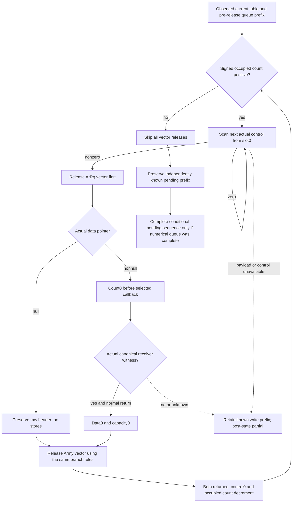
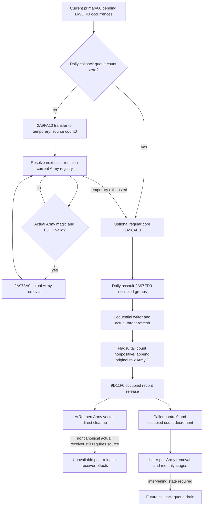
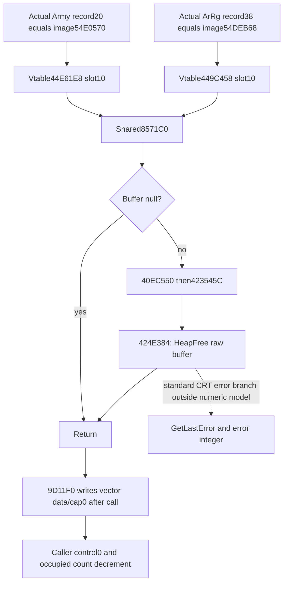

# Current daily assault queue append, later drain and record release — 1.20.0.3

## 2026-10-06: conditional normal-return release implementation

This follow-on adds `same_input_current_daily_assault_normal_return_release_v1` to the same ArmyStrength service result. It takes the already computed pre-release queue projection and the captured current table. The independent table result models one standalone invocation reaching cleanup with ordinary returning numerical calls; it does not execute native writes, earlier refill/drain, Army removal, a later callback, or calendar stages. Actual effects remain false and actual post-table/pending state remains null.

The necessary new input is optional `groups[].armies/arrgs.release_header_v1`: actual header data pointer presence/identity, signed count and signed capacity, with individual unknown values retained. The collector reuses its existing count sample and positive-count data sample; zero/negative counts now also require the actual pointer read, and all counts require the capacity read. Existing reference readiness, occurrence order, duplicates and zero-count legacy data publication remain unchanged. New raw-header read failures produce `partial` and do not change an otherwise ready legacy reference vector. Absent/null optional headers remain compatible with earlier snapshots.

The existing cached caller ledger establishes two different loops. Numerical groups scan to the actual end marker, irrespective of manager `+180` being nonpositive. Cleanup at `2A9819C..2A981E7` reads signed occupied count: nonpositive skips every release; positive scans controls from physical slot0, releases the first nonzero control record, writes control0 and decrements occupied count only after both vector calls return, then continues only while the reloaded signed count is positive. It does not unconditionally release every captured group. A still-positive count reaching the uncaptured end-marker payload is an exact partial next-record dependency. This new-purpose cached excerpt used zero EXE bytes and no new source hashes.

Within each record, the source-defined release order is ArRg then Army. Nonnull data stores count0 before dispatch and data0/capacity0 after normal return. Only the actual same-query canonical allocator witness selects the already closed shared callback ending at standard HeapFree. Null data skips all stores and preserves the raw count/capacity; its allocator is unused. Missing null-branch capacity affects header completeness independently of known return/control/queue effects. A noncanonical nonnull receiver retains the known pre-call count0 request and any earlier completed ArRg release, but stops post-vector and control/count claims.

The new full-service compound passed FIRST once: one method,0.181s test time /1.9270851000328548s process time, exit0. It covers nonzero two-record canonical release, allocated-empty/non-null headers, actual-null preservation, unused missing operands, a retained ArRg prefix before a noncanonical Army call, count-driven first1-of2 and missing end payload, signed0/negative cleanup skips while numerical groups still run, partial numerical queue prefixes, legacy absence/null and captured-input immutability. Receipt: `Z:/ck3_mod_rewrite_process_assets/g2-background-round18-20261006/current-daily-assault-normal-return-release/pure-implementation/python-first-01/PYTHON-FIRST-TEST-RECEIPT.json`.

The independent new native fixture `ck3_12003_daily_assault_release_headers_test.cpp` exercises the real whole-strength reader/serializer in six new scenes. Native build/CTest/compiled-wire qualification is pending Root. An obsolete old placement-fixture assertion that zero-count data must remain unread is changed only in this new candidate: the three newly demanded denied data reads are now expected, while ready empty legacy vectors and their unpublished legacy data stay unchanged. Its constructor's three other obsolete unread-data denials are removed in a separate source-only correction, leaving actual zeroed null headers; the dedicated new failure scene retains its three explicit denials. Root's immutable g96 build was already started before that old-fixture-only correction and does not compile or execute the old fixture. This correction has no new qualification claim. Archived g95 source, first qualifications and samples are retained; no old case is rerun.

Readiness is bounded pure static-ready with a native observer candidate pending qualification. `actual_record_release`, `actual_effects`, `full_daily_assault_ready`, `full_regular_refill_ready`, `full_monthly_ready`, `full_calendar_ready` and `live` stay false. Conditional pending preservation is independent of future queue execution/removal. Next construction uses real appended-Army magic/receiver context and the independently held first-removal/lifecycle inputs; neither today's queue prefix nor this normal-return release establishes a future drain frame.

### First actual compiled route and necessary strict-leaf correction

Root's immutable g96 native source `c98127ed20124abf92da121a3f9b017d409932a2` passed the full four-runtime/new-fixture build once in121.693152s and the one new CTest once in0.17s /0.2082458s process time at2026-10-06T07:29:42UTC. Six new raw-header whole-strength wires were emitted. This qualification does not include the separately adopted old-fixture source-only correction.

FIRST complete-service consumption stopped on the first `zero-count-nonnull` wire: zero new projections/checks; five other wires were not executed. The new strict raw-header leaf required a string reason, whereas the actual shared Status serializer emits `unavailable_reason:null` for a ready value. The source-shaped Python compound had used an empty string and did not prove this actual wire shape. This is a new contract integration RED, not a native buffer-release capability RED. The exact failed invocation, stdout/stderr and `compiled-consumer-first01/CONSUMER-FIRST-RECEIPT.json` remain unchanged in the round18 packet.

The necessary correction accepts the native nullable string and preserves its actual value. It changes only the new Python leaf and this topic; producer, native artifacts and passed compound/CTest are not rebuilt or rerun. A separate exact immutable fixed service source must consume the failed first wire and five previously unexecuted wires once, with native producer source `c98127ed` and fixed service source pinned independently. Qualification remains pending that necessary route; no actual post-state or full/live readiness is promoted.

### Qualified normal-return input/value seam

The authorized necessary route is now GREEN6/6 with18 checks and6 projections, consumer2.693142500007525s / process2.8021722999983467s at2026-10-06 15:34:39.835359–15:34:42.528503+08:00. The exact immutable service is `cc33fc556813a4d098f3e50ab726fabc372e423a` at `C:/codex-ck3-background/daily-release-batch/service-reason-fix01`; actual native producer/wires remain `c98127ed20124abf92da121a3f9b017d409932a2`. The first failed sample is explicitly a necessary retry; the other five are FIRST previously unexecuted samples. No passed Python method, native CTest, old wire or successful service scene was replayed. Root's separate freeze receipt records the nullable-reason correction and unchanged native producer; this is not a full native rebuild claim at the fixed service head.

Real compiled whole-strength JSON now passes the production strict contract and complete registered service. Allocated-empty nonnull data and signed negative count/capacity yield canonical conditional postzero; positive counts preserve duplicate ArRg references and share pointer/count capture. Actual null data keeps raw capacity17 with its unused mismatched allocator. An actual null data/unread capacity sample remains independently cleanup-ready with only that header field unknown. The actual unknown data and actual noncanonical nonnull receiver samples stop at the ArRg prefix, retain table count1 and the exact missing operand; the latter retains count0 as a known pre-call request without fabricating post-free state. Four complete cleanup scenes derive table count1→0/control0. All six retain missing complete pending-tail readiness where numerical/pending inputs were not published by this focused fixture.

The failed first receipt and frozen first script remain in `compiled-consumer-first01`; the successful route, exact six wire SHA values, six full production outputs and source pins are in `compiled-consumer-necessary-retry02/CONSUMER-FIRST-RECEIPT.json` under the round18 packet. Root's full DLL11105792B SHA `b5b897b60c6ec2eb724aaf3c1f71db13133b9adb9b979cc7c3b62f6941bc4fd1` and native manifest323015B SHA `d04a6282a0af214f7f9a16e5374a5d6fc0c6b71b844900895fc5e50f66be6b97` are reused from the qualified build receipt, not rehashed here.

This seam is bounded static-ready with the actual compiled fake-memory producer and immutable complete-service route qualified. There is no new CK3 paused snapshot or live day. Actual release/effects remain false, actual post-table/pending values remain null, and future queue execution/removal, full daily/monthly/calendar and live readiness remain false. The next independent construction needs actual Army magic for the raw appended-reference union and actual first-removal context for a newly selected appended candidate, preserving prior queue order and duplicates; no future-drain frame is inferred from today's normal-return vector state.

2026-10-06 / W41. This source-first package connects the independently modeled [current daily loss groups](army-current-daily-assault-loss-inputs-12003.md) to the existing queue/removal capabilities. Exact `.3` / Steam25652598 / EXE SHA `94b55397abb687a3dcd436805a5d885e6be90fa6c693feb44a9e3bbeeade02a6` and held source receipts are reused. No EXE bytes, closed native bodies or old qualification samples are read again; no implementation, test, build or runtime operation is performed for this plan.

## Native scheduling and two distinct release paths

The primary Army manager is inline at `GameData+2A540`. Its secondary interface is primary `+8`, or `GameData+2A548`. The daily callback `2A9A590` receives that secondary interface and forms the primary receiver at `2A9A681`. The pending DWORD queue descriptor is primary `+68` / secondary `+60` / `GameData+2A5A8`, with count primary `+74` / secondary `+6C`. It is distinct from the occupied daily-assault table at primary `+178`.

The held daily callback supplies this order:

1. At `2A9A69D`, count zero skips queue draining. Otherwise it initializes an empty temporary DWORD vector and calls `2A9FA10` at `2A9A6CE`. Both source-closed transfer paths leave the source queue count zero before iteration.
2. Each temporary occurrence is resolved against the then-current Army registry `5D1DE48`, with fallback `5D1DE50`. The callback requires actual Army magic `+14 == 0x41726D79` and actual full ID `+10 != -1`. For each valid occurrence, `2A9A737` calls `2A978A0(primaryManager, actualArmyPointer)`. Registry state is reloaded after calls; repeated raw IDs can resolve differently after an earlier removal.
3. The temporary vector is released at `2A9A758..775`. It does not restore the drained queue count.
4. Optional regular core `2A98AE0` occurs at `2A9A8FD`, then daily assault `2A97ED0` at `2A9A905`.
5. Subsequent Army iteration can independently call `2A978A0` at `2A9A9B2`. The bucket monthly call `24E3430` occurs later at `2A9AB66`.

Within `2A97ED0`, the group Army tail appends the **original raw group Army ID** to primary `+68` when its current flags0 count is at or below zero. Occurrence order and repeats survive. These appends occur after this callback's earlier queue drain; they are not proof of an immediate queued-removal call. Later per-Army effects and the next callback's earlier stages can change the receiver state before a future drain.

The same assault consumer separately releases occupied group entries through `9D11F0(record+10)`, then writes control zero and decrements manager `+180`. The first sealed plan had only this caller and outer bookkeeping; the newly closed direct body is recorded below. It must not be named as Army removal. `2A978A0` is the independently source-closed Army-removal entrance.

## Held evidence and reusable production inputs

The scheduling closure is the cached `2A9A590..2A9AB93` daily entry, summarized in the existing monthly writeback topic's queue section. The earlier transfer closure is `2A9FA10..2A9FC7D`,621B, held SHA `05b125d14dbe142ff29bfba1c09536eaa8a81e8799694c21e2d66646a28745c2`. The held removal closure is `2A978A0..2A97EC1`,1569B, SHA `b324251def171eaf33abbef8e4e5eea70c359611a9619787dcb76bf4063f8aef`. These are receipt reuse, not new hashes or native reads.

The first-removal ledger remains `Z:/ck3_mod_rewrite_process_assets/g2-background-round4-20261005/monthly-caller-effects/queue-consumer-source/first-removal-stage-ledger/`. It closes `2A98200`: first stable removal from primary `+50`; first swap-last removal from `+68/+80/+98/+C8/+158`; every matching opaque16B primary `+B0` record; stable all-matching removal from the actual unsigned-ID modulo30 bucket. Its argument is the actual resolved Army full ID, not automatically the original queued ID. Later `2A98590`/`24E9940` and lifecycle boundaries retain their separate qualified current-input models; they do not establish full sequential deletion.

| Required value or stage | Existing production input | Exact use and gap |
| --- | --- | --- |
| Current ordered pending IDs | `monthly_daily_queue_inputs_v1.manager_army_id_list_2a5a8` | Captured current DWORD sequence, not tomorrow's queue. Preserve signed32 stored representation and raw32 identity bits. |
| Initial current queue resolution | `initial_army_resolution_rows` | Covers only captured queue occurrences. It includes actual magic, resolved full ID, fallback and validity. |
| New ordered append requests | `same_input_current_daily_assault_loss_v1[].projection.ordered_queue_append_requests` | Derived prefix output over a fixed observed table. Empty is meaningful only with the corresponding numeric-prefix readiness. |
| Potential appended-ID resolution | Current loss `group.army_counts[].resolution` | Supplies actual pointer identity and full ID, but does not publish Army magic `+14`; flags0 counts alone cannot prove the drain predicate. |
| First candidate cleanup context | `monthly_first_removal_cleanup_inputs_v1` | Selects the first valid **captured queue** candidate. An empty captured queue does not supply cleanup context for a newly derived appended ID. |
| Record-release effects | `9D11F0(record+10)` | Direct body now closed below; two dynamic buffer-release targets remain separate. Outer control/count writes are caller effects. |
| Subsequent duplicate removal | Registry/cache after prior `2A978A0` | Current initial predicates cannot replace this evolved physical state. |

## Smallest numerical and observation work packages

The first independent pure value is an explicitly named **conditional pre-release pending queue** for a standalone current-table invocation: copy the captured current pending occurrences, then append the computed prefix's raw ID requests in their original order. Keep captured and derived occurrence provenance separate. Do not modify or feed this list back into the observed DTO. With a complete numerical prefix, the list may be complete for that bounded stage; with a partial prefix, publish only the known append prefix and its next missing group/request. This does not need the unconsumed removal context, a full seven-chunk gate, or a new capacity limit. No actual post-state or fullmonthly readiness changes.

The first plan identified `9D11F0` as the next necessary source leaf because it executes before the consumer returns and can determine whether current Army-resolution context is reusable. Its bounded `.pdata` lookup and frozen-file read are now delivered below. Only a real dependency on the remaining dynamic receiver effects would justify more source work. No closed manager, allocator, writer or placement body needs rereading. The separate placement owner confirms their `2AA2030` packet contained only the `9D11F0` call/address and reuses this lane's new closure.

If that closure permits a conditional post-release drain seam, the smallest additive same-query collector captures Army `+14` for the real group Army reference union through the existing generation/fallback resolver. It retains original reference versus actual receiver identity, and reuses current queue resolution rows for existing pending IDs. For a new first valid appended candidate, explicitly capture the existing first-cleanup components against that actual candidate rather than repurposing an unavailable current-queue candidate DTO. Derived cache deltas stay separate from the observed cleanup context. Full removal still requires the real later lifecycle/registry suffix, so later repeats remain partial until those writes are modeled.

The implementation order is source plan review, independent pure queue append assembly with one necessary new production case, then only the genuinely needed source/readonly input for release and initial removal. Root owns all native registration, formal build, new CTest and first compiled-wire authorizations. This plan introduces no action, extra gate, test rerun, new native target or fictional calendar frame.

## Status and delivery

This package is **research / source-first plan**, not a newly qualified numerical or live capability. Actual daily loss/effects/removal/post-stage remain false/null; complete regular-refill, calendar and fullmonthly remain false. The current daily loss native FIRST fixture RED and its minimal end-marker correction are recorded in its own topic and retained packet; this planning work grants it no wire credit.

The external packet is `Z:/ck3_mod_rewrite_process_assets/g2-background-round17-20261006/daily-assault-queue-release-source/`, with the original sealed scope, held canonical excerpt receipt, machine-readable input/stage ledger and Oct6/W41 coordinator fields. Root merges shared reports and pushes. The original source plan remains historical; the new source and independently useful pure result follow.

## New direct release source

The authorized frozen-file read closes `9D11F0..9D124C`,92B, raw SHA `d04dbf98b0753f1ebdd1ca022537661ad1967759e8965f61f33ae762c9d96ca9`. Verified `.pdata`/unwind metadata and body cost324B total across21 seeks; no header/fullEXE scan/hash or old function body read. `SOURCE-009D11F0.json` retains every exact read, instruction and new raw byte.

With receiver `record+10`, the function handles the ArRg vector first: if its data at record `+28` is nonnull, it sets count `+34` to zero, calls virtual slot `+10` on the buffer-release receiver at record `+38` with `(data,4)`, then writes data `+28=0` and capacity `+30=0`. It then applies the same sequence to the Army vector at data `+10`, count `+1C`, release receiver `+20`, capacity `+18`. A null data pointer skips **all** stores for that vector; it does not manufacture zero count/capacity. Normal return reaches the separately held caller's control/count bookkeeping.

There is no direct Army/ArRg registry or primary pending-queue write in these92B. At the initial direct-body delivery, the two indirect buffer-release targets remained unclosed; the source-selected canonical targets are now closed below. A noncanonical or unavailable actual receiver still requires its own concrete source input. The delivered pre-release sequence consumes none of that context and needs no additional native field.

## Production pre-release pending sequence

The independent `project_current_daily_assault_queue_append_v1(army_strength, loss_projection)` uses the already computed same-query loss prefix. The service now publishes `same_input_current_daily_assault_queue_append_v1` without recomputing the writer or altering the existing loss result. It returns captured pending occurrences, known conditional append occurrences, and a composite known prefix with each source index/provenance. A complete bounded pre-release sequence becomes ready only when both actual captured pending input and the loss append sequence are available. A missing captured queue leaves the computed append prefix available; a partial group preserves its known append prefix and concrete next group/request; an unqualified empty append list cannot claim a complete tail. No queue execution, earlier drain, record release or next day is replayed.

One newly authored compound passed FIRST on2026-10-06, process1.7453002s, `Ran1 test in0.074s`. The real service preserves captured `[7,7,-2147483643]` and derived raw append requests `[12,12,0x80000005,12]`, producing stored signed32 `[7,7,-2147483643,12,12,-2147483643,12]` in exact order. Original fallback raw ID bits survive; repetitions are retained. The same compound covers a missing group1/physicalslot7 percentage with known first-group prefix, missing observed pending, unqualified empty tail, complete no-append/empty-table copy and older absent schema. Captured JSON stays unchanged and the driver records one Strength query per service invocation. It invokes no old test method or native wire.

Evidence is `pure-implementation/PRESEALED-EXPECTATIONS.json`, `python-first-01/PYTHON-FIRST-TEST-RECEIPT.json` and `PYTHON-ROOT-DELIVERY.json` in the external packet. The latter is4683B SHA `8867f646d94331a78cc04fa91bb5075c9ef77b2d28b30dab15f047546ea8e2d8`. The new pure interface and production service hook are **bounded static-ready**; the direct release source is research with explicit dynamic receiver boundaries. Actual pending after-effects, actual removal, live/full daily/regular refill/calendar/fullmonthly remain false/null. No native registration/build/test, old scene rerun or local game/Steam/SDK/pipe/UI/process operation is performed for this package.

## Canonical selected buffer-release callbacks

The placement source's real constructor `2AA2450` assigns Army-vector release receiver image `+54E0570` at `2AA2485` and ArRg-vector receiver image `+54DEB68` at `2AA24A6`; its literal replacement path uses the same identities. The separate current placement observer captures actual record `+20/+38` identity and equality to those source singletons. Counts and vector metadata cannot substitute for the actual receiver witness. That owner's held source is reused rather than read again.

Four selected frozen qword reads,32B, show `54E0570 -> vtable44E61E8[+10] -> 8571C0` and `54DEB68 -> vtable449C458[+10] -> 8571C0`. Thus one actual callback body suffices for both vectors. The dispatcher `8571C0..8571CE`,14B, returns for null RDX; otherwise it sets RCX to that raw buffer and tail-jumps to `40EC550`. The latter is a5B jump to `423545C`; its17B compiler leaf writes a stack-local zero, loads EAX and jumps to `424E384`.

The actual terminal `424E384..424E3C1`,61B, returns for null RCX. Otherwise it passes `(heap=[5C5DE30], flags=0, buffer)` to import slot `43DA748`. The selected frozen hint/name is exactly `HeapFree`. Its failed-result branch uses `GetLastError` at import `43DA738` and CRT error helpers before returning; those CRT/heap internals are not expanded because the needed logical model ends at normal raw-buffer deallocation. There is no gameplay state receiver or Army/ArRg/manager operation in this selected dispatcher chain. This closes the actual canonical deallocation boundary without a general allocator catalog or runtime operation.

The two source-selected dispatcher addresses lack matching `.pdata` function entries. Original metadata-only attempts are retained, not misreported as native build/test failures. The leaf source captures explicit terminal instructions instead. The old `40EC550` disassembly cache did not carry an exact-build identity; its5B jump is now confirmed against the current frozen source before reuse. A prep sequencing mistake also attempted a228B metadata lookup after that cache locator surfaced; it read zero code and remains included in the actual cost. The initial32B dispatcher window artifact omitted the null-return byte after the nonnull tail jump, requiring a separately retained1B branch read. None of these attempts is hidden or granted sample/test credit.

All reads in this package, including original92B record release and those preserved attempts, total **1386 frozen-file bytes /92 seeks**:916B metadata,112B selected data/names and358B code-window reads. The source-relevant completed direct extents are92B+14B+5B+17B+61B; window padding and the one repeated branch byte remain charged. The original EXE identity and PE mapping are reused; no wholeEXE read/hash, old qualified body reread, native build/test or game operation occurs.

This source now permits a conditional **normal-return record-release stage** only for actual canonical receiver witnesses: data-nonnull vector count/data/cap become zero; data-null vector fields remain their actual captured values; caller control/count updates stay separate. A bounded post-release pending queue equals the pre-release pending result because this selected suffix releases raw buffers and has no pending-queue write. It does not execute `2A978A0`, clear Army registry IDs, or provide a next-callback/calendar frame. The smallest future input join reuses the placement owner's actual allocator witnesses and each vector's captured data presence/count; raw capacity is only needed when exposing its preserved null-data capacity. The delivered pure pre-release field keeps its original meaning and qualification unchanged. A new post-release field remains unimplemented until that same-query join is made; actual post-stage/fullmonthly remain false/null.
