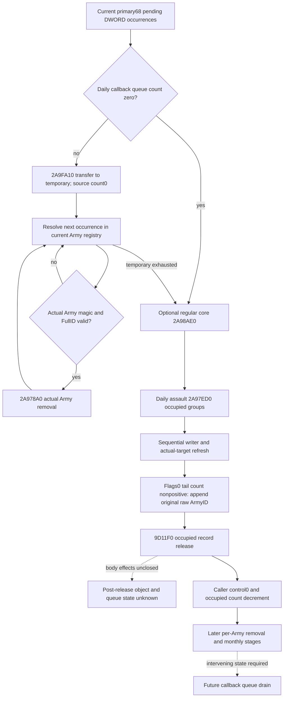

# Current daily assault queue append, later drain and record release — 1.20.0.3

2026-10-06 / W41. This source-first package connects the independently modeled [current daily loss groups](army-current-daily-assault-loss-inputs-12003.md) to the existing queue/removal capabilities. Exact `.3` / Steam25652598 / EXE SHA `94b55397abb687a3dcd436805a5d885e6be90fa6c693feb44a9e3bbeeade02a6` and held source receipts are reused. No EXE bytes, closed native bodies or old qualification samples are read again; no implementation, test, build or runtime operation is performed for this plan.

## Native scheduling and two distinct release paths

The primary Army manager is inline at `GameData+2A540`. Its secondary interface is primary `+8`, or `GameData+2A548`. The daily callback `2A9A590` receives that secondary interface and forms the primary receiver at `2A9A681`. The pending DWORD queue descriptor is primary `+68` / secondary `+60` / `GameData+2A5A8`, with count primary `+74` / secondary `+6C`. It is distinct from the occupied daily-assault table at primary `+178`.

The held daily callback supplies this order:

1. At `2A9A69D`, count zero skips queue draining. Otherwise it initializes an empty temporary DWORD vector and calls `2A9FA10` at `2A9A6CE`. Both source-closed transfer paths leave the source queue count zero before iteration.
2. Each temporary occurrence is resolved against the then-current Army registry `5D1DE48`, with fallback `5D1DE50`. The callback requires actual Army magic `+14 == 0x41726D79` and actual full ID `+10 != -1`. For each valid occurrence, `2A9A737` calls `2A978A0(primaryManager, actualArmyPointer)`. Registry state is reloaded after calls; repeated raw IDs can resolve differently after an earlier removal.
3. The temporary vector is released at `2A9A758..775`. It does not restore the drained queue count.
4. Optional regular core `2A98AE0` occurs at `2A9A8FD`, then daily assault `2A97ED0` at `2A9A905`.
5. Subsequent Army iteration can independently call `2A978A0` at `2A9A9B2`. The bucket monthly call `24E3430` occurs later at `2A9AB66`.

Within `2A97ED0`, the group Army tail appends the **original raw group Army ID** to primary `+68` when its current flags0 count is at or below zero. Occurrence order and repeats survive. These appends occur after this callback's earlier queue drain; they are not proof of an immediate queued-removal call. Later per-Army effects and the next callback's earlier stages can change the receiver state before a future drain.

The same assault consumer separately releases occupied group entries through `9D11F0(record+10)`, then writes control zero and decrements manager `+180`. The held caller closes the direct call and outer bookkeeping, but the `9D11F0` body is not held. It must not be named as Army removal or assumed to release only two vectors. `2A978A0` is the independently source-closed Army-removal entrance.

## Held evidence and reusable production inputs

The scheduling closure is the cached `2A9A590..2A9AB93` daily entry, summarized in the existing monthly writeback topic's queue section. The earlier transfer closure is `2A9FA10..2A9FC7D`,621B, held SHA `05b125d14dbe142ff29bfba1c09536eaa8a81e8799694c21e2d66646a28745c2`. The held removal closure is `2A978A0..2A97EC1`,1569B, SHA `b324251def171eaf33abbef8e4e5eea70c359611a9619787dcb76bf4063f8aef`. These are receipt reuse, not new hashes or native reads.

The first-removal ledger remains `Z:/ck3_mod_rewrite_process_assets/g2-background-round4-20261005/monthly-caller-effects/queue-consumer-source/first-removal-stage-ledger/`. It closes `2A98200`: first stable removal from primary `+50`; first swap-last removal from `+68/+80/+98/+C8/+158`; every matching opaque16B primary `+B0` record; stable all-matching removal from the actual unsigned-ID modulo30 bucket. Its argument is the actual resolved Army full ID, not automatically the original queued ID. Later `2A98590`/`24E9940` and lifecycle boundaries retain their separate qualified current-input models; they do not establish full sequential deletion.

| Required value or stage | Existing production input | Exact use and gap |
| --- | --- | --- |
| Current ordered pending IDs | `monthly_daily_queue_inputs_v1.manager_army_id_list_2a5a8` | Captured current DWORD sequence, not tomorrow's queue. Preserve signed32 stored representation and raw32 identity bits. |
| Initial current queue resolution | `initial_army_resolution_rows` | Covers only captured queue occurrences. It includes actual magic, resolved full ID, fallback and validity. |
| New ordered append requests | `same_input_current_daily_assault_loss_v1[].projection.ordered_queue_append_requests` | Derived prefix output over a fixed observed table. Empty is meaningful only with the corresponding numeric-prefix readiness. |
| Potential appended-ID resolution | Current loss `group.army_counts[].resolution` | Supplies actual pointer identity and full ID, but does not publish Army magic `+14`; flags0 counts alone cannot prove the drain predicate. |
| First candidate cleanup context | `monthly_first_removal_cleanup_inputs_v1` | Selects the first valid **captured queue** candidate. An empty captured queue does not supply cleanup context for a newly derived appended ID. |
| Record-release effects | `9D11F0(record+10)` | Known exact direct entrance; body/storage effects unclosed. Do not treat outer control/count writes as its body. |
| Subsequent duplicate removal | Registry/cache after prior `2A978A0` | Current initial predicates cannot replace this evolved physical state. |

## Smallest numerical and observation work packages

The first independent pure value is an explicitly named **conditional pre-release pending queue** for a standalone current-table invocation: copy the captured current pending occurrences, then append the computed prefix's raw ID requests in their original order. Keep captured and derived occurrence provenance separate. Do not modify or feed this list back into the observed DTO. With a complete numerical prefix, the list may be complete for that bounded stage; with a partial prefix, publish only the known append prefix and its next missing group/request. This does not need the unconsumed removal context, a full seven-chunk gate, or a new capacity limit. No actual post-state or fullmonthly readiness changes.

The next necessary source leaf is `9D11F0` because it executes before the consumer returns and can determine whether current Army-resolution context is reusable. A single bounded `.pdata` lookup and frozen-file read should close its real extent and direct state footprint; only a callee that changes the required Army registry, queue or group-vector state justifies further reads. No closed manager, allocator, writer or placement body needs rereading. The separate placement owner confirms their `2AA2030` packet contains only the `9D11F0` call/address and will reuse this lane's future closure.

If that closure permits a conditional post-release drain seam, the smallest additive same-query collector captures Army `+14` for the real group Army reference union through the existing generation/fallback resolver. It retains original reference versus actual receiver identity, and reuses current queue resolution rows for existing pending IDs. For a new first valid appended candidate, explicitly capture the existing first-cleanup components against that actual candidate rather than repurposing an unavailable current-queue candidate DTO. Derived cache deltas stay separate from the observed cleanup context. Full removal still requires the real later lifecycle/registry suffix, so later repeats remain partial until those writes are modeled.

The implementation order is source plan review, independent pure queue append assembly with one necessary new production case, then only the genuinely needed source/readonly input for release and initial removal. Root owns all native registration, formal build, new CTest and first compiled-wire authorizations. This plan introduces no action, extra gate, test rerun, new native target or fictional calendar frame.

## Status and delivery

This package is **research / source-first plan**, not a newly qualified numerical or live capability. Actual daily loss/effects/removal/post-stage remain false/null; complete regular-refill, calendar and fullmonthly remain false. The current daily loss native FIRST fixture RED and its minimal end-marker correction are recorded in its own topic and retained packet; this planning work grants it no wire credit.

The external packet is `Z:/ck3_mod_rewrite_process_assets/g2-background-round17-20261006/daily-assault-queue-release-source/`, with the sealed scope, held canonical excerpt receipt, machine-readable input/stage ledger and Oct6/W41 coordinator fields. Root merges shared reports and pushes. Next concrete source entrance is `9D11F0`; next independently useful pure interface is current pending occurrences plus conditional ordered append requests, with no queue execution claim.
