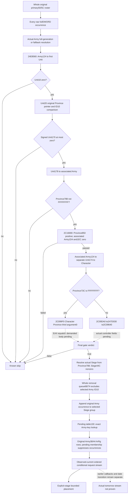

# Current daily-assault original roster admission - CK3 1.20.0.3

Incremental source milestone, 2026-10-06 / W41. This source tree precedes the
new observer. CK3 1.20.0.3 / Steam 25652598 is bound to the reused EXE SHA-256
`94B55397ABB687A3DCD436805A5D885E6BE90FA6C693FEB44A9E3BBEEADE02A6`.
There is no game/process/SDK/pipe/UI/live-pointer operation, test or build.

The bounded placement package now has a qualified independent conditional
prefix. Its next actual input is the complete original primary roster, rather
than a permanently supplied list or the requested Army subset. The cached
pre-date caller uses secondary=primary+8: secondary data48/count54 are original
primary data50/count5C. It resolves every raw full DWORD in original order and
calls `2A99B40(primary,resolvedArmy)` at `2A9A0A1`. Retain duplicates, invalid
requests, the actual fallback selection and native indices independently of
whether that occurrence's admission can be derived. The removal queue68/74
is a separate input.

## Closed gate inputs, in native order

`24E8560` is exactly `[024E8560,024E8634)`, 212 bytes, SHA-256
`3423fd0a9c199fdb00122c3dffb38086207816a18c5ce869f5d00647289c2b0f`.
Resolve Army DWORD124 through Unit slots5D1E380/5D1E378, unsigned low24 index,
registry20 data/2C count, stride16 pointer8 and full object ID10 equality.
Unit DWORD18 nonzero rejects before further demands. Unit20 is an actual
Province pointer. Null chooses fallback5D1E390 for one comparison operand,
but the body still unconditionally reads the original pointer+10. A null or
failed read is therefore a native precondition gap, not a proven false gate.
For the normal nonnull pointer the two comparison operands are identical.
Signed Unit170 positive rejects. Resolve Unit178 through Army slots5D1DE48/50,
full object ID10 equality, then Province788 FFFFFFFF rejects.

`2C16690` is exactly `[02C16690,02C16766)`, 214 bytes, SHA-256
`91f68cb532ec05445f37790d111dc3e3a3ed9cfab25e5bcdc0f24cada51c4145`.
Signed Province850 must be positive; associated Army bytes1D4 and1EC must both
be zero. Resolve that Army124 to a second Unit independently, then Unit174 to
Character via5C67568/70 and full Character ID18. Province73C FFFFFFFF selects
`2C099F0(Character,Province,0)` and requires EAX==0. Other values select
`2C09DA0(Character,Province)`.

`2C09DA0` is exactly `[02C09DA0,02C09E0A)`, 106 bytes, SHA-256
`31c1ae747e198fbc5aa5ad7247ea69b5bd5968cbae89bea5f6d74d323eed849d`.
It calls247D030 with Province and a stack output, resolves the returned full
Character ID through5C67568/70, then calls2C09640 with the two actual selected
Characters and third argument0. These two leaf input contracts and2C099F0
remain branch-local source gaps. Cross-owner cache reuse precedes new reads.

## Closed caller and pending selection

The held complete2A99B40 body is `[02A99B40,02A99DBD)`, 637 bytes, SHA-256
`9d4ffe6848ad80c8bff96c277e8a1acdcb02412a2f18c00af7b35562c42b7ab2`.
After a true gate it resolves original Army124 again, selects Unit20 or the
Province fallback, resolves Province788 via Siege registry5D1EC88/fallback
5D1EC60 with fullID8 equality, and demands Siege byte44C nonzero. The complete
removal queue at primary68/74 is searched for selected Army ID10 before any
group append. A matching occurrence skips the whole Army.

After source-approved group placement the caller appends selected Army ID10
once, even when pending lookup misses or the ArRg list is empty. Pending130 is
a separate inline table: data138, signed mask144, tail148, stride28 (40 bytes),
control4/key8; little-endian fullDWORD FNV uses seed811C9DC5 and multiplier
01000193. Lookup starts hash&mask with distance byte1, advances while the
actual control permits it, and miss selects the end record at
signed(mask+tail+1). The selected end record's controlFF suppresses all ArRg
requests. A real selected record has ArRg data10/count1C. Original Army ArRg
data38/count44 are read in source order. Each raw fullDWORD occurrence is
appended to the group unless found in that pending record's complete list.
There is no source deduplication of repeated admitted occurrences.

The new observer must retain demanded probe rows and the actual end marker,
not replace an unobserved pending selection by a guessed empty list. It can
publish the raw original roster independently while a gate or pending branch
is partial. Count0 is legal complete empty without registry or gate demands.
Whole admission readiness requires every occurrence's source selection or
skip; the new fixture must include a genuinely true, nonempty admission.

## Cost and boundary

The source child currently adds532 unique code +528 metadata =1060 actual
frozen bytes, zero duplicate reads. Its2C099F0 metadata-only harness RED read
52 metadata and zero code, saved unchanged. Exact pdata closes the necessary
567-byte body extent; no metadata recapture is needed. Parent adds zero new
EXE bytes, reusing637-byte caller and saved source ledger without rehashing.
The gate source tree, pins, READONLY-BINDING.json and READ-COST.json are under
`gate24e8560-source` in the packet below. Future required controller bytes
remain separately planned and are not included as already read.

Readiness is research: concrete readonly field binding and exact short-circuit
rejections, not a new native producer or qualified complete stream. Existing
g95 placement qualification is unchanged. Earlier/per-Army callbacks, actual
date association, current-final versus fresh stage, growth, and general
collision are independent boundaries. Release raw headers are attrition-owned.

Packet: `Z:/ck3_mod_rewrite_process_assets/g2-background-20261006/daily-assault-roster-admission/`.
Root owns shared reports, publication, native registration, build and first
wire qualification.
