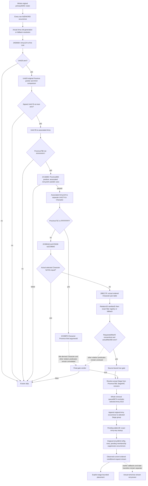
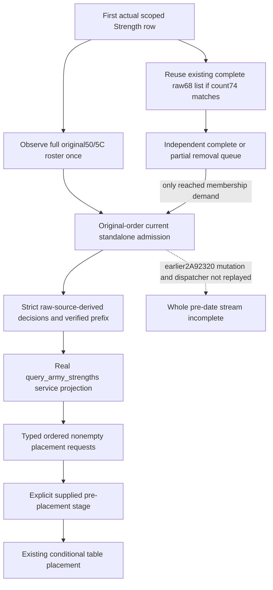

# Current daily-assault original roster admission - CK3 1.20.0.3

Selected nonempty admission source closure, 2026-10-06 / W41. This source tree precedes the
new observer. CK3 1.20.0.3 / Steam 25652598 is bound to the reused EXE SHA-256
`94B55397ABB687A3DCD436805A5D885E6BE90FA6C693FEB44A9E3BBEEADE02A6`.
There is no game/process/SDK/pipe/UI/live-pointer operation, test or build.

The bounded placement package now has a qualified independent conditional
prefix. Its next actual input is the complete original primary roster, rather
than a permanently supplied list or the requested Army subset. The cached
pre-date caller uses secondary=primary+8: secondary data48/count54 are original
primary data50/count5C. It resolves every raw full DWORD in original order and
can reach `2A99B40(primary,resolvedArmy)` at `2A9A0A1` after earlier per-Army dispatch. Retain duplicates, invalid
requests, the actual fallback selection and native indices independently of
whether that occurrence's admission can be derived. The removal queue68/74
is a separate input.

## Closed gate inputs, in native order

`24E8560` is exactly `[024E8560,024E8634)`, 212 bytes, SHA-256
`3423fd0a9c199fdb00122c3dffb38086207816a18c5ce869f5d00647289c2b0f`.
Resolve Army DWORD124 through Unit slots5D1E380/5D1E378, unsigned low24 index,
registry20 data/2C count, stride16 pointer8 and full object ID10 equality.
Unit DWORD18 nonzero rejects before further demands. Unit20 is an actual
Province pointer. Null chooses fallback5D1E390 for one comparison operand,
but the body still unconditionally reads the original pointer+10. A null or
failed read is therefore a native precondition gap, not a proven false gate.
For the normal nonnull pointer the two comparison operands are identical.
Signed Unit170 positive rejects. Resolve Unit178 through Army slots5D1DE48/50,
full object ID10 equality, then Province788 FFFFFFFF rejects.

`2C16690` is exactly `[02C16690,02C16766)`, 214 bytes, SHA-256
`91f68cb532ec05445f37790d111dc3e3a3ed9cfab25e5bcdc0f24cada51c4145`.
Signed Province850 must be positive; associated Army bytes1D4 and1EC must both
be zero. Resolve that Army124 to a second Unit independently, then Unit174 to
Character via5C67568/70 and full Character ID18. Province73C FFFFFFFF selects
`2C099F0(Character,Province,0)` and requires EAX==0. Other values select
`2C09DA0(Character,Province)`.

`2C09DA0` is exactly `[02C09DA0,02C09E0A)`, 106 bytes, SHA-256
`31c1ae747e198fbc5aa5ad7247ea69b5bd5968cbae89bea5f6d74d323eed849d`.
It calls247D030 with Province and a stack output, resolves the returned full
Character ID through5C67568/70, then calls2C09640 with the two actual selected
Characters and third argument0. The selected normal Province73C branch is now closed below. Other title-derived
and remaining relation branches stay local source gaps; no arbitrary supplied
boolean is used to complete them.

## Closed caller and pending selection

The held complete2A99B40 body is `[02A99B40,02A99DBD)`, 637 bytes, SHA-256
`9d4ffe6848ad80c8bff96c277e8a1acdcb02412a2f18c00af7b35562c42b7ab2`.
After a true gate it resolves original Army124 again, selects Unit20 or the
Province fallback, resolves Province788 via Siege registry5D1EC88/fallback
5D1EC60 with fullID8 equality, and demands Siege byte44C nonzero. The complete
removal queue at primary68/74 is searched for selected Army ID10 before any
group append. A matching occurrence skips the whole Army.

After source-approved group placement the caller appends selected Army ID10
once, even when pending lookup misses or the ArRg list is empty. Pending130 is
a separate inline table: data138, signed mask144, tail148, stride28 (40 bytes),
control4/key8; little-endian fullDWORD FNV uses seed811C9DC5 and multiplier
01000193. Lookup starts hash&mask with distance byte1, advances while the
actual control permits it, and miss selects the end record at
signed(mask+tail+1). The selected end record's controlFF suppresses all ArRg
requests. A real selected record has ArRg data10/count1C. Original Army ArRg
data38/count44 are read in source order. Each raw fullDWORD occurrence is
appended to the group unless found in that pending record's complete list.
There is no source deduplication of repeated admitted occurrences.

The new observer must retain demanded probe rows and the actual end marker,
not replace an unobserved pending selection by a guessed empty list. It can
publish the raw original roster independently while a gate or pending branch
is partial. Count0 is legal complete empty without registry or gate demands.
Whole admission readiness requires every occurrence's source selection or
skip; the new fixture must include a genuinely true, nonempty admission.

## Selected true and false controller branch

The exact247D030 body returns Province73C unchanged when that DWORD differs
from FFFFFFFF. It adds no title lookup demand on this branch. Resolve this full
Character ID through5C67568/70; compare the two actual selected Character full
IDs at18. Equal full IDs make2C09640 false before any relationship or War read.

For unequal full IDs, exact28BC270 is a readonly ordered pair lookup with no
direct calls or mutation. It reads the associated Character1B0 component. Null
selects the actual relationship pointer from slot5D27B70. A nonnull component
has data20/signed count2C, stride10 (16 bytes), keyDWORD0/pointer8. The key is
the second selected Character's full unsigned DWORD18. Execute the literal
unsigned binary search in the packet's MINIMAL-GATE-RAW-SCHEMA.md, including
the final target<candidate comparison. Do not sort, deduplicate, strengthen it
to an extra equality check or require unused relationship pointers. Count0
is a known native lookup miss and demands the actual default pointer.

The selected actual relationship has raw War DWORD20. Only this requested
War ID FFFFFFFF branches to remaining predicates. Other IDs resolve through
War slots5D1DE58/5D1DE40, candidate full-ID equality at8. After actual registry
or fallback selection the native code reads byte358. Zero with native third
argument0 yields true through2C09640,2C09DA0,2C16690 and24E8560. There is no
magic check and no rejection of a selected fallback War whose own fullID8 is
FFFFFFFF. Requested sentinel and selected fallback ID are different facts.
Actual ended War or requested sentinel needs2C095A0 and conditional2C097A0;
these branches stay precisely partial. Province73C FFFFFFFF instead demands
the title-derived Character and2C099F0 relation/hierarchy inputs, also separate.

The nonempty first fixture recipe must select this real true path from actual
raw memory: original and associated Army/Unit are different, the associated
Unit174 Character differs from Province73C Character, relation table20/2C
contains the actual second fullID and actual relation pointer, relation20 gives
a nonsentinel War request, and the selected War358 is0. Also cover the early
same-Character-ID rejection without reading relation or War fields, a real
fallback with selectedIDFFFFFFFF, original null Province read precondition,
original repeated raw Army IDs and pending ArRg occurrence suppression.

## Outer dispatch replacement boundary

The complete original raw roster is observed independently from this new
**current standalone2A99B40** conditional evaluation. The held2A99DC0 caller
first resolves Army128 Combat (slots5D1DE70/5D1DE18); valid Comb magic0C and
ID8 influence the first branch. A nonvalid Combat plus Army5C==0 can call
2A92320(Army,primary130), append ArmyID10 to removal queue68 and jump2A9A0AE,
skipping2A99B40. Other Character120, associated Unit174, Character alive/rank
and2C12170/1D63180/2C129A0 paths precede the eventual2A9A09A callsite. After
2A99B40,24DF3C0 is a separate per-Army callback.

This package does not replay those mutations or substitute today's observed
table for tomorrow's initial state. The concrete next whole-stream observer
replacement is the actual earlier Combat128/Army5C/2A92320 dispatch input and
the demanded Character/Unit branch, with original occurrence order and evolving
queue/admission association. This remains priority after the independent
current admission primitive qualifies; a conditional label is not whole-stream
completion. Growth/general collision and release suffix remain other owners.

## Source pins, cost and readiness

Final gate packet is `gate24e8560-source/ROOT-DELIVERY.json`. It pins SOURCE-TREE,
MINIMAL-GATE-RAW-SCHEMA.md/json, READONLY-BINDING, READ-COST and each exact body.
Selected bodies:24E8560 212B,2C16690 214B,2C09DA0 106B,2C099F0 567B,
247D030 172B,2C09640 191B, and four nonoverlapping28BC270 fragments totalling
176B. New cost is1638 unique code +904 metadata =2542 actual frozen bytes,
zero recapture. Parent adds0 new EXE bytes and reuses the complete637-byte
caller and existing pre-stage caller. Exact source read receipts bind the reused
EXE pin; no whole-file hash, section scan or generic container catalog occurred.
The52B metadata-only2C099F0 harness RED remains unchanged; its later567B body
uses saved metadata. Intermediate1060B and2146B milestones are historical,
not additional reads to sum again.

Readiness is research / source-ready selected genuine nonempty conditional
admission branch. New producer/strict normalizer/service/fixture are not yet
qualified by this source milestone. Other controller branches retain exact
missing inputs rather than false/empty substitutes. Existing g95 qualification
is unchanged. Actual earlier dispatch/date association and full daily assault
remain incomplete. Local game/process/SDK/pipe/UI/live-pointer operations,
tests, builds and old wire replays are0.

Packet: `Z:/ck3_mod_rewrite_process_assets/g2-background-20261006/daily-assault-roster-admission/`.
Root owns shared reports, publication, native registration, build and first
wire qualification.

## Current readonly producer and first service qualification

The new optional `current_daily_assault_roster_admission_v1` is now implemented
in the same ArmyStrength query. `ReadCurrentDailyAssaultRosterAdmission12003`
uses raw memory reads only; it never invokes24E8560,2A92320,2A99B40 or a table
mutator. The full original50/5C roster remains independent of the requested
Army subset. Every native index, raw full DWORD, invalid/fallback selection and
duplicate is retained. Actual gate operands, ordered pair-map probes, War
selection, Siege44C, removal membership and pending130 probes are exposed.
Army append is independent of the later ArRg append readiness. A partial
pending read preserves the verified Army append and a null ArRg result, rather
than an empty substitute.

The whole raw68/74 removal queue is independently captured once. The new query
samples it after the first existing `Strength` row and reuses a complete,
count-matched `monthly_daily_queue_inputs_v1.manager_army_id_list_2a5a8` where
available. Signed stored IDs become their original full u32 values in order;
the new collector performs no second raw element or resolver loop on this
route. It always reads the actual count74. Count0 demands no unused data68.
Pointer metadata remains independent of an already observed complete raw list.
Existing monthly-queue consistency samples and Army14 predicates are unchanged
and are not new admission predicates. An unread independent queue does not
block an early false gate or a zero roster.

Production Python entry points are
`normalize_current_daily_assault_roster_admission_v1`,
`project_current_daily_assault_roster_admission_12003` and
`daily_assault_roster_admission_requests_12003`. The last defaults to a complete
current conditional stream; `prefix_only=True` explicitly selects the verified
continuous prefix. Independent later rows and verified Army-only facts remain
visible. The service exposes per-requested-Army
`current_daily_assault_roster_admission_inputs_v1` without changing strength,
forecast or full-monthly readiness. The new native family's complete reason is
the empty string; unavailable/partial reasons are concrete strings. Existing
families keep their previous nullable convention.

One new complete production-service compound first passed at2026-10-06
16:02:34 CST / W41:1 passed in0.65s,1.0515274s outer. It observes original raw
roster `[11,11,13,FE00000E,15]`, derives four nonempty/empty-list requests with
repeated Army and ArRg occurrences and actual fallback resolution, then feeds
the existing placement model with an explicit held fixture pre-placement
stage. Projected physical groups are slots `[0,1,2,4,7]`, Siege IDs
`[5,13,4,1,2]`. It also checks optional fallback-War metadata, independent
queue-pointer metadata, partial pending/continuous prefix, reached membership
before an unread tail, raw occurrence failures, legal zero and older-producer
absence. No current table is relabeled as tomorrow's initial state.

The initial service attempt is preserved as `service-first01/RECEIPT.json`:
harness RED from a test reading `request.native_index` instead of the stable
`request.source_provenance.original_roster_native_index`. Only three assertion
paths changed; production logic did not change. The first completed result is
`service-repair01/RECEIPT.json` with its complete output. No passed old test,
native fixture or wire was replayed.

Native fixture source contains nine new scenes, including actual production
hook reuse of the old signed raw queue. Register
`xar_bridge_daily_assault_roster_admission_12003_test` from
`src/ck3_12003_daily_assault_roster_admission_test.cpp`, linking the actual
`xar_ck3_12002_runtime`. It emits complete production `AppendArmyStrengthV1`
bytes after `ReadArmyStrengthsForScope`; Root owns its first native compile,
CTest and immutable-service consumer. Recipe and frozen expected fields are in
`native-fixture/ROOT-EXECUTION-RECIPE.md` and `EXPECTATIONS.json`.

Readiness is static-ready for this selected current conditional admission and
source-shaped complete-service path. Native qualification and live observation
are pending. Ended/requested-sentinel War predicates, Province73C sentinel
title-derived controller inputs, earlier per-Army pending mutations, the date
transition and full daily assault remain explicit separate dependencies.
New implementation source reads add0 EXE bytes. Native builds/CTest/compiled
wire consumption/local game operations/old test runs are0.

The Root-owned g97 first full native build at original immutable registration
head `da887a09e679065ebea1d13700d7c117932934c8` is preserved as RED after
123.89342s. The sole compiler error is the new fixture line347 comparing
`optional<uint32_t>` with signed literal1, instantiating MSVC C4389/C2220 under
`/WX`. Production TUs reported no errors. The minimal repair changes only this
fixture assertion to `1U`; same-file optionalu32 literal comparisons have no
other signed literal. No production logic, DTO, expected values or Python
qualification changed. Root owns the necessary repaired fixture/remaining-link
build and first CTest; neither compiled byte consumption nor a successful full
native qualification is claimed before those receipts exist.
