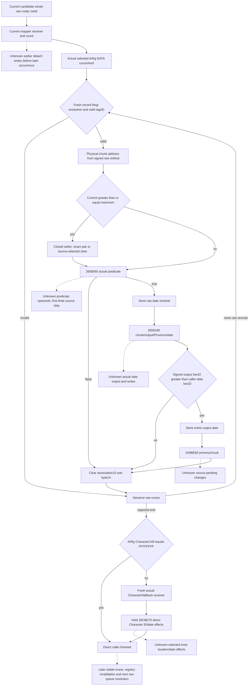
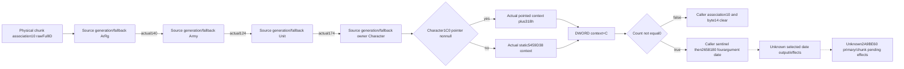
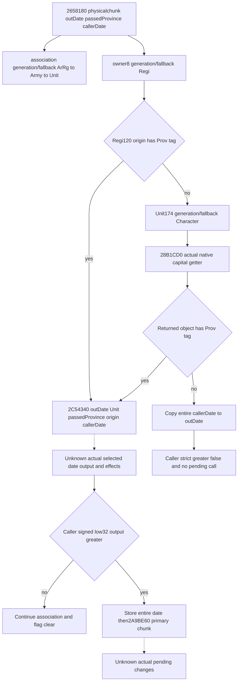

# Actual detachment date and pending inputs (1.20.0.3)

This source-only package continues [the later removal tree](army-later-removal-drain-stage-inputs-12003.md). The qualified [current candidate mapper](army-current-candidate-detachment-mapper-12003.md) supplies an initial current receiver/count preview. Its nine raw occurrences, seven physical mapper rows and actual signed counts are immutable current-seed evidence, not the state after `2633FF0` or a later queue iteration.

The held build is CK3 **1.20.0.3**, Steam **25652598**, EXE SHA `94b55397abb687a3dcd436805a5d885e6be90fa6c693feb44a9e3bbeeade02a6`, reused without recomputation. Scope was sealed before cached-body reuse in `Z:/ck3_mod_rewrite_process_assets/g2-background-round29-20261006/detachment-date-pending-source/SCOPE-FIRST.json`. This package performs **zero new EXE reads, zero tests/wires/builds, zero model/observer/shared-file changes and zero local game/Steam/SDK/pipe/UI/process/user-data operations**.

## Actual caller inputs and execution order

Held `slice-02633FF0-240.txt` has the semantic caller `[2633FF0,26341A8)` (**440 B**) inside a 576 B cache window. The original metadata selects only the first 9 B `.pdata` fragment; it must not be represented as the complete function extent. The larger held disassembly reaches the caller's final return. Its next-function prefix is excluded from this package's semantics. Existing capture-window SHA `4fc90347668a4517994600bfc8d4d4fae1b8e0cfc4fd31c57356cfed90b0dc33` is reused, not recomputed.

The physical ABI is **`2633FF0(ArRg, Province, date_pointer, primary_receiver)`**: entry RCX is retained in R13, RDX in R14, R8 in RBP and R9 in R15. The previous shorthand `2658180(chunk,Province,date)` omitted its output-buffer argument. The actual four arguments and the caller's signed comparison are necessary numeric inputs.

The held parent-source summary identifies `2A971A0` as the ArRg resolver/magic admission: it uses that ArRg's actual `+140` Army, then `24E0EB0(Army)` or its actual fallback context to supply this Province argument. Consequently the queried subject's current Province is not automatically this passed Province. In a persistent cleanup the incoming ArRg references originate from the selected persistent object's seven association slots; the initial outer candidate roster is a separate source scope. This package reuses that summary without reopening its closed function body.

| Order / source address | Read or effect | Subsequent demand |
| --- | --- | --- |
| `2634007..263402B` | Capture ArRg signed DATA count `+2C`, data pointer `+20`, and end `data + (sign_extend(count)<<4)` once. Loop terminates on cursor equality, not a positive-count gate. | Preserve raw count, pointer, ordered stride-`10h` records and captured cursor/end. A negative count is not a ready empty sequence. |
| `2634040..263408F` | Each fresh record `+8` Regi FullID resolves through registry `5D1EB68`, fallback `5D1EB58`. Selected object must have magic `Regi` at `+14` and FullID `+10 != FFFFFFFF`. | Record-by-record actual generation/fallback selection; no reuse of a finally returned mapper fallback as if it were this selection. |
| `2634095..26340AB` | Signed record ordinal `+C` selects physical address `Regi + 18h + 24h*ordinal`; only the resulting pointer is checked for zero. | Keep raw ordinal separately from occurrence index and physical alias identity. This caller does not add a seven-index or ArRg backlink gate. |
| `26340AD..26340B7` | Signed current `+4 >= maximum +0` invokes closed `2657EA0(chunk,maximum)`. | Predicate and later aliases must see the setter's resulting pair. Its source-closed special clear uses actual raw association/flag/owner cleanup operands when selected; the associated writer's narrower domain cannot substitute for this one. |
| `26340BC..26340C6` | `2658050(chunk)` returns AL. False bypasses all date and pending operations. | Close this predicate first: its actual operands decide which subsequent inputs are used and whether it must be recomputed after an earlier alias write. |
| `26340C8..26340EF` | True stores `chunk+1C = FFFFFFFF029C77F8`, then calls **`2658180(chunk,&output_date,Province,date_pointer)`**. | Actual passed Province and low/high date words; raw predicate-relevant fields after the setter; complete helper output/effects. The output is not the pre-call date. |
| `26340F4..2634108` | Read output qword; compare **signed output low32 > signed caller date low32**. Only then store the full output qword to `chunk+1C` and call **`2A9BE60(primary_receiver,chunk)`**. | Retain both date halves and signed comparison; source-defined append/changed primary state and physical pointer alias. Do not assume raw Army-ID append. |
| `263410D..2634126` | For every valid selected chunk, store `chunk+10 = FFFFFFFF`, byte `chunk+14 = 0`, then advance cursor `+10h`. | Next physical alias reads these writes; association is cleared even when the predicate was false or output date did not exceed the caller date. |
| `2634136..263419C` | After the entire DATA loop, read ArRg Character FullID `+148`. FFFFFFFF returns; otherwise resolve Character registry `5C67568` / fallback `5C67570` using selected `+18` full ID, then tail-call **`28CBE70(Character,Province)`**. | Exact actual Character receiver, independent of pending or DATA loop emptiness. No Character magic/identity guard is introduced here. |

The Regi fallback pointer is loaded into R9 before the DATA loop and reloaded only after a valid chunk's processed path (`2634118`); an invalid record skips that reload. Registry slot/count/payload checks are fresh per record. A sequential model must preserve this held fallback register as well as evolving registry state rather than resolving every failure from an assumed unchanged initial fallback.

`2633FF0` directly reads registries and writes physical chunk fields. It does **not** directly compact Army `+38/+44`. The existing closed nesting remains `2A972B0 -> 2A971A0 -> 2633FF0 -> 24E0D30 -> 2A9E640`; thus a later stable erase can change the outer captured Army buffer payload without shortening its previously captured end. A current mapper count must be recomputed from evolved physical chunks before the next raw occurrence uses it. Subsequent raw queue IDs must be resolved against the changed registry only after the separately closed destruction/invalidation stage.

## Cached Character suffix: direct body exists, inner effects remain explicit

The previous four-helper summary called `28CBE70` uncaptured. Named cache inventory now locates **`slice-028CBE70-210.txt`**, held 528 B `[28CBE70,28CC080)`, with semantic return extent `[28CBE70,28CC079)` (**521 B**) and seven trailing padding bytes. Its existing window SHA is `d91fe10177afcaffb2f31a47d050a094c692f054ceba7b49642f692eb64458b6`. Initial `.pdata` metadata `[28CBE70,28CBE9C)` is only the 44 B prologue fragment; that short slice is not a complete body. No cached body was rehashed or recaptured.

The held continuation gives these actual direct effects, not a transitive lifecycle claim:

- Character `+1B8 == null` returns without these writes or calls.
- Otherwise resolve the `+1B8` object's ArRg ID `+F8`, then its ArRg `+140` Army ID, then Army `+124` Unit ID, each with actual generation/fallback selection. Store the originally loaded object's `+F8 = FFFFFFFF`; if reread Character `+1B8` is nonnull, store its `+100 = FFFFFFFF029C77F8`.
- Call `28B1840(Character)`. Its returned object must have `Prov` magic at `+85C` before calling `28B2730(Character,returned_Province,0,0)`.
- Resolve the selected Unit's `+174` Character owner; its `+1C0` pointer plus `318h`, or the actual static fallback, supplies a count at `+C`. If nonzero, call `2C54340(&output_date,Unit,passed_Province,returned_Province,&current_state_date)`.
- Only signed output low32 greater than signed current-state-date low32 stores the output qword to reread Character `+1B8` object's `+100`.

The `28B1840`, `28B2730` and `2C54340` footprints are not silently closed by those direct calls. This wrapper contains no direct physical DATA/current/Regi-registry/pending-vector write, but its actually selected callees still determine downstream Unit/Character context. That branch is unused when the caller Character ID is FFFFFFFF or the resolved Character's `+1B8` is null.

## Minimum source and input construction plan

The new external `INPUT-LEDGER.json` distinguishes reusable existing current observations from the complete raw DATA/physical/Character state still required for this caller. The validated associated-DATA writer fields are useful on their actual source-domain subset; they are not proof of the caller's whole raw ArRg DATA cursor, arbitrary raw ordinal, or final fallback role. There is no new full-seven/prepared gate.

The minimum next source step is **`2658050`**, whose body is presently unlocated after named cache filename and disassembly entry searches. Reuse held `PE-MAP.json`: `.pdata` RVA `5DC3000`, size 2933220 B / 244435 records, and section file mapping. Binary-search only that exact entry; maximum 18 selected 12 B records plus a 4 B unwind header (**220 B**) and, if selected, one 12 B CHAININFO record (**232 B**). Publish exact record/raw header/chain provenance before reading body. There is no whole `.pdata` scan.

Only if the selected start is exactly `2658050`, its verified extent is complete and ends at or below the known direct callee entry `2658180`, the proposed first code budget is **at most `130h` / 304 B**, exact verified extent rather than a 304 B window. A fragment, nonmatching start, out-of-bound extent or CHAININFO requiring another extent stops before body capture and produces an amended finite plan. New code requires Root's separate approval after this source package; none is read here.

Once the predicate is closed, the next branch-selected source priorities are `2658180` actual output/effects and `2A9BE60` exact primary/chunk pending update. Each needs its own verified exact `.pdata` extent and finite bound; this plan does not authorize their body reads. The already held Character body avoids duplicate `28CBE70` code I/O; expand only an actually selected inner callee needed to evolve the numerical/current context. No generic allocator/CRT/destructor internals are needed by this stage plan.

The independently useful implementation candidate, **after those required branches are source-defined**, is an ordered conditional DATA-detach prefix with physical alias map and changed date/pending requests. It must read evolving maximum/current/association/byte/date values for every alias, use the captured raw cursor/end and branch-correct mapper count, and preserve ready predicate-false records independently of a different pending/Character branch. No model or new observer is implemented here. Actual detach/post-stage, future drain/lifecycle/calendar/full monthly/live remain false/null.

## Authorized exact metadata attempt: no entry, code still unread

Root approved **metadata only**. On October 6 **18:37:03 CST**, binary search consumed exactly **18 records / 216 B / 18 seeks**, then stopped because there is no record beginning at `2658050`. No unwind header or code byte was read. `2658050-METADATA-ONLY-READ-RECEIPT.json` preserves every actual selected record and the raw provenance.

The already-read consecutive records are RVA `5F49708` / file `5DE0908`, raw `107f65025080650224951005`, describing **`[2657F10,2658050)`** / unwind `5109524`; and RVA `5F49714` / file `5DE0914`, raw `808165022b83650204342605`, describing **`[2658180,265832B)`** / unwind `5263404`. Neither contains the target. Thus the direct called entrance is in a **304 B gap without an independent runtime-function entry**; the gap is not a verified 304 B function body. The original exact-record body proposal cannot be executed as written.

The amended `2658050-UNWIND-LESS-LEAF-PLAN.json` proposes only **at most 32 distinct target code bytes / 32 seeks**, incrementally decoding one instruction from `2658050` without reading ahead beyond a terminal return. No header/neighbor/helper body is read. If a branch needs bytes outside that bounded prefix, a call supplies an unresolved result, an indirect transfer appears, or 32 B do not reach the complete predicate, preserve the actual partial instructions and publish the concrete continuation before further reads. No predicate semantics, frameless-body classification or code-read qualification is inferred from the `.pdata` gap. This requires Root's separate code authorization; code remains **0 B** at this source update.

## Authorized first target prefix: actual association lookup, predicate still partial

Root then approved the target-only 32 B decode. It read exactly **`[2658050,2658070)` / 32 B / 32 seeks** on October 6 **18:42:07 CST** and stopped at the planned bound without reading a return, neighbor, metadata or old code. The actual first instruction loads ArRg registry `5D1F340`. The remaining captured instructions read **physical chunk `+10` association FullID**, keep its low 24-bit index, compare registry `+2C`, and load its `+20` slot data. Failure branches at `265805A` and `265806A` both target **`2658082`**, outside the first approved prefix. `2658050-TARGET-LEAF-READ-RECEIPT.json` and `function-02658050.asm.txt` preserve all raw bytes and instructions.

This proves an evolving association input is used by the predicate: after a preceding alias's closed `chunk+10=-1` store, its next invocation reads that changed field. It does **not** yet define AL, identity/tag admission, the final fallback rule or all helper effects. The new `2658050-CONTINUATION-PLAN.json` proposes at most **64 additional distinct B / 64 seeks** in `[2658070,26580B0)`, starting only the unfinished fallthrough and the known `2658082` branch. Reuse all first-prefix bytes; stop at actual returns on all selected paths. A remaining outside target, indirect transfer or required callee becomes a concrete partial continuation, not a new inferred body. New code requires separate Root approval. Cumulative actual EXE cost so far is **216 metadata B + 32 code B / 50 seeks**; no model, observer, test, native build or local game operation is performed.

The separately authorized continuation read **46 additional B / 46 seeks** on October 6 **18:46:19 CST**, selecting the known `2658082` failure branch first. It loads ArRg fallback `5D1F338`, reads its actual `+140` Army FullID and queries Army registry `5D1DE48`; the new failure targets are **`26580C2`**. The last complete instruction ends at `26580AF`; one first byte of the next instruction was read before the fixed prefix end stopped decoding. No return was reached and the planned `2658070` fallthrough had not yet run when the stop occurred. The receipt preserves that actual partial outcome without repeating any source byte.

`2658050-REMAINING-CONTROL-PLAN.json` now identifies only those three unfinished entries: **`2658070`, `26580AF`, `26580C2`**. It proposes up to **226 new distinct B / 226 seeks**, excluding all 78 already captured bytes, inside the already known gap ending at direct callee entry `2658180`. Incremental decode stops at actual returns; unused gap bytes, padding and neighbor bodies are not read. This finite ceiling allows the actual association-selected receiver chain to finish without assuming the whole gap is one function. It still requires Root's approval. Cumulative actual cost at this update is **216 metadata B + 78 code B / 96 seeks**. AL and complete predicate effects remain unclosed; no new numeric model or observer is implemented.

## Closed actual `2658050`: association-to-owner raw count predicate

Root approved that finite one-pass remainder. October 6 **18:51:38 CST**, it read only **212 additional B / 212 seeks**, reaching both actual returns at `2658162` and `2658171`. All actual direct control paths join or return within **`[2658050,2658172)` / 290 B**. The remaining 14 B before `2658180` were not read. There are **no calls, memory writes or indirect transfers**; the predicate uses only the following generation/fallback chain and raw count. Earlier 78 B were reused from their read maps, not reread or rehashed.

| Link | Requested full ID | Registry / fallback | Full-ID comparison |
| --- | --- | --- | --- |
| Physical chunk to ArRg | DWORD chunk `+10` | `5D1F340` / `5D1F338` | Selected object `+10` |
| ArRg to Army | DWORD selected ArRg `+140` | `5D1DE48` / `5D1DE50` | Selected object `+10` |
| Army to Unit | DWORD selected Army `+124` | `5D1E380` / `5D1E378` | Selected object `+10` |
| Unit to owner Character | DWORD selected Unit `+174` | `5C67568` / `5C67570` | Selected object `+18` |

For every link, null registry, unsigned low24 index `>=` registry DWORD `+2C`, null slot payload, or generation mismatch selects the actual fallback pointer. There is **no magic gate or explicit FFFFFFFF-ID skip**. After Character selection, qword `Character+1C0 != null` chooses `pointer+318h`; otherwise choose actual static context **`5459D38`**. Return AL is exactly **DWORD `[chosen_context+C] != 0`**. Zero is false; any nonzero value, including signed negative, is true. Neither a guessed context name nor a positive-count test substitutes for this source expression.

This closes the source bool and all of its own effects. It does not turn a captured bool into a later-stage observation: association changes select a different current chain, while later pending/Character callbacks may change linked context or registry state. The no-call predicate itself reads no chunk current/max/date. The preceding setter changes only the current/maximum pair, so it does not change this predicate's inputs; the later explicit `chunk+10=-1` store changes the next alias's requested ID.

`2658050-REMAINING-CONTROL-READ-RECEIPT.json` preserves each new byte and every decoded instruction together with the cached prefix; `function-02658050-FINAL-CONTROL.asm.txt` reaches both returns. Cumulative actual frozen-EXE I/O is **216 metadata B + 290 code B = 506 B / 308 seeks**. The incomplete metadata/prefix attempts remain separate history. No EXE/body hash, code replay, native build or game operation was added.

## Minimum whole-incoming-DATA observer and value API

The new `2658050-SOURCE-AND-OBSERVER-PLAN.json` defines the next useful query seam. A header-only reader API can take **the actual incoming ArRg receiver**, its actual passed Province/date/primary context and the existing source-shaped lookup bindings. It must capture **that ArRg's whole raw DATA `+20/+2C` sequence**, not the current mapper's first record, not a validated associated subset and not a different queried subject's DATA. Source receiver selection from `2A971A0`/persistent associations is a separate origin ledger; a copied current seed is never labeled an actual future invocation.

For every source-visited record, publish raw ordinal/Regi selection, physical chunk identity and its actual current/max/association/flag/date fields. Publish the `2658050` chain roles and final **raw context count**, plus the same-capture FFFFFFFF-association fallback chain needed after the closed clear. Physical rows can be sampled once while ordered record occurrences retain repeated aliases. The pointer/fullID/tag provenance belongs to its actual role; do not add tag gates which this predicate lacks. For the setter's special clear, demand its actual raw owner/cleanup operands only on the selected branch.

The minimal additive family is proposed as `current_detachment_data_inputs_v1`, with a separate builder `same_input_current_detachment_data_prefix_v1`. A source-predicate-false DATA prefix can expose real conditional current/max pair changes and association/flag clear requests from copied actual raw records. Recompute the bool from evolved association and the captured role map rather than replaying an initial bool. Stop the numerical prefix at a selected date/pending operation whose required source/evolving inputs are not yet available, retaining earlier independent effects. Its basis is **conditional current incoming-DATA**, with actual detach/post-stage/lifecycle/full monthly/live false/null.

This is an implementation/API plan, not a new observer or a static-ready value claim. Root will own coherent native registration/build, the new whole-query fixture and FIRST compiled-service qualification, then a **fresh minimized paused read**. The child never attaches to the game. Before implementing a complete true date branch, close the actual `2658180`/`2A9BE60` numerical effects; do not leave permanent-null fields or expand unrelated allocator/stat trees. The external `2658180-FINITE-METADATA-PLAN.json` reuses the already-read exact 443 B record and proposes only its 4 B unwind header (plus one selected 12 B chain record if present) before a separate exact body review.

## Selected `2658180` extent and unwind metadata

Root approved that metadata-only step. October 6 **19:10:12 CST**, the reader reused the held record at RVA `5F49714` / file `5DE0914`, raw `808165022b83650204342605`, selecting **`[2658180,265832B)` / 443 B** and unwind RVA `5263404`. It read only the selected **4 B header / 1 seek**, raw **`01a20800`**: version 1, flags 0, prologue byte count 162, unwind code count 8, frame byte 0. There is no CHAININFO record to read. Neither the pdata record nor any code byte was reread. `2658180-METADATA-ONLY-READ-RECEIPT.json` keeps this exact selection and its actual cost; the body remains **NOTRUN**.

The next finite body proposal was that exact range with a planned **443 B / 1 seek** ceiling, followed by complete control-flow decoding of its actual four-argument contract. Calls and transfers leaving the selected range are recorded with their exact receivers/arguments; an actually needed callee requires its own cache-first finite source plan. This proposal does not authorize a neighboring window, guessed date formula, generic modifier tree, or new observer implementation. Cumulative actual frozen-file I/O at the metadata step was **220 metadata B + 290 code B = 510 B / 309 seeks**. The source bool remained closed; selected date output and pending effects remained the concrete gaps.

## Actual four-argument date wrapper and independent equal-date path

Root approved the exact selected body once. October 6 **19:18:40 CST**, actual read cost was **427 B / 1 seek**, reaching its return at `265832A`; all direct control paths remain inside `[2658180,265832B)`. **That address difference is `0x1AB = 427`, not the 443 B previously written in the plan and metadata receipt's derived length field.** The raw record and selected addresses were correct; the historical receipts retain the original arithmetic error, while this actual-body receipt records the physical length. No neighboring 16 B, metadata, old code or padding window was read. Cumulative I/O is **220 metadata B + 717 code B = 937 B / 310 seeks**.

The actual ABI is `2658180(chunk, output_date_buffer, passed_Province, caller_date_pointer)`. Its association `chunk+10` resolves ArRg, then ArRg `+140` resolves Army, then Army `+124` resolves Unit with the same source generation/fallback rules. Separately `chunk+8` resolves **owner Regi** through `5D1EB68/5D1EB58`, exact ID `+10`; it reads that actual Regi's qword `+120` origin pointer and demands DWORD origin `+85C == Prov`.

When origin is not Province-tagged, actual Unit `+174` resolves owner Character with `5C67568/5C67570`, exact Character ID `+18`, then `28B1CD0(Character)` obtains a fallback origin. If that returned object also lacks the Province tag, the wrapper **copies the entire qword caller date to the output buffer and returns it**. The caller's signed-low32 strict-greater test is consequently false: its already stored sentinel remains, `2A9BE60` is skipped and the later association/flag clear can continue. This is a source-defined independent branch; it does not require a guessed travel duration.

For a Province-tagged original or fallback origin, call `2C54340(output_date_buffer, actual_Unit, passed_Province, actual_origin_Province, caller_date_pointer)`, with the fifth argument on the stack. The wrapper has no direct stores to chunk, current/max, registry, Character or pending manager fields. Its direct non-stack store is only the equal-date output write. **The selected `2C54340` output/footprint is still needed**; a copied current date must not replace its actual result.

Existing capital source is reused from `battle-native-owner-retreat-v62/active-criteria/new-owner-target-28b1cd0.asm.txt`, with the held `new-owner-title-id-28b2220.asm.txt`. It is the existing native Character-capital query entrance, not an arbitrary chosen capital. The available `new-title-province-230f900.asm.txt` is only a partial cache; its presence is not credited as a newly complete transitive footprint. Current whole-DATA inputs can publish the actual getter's selected returned origin when that branch is used; no call to a mutator is proposed.

The next source plan names only two actual dependencies: the numerical date constructor **`2C54340`** and the strictly-later pending callback **`2A9BE60(primary, physical_chunk)`**. No complete body/metadata locator was found in the searched owned date/pending catalogs; only already held pending callsites are credited. `2658180-SELECTED-CALLEE-METADATA-PLAN.json` proposes finite exact-start pdata/unwind selection for those two named entries, reusing any previous selected record bytes. Code capture still requires separate exact-extent review. Whole incoming-DATA DTO implementation remains pending those concrete branch operands, with the false-predicate and equal-date prefixes independently retained in its construction plan.
