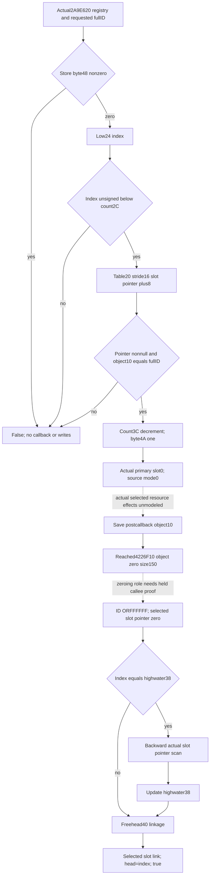

# ArRg store admission and invalidation — CK3 1.20.0.4

Exact source pin: CK3 **1.20.0.4**, Steam **25734779**, SHA-256
`98702f88a547cde2eaf29a85f93b85f68ee4cf8148336a4f7afaeb75319dd518`.
Source baseline is `23c3c4bc7fdf261f46174d35db12732808523463`; callback input
candidate is commit `bbd06d13c9c2ef884178de3c9429f280739fe9e0`.

The complete semantic method is actual **`2A9E620..2A9E732`**,274B. Root approved
only the two remaining100B/155B spans after the selected caller19B was held.
Both remaining spans completely match their old cached instructions, ordinary
control topology and member/literal operands; the existing19B was reused.
No callee, padding or next function was read. The external receipt is
`army-future-dates-12004/callback-map05/FAMILY-MAP.json`. This increment consumed
**255 actual4 bytes/two reads**; intentional cumulative source cost is
**744 bytes/eight reads**, with old EXE/new metadata/hash cost zero.

The receiver is the ArRg registry store, not an ArRg object. Incoming EDX is a
full uint32 ID. The method first rejects a nonzero byte48. Otherwise its index
is `fullID & 0xFFFFFF`; `JB` compares this index against DWORD2C **unsigned**.
An out-of-range index returns false without loading the slot table. An admitted
index loads pointer20 and selects the stride16 slot's pointer at+8. Null or
selected object's DWORD10 differing from the complete requested ID returns
false. These branches do not read DATA, run a callback or mutate the store.

On a matching object, DWORD3C is decremented, byte4A becomes1, and the selected
object's actual primary slot0 is called with EDX0. The callback leaf describes
its separately known effects; the registry does not add a magic14 test. After
the callback it saves the object's **post-callback** DWORD10, calls reached
`4226F10(object,0,0x150)`, and writes the saved ID OR`0xFFFFFF` at10. The zeroing
callee itself was not expanded under this plan. Its semantics and any effects
of the callback's selected resource allocator cannot be invented from the call
arguments or a prior snapshot.

The method reloads table20 and clears selected slot+8. If selected index equals
DWORD38, it scans prior slot pointers backwards to the first nonnull pointer or
`0xFFFFFFFF`, then stores that as38. It reads DWORD40 as free head. When head is
below`0xFFFFFF` unsigned, the head slot's DWORD+4 becomes selected index. It then
stores the current free head in selected slot DWORD+0, stores selected index
as40 and returns true. Table20 is reloaded at the source's later write roles;
the current frame is not evidence that it stays unchanged through callbacks.

The independently authored same-Army query leaf publishes current registry48,
unsigned count2C, table20, requested full IDs and their actual selected slots.
It also preserves current3C/4A/38/40 and only the backward pointer suffix used
by an admitted highwater request. The raw admission result is independent of
the old DATA/date family's overall readiness. Unused callback/slot fields are
not required for a source-proven skip. The pure consumer can close admission
and pre-callback writes without pretending that the callback, zeroing or later
registry reads occurred. Root owns shared hooks, first whole producer/registered
consumer qualification and paused observations. No forecast gate is added to
the current one-day OODA.

Raw family is `current_detachment_store_inputs_v1`; strict API is
`normalize_current_detachment_store_inputs_v1`, pure API is
`project_current_detachment_store_inputs_v1`, and the Service sibling is
`current_detachment_store_admission_v1`. Three standalone native headers add
the exact4 source binding, current collector and inline serializer; two Python
files add the optional contract and projection. The collector captures unique
`(fullID, incoming pointer)` requests and retains all original seed indices.
Pure request admission and pre-callback updates are separately ready; active
count3C subtraction preserves uint32 wrap. Missing count3C, target or trailing
context does not invalidate an already complete admission result. All-skip
results have no unselected post-call entries in `remaining_stage_inputs`.

The additive shared hooks are external
`next-store-source/SHARED-HOOK-RECIPE.md` and
`next-store-python/ROOT-HOOK-RECIPE.json`. They preserve baseline Army/current
DATA/global readiness and use one sibling cache per complete query. No new TU
or CMake target is required by the inline headers.

Current state is **research / complete direct method source with
AUTHORED_NOTRUN production leaf**; no static-ready, fixture, production-live or full
future-date/daily/monthly credit is assigned. The existing callback source and
conditional after-header are documented in
[the ordered callback topic](army-ordered-detachment-callback-12004.md).
