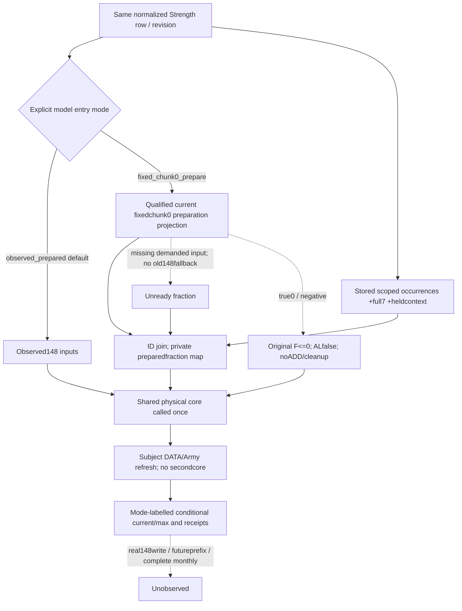

# Explicit fixedchunk0 preparation into scoped ordered core, CK3 1.20.0.3

2026-10-06 /2026-W41. Root reviewed the source-first plan once and authorized this independent Python composition. [Ordered native source](army-ordered-regular-refill-projection-plan-12003.md) and [qualified same-query preparation inputs](army-fixed-chunk0-preparation-inputs-12003.md) remain the input ledger. Exact frozen1.20.0.3/Steam25652598/EXE SHA`94b55397abb687a3dcd436805a5d885e6be90fa6c693feb44a9e3bbeeade02a6` is reused. No new native source read/data/fixture or build is needed.

Packet `Z:/ck3_mod_rewrite_process_assets/g2-background-round16-20261006/explicit-prepare-scoped-core/` contains `SOURCE-FIRST-PLAN.md` before implementation. The same owned C sparse tree now uses qualified Root`51d14f31a083c549660f9a66902e77a638d2ac4a` to obtain the actual core modules; immutable g91 source and old Z trees are unchanged. Previously delivered qualification doc`1b8d04e1` remains separate. Current status at plan freeze is **research/assembly pending**; the native prep+core ingredients retain their existing qualifications.

## Native edge and entry modes

`262C6A0` logically selects fresh fraction or valid0 and writes persistent148; later`2A98AE0` reads that prepared148, prezeros seven q slots, completes the ordered request buffer, applies all admitted ADD/cleanup operations, then refreshes requested Army DATA/current/max after the persistent roster. This assembly projects the first edge with the qualified read-only current inputs, substitutes its scalar only into a private declared core-entry map, and invokes the qualified core once. It never calls the native writer or stores real148.

Default **`ordered_refill_entry_mode=observed_prepared`** preserves the existing observed148 path. Explicit **`fixed_chunk0_prepare`** chooses conditional fresh preparation under the same current frozen context. The existing general `same_input_conditional_scoped_ordered_refill_current_v1` service field carries only the selected mode's result, with mode/projection kind/source basis visible. Independent native preparation output retains its own current-input basis. This avoids calculating both core modes in the same request or labelling fresh inputs observed cache. Native query operation/army IDs/revision are unchanged; the MCP parameter selects Python model input only.

## Same-query input ledger and single core call

| Input | Source / treatment |
| --- | --- |
| Army/CArmy identity and coherent current capture | The same normalized Strength row and query/revision; both existing optional leaves are captured together. |
| Materialized persistent FullIDs, full7 physical state and stored manager occurrences | Qualified `scoped_ordered_refill_inputs_v1`; retain all execution duplicates, q ordinals and held nonphysical context. |
| Fresh containing guard/definition/fixed physicalchunk0 permission/fraction | Qualified `fixed_chunk0_preparation_inputs_v1`; use its existing conditional preparation projection for each matching persistent. |
| Private prepared fraction for core | Exact ID join to `conditional_prepared_fraction_raw`; missing demanded preparation input becomesNone, never old148 or zero. Valid0 and signednegative pass unchanged to the originalF<=0 branch. |
| Raised refresh input and execution order | Existing subject DATA plus real subject refresh occurrences; the extracted refresh adapter consumes the one physical projection. |

`attrition_setter_research` owns the extraction in `army_scoped_ordered_refill_projection.py`: `project_observed_prepared_ordered_physical_core_v1(inputs, prepared_input_basis=...)`, and `project_scoped_ordered_refill_from_physical_v1(row, physical_projection)`. The latter performs no second q/ADD loop. This package owns a new assembly module, focused compound and small service/MCP mode hooks; it copies no predicate, numeric, q-buffer, ADD or cleanup algorithm and edits no shared core/B/native/DTO file.

Preparation's logical writes change only148 under the explicit captured context. Repeated preparation occurrences before core writes see the same physical state; the physical map supplies their same fraction. Core execution still retains every duplicate occurrence and evolving current. Missing per-persistent preparation keeps independent ready rows visible and marks its own downstream result partial. Original DATA/prepared/cache/context inputs remain unchanged. Actual-after/cachewrite, full manager/regular/monthly and live remain unclaimed; a changed future prefix/context is a different entry.

## Qualification plan

One new production service/MCP compound FIRST will use true optional contracts and MCP dispatch, with the sibling's committed extraction. It must prove active physical core call count1, input immutability, positive fresh numerical gain from an observed0 cache with duplicate execution, legal0/negative noADD, and missing fixed permission unable to borrow an old positive cache. Existing fixture builders may be imported; no old test methods/wires/native or game/Steam/SDK/pipe/UI/process operation is authorized by this package. Root owns shared reports and publication. Qualification and Oct6/W41 fields will be appended after the new FIRST; complete calendar/monthly/OODA remains outside scope.

## Implemented parameter and output contract

`army_prepare_scoped_ordered_refill_assembly.py` consumes the service's already computed preparation projections. It joins each materialized persistent FullID, substitutes only `prepared_fraction_raw` in a private copy, calls the shared physical entry once, then passes its result to the existing refresh adapter. The original Strength row, observed prepared148, DATA records, physical inputs and execution roster are retained. A missing joined scalar remains `None`; the shared core determines whether the actual execution occurrences demand it. Independent ready physical rows survive a different persistent's missing input.

The Python service parameter and registered `ck3_query_army_strengths` MCP enum both default to `observed_prepared`. Explicit `fixed_chunk0_prepare` selects the new assembly; it does not dispatch a different native command. The service echoes `ordered_refill_entry_mode`. Existing preparation, land/B/monthly projections retain their independent source bases; this entry mode selects only `same_input_conditional_scoped_ordered_refill_current_v1`.

The explicit result uses `projection_kind=conditional_fixed_chunk0_prepare_scoped_ordered_core`, `input_basis=same_capture_fixed_chunk0_conditional_preparation_ordered_occurrences` and `preparation_context_basis=current_frozen_context_preparation`. The shared held nonphysical context basis remains visible. `preparation_join` reports each FullID's observed and conditional fractions, physical chunk index0, source branch and missing demanded operands. `preparation_inputs_ready` describes the independent preparation projection; downstream ordered/refresh readiness is separately calculated by the shared APIs. `conditional_preparation_projected=true` means a model input was selected. `cache_write`, `actual_after`, `actual_post_stage_observed`, `preparation_replayed`, `full_manager_replayed`, `full_ordered_regular_refill` and `full_monthly_ready` remain false.

Dependency: shared extraction original commit `81d055db78233d21f7902921aa9f040073e1089c`, locally cherry-picked as `d31b6f258bc52503f4f413f85eab43e528e5e635` over qualified ingredient source `51d14f31a083c549660f9a66902e77a638d2ac4a`. Root adopted the same extraction independently as `e6ed6077`. This package edits no shared core algorithm.

## FIRST qualification, 2026-10-06 / 2026-W41

At **2026-10-06 13:35:47.556159 Asia/Shanghai**, the one new production compound passed **1/1 GREEN**, with six explicit registered MCP calls. Test time was **1.042s**; process wall time was **3.0493282s**. The actual Python MCP server registered and dispatched `ck3_query_army_strengths`; only its service construction used the memory route. The production Strength normalizer, both optional contracts, preparation projection, new assembly, shared physical core and DATA refresh all ran. Registered schema confirmed the optional enum and default without querying the old mode. No RED attempt occurred.

| New named case | Qualified result |
| --- | --- |
| Observed148=0, ordinary guard bypass, fresh10000 | Duplicate stored indices1/3 remain ordered: physical80→90→100, q0=10 each time; two DATA aliases refresh raised current160→200, max200. |
| Observed positive148, valid fresh0 | Conditional fraction0; no ADD/cleanup, raised160/200. |
| Permission true, fresh−3456 | Signed fraction retained; no ADD/cleanup, raised160/200. |
| Missing fixedchunk0 permission, observed positive148 | Conditional fraction unavailable; ordered/refresh result partial, totalsNone; no old148 fallback. |
| Known permission false, unused fresh unavailable | Conditional fraction0 is ready; no ADD/cleanup, raised160/200. |
| Preparation leaf absent, observed positive148 | Conditional fraction unavailable; demanded occurrence unready, no old148 fallback. |

Each call wrapped the real shared physical API and proved **exactly one invocation**. Source fixture, native observed148, DATA records, physical/ordered inputs, native command/revision and native readiness stayed unchanged. The independent preparation output retained its basis. These named offline fixtures provide static qualification for the new composition; they are not a fresh game frame or another native wire qualification.

Artifacts under `Z:/ck3_mod_rewrite_process_assets/g2-background-round16-20261006/explicit-prepare-scoped-core/`:

- `QUALIFICATION.json` seals the result and input/source boundaries.
- `first01/FIRST-COMPOUND-RECEIPT.json`, SHA-256 `801d43c99fa7b1ba17c665c5bb70a1c3887bf450dcde14203310dfd6cf91284b`.
- `first01/production-output.json`, SHA-256 `9dcce65b692b2dcb9a26e6f800bd1e33a95d7f0a59375287d478b2fee8ffcb51`.
- `first01/registered-tool-schema.json`, SHA-256 `fa3203cb79d2f69ef0cbcfd49d67ed7ca0c54007397d1b1451c08c4a58ff64dc`.
- `first01/stdout.log` and `stderr.log`; runner command and log hashes are in the receipt.

Readiness changes to **limited static-ready for explicit captured preparation → scoped ordered core → requested DATA/current/max**. Actual cache writes/after-state, changed future prefix, full manager/regular/monthly and live remain false. The mode does not compose independent B/land/monthly results or claim official CI. If an execution persistent has no same-query preparation row, that precise input remains partial; a later collector extension can supply it without changing this assembly or copying the core.

Costs: one new compound / six registered Python MCP dispatches; **0 new EXE/native bytes, native fields, builds, CTests, old cases/wires/default-mode queries, local game/Steam/process/CK3 SDK/pipe/UI operations**. Root owns Oct6/W41 shared reporting, Git adoption/publication and any later native qualification. No game authorization was requested or used.
