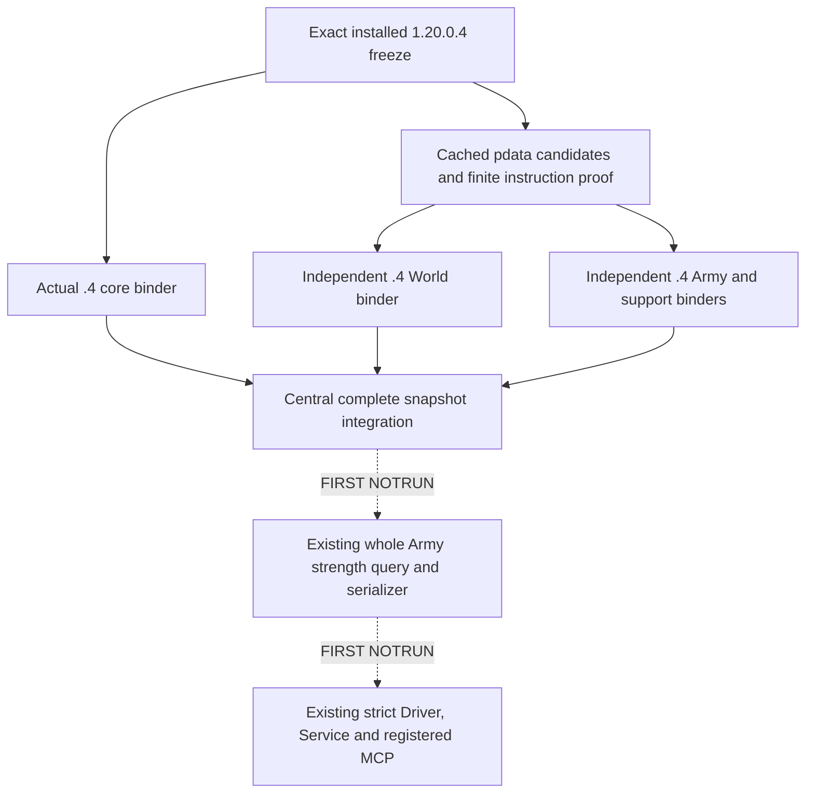

# Army and World migration to CK3 1.20.0.4

The installed Steam build 25734779 has native version text `1.20.0.4` and
EXE SHA-256 `98702f88a547cde2eaf29a85f93b85f68ee4cf8148336a4f7afaeb75319dd518`.
Both `.text` and `.rdata` changed. This migration uses independent `.4` address
binders and the existing software DTOs and readers; it does not pass an old
build hash to an old image binder.

The implementation starts from adopted source
`caa4adc3d1278e324cf4ec19774028e9b9138e28`. The existing partial core observation
is separate from a complete gameplay snapshot. Army strength queries currently
call the complete snapshot reader first. The central entry owner will connect
the migrated resource, relationship, event and World families before enabling
that complete `.4` snapshot path.

## Closed World source

| Native entry | Old `.3` RVA | Actual `.4` RVA | Complete body bytes |
| --- | --- | --- | --- |
| War participant predicate | `2494B60` | `2494B40` | 130 |
| Attacker-relative war score | `249AC40` | `249AC20` | 429 |
| Character capital | `28B1CD0` | `28B1CB0` | 187 |
| Default raise Province selector | `24A51B0` | `24A5190` | 912 |

The cached `.pdata` ordinal selects each candidate; actual complete instruction
bytes, preserved member operands, local control flow and ordered relative/RIP
edges establish these mappings. No global RVA shift is inferred. The actual
War storage constructor `2A83C40` to `2A83C20` preserves the RIP references to
registry slot `5D1DE58`, including its pointer publication store.

The World packet also records actual use operands for `GameData+2EBE0`, manager
storage `+20`, War ID `+8`, sides `+20/+80`, CB `+100`, start date `+E0`, targets
`+270/+278/+27C`, leaders `+288/+28C`, claimant `+290` and ended byte `+358`.
Participant ID `+8` comes from the actual callback operand selected by the
participant predicate's RIP reference. The complete 1,328-byte native War
registry iterator preserves the storage indexing operands; the participant
constructor preserves the capacity/count qword at side header +10/+14.
The two-build finite reads for this
packet total 7,354 bytes in 52 calls; whole EXE reads, hashes, PE reparses,
builds, tests, game and SDK operations are zero.

The original 18-byte claimant witness truncated its second instruction. That
partial receipt remains preserved. Only its missing three bytes per build were
read to complete the 21-byte witness; the captured prefix was reused.

Evidence: [World profile source packet](Z:/ck3_mod_rewrite_process_assets/g2-background-20261007/upstream-build-migration/army-family-12004/world-mapping/WORLD-PROFILE-SOURCE-CLOSED.json),
[central core slot proof](Z:/ck3_mod_rewrite_process_assets/g2-background-20261007/upstream-build-migration/core-global-slots/CORE-GLOBAL-MAP.json),
[global build delta](Z:/ck3_mod_rewrite_process_assets/g2-background-20261007/upstream-build-migration/global-pe-diff/COMPACT-PE-DIFF-SUMMARY.json).

## Integration and readiness

World is source closed and implemented. Native compilation, new fixture,
complete `.4` snapshot, paused query and live qualification are NOTRUN here.
Army/roster/commander/supply bindings are now source closed and implemented.
Shared adapter/full snapshot/commander mailbox integration belongs to the entry owner. Missing source fields go to the finite mapper with their
actual producer and consumer; a disabled or null field does not close migration.

The separately qualified version-independent MCP compact-result change already
preserves the full structured Army payload. It is not rerun for this migration
and does not provide new-build gameplay or measured production speedup credit.

## Preserved Army query inputs

The independent Army binder selects the actual .4 Unit/Army/ArRg registries,
Unit state D19140, current soldiers 2A95720 and maximum soldiers 24E0430.
Existing software readers retain full IDs, backlink checks, duplicate roster
occurrences, signed counts, supply, movement, replenishment, monthly/daily
inputs and the established nested DTOs. No old image binder is called.

Current detachment, pending-date update and combat role/phase bindings use
actual source-use proofs. Canonical pending vtable44DEFB8 points to callback
8863D0. Pending empty storage5D68BA0 is selected by the complete93-byte
helper2A9E7D0. Roles use the CombatManager secondary vtable477F188; this is
separate from CCombat identity. Side roster/capacity/count/parent operands
retain +10/+18/+1C/+B8.

Direct owned Regi inventory stays on the existing first player army row.
Character+1C0 supplies military+108 full-ID enumeration. Persistent identity,
type+118, capacity+128, owner+12C and all7 physical chunks are preserved.
The two missing chunk operands required only7 new bytes: signed ordinal+C
at2A932C1 and pending byte+14 at2A931A5. The native writer is a layout witness,
never an observer callback. GDbo key18/length28/capacity30/inline branch/tag38
reuse already closed law and CB constructor evidence. Signed MaA tier2A0
is supplied by the Province owner.

The actual supply-loss consumer loads county-entry minimum from5C68C64.
The old .3 binding constant5C68B64 disagreed with the native RIP operand.
Only the new binder uses the actual slot; historical .3 source is retained.

Evidence: [Army current ledger](../../ck3_autonomous_player/native_bridge/research/ck3_1_20_0_4_army_world.json),
[Army support ledger](../../ck3_autonomous_player/native_bridge/research/ck3_1_20_0_4_army_support.json),
[shared roster proof](Z:/ck3_mod_rewrite_process_assets/g2-background-20261007/upstream-build-migration/army-family-12004/shared-roster-layout/SHARED-ROSTER-LAYOUT-CLOSURE.json).

## One fresh producer and consumer

New target xar_ck3_12004_army_family_test takes one positional fresh output
directory. It creates four whole command results through production
ReadArmyStrengthsForScope12004 and AppendArmyStrengthV1, with fixture-owned
objects and callbacks. It does not transplant bodies or execute native EXE
addresses. It checks actual .4 Army/World binder selection without invoking
those addresses.

Scenes zero/negative/positive/unavailable use sequences1..4 and current
landing days0/-1/34/null; the last leaf reason is disembark_getter_not_bound.
Each scene retains the five-key native result and duplicated two-regiment
roster. Build metadata remains outside the result body.

One new compound passes the complete compiled frames through the actual
native driver, Service, registered ck3_execute_step Army route and direct
Army tool. It checks complete structured SDK roundtrip, compact text,
signed values and the source-bound current landing projection. Only nonce
correlation and a paused enclosing snapshot/capability frame are synthetic.
The disembark owner's actual .4 Python guard is an integration dependency.

The producer and consumer are FIRST NOTRUN. Root owns first build/execution,
receipts and any paused game query. This source package adds0 game actions
and0 game days; it grants no production-live readiness. Existing DTO names
and source labels remain stable; executable identity/native addresses are4.

[Exact first-run recipe](Z:/ck3_mod_rewrite_process_assets/g2-background-20261007/upstream-build-migration/army-family-12004/FIRST-PRODUCER-CONSUMER-RECIPE.json)
records target registration, outputs, sole method and complete argv.
