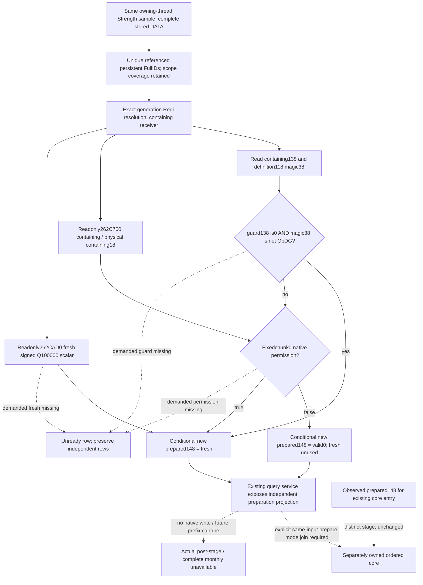

# Current fixed physical chunk0 preparation inputs, CK3 1.20.0.3

2026-10-06 /2026-W41. The [ordered regular-refill source plan](army-ordered-regular-refill-projection-plan-12003.md) distinguishes preparation entry from observed-prepared core entry. This package supplies real same-query inputs and a bounded pure preparation result for the former. It does not replace the latter's observed cache or replay manager occurrences. Frozen exact1.20.0.3 /Steam25652598 /EXE SHA`94b55397abb687a3dcd436805a5d885e6be90fa6c693feb44a9e3bbeeade02a6` is reused; new EXE reads/hashes0.

Source-first packet: `Z:/ck3_mod_rewrite_process_assets/g2-background-round15-20261006/fixed-chunk0-preparation/`, including `SOURCE-FIRST-PLAN.md`, Mermaid and subsequent `OWN-HOOKS-PLAN.md` before collector/model edits. Isolated sparse C base`aff6d9f2165e7cd54af079b599f0a5953e3ca51f`; old Z and fleet implementation trees are preserved.

## Native source and receiver identity

Closed `262C6A0` is a **writer**, so the observer never calls it. Its containing-persistent `+138==0` and definition `[persistent+118]+38 !=0x4744624F` guard bypasses permission and writes fresh fraction to `+148`. Otherwise it asks `262C700(persistent,persistent+18)`: false writes0, true writes fresh fraction. Every ordinary return writes the cache. This exact guard/store closure reuses the manager source owner's `round13/monthly-manager-prepared-order/ROOT-DELIVERY.json`, SHA`33a4cfd149ba89e500901e0d4e3463bdd0050f63ed833abdcb7cc90d10a7ffc2`; the [replenishment topic](army-regiment-replenishment-raised-reserve-12003.md) retains the distinct fresh/current permission ABI.

Held nativeABI SHA`8b2848041af660d158ccea8fe51119d355d2f3a5785df9e3235357eb0c1f4fad` provides `262C700[262C700,262C9C5)`709B, SHA`20ae05a8718b305c840b368f68cfe3119c0eda673b07ee7fe61f15885ada5673`, and `262CAD0[262CAD0,262CB55)`133B, SHA`4df011548bcfba3c0afe382571a44dfdff7647dade9206f09e1ccb96a7a12712`. Their existing exact.3 `ArmyBindings.can_regiment_replenish` and `get_regiment_monthly_replenishment_fraction` are reused unchanged. The ten-function ABI file does not contain a `262C6A0` function row; do not attribute that prepare body to the two getter pins. An initial cached-index print was too broad and truncated; its corrected retained excerpt contains only these two needed ABI rows, with no new executable read or ABI capture.

Three identities stay distinct: containing persistent; fixed **physical chunk0 at containing+18**; arbitrary DATA-selected chunk. Current completeDATA records already publish a fresh whole-persistent scalar and a permission for their selected chunk. They establish useful receivers and references, but an arbitrary chunk's permission cannot replace the fixed physicalchunk0 call. The ordered core observer's rawchunk`+8` resolved owner guard is for cleanup and need not be the containing preparation guard. Independent `2657F10` must not be manually ANDed into `262C700` or ordinary prepare bypass.

## Observable same-query contract

New optional Strength leaf **`fixed_chunk0_preparation_inputs_v1`** is sampled after its existing completeDATA capture by a dedicated `ck3_12003_fixed_chunk0_preparation.cpp` TU. It generation-resolves unique persistent FullIDs from those stored DATA references using the existing registry layout, preserving first-reference order. Deduplication is only for physical input capture; it does not discard manager execution occurrences. Legal complete count0 yields an available empty list. An unreadable count/header leaves `referenced_persistent_ids_complete=false`; unresolved persistent identities retain individual unavailable rows.

The family declares `source=native_scoped_fixed_chunk0_preparation_inputs`, `entry_kind=current_frozen_context_preparation`, subject public Army/CArmy IDs, complete-reference coverage, status/ready/reason and `persistent_regiments[]`. Each persistent row publishes fullID, physical `fixed_chunk_index=0`, signed containing`+138`, unsigned definition magic DWORD`+38`, independent `native_fixed_chunk0_can_replenish`, fresh signed64 fraction/scale100000 and observation status/ready/reason. Existing callbacks are read-only; absent binding/unresolved receiver/failed fraction read is null, while nativefalse and raw0 remain valid read values. No new adapter binding is required. `262C6A0`, setters and `+148` writes are never invoked.

The own DTO/header and serializer are integrated by minimal additive Strength hooks. Dedicated Python strict contract accepts old absence asNone, exact row/family shapes and widths, current entry kind, subject identity and scale. Observation `ready` means complete publication of all four operands; it is separate from branch-local calculation readiness. No whole V2/base native readiness is changed.

## Pure result and practical consumer

Existing production **`query_army_strengths`** now returns **`same_input_conditional_fixed_chunk0_preparation_v1`** from the normalized same-query leaf. Each persistent result carries the input operands, observation completeness, `preparation_branch`, `preparation_ready`, **`conditional_prepared_fraction_raw`**, scale and exact missing inputs. Bypass consumes fresh even when native fixed permission isfalse. Nonzero guard, or known special magic, establishes the permission branch without demanding the other unused guard operand. False permission closes0 even when fresh is missing; true requires fresh and retains signed negatives without clamping. Unknown demanded fixed permission is not filled from an arbitrary DATA chunk or observed prepared cache.

All result flags `actual_preparation`, `cache_write` and `full_ordered_regular_refill` remainfalse. The original completeDATA observations, including held `persistent_prepared_replenishment_fraction_raw`, remain unchanged. The independently owned core continues to consume its actual observed prepared cache unless an explicit preparation-entry mode supplies this new per-persistent result. That later join must use matching same-query scope and context, retain the owner's ordered persistent execution roster and full7 physical map, and name the changed entry. This package does not silently overwrite current core inputs.

The nonphysical environment and current preparation-entry context are held fixed. This is a current numerical prepare candidate, not a guarantee of what the next calendar/monthly prefix will capture after other game changes. Full manager coverage, prefix updates, core apply/cleanup/refresh and post-stage observations retain their own contracts.

## First qualification and next native boundary

**FIRST Python production-contract/service compound GREEN1/1**, six route cases, completed **2026-10-06T12:53:36.035799+08:00**, process **2.9579572s**, unittest **0.038s**. It proves ordinary bypass prepares10000 despite native fixedfalse/chunkfalse and observed cache0; special denied permission prepares0 with freshNone; true permission retains−3456; missing fixed permission stays unready despite an observed chunk1 permissiontrue while a separate persistent remains ready0; nonzero guard/null definition/falsepermission closes0; old absence isNone/unready and complete empty DATA isready with no dummy persistent. Full actual service outputs SHA`f934bd25107be06d71d56eb41fca4174d9948ba40a9eb7410ff6c14748a5e82e` are sealed with the receipt. Only existing fixture builders were imported; no old test method was run.

New native fixture source and six emitted-wire recipe are delivered for **Root's next centralized qualification**, not executed here. It exercises the real collector and whole Strength serializer, duplicate DATA reference capture, fixed physicalchunk0 argument, signed and zero fractions, receiver failure, valid empty scope, and unchanged cache148. No CMake/CI build-list edits are made here; Root adds the new TU to the DLL, fixture target and known actual-army route CI. First compiled-wire consumer is prepared externally and must wait for Root's fresh build/CTest authorization; no old wire is consumed.

Current status: **Python contract/service static-ready; native observer candidate awaiting centralized native qualification**. New EXE bytes/hashes0; native builds/tests0; old cases/wires0; local CK3/Steam/process/SDK/pipe/input operations0; child push0. Oct6/W41 delivery fields and shared-report integration belong to Root. Native qualification, then the explicit prepare-mode join into the separately owned scoped ordered core, are the remaining concrete steps; actual future calendar, full-monthly and live/OODA readiness are unchanged.
