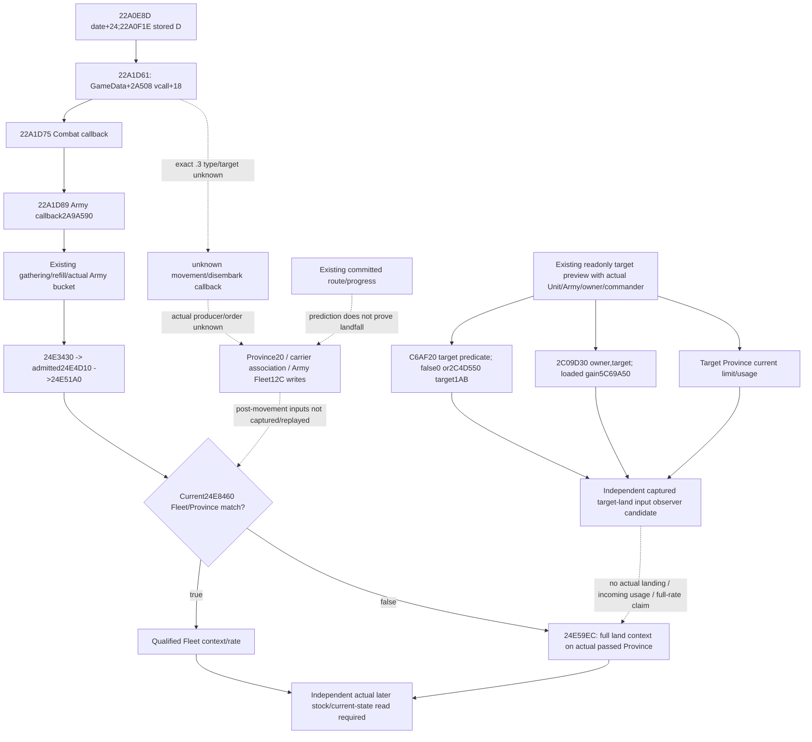

# Fleet disembark to land supply transition, exact CK3 1.20.0.3

2026-10-06 / ISO2026-W41. This cache-only source study follows [fleet supply rate](army-fleet-supply-rate-inputs-12003.md), [land rate inputs](army-land-supply-rate-inputs-12003.md) and [actual Army update order](army-monthly-update-order-12003.md). Frozen CK3 **1.20.0.3 / Steam25652598**, reused EXE SHA `94B55397ABB687A3DCD436805A5D885E6BE90FA6C693FEB44A9E3BBEEADE02A6`. Actual disembark source is **research / source-partial**. An independently source-closed target-input observer candidate is prepared below, **FIRST NOTRUN**; neither part adds numerical qualification, game calls or game days.

The decision need is concrete: a current Fleet rate0, or an explicitly fixed-context next-admitted-day Fleet rate, does not determine the land supply context after an actual landing. Move/continue/leave decisions need the selected landing Province's actual land inputs and the native source that changes the Province/Fleet association. The current Fleet Boolean/date raw family has already passed its independent FIRST; it is reused without a rerun or duplicate observer.

## Existing branch boundary

The complete current rate caller `24E51A0 [24E51A0,24E5FFA)`,3674B, archived SHA `2df6ea7faf0de9aa16969bb85bc040c558f161e911c06010e883e0463278ef36`, invokes the already closed `24E8460` Fleet predicate. That predicate resolves `Army+12C`, requires Fleet tag/fullID validity, resolves `Army+124` and `Fleet+18` public Units, then compares the actual Province full IDs at their `+20` pointers. A non−1 Fleet ID alone does not select the Fleet branch. False branches to **`24E59EC`**, which uses the Province actually passed at that rate stage.

Existing `current_land_resupply_v1.native_land_branch_applicable`, `current_land_supply_rate_inputs_v1` and `current_fleet_supply_tick_inputs_v1` supply the present branch observation. The full Fleet rate and land/resupply arithmetic retain their prior qualification. They neither locate the landfall commit nor observe its actual future result.

## Exact daily handoff locator

The existing exact `.3` daily date body `[22A0D80,22A232D)`,5549B, archived SHA `a6c98746b9272fb80168bcf3ea6ba34a5ddc3ddaf50a3cf54de12cf3712068e5`, first admits raw date+24 at `22A0E8D` and refreshes stored day D at `22A0F1E`. Its later consecutive callback sequence is:

| Actual callsite | Actual receiver and call | Source boundary |
| --- | --- | --- |
| `22A1D61` | Load GameData at `22A1D50`; add `2A508` at `22A1D57`; load its vptr at `22A1D5E`; invoke **`[vptr+18]`** | Exact call and order are closed. Exact `.3` type/vtable/target are **unknown**. |
| `22A1D75` | `GameData+2E9D8`, virtual+18 | Existing CCombatManager secondary interface; `477F178+18 -> 2AD8000`. |
| `22A1D89` | `GameData+2A548`, virtual+18 | Existing CArmyManager secondary interface; `477C2E0+18 -> 2A9A590`. |

This is a real callback-order locator after date admission. It does not yet prove that the first callback performs movement or disembarkation. The independent [later removal topic](army-later-removal-drain-stage-inputs-12003.md) also contains a Unit/context call `2AD6910(GameData+2A500, fresh Army+124)`. That establishes a primary-receiver locator at `+2A500`; the daily call uses `+2A508`. Its removal gameplay body was not expanded here, and `2AD6910` is not relabeled as a landing entry.

If the actual selected landfall writes are subsequently proven to occur in the first callback, Army supply later that same admitted date will read the resulting current Province/association. That is presently a **conditional implication**. Exact movement admission, Province insertion, Fleet unlink/mismatch and intervening changes still need their actual source. A rounded ETA or action ACK cannot close those edges.

## Inputs that unlock a useful supply decision

| Operand | Reuse | Remaining need |
| --- | --- | --- |
| Current Fleet/land verdict | Existing land and Fleet raw families | No new current Boolean. |
| Continued Fleet scalar/date gate | Completed Fleet FIRST/static-ready | Actual landing changes the context; do not carry this scalar into land. |
| Committed edge and remaining route | Existing progress, speed, native duration and committed timeline | Actual selected landing-edge classification and commit admission. |
| Selected target limit/usage | Existing Province supply preview for captured owner/commander | Target Province1AB predicate/value and native owner-versus-target resupply verdict. Current land-only collection returns `not_land` at sea. |
| Commander1A9 and floor/max | Fleet inputs can retain these same-capture operands; land input on land | Reuse; no duplicate commander family. |
| Target usage after incoming army | Existing current Province contributor machinery | Actual insertion/order and source-bound incoming contribution; captured target usage is not an observed after-stage total. |
| Army supply dispatch opportunity | Existing actual pointer-matched bucket, stored D, dates and loaded grace | Preserve independent future admission/earlier-stage boundaries owned by other work packages. |
| Actual landing result | A later independent paused strengths/route frame | No new live frame consumed here. |

The minimum useful numerical scenario can use explicitly captured **target-land inputs** independently of full future callback replay. It must preserve original current observations, allow valid0/false, retain missing demanded operands as null/unready, and leave actual-after/full-daily/full-monthly/live flags false. The additive input observer candidate below publishes the two missing current target operands. A full numerical scenario and pure/counter-policy kernel remain unimplemented.

## Independently prepared target numerical input observer

The existing readonly public entrance is `ck3_execute_step(step=preview-move-army-{army_id}-to-{province_id},expected_revision=<fresh>)`, formatted by `war_contract.preview_move_army_step`. It already returns `route_preview.province_supply` for an available exact `.3` move preview. This is an existing preview path, not a new MCP method. Its native `ReadArmyProvinceSupplyForPreview` resolves public Unit, internal Army and backlink, actual owner, actual commander/native fallback and each selected Province before reading current and target limit/usage. Those contexts are sufficient for the two closed readonly land-source getters; no missing Army/owner argument requires a larger query scope.

The prepared additive field is **`route_preview.province_supply.target.captured_target_land_supply_inputs_v1`**. Current Province supply rows and old preview fields remain independent. It calls the existing `C6AF20(targetProvince)` predicate; false publishes component0 without requiring the numeric reader, while true calls `2C4D550(&out,targetProvince+30,1AB,null,100000,0)`. It separately invokes `2C09D30(actualOwner,targetProvince)` and retains the actual loaded signed raw gain from `5C69A50` when that slot is readable. These are actual current target-context numerical observations, without asserting that the subject is on land, that the target is reached, or that a supply update ran.

The DTO carries actual Unit/Army/owner/target IDs, `input_basis=captured_owner_and_target_province`, scale100000, independent component/resupply observation readiness and reasons, the actual component applicability/value, the native resupply Boolean and nullable loaded gain. `current_inputs_ready` means the two requested target observations are ready; it does not mean a full target rate. A missing optional loaded gain does not erase a real native resupply true/false. A later rate consumer must independently require that gain on a branch that uses it. The component may remain ready when the resupply callback is absent, and the resupply Boolean may remain ready when numeric component output is unavailable.

All binding types and slots reuse existing exact `.3` land/resupply bindings. The header-only collector does not call the current Fleet predicate, force a native land Boolean, invoke `24E6000`, or perform a movement/stock mutation. The version-neutral DTO has default equality for existing snapshot/preview comparisons. Four source leaves and four shared hook files are prepared externally; no new ABI, capability, MCP, native TU or CMake target is introduced by the observer source itself.

The actual production preview serializer emits the sibling only when collected. The prepared native-driver hook uses a strict exact-key/width/readiness/reason normalizer for that new sibling and joins its IDs to the existing requested preview and target row. It preserves old preview shape when the sibling is absent and leaves old limit/usage/status/readiness values unchanged. This hook remains source-only; no project imports or functional checks were executed.

The native Mermaid above separates this target-input path from the unknown actual movement/disembark branch. The target observer reuses a **closed readonly numerical ABI**; it does not close `22A1D61`'s target or a future landfall producer. [Target source delivery and adoption manifest](Z:/ck3_mod_rewrite_process_assets/g2-parallel-20261006/army-supply-tick/followups/fleet-disembark/TARGET-INPUTS-DELIVERY.json) enumerate source files, shared patch, existing method/response and a new-only whole-preview/real-driver-Service FIRST plan. All cases remain **NOTRUN**. No full rate, incoming contribution, numerical projection or policy is added.

## Finite continuation

External package: [fleet-disembark source delivery](Z:/ck3_mod_rewrite_process_assets/g2-parallel-20261006/army-supply-tick/followups/fleet-disembark/ROOT-DELIVERY.json), with [field accounting](Z:/ck3_mod_rewrite_process_assets/g2-parallel-20261006/army-supply-tick/followups/fleet-disembark/NATIVE-SOURCE-ACCOUNTING.md), [native graph](Z:/ck3_mod_rewrite_process_assets/g2-parallel-20261006/army-supply-tick/followups/fleet-disembark/NATIVE-TREE.mmd) and [finite metadata/body plan](Z:/ck3_mod_rewrite_process_assets/g2-parallel-20261006/army-supply-tick/followups/fleet-disembark/FINITE-METADATA-BODY-PLAN.json).

The next input is one already-held exact `.3` constructor/RTTI/vtable record identifying `GameData+2A508` virtual+18. There is no cached selected target yet. The plan therefore selects no guessed body. The repository's historical `actual_contact_scope_v1_abi.json` declares **1.19.0.6**; its UnitManager/movement/commit RVAs remain old-version locator hints and receive no `.3` credit.

If no exact cache locator exists, the optional fallback is **Root-owned paused metadata**, at most80B for the actual vptr, slot target, COL and selected type name. This is a new dependency and plan only; **it is not a game call authorized or executed by this task**. After Root supplies a real target, reuse the held PE map, read only selected pdata/unwind metadata up to344B, then deliver the actual finite code interval before an at-most1024B first fragment. Do not scan the image, hash the EXE, read arbitrary neighboring vtables or expand pending/detachment/current31 work.

All new methods are **NOTRUN**. Actual counters: new EXE bytes/seeks/hash0, project imports/tests/build0, game/process/SDK/pipe/Steam/UI0, Git/main-tree writes0, old fixture replay0, new days0. Standard-library text preparation generated the external patch only. The readiness delta is an exact callback-order locator, finite disembark construction entrance and source-prepared independent target input observer; its native/consumer FIRST, actual landing writer, fixture/live, complete daily/monthly and complete OODA remain unqualified. [Oct6/W41 report fields](Z:/ck3_mod_rewrite_process_assets/g2-parallel-20261006/army-supply-tick/followups/fleet-disembark/OCT6-W41-FIELDS.json) preserve these limits for the parent report.
