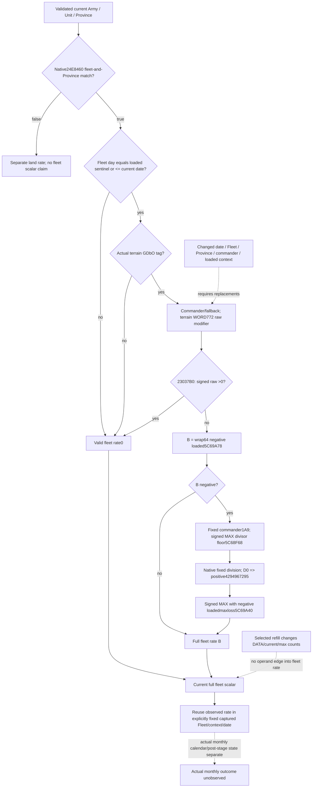

# Fleet supply-rate branch, exact CK3 1.20.0.3

2026-10-06 / ISO2026-W41. This source-first continuation of [full land rate inputs](army-land-supply-rate-inputs-12003.md) closes the fleet scalar and a smaller immediately usable fixed-context entrance. Frozen CK3 1.20.0.3 / Steam25652598 / EXE SHA-256 `94B55397ABB687A3DCD436805A5D885E6BE90FA6C693FEB44A9E3BBEEADE02A6` is reused. Packet: `Z:/ck3_mod_rewrite_process_assets/g2-background-round12-20261006/fleet-supply-rate-source/`. This package changes no provider, strategy or runtime and executes no test/build/game/process/SDK/pipe operation.

## Actual source and branch gates

The complete held caller **`24E51A0 [24E51A0,24E5FFA)`**,3674B, SHA `2df6ea7faf0de9aa16969bb85bc040c558f161e911c06010e883e0463278ef36`, is reused from `g2-resume-20261003/army-supply-attrition/native-tree/supply-change-next/function-24e51a0.txt`. Its null-detail ABI is `int64_t* fn(CArmy*,int64_t* out,CProvince*,nullptr)`. A matching current Province is already validated by Strength. Native bad Prov magic would return0 at24E51E0..51F3; an unreadable required observation is not inferred to have taken that branch.

At **24E5383** the caller invokes **24E8460**. Its complete existing256B source, SHA `4c6cc9e823d3c9a55de0cf713e676323217423299f48278d5e88956aafd18047`, is separately closed and reused from the [monthly budget topic](army-attrition-soldier-writeback-12003.md). It generation-resolves Army+12C through storage5D1F9B8/fallback5D1F9A8; requires the Fleet tag466C6574 at+14 and fullID+10!=-1; resolves Army+124 and Fleet+18 Unit IDs and compares their actual current Province fullIDs. This native verdict is not equivalent to an embarked UI label or a non−1 Fleet ID. False branches to the land calculation at24E59EC. True enters the following fleet path.

1. **Date admission,24E5390..53F4.** Resolve the same Army+12C record with fullID+10 and native fallback. Read signed32 day+20. If it equals loaded signed32 sentinel**5C83A68**, proceed. Otherwise proceed only when day is signed`<=` current GameState date low32 at **QWORD[5C68C50]+8**. A later day returns observed rate0 immediately at24E53E7..53EF. Equality is admitted; no elapsed-day scaling occurs here.
2. **Terrain gate,24E53F4..5417.** Current Province+20→definition+ B8 gives the actual terrain definition. DWORDterrain+38 must equal4744624F (`GDbO`); otherwise jump to the valid0 fleet result. This gate does not inspect land usage or a guessed sea-terrain label.
3. **Commander terrain modifier,24E5417..5480.** Resolve Army+120 through Character store5C67568, fullID+18, otherwise native fallback5C67570. `28C3AE0(actual_character)` returns its effective aggregator. Pass **aggregator+68** and zeroextended **WORDterrain+772** to **23037B0** at24E5479. True jumps to the valid0 result before loading base loss.

The last predicate's terminal was genuinely missing from the held cache. Its old256B `function-02303700.json` covered2303700..2303800 and retained78 complete instruction bytes from23037B0. One planned64B continuation at **23037FE..230383E** closes the entire **130B leaf `[23037B0,2303832)`**, retaining12 padding bytes. The first2B recover an instruction crossing the old disassembler boundary; unique new byte coverage is62B. No header/pdata or whole-image/hash scan was needed.

**23037B0 tests positive numeric value, not key presence.** WORDFFFF returnsfalse. It performs an unsigned lower-bound search over WORD keys at component+0/count+C; an absent key or invalid index returnsfalse. A matched key reads its associated signed64 value from component+68, compares it with0 at **2303824**, and uses **SETG AL at2303829**. Thus zero or negative values returnfalse even when a key exists; a positive value suppresses fleet loss. The provisional cache-prefix membership interpretation is superseded. The existing numeric reader **2303700** supplies the same raw value, with absent/FFFF→native0; it can be reused with terrain772 and `raw>0` without adding a flag binding. No unrelated modifier/helper was expanded.

## Complete null-detail numeric formula

After those gates, load actual signed64 Q100000 loss parameter **5C69A78** at24E5486 and set `B=wrap64(-loaded_fleet_loss_raw)`. Nonnegative B returnsunchanged. If B isnegative, the inline **24E5579..571A** adjustment resolves the actual commander/fallback again and reads fixed ordinal**1A9** from its generic aggregator. Missing1A9 is native0. Let Q=100000, M=this signed raw value, and:

`D = signed_max(loaded_divisor_floor_raw, wrap64(Q+M))`, using slot **5C68F68** at24E5635 and signedCMOVL at24E563F.

For nonzero D, retain the same three fixed-division paths as the held land arithmetic: inclusive B range±53E2D6238DA3 uses wrapped`B*Q` followed by trunc0 division; otherwise signed wrapped abs(D)>=Q² uses`trunc0(B/trunc0(D/Q))`; the remaining path decomposes B into trunc0 quotient/remainder byQ, preserving intermediate signed64 wraps. **Fleet D==0 is distinct:** `MOV EDI,FFFFFFFF` at **24E5666** zeroextends RDI to **positive4294967295**, not signed−1. A future fleet kernel must preserve that exact instruction and cannot reuse the existing land zero-divisor wrapper unchanged.

Finally select **`rate = signed_max(divided_B,wrap64(-loaded_max_loss_raw))`**, slot **5C69A40** at24E5709. With null details,24E571D jumps to24E592E, which copies the numeric result intoRBX;24E59DD..59E4 writes RBX to the caller's output. This path does not call24E6000, does not add a land resupply gain and does not require Province usage/limit. Nonnull detail-formatting branches are not invoked or promoted as numeric prerequisites.

## Immediate fixed-context numerical value

**No new native leaf is required for selected refill's fleet rate.** Unlike the land branch, this source never reads ArRg current/max, province contributor usage/limit, resupply eligibility or supply stock. The selected model changes physical refill/current/max/counts while explicitly retaining its captured Fleet/date/Province/commander/loaded context. Its full fleet scalar is therefore the already observed **`current_supply_change_monthly_raw`**, including nonzero, zero or positive values; selected refill does not recompute it from land usage. Stock/capacity, post-stock budgets and four loss passes still use the separately derived post-refill counts and DATA.

Current `current_land_resupply_v1.native_land_branch_applicable == false` or its same-query `current_land_supply_rate_inputs_v1` counterpart identifies this actual native fleet branch. Status `not_land` does not mean unavailable fleet rate. The existing monthly budget's `native_fleet_supply_loss_suppressed` additionally publishes the exact fleet/day/sentinel suppression result. For a known fleet branch, false means the frozen-current date gate is admitted. It is not needed to infer a rate when the full native scalar itself is available, and must not become an extra gate for a known scalar. No player/owner label, public unit-state enum, another query or a guessed terrain flag substitutes for actual branch provenance.

The smallest service implementation entrance is an independent **selected full-supply-rate mode/source** in the existing selected monthly assembly. Land mode continues to consume its existing conditional usage/full-land-rate result. Fleet mode consumes the same-row native current monthly scalar with a basis such as `observed_current_fleet_rate_fixed_context`; missing raw remainsnull/partial, while raw0 isready. Preserve the original land result as `not_land`; do not rewrite it into a fleet observation. The private derived monthly frame can then pass this fleet scalar with refreshed counts/DATA to the existing stock, budget and writer kernels. All actual-after/full-monthly flags remainfalse/null.

This reuse holds only for the explicit fixed captured context/date. It does not forecast embark admission on a later day, route/terrain changes, a different commander or loaded parameter changes. A positive terrain modifier's zero result is valid, but the current wire does not publish terrain772 raw or its reason; a fixture may test the observed zero scalar without claiming an independently observed positive-terrain predicate. No new Boolean is invented.

## Minimum changed-context collector entrance

For a later explicitly replaced fleet context, proposed optional `current_fleet_supply_rate_inputs_v1` must publish real operands, not a permanently null family: actual native branch verdict; existing fleet/date suppression or raw Fleet/day/sentinel/current-date provenance for changed-date calculations; actual terrain validity and WORD772; commander raw/resolved FullID and native-fallback provenance; generic terrain772 signed raw; actual loaded5C69A78 fleet loss; fixed1A9 signed raw; floor/maxloss. Reuse existing24E8460, Character/fleet resolver,28C3AE0/2303700 and existing loaded slots. `current_land_supply_rate_inputs_v1` already reads floor/maxloss **before** its `not_land` return, but fixed1A9 is behind the land branch and absent for fleet. Budget's current terrain ordinal770/raw is a different input and cannot stand in for772.

Branch-local observation preserves valid0 without demanding unused later inputs: future Fleet day returns0 before terrain/commander; invalid terrain returns0 before base loss; positive terrain772 raw returns0 before base loss; nonnegative B returns B without requiring negative adjustment1A9. Failed reads remain unavailable for their demanded branch. These are actual source short circuits, not additional policy limits. This source-only package implements neither collector nor changed-context kernel.

## Receipt, cost and boundaries

`SOURCE-PLAN.json` precedes cached fleet inspection; `MEMBERSHIP-TAIL-READ-PLAN.json` precedes its sole missing direct leaf read. Byte receipt, combined source, cached/published-field excerpts, helper note, minimum contract and Oct6/W41 fields are sealed externally. New static image cost: **64B /1 seek**, code only, **62B unique plus2B boundary recovery**. Existing fullfleet predicate/caller pins and all other native bytes are reused. A cached-field printing attempt hit GBK encoding after its receipt had been completely written; only that existing receipt was printed with UTF-8, with no source reread. This harness output failure is retained in `ATTEMPTS.json` and is not a capability RED.

Readiness is **research/source-closed fleet numerical branch and fixed-context reuse contract**. Existing current monthly rate is already a published observation; this package supplies no new runtime qualification. The smallest next useful implementation is the selected monthly assembly's explicit fleet-rate mode, followed by one new production compound, without rerunning old land/monthly cases. Actual stock/capacity application remains one successful native update, not elapsed-day division or a guaranteed calendar month; preparation/scheduling and actual post-stage observation retain their separate contracts. Root owns that implementation's authorization/integration, centralized native checks, shared reports and push.
