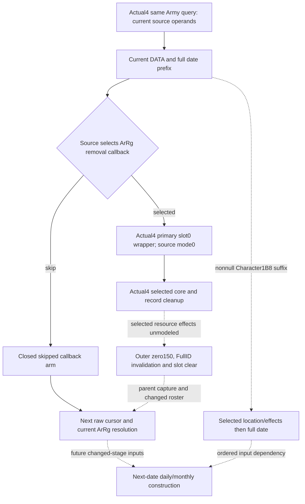

# Army future date input construction — CK3 1.20.0.4

This work starts from source `23c3c4bc7fdf261f46174d35db12732808523463` on
2026-10-07, ISO week 2026-W41. Root's installed build is CK3 **1.20.0.4**,
Steam **25734779**, EXE SHA-256
`98702f88a547cde2eaf29a85f93b85f68ee4cf8148336a4f7afaeb75319dd518`.
The pin is reused; this lane does not hash the executable or operate the game.

The existing actual4 `ck3_query_army_strengths` family binds the current whole
DATA, pre-date pending/dated, army flag, supply, replenishment and date readers.
Those standing inputs do not describe the changed state after an earlier
detachment, Character suffix or date transition. The useful next increment is
the ordered parent input graph needed to convert the standing Army snapshot
into a source-defined next-date stage. Migration validation remains Root-owned.

| Decision/input gap | Existing useful observation | Concrete construction entrance |
| --- | --- | --- |
| Next ordered ArRg visit after removal | Current raw DATA occurrences, physical chunks, mapper resolution and full `GameState+8` date | Actual4 primary `4744DB0`, slot0 `2632D90`, core `2632DD0`, reached `EBA050` loop and selected parent mode0 are source-closed. Commit `bbd06d13` adds real current callback targets/allocator descriptors and a conditional header result. Actual resource effects and coherent changed-stage replay remain separate. |
| Actual ArRg store admission and removal indexes | Current incoming full IDs and actual4 registry slot binding | Complete direct method `2A9E620..2A9E732` now closes store48 / unsigned count2C / slot16+8 / fullID10 skip/admit and direct invalidation sequence. A separate same-query current store frame is being authored; source-selected zero150 and post-callback state remain explicitly unknown. |
| Nonempty Character suffix before date | ArRg148, actual Character generation/fallback selection, Character1B8 presence/identity | Actual complete wrapper `28CBE50..28CC059` now matches old521B source, closing direct extensionF8/QWORD100 reset, reached origin`28B1820`, mutator`28B2710` and known date`2C54320` roles. Getter/mutator and post-mutator role/date inputs remain explicit dependencies. No standing role is a post-callee state. |
| Future pending consumption | Current primary130 map and distinct primary468 typed records | Keep the distinct protocols. The typed468 consumer has no held exact entrance; it cannot be fabricated from `2A92320`, `2A9FC80` or `2A9A360`. |
| Date-specific future stock and strength | Current daily/monthly dispatch, supply admission, source rates, refill/loss inputs | Continue source-specific future date eligibility and changed province/regiment inputs. The parallel supply leaf records the smallest unresolved source dependency. |

The callback branch is a real execution dependency, not an invented gate:
the native parent selects it between DATA/date effects and its following
registry invalidation. The existing store48/missing/stale-ID skip arms need no
callback effect. Already proved independent DATA-prefix readiness is retained.

Root's cached runtime tables supplied candidates before the finite reads:
old constructor `2632CD0..2632DA1` maps by ordinal132799 to
`2632CB0..2632D81` (209B); wrapper `2632DB0..2632DE4` maps by
ordinal132800 to `2632D90..2632DC4` (52B); core `2632DF0..2632E5C`
has ordinal132801 candidate `2632DD0..2632E3C` (108B).
The actual4 constructor, primary4744DB0 slot0, wrapper2632D90 and directly
reached core2632DD0 are now closed at the direct-source level by exactly377B /
four fresh reads. Subsequent approved helper93B/caller19B reads closed the
selected record algorithm and parent mode0; remaining parent255B/two reads
closed the complete direct admission/invalidation method. Total intentional
source cost at the store milestone was **744B/eight reads**. A subsequent
separately approved Character wrapper521B/one read brought cumulative selected
source cost to **1265B/nine reads**. [The Character source](army-character-detachment-suffix-12004.md)
records its direct extension reset, exact reached helper targets and fresh
post-mutator date/context boundary. [The callback source](army-ordered-detachment-callback-12004.md)
records the concrete DATA20/allocator30/tag14 footprint and actual selected
EBA050 cleanup. Its new input leaf preserves actual record targets, legal null
and signed nonpositive branches, and an independently closed no-op prefix for
known target8863D0 mode0. [The store source](army-detachment-store-admission-12004.md)
records actual source-defined skip/admit and registry writes. Ordered
post-callback replay remains separate; no allocator or CRT expansion was
performed. Root explicitly has no held actual4226F10 zeroing-role proof, so its
call arguments are not treated as completed memset effects.

The independently useful candidate now captures every subject pointer
occurrence in all30 current native supply phases, rather than stopping after
the first bucket or scanning only the current selected phase. Source proof
reuses the held actual4 dispatcher1539B. The collector, DTO, serializer, strict
normalizer and conditional projection are authored as independent files.
An unavailable phase keeps the other phases usable, and an empty bucket is a
ready zero. Each pointer position is retained, including duplicate subject
appearances and appearances in different phases. The existing current-only
clock and daily dispatch leaves are unchanged.

The projection can join separately supplied prospective native date/D pairs to
these observed slots, preserving original matching positions and callback
opportunity counts. It does not derive the .4 calendar from the historical .3
clock, reconstruct later bucket mutation or claim callback eligibility, stock,
strength or full tick execution. This removes an actual current observation
gap for selecting the next useful supply boundary.

A subsequent bounded cache-only lookup closes part of the prospective-frame
source. The already held actual `2A99DA0` pre-date prefix copies the current
full QWORD, adds`0x18` to its low DWORD, and computes local absolute-day/year/
month/day roles before passing a prospective CDate64 to actual`2A9A340` at
`2A99E71`. The local signed arithmetic uses
`signed32(currentRaw+24-43800000)/24`; it is not proof that this local quotient
is the dispatcher's separately stored `GameState+9C` D. The selected calendar
table contents and complete next QWORD are not newly read or claimed here.
The existing native clock only reads current `GameState+8` low32 and+9C; its
Python contract only validates current fields.

Root confirms the actual date-stage+9C writer/caller is **NOTHELD**. Its next
construction entrance is a named actual writer assigning+9C and its matching
date+8 RHS, followed by a separately approved finite block read once a real
locator exists. Neither `2A9A340`'s prospective-date consumer role nor a guessed
`D+1` substitutes for that writer. This source dependency is recorded in
external `future-frame-source/VALUE-ENTRY.md` and `OCT7-W41-FIELDS.json`; it
does not block normal one-day execution or change current Army readiness.

Readiness is **research / authored source NOTRUN**, with no new static-ready, fixture-live,
production-live or complete credit. Root owns builds, compiled wires, tests,
SDK queries, Robert29829's original ordinary campaign and game execution.
All new execution and game-day counts are zero.

Evidence is under
`Z:/ck3_mod_rewrite_process_assets/g2-parallel-20261007/army-future-dates-12004/`.
It reuses the historical callback package under
`g2-background-20261007/current-detachment-callback-target-inputs/`, the
`detachment-date-pending-source/next-date-pending/` parent plan and actual4
`upstream-build-migration/army-world-family/native-main/` reader proofs.
October7/W41 fields are supplied externally for Root to merge; no handoff is
being written.
