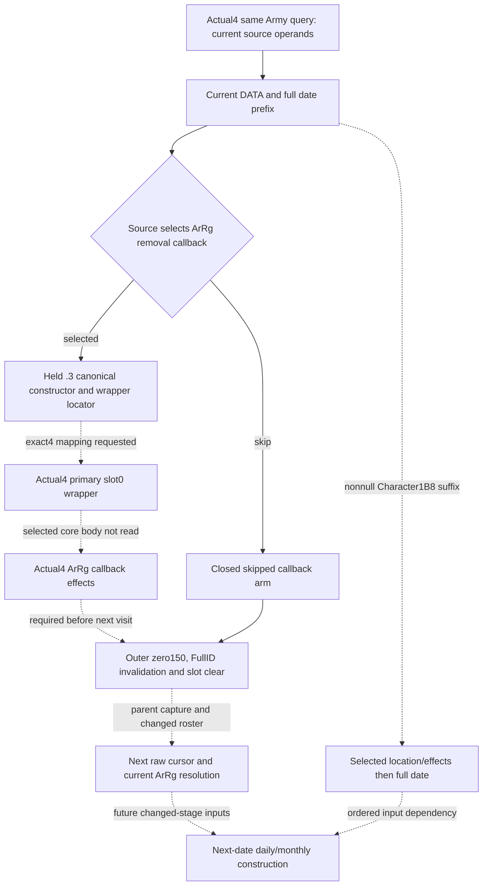

# Army future date input construction — CK3 1.20.0.4

This work starts from source `23c3c4bc7fdf261f46174d35db12732808523463` on
2026-10-07, ISO week 2026-W41. Root's installed build is CK3 **1.20.0.4**,
Steam **25734779**, EXE SHA-256
`98702f88a547cde2eaf29a85f93b85f68ee4cf8148336a4f7afaeb75319dd518`.
The pin is reused; this lane does not hash the executable or operate the game.

The existing actual4 `ck3_query_army_strengths` family binds the current whole
DATA, pre-date pending/dated, army flag, supply, replenishment and date readers.
Those standing inputs do not describe the changed state after an earlier
detachment, Character suffix or date transition. The useful next increment is
the ordered parent input graph needed to convert the standing Army snapshot
into a source-defined next-date stage. Migration validation remains Root-owned.

| Decision/input gap | Existing useful observation | Concrete construction entrance |
| --- | --- | --- |
| Next ordered ArRg visit after removal | Current raw DATA occurrences, physical chunks, mapper resolution and full `GameState+8` date | Source-selected ArRg callback must be closed before applying outer zero/invalidation and resolving the next raw cursor request. The held .3 constructor proves primary `4744DA0`, slot0 `2632DB0`, unconditional core `2632DF0`; actual4 mapping is still required. |
| Nonempty Character suffix before date | ArRg148, actual Character generation/fallback selection, Character1B8 presence/identity | Capture/source-model selected `28CBE70` writes, readonly location and actual `28B2730` continuation, then saved Unit174 owner/context and full date operands. No observed current role is a post-callee state. |
| Future pending consumption | Current primary130 map and distinct primary468 typed records | Keep the distinct protocols. The typed468 consumer has no held exact entrance; it cannot be fabricated from `2A92320`, `2A9FC80` or `2A9A360`. |
| Date-specific future stock and strength | Current daily/monthly dispatch, supply admission, source rates, refill/loss inputs | Continue source-specific future date eligibility and changed province/regiment inputs. The parallel supply leaf records the smallest unresolved source dependency. |

The callback branch is a real execution dependency, not an invented gate:
the native parent selects it between DATA/date effects and its following
registry invalidation. The existing store48/missing/stale-ID skip arms need no
callback effect. Already proved independent DATA-prefix readiness is retained.

Root's cached runtime tables supplied candidates before the finite reads:
old constructor `2632CD0..2632DA1` maps by ordinal132799 to
`2632CB0..2632D81` (209B); wrapper `2632DB0..2632DE4` maps by
ordinal132800 to `2632D90..2632DC4` (52B); core `2632DF0..2632E5C`
has ordinal132801 candidate `2632DD0..2632E3C` (108B).
The actual4 constructor, primary4744DB0 slot0, wrapper2632D90 and directly
reached core2632DD0 are now closed at the direct-source level by exactly377B /
four fresh reads. [The callback source](army-ordered-detachment-callback-12004.md)
records the concrete DATA20/allocator30/tag14 footprint and actual selected
EBA050 cleanup entrance. Record-callback effects and ordered parent replay
remain separate; no allocator or CRT expansion was performed.

The independently useful candidate now captures every subject pointer
occurrence in all30 current native supply phases, rather than stopping after
the first bucket or scanning only the current selected phase. Source proof
reuses the held actual4 dispatcher1539B. The collector, DTO, serializer, strict
normalizer and conditional projection are authored as independent files.
An unavailable phase keeps the other phases usable, and an empty bucket is a
ready zero. Each pointer position is retained, including duplicate subject
appearances and appearances in different phases. The existing current-only
clock and daily dispatch leaves are unchanged.

The projection can join separately supplied prospective native date/D pairs to
these observed slots, preserving original matching positions and callback
opportunity counts. It does not derive the .4 calendar from the historical .3
clock, reconstruct later bucket mutation or claim callback eligibility, stock,
strength or full tick execution. This removes an actual current observation
gap for selecting the next useful supply boundary.

Readiness is **research / authored source NOTRUN**, with no new static-ready, fixture-live,
production-live or complete credit. Root owns builds, compiled wires, tests,
SDK queries, Robert29829's original ordinary campaign and game execution.
All new execution and game-day counts are zero.

Evidence is under
`Z:/ck3_mod_rewrite_process_assets/g2-parallel-20261007/army-future-dates-12004/`.
It reuses the historical callback package under
`g2-background-20261007/current-detachment-callback-target-inputs/`, the
`detachment-date-pending-source/next-date-pending/` parent plan and actual4
`upstream-build-migration/army-world-family/native-main/` reader proofs.
October7/W41 fields are supplied externally for Root to merge; no handoff is
being written.
