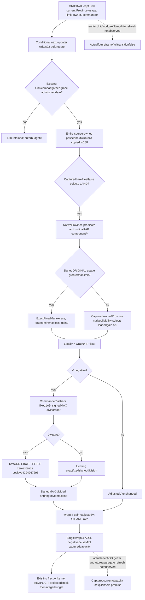

# LAND next stock and supply budget, CK3 1.20.0.4

2026-10-08/W41. This source-prepared extension uses ORIGINAL captured current Province native usage/limit and full LAND inputs to reconstruct one admitted conditional next stock ADD/clamp and supply integer budget. It reuses existing raw families, with no new native getter, binder or DTO. The three new whole scenes and sole registered Service consumer are **NOTRUN** at child handoff.

The supplied source base is88b37f411f21af893ae8aeb9d8f9f8b4c9882f3b, build1.20.0.4/Steam25734779/SHA98702f88a547cde2eaf29a85f93b85f68ee4cf8148336a4f7afaeb75319dd518. No EXE/hash/source-pin verification is repeated.

## Source order before implementation

The actual4 support attachment is PopulateArmySupportBindings12004 in ck3_12004_army_support.cpp73–129/151–169. It installs limit247BEA0, usage247C580, Province conditionC6AF20/component2C4D530, resupply2C09D10, Character aggregator28C3AC0/reader23036E0 and actual loaded values. Existing12003 DTO/helper names retain operation lineage while the selected binder owns actual4 addresses.

The real shared Strength reader validates the currentProvince, captures current_land_resupply_v1 and then current_land_supply_rate_inputs_v1 using that same owner/Province witness. current_province_supply_contributors_v1 supplies typed ORIGINAL nativeusage/limit. Existing complete fullLAND kernel receives that usage explicitly; post-refill conditional usage and captured-target inputs are not substituted.

Complete rate24E5180/3674 and bareFleet24E8440/256 were already read in the previous lane and are not reread. The one necessary new cached source read is actual4 negative helper24E5FE0/1124. With null details it dereferences the address of the localArmy pointer, reads onlyArmy120 for commander/fallback, computes fixed1A9 adjustment and writes only localcomponent. It has noArmy22/188/180/190/globaldate/nativeD read. The main rate body directly reads120/124/12C/38/44; Province/owner/commander callees do not receive updater passeddate. Their captured scalar/verdict inputs are heldfixed; later transitive refresh is not claimed.

LAND gain and loss share the exact source join. If usage>limit, fixed multiplication of excess and slope gives the two-branch min/maxloss, with gain0. At usage<=limit, loss0 and native eligibletrue selects the loadedgain. Adjust only a negative localP−loss: signedMAX(floor,wrap64(100000+fixed1A9)), exact division, then signedMAX(divided,negative loadedmaxloss). Finally wrap64 gain+adjustedcomponent. The nextdate affects outer admission/full188copy; there is no imported Fleet date comparison or copied currentD+1 in the LAND rate.

A concrete source correction accompanies this bundle: divisor0 gives **positive4294967295**, not−1.24E60E6 MOV ESI,FFFFFFFF and24E610E MOV EBX,ESI zeroextend RBX;24E63E7 stores the QWORD without signextension. The existing _native_fixed_div is corrected narrowly by the sibling, and the third full program scene exercises its stockcap consequence. No separate prefix test or old suite is replayed.

Capacity2C53BF0 is called after ADD. Parent alone reviewed its retained null-details source: invalid commander returns loadedFULL; valid commander uses fixed1D3/1D4 and loadedFULL, without directArmy22/188/180/190/globalclock reads. This program holds observed current capacity200000000; valid commander lateraggregate refresh and actual future getter invocation remain unqualified.

## Three new complete whole scenes

All scenes keep currentraw53288448/current syntheticD12, source-next53288472/D395353 and exact fullCDate304845178016701976 from the existing production builder. Current elapsed grace2 equals loaded2 and rejects; next elapsed3 admits. Original22=0, old188=21528124856 and anchor190=38707994064 remain native observations.

| Scene | ORIGINAL usage/limit | Current stock / direct rate | Conditional ADD/clamp stock | Projected supply budget |
|---|---|---|---|---|
|01-land-over-limit-loss|101/100|100000000 /−100000|99900000|25|
|02-land-under-limit-gain-cap|99/100|199000000 /2000000|201000000→200000000|0|
|03-land-zero-divisor-cap|101/100|100000000 /4294967295|4394967295→200000000|0|

All direct current budgets are12. The rate is a direct current LAND getter and is not date/grace-gated, so its source-consistent raw result is preserved rather than manufactured as0. The new program recomputes from observed operands and never relies blindly on that total.

Common raw inputs are component0, slope100000, minloss100000, maxloss500000, gain2000000, native resupplytrue and bareFleetfalse/not_fleet/readytrue. Valid typed commander FullID83886081/tagChar is generation-resolved withoutfallback. Dynamic budgetordinal1B0/raw0 preserves base fractions. Fixed rate1A9 is0/0/−100000 with floor100000/100000/0. Actual fixture sparse WORD keys[1A9,1B0]/count2 at aggregate68/74 and qword values[fixed,0] atD0 match the negative-helper source, so the third operand is not invented from an empty fallback table. Loaded levels[2000,1000,0], fractions[0,12500,25000] and eligiblecurrent100 give poststock budgets25/0/0.

## True whole path and first recipe

The new target `xar_ck3_12004_source_derived_next_land_stock_supply_budget_whole_test` takes `--wire-dir <fresh>` and emits the three filenames above with .json and paired -native-context.json sidecars, plus PRODUCER-RECEIPT.json. It runs actual ReadArmyStrengthsForScope12004, actual current collectors, actual AppendArmyStrengthV1 and the actual4 identity renderer, oncepercase. No new family or derived numerical output is hand-assigned to a snapshot. Heap-owned inputs/before-copy stay unchanged;29ordered callbackevents verify typed receiver/output/ordinal/detail ABI per scene.

The sole consumer SourceDerivedNextLandStockSupplyBudgetWholeService12004Tests.test_source_next_land_stock_budget_reaches_same_army_service uses existing registered ck3_query_army_strengths → actual GameplayBridgeService.query_army_strengths → actual NativeHeadlessGameplayDriver, three requests in one compound method. It preserves original whole/context authority, creates only synthetic current paused hello/frame and rebinds only outer transport correlation. No heartbeat or future frame is injected.

External source-order, zero-divisor instruction receipt, WHOLE-WIRE-PROTOCOL.json, ROOT-FIRST-RECIPE.md and Oct8/W41 fields are at Z:/ck3_mod_rewrite_process_assets/g2-parallel-20261007/army-land-next-stock-12004/native-source/. Metadata64 values use decimalstrings; compiled serializer/context uses exact signed64 JSON integers. Child EXE/hash/game/SDK/process/build/import/test/native-run/Git/AST/diffcheck counts are0. Parent owns its separate sourcecheck/commit receipt; Root owns FIRST. Current/future worldstage, actual future rate/capacity getter, physical casualty application and full daily/monthly transition remain false.
