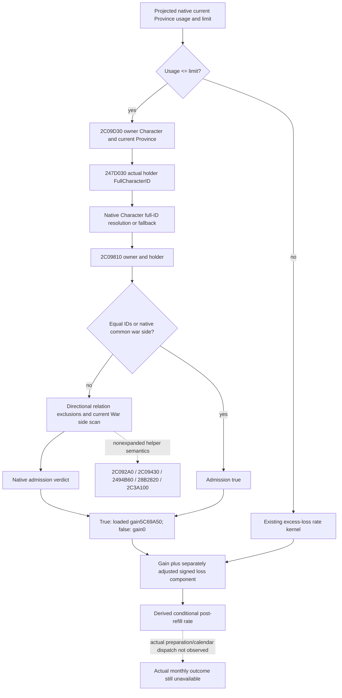

# Land monthly resupply admission, exact CK3 1.20.0.3

2026-10-06 source-only continuation of [current supply-change](army-current-supply-capacity-attrition-12003.md) and [soldier writeback](army-attrition-soldier-writeback-12003.md). Build `1.20.0.3` / Steam `25652598`, reused EXE SHA-256 `94b55397abb687a3dcd436805a5d885e6be90fa6c693feb44a9e3bbeeade02a6`. No game/process/SDK/pipe/UI/live-memory access, builds, functional tests or strategy changes occurred. Readiness is **research: exact caller/admission ABI and direct relation body closed**; observer publication and actual monthly dispatch remain separate work.

The post-refill budget correction is adopted: `Army+130..17F` is not a monthly-budget input. Relevant current Province contributor usage is owned by the separate `247C5A0` observer. This packet closes a disjoint consumer: the boolean that admits the **gain component** when projected land usage is at or below the native limit. It does not reopen current/max refresh or Province roster collection.

## Exact caller and observer entrance

Cached `24E51A0` body `[24E51A0,24E5FFA)`, SHA-256 `2df6ea7faf0de9aa16969bb85bc040c558f161e911c06010e883e0463278ef36`, is reused without reading those EXE bytes again. At `24E5BD4..24E5BD7`, signed Q100000 usage is compared to limit; `usage <= limit` branches to `24E5E8E`. The Province pointer has been restored from the caller stack at `24E5BCD`; the owner Character is the generation-resolved `CUnit+174` owner, **not the commander or Army pointer**.

| Entrance | Exact contract |
|---|---|
| `2C09D30` | Windows x64 `bool fn(void* owner_character, void* province)`: RCX owner Character, RDX current Province, AL verdict. Same two-argument entrance already exposed internally as combat `IsHoldingDefender`. |
| Span / pin | `[2C09D30,2C09D97)`, 103 B, SHA-256 `48dd97c033afb09e14ab1878186f05a653a298189e6359cfd35c54f31f4472e0`. |
| Holder resolution | `247D030(province,&localID)`; Character registry slot `5C67568`, low24 index against count `+2C`, stored pointer from `+20` indexed in 16 B records, full-ID match at Character `+18`; mismatch uses native fallback slot `5C67570`. |
| Final verdict | `2C09810(owner_character,resolved_holder_character)` at `2C09D8C`. There is no Army-strength or supply-stock input in this wrapper. |
| Numeric effect | True loads signed raw gain from slot RVA `5C69A50` at `24E5EA6`; false leaves gain zero. With null details both proceed through `24E5FB1` to the ordinary adjusted-loss helper and final `RBX + R14` at `24E5E62`. |

The wrapper writes only its local holder-ID output/shadow stack. The already reviewed production routes/combat readonly ABI is reused for its callees; this packet does not claim to have expanded every transitive relation helper. It must not be confused with AI resupply target distance/cooldown selection. Native occupation, alliance or a currently positive monthly rate cannot replace this actual verdict.

`247D030` is reused as complete172 B held code, SHA-256 `b7ef728ba079f4ef622074e717ecb49add6e0d50882f40e23f5ae2c8437d7915`, with the matching full-span `.3` ABI reuse record. It returns `Province+73C` when not `-1`; otherwise it generation-resolves `Province+738` TitleID, follows the effective parent for a tier1 barony, and returns holder FullCharacterID `Title+128`. Its source and reuse records are pinned in the delivery packet; no old getter code was reread from EXE.

## Direct relation decision body

`2C09810` is `[2C09810,2C099E1)`, 465 B, SHA-256 `5ea0205219f19dfaeb1b2d2e478757db313d26dbc70c980a3d8669aa133d805e`. The complete branch structure is held, while names/semantics of nonexpanded helper predicates remain explicit unknowns:

1. Equal Character `+18` full IDs return true.
2. `2C090F0(owner,holder,null)` being true bypasses the following relation exclusions; its repeated true verdict then returns true. The current common-war-side helper is reused from the contributor lane.
3. Otherwise either direction of `2C092A0` or `2C09430` returning true returns false. No alliance or hostility label is assigned to these four calls here.
4. Read owner `+1C0`, its `+318` descriptor or native empty descriptor, and traverse stored FullWarID occurrences. Resolve each War with full-ID match at `+8`. Select side descriptor `War+20`, otherwise `War+80`, by `2494B60(side,ownerID)`. For each selected participant pointer except the owner's full ID, `28B2820(holder,participantID)` returning true returns true.
5. Finally `28B2820(holder,ownerID)` or `2C3A100(holder,owner)` being true returns true; otherwise false.

The direct body writes only saved registers/stack and has no direct persistent-object stores. Its unexpanded helper semantics are unnecessary to publish the existing native boolean and remain a source boundary, not a new observation gate.

## Minimum next implementation inputs

Add the existing readonly two-argument predicate to the exact `.3` Army strength bindings and invoke it with the same actual owner Character/current Province used by the land limit/usage getter. Suggested scalar: `native_current_province_resupply_eligible` (bool/null with normal unavailable reason). Publish the actual loaded signed64 `5C69A50` gain at Q100000; do not substitute stock20. These are current-query inputs, not a writer or a new game action. Existing complete Army/Unit/owner identity resolution and current Province validation are sufficient; this packet proposes no extra policy checks.

With the separately published current Province census and an explicit selected-refill scope, the pure gain component entrance is:

`gain_raw = loaded_gain_raw if projected_usage_raw <= limit_raw and native_resupply_eligible else 0`.

This unlocks a concrete production-reachable branch when conditional refill changes under-limit usage. The predicate depends on owner/holder/relationship context rather than soldier current/max, so it can be carried into that explicitly same-context conditional calculation. It does not predict a later date with changed ownership/relationships. Actual post-stage fields remain absent. The full monthly rate still needs the distinct Province modifier, loaded slope/min/max and native commander loss-adjustment inputs from the closed rate kernel; publishing only the gain boolean and gain raw does not establish full-rate readiness. Existing monthly-loss-budget commander observations are not silently reinterpreted as the supply-change helper's context.

The next necessary implementation is this current admission/loaded-gain observation beside the contributor census. The remaining full-rate input collection should reuse the already cached `24E51A0/24E6000` numeric contract rather than reread those bodies or infer inputs from a pre-refill rate. Actual manager roster/preparation/calendar remains an independent later assembly dependency.

## Source receipt and cost

External packet: `Z:/ck3_mod_rewrite_process_assets/g2-background-round7-20261006/resupply-eligibility/`. `ROOT-DELIVERY.json` binds the source plan, Mermaid, full assembly/raw bodies, cache pins and read receipts. Newly read code is103 +465 = **568 B**; PE mapping headers1024 B, targeted pdata432 B; total frozen-EXE read **2024 B**. No whole-image scan/hash, old code reread or game access. Initial plan-init missing-directory harness failure is retained; it caused no source read and is not a capability RED. Structural plan rendering checks only declarations/file integrity and is not a functional/native test.
