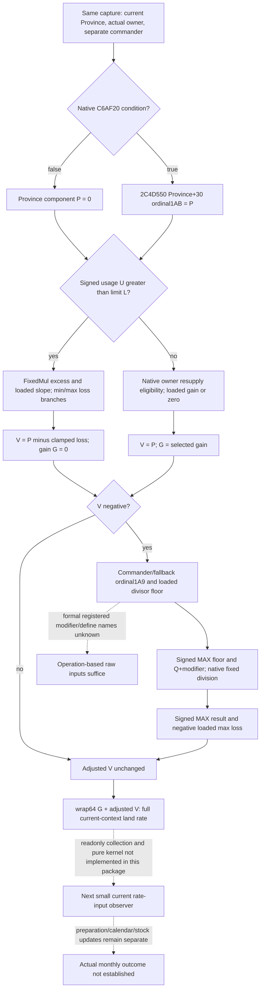

# Full land supply rate inputs, exact CK3 1.20.0.3

2026-10-06 source-only continuation after the independently qualified [current land admission and loaded gain](army-land-resupply-admission-12003.md). This closes the remaining numerical operand contract of the **current Province land branch** of `24E51A0`. It is a construction entrance for a full rate projection after explicit same-context refill, not an implemented observer, actual post-stage observation or monthly dispatcher.

Build `1.20.0.3` / Steam `25652598`, reused EXE SHA-256 `94b55397abb687a3dcd436805a5d885e6be90fa6c693feb44a9e3bbeeade02a6`. The source plan was frozen before consulting the existing cached bodies. New EXE reads, recaptures, native-code hashes, game/process/Steam/SDK/pipe operations, tests and builds are all **zero**. The qualification commit for the previous observer remains separate.

## Held source and current context

| Held source | Complete native span / reused code SHA-256 | Use here |
|---|---|---|
| `supply-change-next/function-24e51a0.txt` | `[24E51A0,24E5FFA)`,3674 B; `2df6ea7faf0de9aa16969bb85bc040c558f161e911c06010e883e0463278ef36` | Selected land operand instructions and actual call/return order |
| `supply-change-next/function-24e6000.txt` | `[24E6000,24E6464)`,1124 B; `2c888577ed0bc3a53ee9848ad5566366f7397a332def8e62891afbb630271b87` | Complete negative local-component adjustment, including null-detail path |
| Existing movement/modifier contract | [Movement composition](army-movement-speed-composition-12003.md) | `C6AF20` predicate and already exposed generic modifier reader ABI |

The two assembly caches live under `Z:/ck3_mod_rewrite_process_assets/g2-resume-20261003/army-supply-attrition/native-tree/`. Their old native byte pins are reused rather than recomputed. The selected excerpt and source-first plan are sealed in `Z:/ck3_mod_rewrite_process_assets/g2-background-round9-20261006/full-land-rate-inputs/`.

The subject is the same generation-bound public CUnit/internal CArmy/current Province already resolved by Strength. `CUnit+174` resolves the **owner** Character for usage, limit and resupply admission; `CArmy+120` independently resolves the **commander**, with the native Character fallback, for limit and negative adjustment. The current Province comparison at `24E5B24..24E5B2C` skips incoming-subject addition. The separate foreign-Province branch is outside this package.

Current Province usage `247C5A0(Province,owner,0,null)` and limit `247BEC0(Province,owner,commander,null)` return signed32 whole soldiers at `24E5AF2..24E5B15`, then multiply by100000. Existing Province contributor collection and the explicitly selected refill calculation supply those usage operands. `Army+130..17F` is not a numerical rate input, and the current total rate is not an operand for recomputing a changed usage.

## Exact remaining operands and readonly ABI

All loaded values below are **actual current signed64 Q100000**, not stock defaults. Slot RVAs come directly from the cached RIP-relative operands. Operation-based names do not claim a formal registered define name.

| Suggested input | Exact source / observation entrance | Meaning |
|---|---|---|
| `native_province_component_applicable` | `bool C6AF20(void* province)`, called at `24E59EF`; reuse the existing predicate ABI | If false, Province component is valid0. Existing source closes Province `+860` threshold comparisons. The legacy binding name `province_has_holding` is not the semantic contract. |
| `province_component_raw` | If true, `2C4D550(&out,Province+30,0x1AB,null,100000,0)` at `24E59F8..24E5A22`; read signed64 from returned output pointer | Direct current component `P`, before excess loss and commander adjustment. No inferred holding/terrain identity replaces this value. |
| `loaded_excess_slope_raw` | qword slot `5C69A38`; load `24E5BE3` | Fixed-point multiplier of usage exceeding limit. |
| `loaded_min_loss_raw` | qword slot `5C69A30`; load `24E5C8E` | First loss-clamp lower branch. |
| `loaded_max_loss_raw` | qword slot `5C69A40`; loads `24E5C87` and `24E61E5` | First loss-clamp upper branch, then negative-component floor after division. |
| `loaded_divisor_floor_raw` | qword slot `5C68F68`; load `24E60EB` | Signed **lower bound** for the commander divisor. `cmp RCX,RAX; cmovl RCX,RAX` at `24E60F2..24E60F5` selects the greater value. |
| `commander_modifier_1a9_raw` | Resolve `CArmy+120` with Character storage slot `5C67568`, full-ID match at `+18`, otherwise fallback slot `5C67570`; call `28C3AE0(actual_character)`; exact sparse ordinal `0x1A9` at `24E6091` | Missing sparse key is native0, including the native fallback context. This fixed ordinal differs from the dynamic Province-derived ordinal in the monthly-loss-budget observer. |

Reuse existing `ReadAdvantageModifierValue` from `ck3_12002_phase_advantage.hpp` for `2C4D550`: Windows x64 `int64_t* fn(int64_t* out,void* receiver,int32_t ordinal,void* detail,int64_t multiplier,int32_t mode)`. Keep detail null, multiplier100000 and mode0; the receiver is **Province+30** for ordinal1AB.

For ordinal1A9, the held helper reads sorted WORD keys at effective aggregator `+68`, count `+74` and qword values at `+D0`; no key means0. The existing `28C3AE0` / `2303700` readonly bindings can publish that same generic subtable value using `2303700(aggregator+68,&out,0x1A9)`. `ArmyMonthlyLossBudgetBindings12003` already contains Character storage/fallback and these function types. Reuse their source/ABI; do not reinterpret its dynamic `commander_supply_modifier_id/raw` as fixed1A9 or replace native fallback with a missing observation.

The actual `24E6000` ABI is `void fn(void** local_army_receiver,int64_t* local_component,void* optional_detail)`: caller stores CArmy in `[RBP-40]` at `24E51F8`, then passes **the address of that local pointer** at `24E5E3D`, not a CArmy pointer or generic modifier receiver. `24E6038` dereferences RCX before reading Army+120. Its null-detail branch writes only the caller's local signed output; output return type is not used by the caller. A future pure kernel should use the captured scalar operands rather than needing to invoke this helper for an imagined post-stage state.

## Numerical branch order

Let `Q=100000`, `U` and `L` be the signed whole-soldier usage/limit multiplied byQ, `P` the observed Province component, and `G=0` initially. Arithmetic follows signed64 native operations with wrapping stores and truncation toward zero.

1. If `U > L`, compute `x=NativeFixedMul(wrap64(U-L),loaded_excess_slope_raw)`. At `24E5C95..24E5CA4`, choose `loss = min_loss` when `x < min_loss`; otherwise choose `min(x,max_loss)` by signed comparison. Set `V=wrap64(P-loss)`. This preserves the actual two branches even if loaded bounds have an unusual order.
2. If `U <= L`, keep `V=P`. The native owner/Province resupply verdict selects `G=loaded_gain_raw` or valid0. Equality belongs to this branch.
3. `24E6000` returns immediately if `V >= 0` (`24E602F..24E6032`). If `V < 0`, resolve the actual commander/fallback, read fixed1A9 raw modifier `M`, and compute `D=max(loaded_divisor_floor_raw,wrap64(Q+M))` by signed comparison. There is no separate lower clamp in this held body.
4. For `D==0`, division result is raw **-1** (`24E6129..24E6130`). Otherwise use the native fixed division below. Then choose `adjustedV=max(result,wrap64(-loaded_max_loss_raw))` at `24E61E5..24E61F2` and write the local component at `24E6407`.
5. Return **`wrap64(G+adjustedV)`** at `24E5E62..24E5E6D`. `24E6470` receives optional details after adjustment; null details do not alter these two numeric components.

Commander adjustment therefore acts on `P-loss`, not on excess loss alone and not on the final gain-plus-loss result. A negative Province component can reach adjustment while usage is under the limit; a sufficiently positive component can bypass adjustment above the limit. Current eligibility/gain alone does not cover either numerical dependency.

## Fixed arithmetic implementation entrance

`NativeFixedMul` at `24E5BEA..24E5C84` uses the fast product/divQ path only when both operands satisfy unsigned64 `(value+3037000499) <= 6074000998`. Otherwise select `high=max(a,b)`, `low=min(a,b)`, `q=trunc0(high/Q)` and `r=wrap64(high-q*Q)`; return `wrap64(wrap64(q*low)+trunc0(wrap64(r*low)/Q))`. The existing monthly-loss-budget pure kernel already uses this **high operand** decomposition. Its matching primitive is the reuse entrance, rather than a battle primitive that decomposes the low operand or an ideal big-integer multiplication.

`NativeFixedDiv(V,D)` at `24E6135..24E61CE` preserves three numeric paths:

- Inclusive `V` range `[-0x53E2D6238DA3,+0x53E2D6238DA3]`: `trunc0(wrap64(V*Q)/D)`.
- Otherwise when signed absolute divisor is at least `Q*Q=0x2540BE400`: `trunc0(V/trunc0(D/Q))`.
- Otherwise split `q=trunc0(V/Q)`, `r=wrap64(V-q*Q)` and `A=wrap64(q*Q)`. Divide A by D to obtain quotient `qa` and remainder `ra`; result is `wrap64(wrap64(qa*Q)+trunc0(wrap64(ra*Q)/D)+trunc0(wrap64(r*Q)/D))`.

The zero-divisor raw-1 branch precedes those paths. Preserve the source's signed comparisons, truncation and intermediate wrapping; do not replace the large-value paths with one ideal rational division. This package delivers the source entrance only, with no arithmetic implementation or fixture claim.

## Minimum same-query data proposal and next work

Add one independent `current_land_supply_rate_inputs_v1` family to the existing Strength capture. Reuse the qualified `current_land_resupply_v1` land branch, owner/Province identity, native admission and loaded gain, plus the separately qualified current Province usage/limit inputs. Newly publish `native_province_component_applicable`, `province_component_raw`, the four loaded raw operands above, and fixed `commander_modifier_1a9_raw` from the actual native commander/fallback. Carry raw commander FullCharacterID, resolved Character FullID and `commander_used_native_fallback` as context provenance; this makes a legitimate native zero distinguishable from unreadable input without inventing a new policy gate.

One current query must collect those operands together. Native false predicate publishes P0; absent sparse1A9 publishes M0. A failed required read remains null with the established unavailable reason. Formal modifier/define names and expanded inner relation logic remain unknown but are not required to observe these actual raw values. No Army cached stats or current total rate need be added as replacement inputs.

The pure full-rate entrance takes the captured complete object and an **explicit selected-refill usage** in the same owner/Province/commander/relationship context. It can then recompute the rate with the branch order above while marking actual post-stage observation false. A changed Province, owner, commander, date or relation context needs its own observation; this current-Province construction does not stand in for a later capture. Existing current total monthly rate can be an independent current-frame fixture comparator, not the changed-usage input.

Next package: implement this small readonly operand collector and normalizer hook, then the source-closed pure kernel and one focused fixture through Root's first native qualification. Full-rate availability can become true only after those operands are actually published. Monthly stock/capacity application, budget fractions and preparation/calendar dispatch still have their separate contracts and readiness. This source-only topic grants **research/source-closed current land numerical operand contract**; it grants no new static-ready observer, full monthly readiness, paused/live evidence or outcome loop.

## Receipt, budget and retained attempts

External `ROOT-DELIVERY.json` and `SOURCE-CLOSED-PLAN.json` bind this topic, the source-first freeze, selected cached assembly, exact input layout and Oct6/2026-W41 fields. The native spans reused total4798 B; **new EXE byte budget consumed0 B**, no pdata/header seeks or native code hash rerun. Only held cache/source text was consulted. Mermaid/file-record rendering, if referenced, checks record declarations and file integrity rather than native execution.

Quoted inline Python and missing guessed source filenames produced read-only harness errors; no functional case, native body or game operation occurred. Those attempts and the provisional divisor-cap interpretation corrected to the exact signed MAX/floor branch are retained in `ATTEMPTS.json`. They do not constitute capability RED or an added deployment requirement.

## 2026-10-06: same-query observer and conditional full-rate candidate

The additive optional `current_land_supply_rate_inputs_v1` is now implemented in the exact `.3` Strength reader and shared serializer. It reuses the current validated Province and same-capture resupply owner/land result, captures all four actual loaded raw slots, invokes `C6AF20` and the existing six-argument Province+30 ordinal1AB reader, then resolves `Army+120` with the native Character fallback and reads effective generic ordinal1A9 through the existing aggregator/sparse-reader ABI. It publishes subject Unit/CArmy IDs and raw/resolved commander FullIDs with native-fallback provenance. False component and missing sparse key publish valid0; loaded0 is available; a failed slot/getter leaves only this family unavailable, while old current rate and current resupply remain independent. The legacy `.2` producer omits it. No game action or source recapture was added.

The strict production Strength normalizer accepts this new family. `project_full_land_supply_rate_v1` takes one same-query Strength row and an explicit `selected_refill_usage_soldiers`; the native current Province limit and owner/Province/subject identities come from its contributor family. The projection checks that those current contexts agree, preserves the source's two loss-clamp branches, reuses the established HIGH-decomposition multiplication, implements all three fixed-division paths including signed-abs wrapping, signed MAX divisor floor and zero-divisor raw-1, adjusts a negative local component before adding gain, and retains the independently observed current total rate. Its `full_land_rate_ready` means only this conditional current-context scalar; `actual_after`, `actual_post_stage_observed` and `full_monthly_supply_change_ready` remain false.

One **new focused Python compound** is GREEN on its first execution under `-B -O`: production normalizer hook; below/equal/above-limit branches; negative under-limit component and positive over-limit bypass; first min/max branches including unusual bound ordering; signed MAX divisor floor; zero-divisor raw-1 and the second negative floor; native fallback/false/loaded0; multiply boundary/HIGH path and all three division paths; absent/partial new family with current total preserved; strict schema and context mismatch. No old case was run. Receipt, frozen implementation plan and Oct6/2026-W41 fields: `Z:/ck3_mod_rewrite_process_assets/g2-background-round10-20261006/full-land-rate-observer/ROOT-DELIVERY.json`.

The new native fixture and Root recipe prepare5 production reader/serializer wires: negative component/divisor floor, fallback/absent component/zero slots, zero divisor, fleet branch and missing loaded slot. They remain **unexecuted** by this child; Root owns new TU/CMake/route-CI adoption, first compiled native run and first wire qualification. Candidate readiness is **source-closed + first Python fixture GREEN, native pending**. No static-ready raw observer/full-rate credit or actual monthly/live outcome is granted yet. New EXE/code-hash/build/CTest/game/process/SDK/Steam/pipe operations are0.

### First compiled observer wires: static-ready

Root adopted the candidate and CMake/route-CI dependency, then qualified immutable source `5c33040bbc28864fa76106e719fa61fae30258ab` in `C:/codex-ck3-background/person-full-rate-batch/g87`. Root-provided formal batch metadata records GREEN121.369582 s,598 translation units /587 unique /1272 inputs, followed by the first3 new readonly CTests GREEN3/3,1.39 s real, completed2026-10-06 03:21:24.317428 UTC. Native evidence is `person-full-rate-batch/strict01/BUILD-RESULT.json` and `FIRST-THREE-READONLY-CTESTS.json`; this child did not rerun compilation or CTest.

The five actual compiled Strength reader/serializer wires were consumed **once**, using the sealed recipe consumer and production Python from that same immutable source. All five are GREEN: negative Province component with signed MAX divisor floor gives2145678; native fallback/absent component/loaded0 gives0; zero divisor preserves raw-1; fleet remains `not_land`; missing loaded slot leaves only full rate unavailable while current resupply/gain remains ready. Receipt is `FIRST-NATIVE-WIRES-QUALIFICATION.json` in the round10 packet, sealed by its qualification delivery. No new Python compound, old wire/test, native execution, source-byte closure or game access was repeated.

Readiness is now **static-ready for current land raw operand publication and the explicit same-context conditional full land rate kernel**. Fixture callbacks and injected slots do not execute CK3 getters against live objects. No paused/live field credit, actual post-refill state, full monthly assembly/calendar dispatch or outcome loop is granted; `actual_after`, `actual_post_stage_observed` and `full_monthly_supply_change_ready` remain false. The next integration entrance is to consume this conditional rate alongside the existing selected Province refill result and separately source-closed stock/budget stages, retaining each actual-state boundary.

## 2026-10-06: service returns joined selected-refill full land rate

An independent composed helper now joins the qualified ordered Province usage projection to the qualified full land rate kernel, using **one normalized Strength row**. It keeps observed owner/Province/commander, native limit and contributor context, performs the existing one-per-physical selected refill calculation, preserves every admitted stored Province/DATA occurrence, and passes only a ready `conditional_supply_usage_soldiers` as explicit selected-refill usage. It does not substitute current scalar usage or0 when refill/DATA is missing. No native code, capability, gate, strategy or runtime contract changed.

`GameplayBridgeService.query_army_strengths` now returns additive ordered `same_input_conditional_post_refill_land_supply_rate_v1` derived rows alongside its original `army_strengths`, replenishment and loss-allocation fields. Each composed row contains conditional usage/rate readiness and numeric output, the source usage/physical-refill and full-rate calculation, plus independently retained current total rate/resupply/raw inputs. Missing DATA leaves usage/rate null; fleet or partial rate inputs can retain ready conditional usage and readable current leaves. The original selected native rows, route/global status and native readiness remain independent. Actual-after, actual post-stage observation and full-monthly readiness remain false.

The join plan/Mermaid and expected arithmetic were frozen before the first new service-route compound. That **single new compound is GREEN on first execution** under `-B -O`,2026-10-06 03:31:17.959667 UTC,0.012 s test /2.4747401 s process. Only snapshot/capability/execute-step memory boundaries are replaced: the production service method executes its real normalizer, nested DATA refill, duplicate Province contribution, full-rate kernel and returned derived route. One physical80→90 ADD(q10) occurs despite two DATA aliases; refreshed ArRg160→180 contributes twice to Province usage320→360. With native limit340, gain700000 gives way to conditional full rate−50000; the original observed total700000 is preserved. The same compound covers prepared q0, known empty0, missing associated DATA, fleet, partial raw inputs, legacy omission, original global/native readiness and input immutability.

External plan, expected arithmetic, first route outputs/receipt, commit and Oct6/2026-W41 fields: `Z:/ck3_mod_rewrite_process_assets/g2-background-round11-20261006/post-refill-full-land-rate-service/ROOT-DELIVERY.json`. Readiness is **static-ready joined Python service value using already qualified native inputs**; no old compound/wire/CTest, native build, EXE/code-hash or game/process/SDK/Steam/pipe operation was repeated. Next assembly work may feed this conditional rate into separately source-closed stock/capacity and budget stages; actual monthly preparation/calendar/outcome remains separate.
