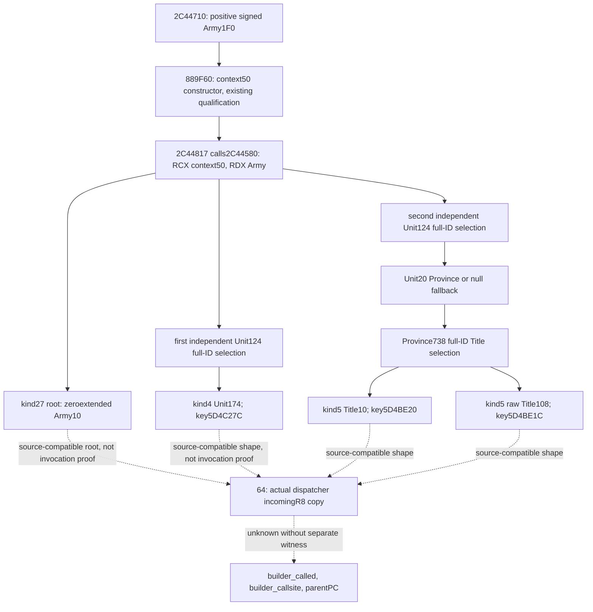

# Army late context builder 2C44580, CK3 1.20.0.4

The complete actual-build body `[2C44580,2C44701)` constructs the root and
three named inputs of the positive `Army+1F0` event path. This package adds a
readonly input reader and a separate copier for a natural dispatcher's actual
incoming context. Neither helper executes the builder or constructs a scope.

The source is CK3 1.20.0.4, Steam build 25734779, held executable SHA-256
`98702F88A547CDE2EAF29A85F93B85F68EE4CF8148336A4F7AFAEB75319DD518`.
The finite acquisition read 385 bytes once into the shared named span cache;
it did not hash or scan an executable. The initial dependency freeze is bound
to Native71 source `16da78339cdff5c1a462e20bc301684594a3f800`. The sole focused
compile used the current `Z:/ck3_mod_rewrite` native include tree with the
separate exact pins in `CURRENT-HEADER-EQUIVALENCE.json`; it did not read the
old SDK tree. The `.4` header matches the retained pin. The foundation header
has a new current pin and differs from the old pin; this leaf uses no types,
offsets or functions from that foundation header.

Evidence is in the external package
`D:/codex-ck3-background-spill/native71-continuation-20261010/continuation-62`:
`SOURCE-2C44580.json` contains the complete instructions and span hash,
`SOURCE-CLOSED.json` records the reviewed ABI and operand chain, and
`INPUT-FREEZE.json` records the initial eight-file include graph and candidate
hashes. `CURRENT-HEADER-EQUIVALENCE.json` records the actual focused header
inputs. `continuation-41/LATE-CALLEE-SOURCE-PROOF.json` supplies the real caller.

## Native source and ABI

Caller `2C44710` retains its Army receiver in RSI. In the positive signed
`Army+1F0` branch, `2C44809` calls the already qualified root constructor
`889F60` on stack `context50`; `2C4480F` puts Army in RDX, `2C44812` puts
the same context in RCX, and `2C44817` calls `2C44580`.

| Output | Exact source | Kind and loaded name |
| --- | --- | --- |
| Root `WORD+0`, `QWORD+8` | Zero-extended `Army DWORD+10` | Root kind 27 |
| First named token | First selected `Unit DWORD+174` | Kind 4; DWORD key at `5D4C27C` |
| Second named token | Selected `Title DWORD+10` | Kind 5; DWORD key at `5D4BE20` |
| Third named token | Same `Title DWORD+108` | Kind 5; DWORD key at `5D4BE1C` |

Each payload is zero-extended by a native `MOV EAX` before its QWORD store.
Full generation bits, legal zero values, and `FFFFFFFF` remain intact. The
third Title value is published by its raw source offset; this package gives
it no unproved relationship name and does not resolve it as another Title.

The body selects Unit twice, with two distinct loads of registry `5D1E380`
and `Army+124`. The low 24 bits index 16-byte registry records, while
candidate `DWORD+10` must equal the complete requested ID. A null registry,
out-of-range index, null candidate, or generation mismatch selects native
fallback `5D1E378`. When the registry pointer is null, the source skips the
`Army+124` load. The observer follows that demand order and does not turn a
failed memory read into a native fallback.

The second Unit's `QWORD+20` selects its position Province; a null pointer
selects fallback `5D1E390`. `Province+738` selects Title through registry
`5D1DAF8`, with the same full-ID check at Title `+10` and fallback `5D1DAE0`.
A null Title registry skips `Province+738`. The first Unit owner payload is
a direct `+174` value; this builder does not resolve or validate Character.

The only transitive callee is already qualified `373A0F0`, called at
`2C4460F`, `2C446C1`, and `2C446E7` on the context's named header at `+18`.
Its existing qualification and constructor `889F60` qualification are reused.
No duplicate constructor, named-save, or old FIRST qualification is run.

## Production helpers

`BindArmyLateContextBuilderInputs12004` binds only the actual `.4` loaded
registry, fallback and name-key slots. `ObserveArmyLateContextBuilderInputs12004`
reads the supplied current Army when its caller explicitly requests the
conditional builder inputs. An undemanded branch reads nothing and has no
named values. This is a current conditional projection; it grants no
historical execution, post-date ingress, or actual builder-call credit.

`CopyActualArmyLateContext12004` instead receives the natural dispatcher's
actual R8 pointer and its guarded memory reader. It copies the root token at
`+0`, raw DWORD seed at `+10`, and named header at `+18`. The existing context
layout has a QWORD data pointer, DWORD capacity and DWORD count; rows have
stride `18`, key DWORD at `+0`, token kind/subtype WORDs at `+8/+A`, and payload
QWORD at `+10`. This layout reuses the existing event-window source contract
and exact `.4` named-helper qualification. It is not newly inferred from
an older executable. The copier stores at most 32 original ordered rows,
retains truncation and partial reads, and compares the exact 16-byte header
before and after. No copied row is replaced with a stock-script value.

`ClassifyActualArmyLateContextRoles12004` takes the three real loaded keys
in their source order. It preserves each copied value and compares kind
4/5/5 and subtype zero. A matching shape expresses compatible source roles,
while `builder_called`, `builder_callsite_rva`, and `parent_pc_rva` remain
null. Missing keys, changed headers, partial rows and truncation cannot grant
a complete named-input shape. The independent serializer preserves all
actual ordered copied rows and these readiness fields.

64 owns the natural dispatcher call to the copier and any actual loaded-key
reads. 55 owns bridge installation. 59 owns Service consumption and any
necessary current Army caller hunk. 60 owns CMake. This package edits only its
new leaf/header/fixture/topic files; no shared core file is changed here.

## Verification and remaining work

The sole new focused native fixture covers the production conditional
reader, actual-context copier, source-role classifier and serializer with
14 finite modeled cases. Its exact command, six source-file hashes and
4 MiB output budget are frozen in `FOCUSED-CURRENT-HEADERS-RECIPE.json`. Central
10 ran the MSVC C++20 `/W4 /WX` compile once and the fixture once: both exited
zero, with 14 cases and 35 checks GREEN. The six candidate source pins remained
unchanged. The actual receipt is `focus01/RESULT.json`; it records zero Game,
SDK, Steam, UAC and Git operations. The fixture is an offline implementation
check and cannot grant new Game, actual builder invocation, or live natural
dispatcher credit.

The new EXE is frozen at SHA-256
`20ee6c1732141883fd30f32811c1a76936f63f24e64c2eecf1d8d0c38141c723`.
Its permanent Defender exclusion remains pending: the recorded request failed
before a settings call because its MSVC output provenance was rejected. The
receipt has no before/after settings readback; fixture success does not imply
that the exclusion was installed.

The complete builder source is closed. Whole late transition effects,
actual post-date regular-core ingress, loaded event effects, and their
historical parent context remain separate work. Actual dispatcher snapshots
can supply new observed context values after 64's real producer integration;
current query values cannot backfill those historical facts.
