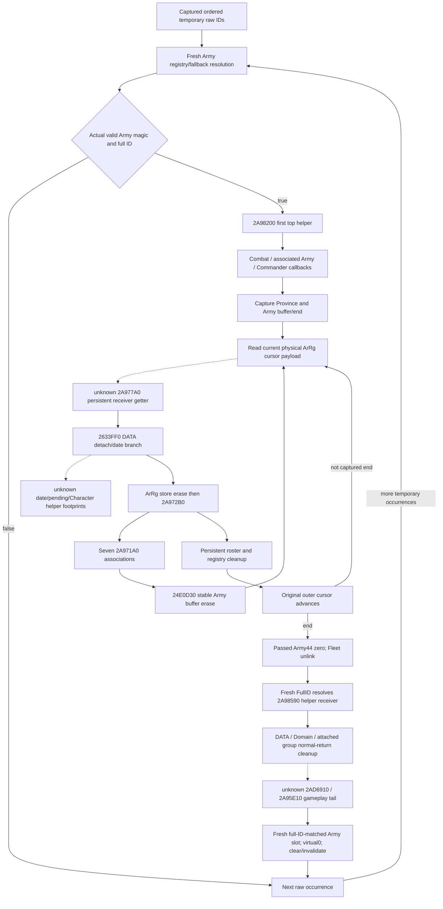

# Later Army removal and evolving drain inputs (1.20.0.3)

This is a source-only continuation of [current first removal](army-current-assault-first-removal-context-12003.md) and the conditional daily record-release work. It identifies the actual remainder of `2A978A0` and the next temporary-queue iteration. It implements no new observer or model. The qualified first-helper output remains a current-input conditional prefix; it does not establish a later removal frame.

The held build is CK3 **1.20.0.3**, Steam **25652598**, EXE SHA-256 `94b55397abb687a3dcd436805a5d885e6be90fa6c693feb44a9e3bbeeade02a6` (reused, not recomputed). This packet used cached source only: **0 new EXE bytes, 0 tests/wires, 0 builds, 0 game/SDK/pipe/Steam/UI/process/user-data operations**. Scope was sealed before the cached-body work in `g2-background-round20-20261006/later-removal-drain-stage-plan/SCOPE-FIRST.json`.

## Actual receiver and read clocks

The temporary list produced by the earlier `2A9FA10` transfer preserves raw ID occurrence order. For each entry the caller resolves the **then-current** Army registry/fallback, checks its actual magic/full ID, and calls `2A978A0` with that receiver. The existing current-query selection family observes this resolution now; repeating its initial result after a prior deletion would skip a real native lookup.

After its already-qualified first `2A98200` call, `2A978A0` runs these stages in order. These are source branches, not a claim that every current frame takes every branch.

| Stage | Actual operand and timing | Consequence for later inputs |
| --- | --- | --- |
| Combat removal | Army `+128` resolves Combat, validates magic/full ID, then `264E180` on `Combat+20` followed by `Combat+368` | Both actual side receivers must be retained; no inferred side or owner exclusion. |
| Associated Army callback | Read Army `+1E8` after the Combat calls; resolve its object, read object `+10`, resolve Army, call `24E3F60` | This is a separately resolved Army receiver, including fallback. |
| Commander unlink | Resolve Army `+120` Character; valid magic/full ID calls `28CC110(Character,0)` | Branch-specific Character context may change before later group callbacks. |
| Regiment loop | Capture current Province from Army `+124` Unit `+20` pointer/fallback; capture Army `+38` buffer and signed `+44` end once | The loop reads the **physical DWORD at its cursor anew**, not an immutable copied ID list. |
| Attached group helper | After the loop, write passed Army `+44=0`; remove valid Fleet, set Army `+12C=-1`; reload passed Army `+10` and call `2A98590` | The helper resolves this full ID again. Its physical Army receiver need not equal the passed receiver. |
| Unit/context tail | `2AD6910(GameData+2A500, fresh Army+124)`; valid Army `+1C8` Character and Army `+1C0` Province each select `2A95E10(primary+E0,mode2/3,Army+1B8,selected ID)` | These gameplay bodies are not closed by this packet. Their possible relevant writes are not assumed absent. |
| Final Army registry deletion | Reload primary `+48`; select matching full-ID slot; call slot receiver virtual 0 with flags 0, then reread its ID, clear `0x208`, invalidate ID and unlink slot | Passed, helper-resolved and final slot Army are distinct physical roles. The next temporary ID uses the changed registry. |

The final slot gate compares full IDs, **not receiver pointers**, and does not add an Army magic gate. A raw queue duplicate can resolve differently after the first slot is cleared; fallback must be resolved again, not inherited from its initial observation. This is also why source pending storage being empty after the earlier transfer does not prove it stays empty after subsequent callbacks.

## The outer regiment loop really can change its own payload

Each cursor resolves the current raw ArRg ID through `5D1F340`/`5D1F338`, then calls **`2A977A0(ArRg)` without a caller magic/invalid-ID guard**. The returned persistent Regi is used for the `+138==4` branch. That branch calls `B105D0` on its owner Character child's `+2A8` list **before** `2C57020`; the later `2A98590` path uses the opposite order and rereads owner context after `2C57020`.

Next, `2633FF0(ArRg,captured Province,GameState+8 date pointer,primary)` processes associated DATA records; then the caller reloads ArRg `+10` for `2A9E640` and calls `2A972B0(primary,persistent Regi)`. Only after these calls does it advance the original cursor toward the originally captured end. After all cursor visits the passed Army `+44` is set to zero.

An initial working note attributed stable Army-list erase directly to `2633FF0`. The actual cached source corrects that attribution: **`2633FF0` does not call `24E0D30`**. `2A972B0` visits seven physical chunk associations and calls `2A971A0` for each; that function invokes `2633FF0`, then calls `24E0D30` on the valid current Army and finally `2A9E640`. Thus a nested call can left-shift the same captured Army buffer. The outer end does not shrink with Army `+44`; stale tail payload and ordered repeats remain actual subsequent cursor inputs.

`2633FF0`'s direct DATA sequence is independently relevant: for each valid associated record, current `>=` maximum calls the already-closed `2657EA0(chunk,maximum)` setter; a true `2658050` result selects a date initialization, `2658180(chunk,Province,date)`, and possibly `2A9BE60(primary,chunk)` when the output low date exceeds the caller date. Then association `+10=-1` and byte `+14=0` are stored. A present ArRg `+148` Character leads to `28CBE70(Character,Province)`. The four named date/pending/Character helpers have no complete body in the reused owner packets, so this does not establish all their transitive effects.

## Persistent cleanup and attached-group cleanup

The cached complete `2A972B0` body provides the following useful stage order. Invalid persistent Regi magic/full ID returns. State 1 may call `28CA660(Character,Regi)`. Other definition/state branches remove Regi IDs from actual Title/Character lists (`22E7C20` or the already-closed stable-list operation), with branch-specific owner reference clearing. GDbO origin/fallback Province branches write `Province+820`; Regi `+120` is then set to the actual Province fallback pointer. It invokes `2A971A0` on **all seven freshly read chunk `+10` association IDs**, removes all matching Regi IDs from primary `+30`, then conditionally destroys/clears the selected persistent registry slot at primary `+20` (`0x150` bytes). Physical identity matters: the final full-ID-matching slot need not be the passed Regi pointer.

Regi `+130` is a **Title full ID**, not an Army ID. Title `+128` supplies the owner Character. Direct Regi `+12C` is used only by the actual mutually exclusive owner-route conditions; both-present/both-absent cases use native Character fallback. The corrected Domain observer and kernel already implement this route. The historical `SOURCE-PREDICATE-COUNT.md` label is superseded by `SOURCE-IMPLEMENTATION-CORRECTION.md`; no old result is rerun here.

`2A98590` entry `+5C==0` returns without writes. A negative nonzero count skips positive group visits but still reaches the final `+5C=0` and stable all-match removal from primary `+C8/+D4`. For a positive count, original ordered group records select persistent Regi/chunk DATA; byte `+14` is cleared. State 4 runs `2C57020` then rereads owner references for its Character-list removal. Character child fields are reset on their actual branch. The helper **rereads** Army `+50/+5C` before invoking `24E9940` in current order.

`24E9940` frees group payload on normal return and leaves the outer group slot pointer unchanged. `EBA050` invokes each physical record's virtual 0 in captured signed-count order and finally zeroes its count. Its record virtual target and group allocator receiver are not proven to be the same as the separately qualified daily-record `9D11F0` canonical allocators. The latter closure must not be borrowed as generic destructor credit. This plan stops at those generic boundaries; it does not reopen allocator internals.

## Smallest next construction and exact missing source

The next finite source step is **`2A977A0`**, the actual receiver mapper used before any persistent branch. Scoped cache inventories and owner replies found only its address and its use as `2A972B0`'s exclusive end; that is not a captured getter body. Reuse the held verified `.pdata` table to locate the entry/chained range, then read only that verified function. The known next entry `2A978A0` is an upper bound of `0x100` bytes, **not assumed function extent**. If the verified extent exceeds that bound or metadata disagrees, stop and report the actual finite extent before any body read. No new EXE read is performed by this packet.

| Required next input | Existing qualified value | Concrete additional same-query entrance |
| --- | --- | --- |
| First/current candidate | Raw current and derived-append selection, actual magic, raw/requested/selected IDs and receiver identity | Reuse `current_assault_removal_reference_inputs_v1`; do not duplicate the raw queue loop. |
| Outer physical ArRg cursor | Subject Army-associated strengths/DATA only | Capture selected candidate Army `+38/+44` ordered raw payload and physical buffer identity, actual per-cursor registry/fallback receiver. Keep buffer payload separate from mutable signed count. |
| Persistent mapper | Current associated DATA rows do not close `2A977A0` for every ArRg/fallback cursor | Source-close the named getter, then publish its actual selected Regi identity and operands, not a guessed first-associated ID. |
| DATA/persistent state | Source-domain associated DATA and conditional writer kernels | Demand actual associated record lists and selected physical chunk aliases on visited branches; the persistent cleanup's seven association reads are a different required source scope. Do not invent a prepared/full-seven gate for `2633FF0`. |
| Current Province/date | Current province context; existing date-related fields | Actual selected Unit `+20` pointer/fallback and raw caller date. A current frame is a model seed, not a recaptured late caller frame. |
| Shared owner/pending state | Qualified Domain/point stores and raw pending sequence | Reuse their same-frame values by identity, then carry closed writes in order. First close the selected named date/pending leaves; current bools cannot certify their future effects. |
| Later helper state | Current first cleanup six lists/B0 and bucket context | Capture actual helper-resolved Army `+50/+5C` ordered groups/records/Character operands, plus actual primary `+C8/+D4` state after earlier swap. Late values cannot be replaced with current initial values. |
| Next duplicate resolution | Current receiver/fallback observations | Retain actual Army DB slot identities/full IDs and source-defined invalidation/free-chain changes; apply only closed effects before re-resolving the next temporary raw ID. |

The independently useful next observer/model seam is the actual candidate's ordered detach receiver and physical DATA effects. It can preserve source branch-specific partial outputs while the attached-object and Unit/context suffixes remain unclosed. A complete future drain requires those **actually selected** gameplay footprints and callback receiver effects; generic heap implementation is not required. There is no new permanent-null field or additional defensive gate in this source plan.

Research readiness advances through this explicit stage/input ledger. **Actual removal, actual post-stage/current troop observation, full removal lifecycle, calendar, full monthly and live remain false/null.** Existing first-helper, queue-append and conditional record-release qualifications remain unchanged.

## Reused source receipts

- `g2-background-round2-20261005/holy-order-release/native/SPANS-0x2a978a0.json` and `span-02a978a0-02a97ec1.txt`: complete held `[2A978A0,2A97EC1)`, source byte SHA `b324251def171eaf33abbef8e4e5eea70c359611a9619787dcb76bf4063f8aef`; only necessary caller excerpts were reused here.
- Same `SPANS-0x2a972b0.json` and `span-02a972b0-02a977a0.txt`: complete held 1264 B, byte SHA `d3e762cd774d31fc7d1436f7305f23123295be9977f65afe2369a6f8357524a4`; detailed branch and seven-association footprint reused here.
- `g2-resume-20261004/battle-knight-entry-future-12003/death-detach/TREE.md` and `slice-02633FF0-240.txt`: detach/erase call ownership and cached `2633FF0` function within a larger slice; no new body capture or digest.
- `g2-background-round4-20261005/monthly-caller-effects/queue-consumer-source/first-removal-stage-ledger/` and `later-manager-removal-stage/`: sealed first/later/group/Domain stage receipts and their implementation correction.
- `g2-background-round5-20261006/holy-order-player-release/army-teardown-receiver/ROOT-DELIVERY.json`: selected actual CArmy destructor summary only; no receiver alias, employer or unrelated lifecycle inference.
- `g2-background-round19-20261006/current-assault-removal-reference-context/QUALIFIED-ROOT-DELIVERY.json`: qualified first/current prefix provenance, including original native CTest RED and corrected fixture/first six service results. None was replayed.
