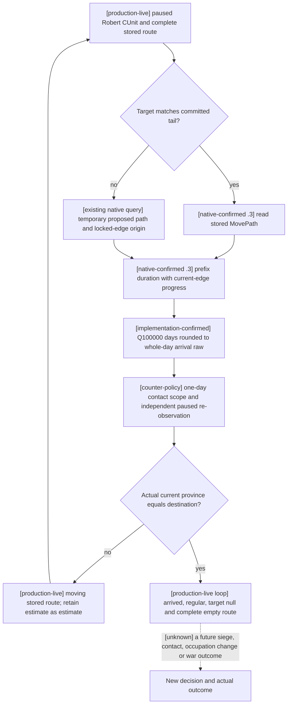

# CK3 1.20.0.3: committed march timing and Robert's actual arrival

2026-10-03. Exact build: CK3 1.20.0.3 / Steam 25652598, EXE SHA-256
`94B55397ABB687A3DCD436805A5D885E6BE90FA6C693FEB44A9E3BBEEADE02A6`.
This file-only research lane consumes Root's frozen ordinary Robert campaign
artifacts. Root exclusively owns SDK, the game, window control and Git. It adds
no action, gameplay day, observer, schema, permit, gate or new verification test.

The original move and native decision inputs are recorded in
[the movement topic](war-movement-1.20.0.3-readiness-2026-10-03.md).
The [reviewed route ABI](ck3-1.20.0.2-routes-migration.md) and
[the .3 ABI reuse ledger](../../ck3_autonomous_player/native_bridge/research/ck3_1_20_0_3_abi_reuse.json)
are the inputs to the following native tree. The previous version's publication
date and evidence remain unchanged.

## Native timing before a new movement decision

| Input / branch | Existing implementation | Meaning |
| --- | --- | --- |
| Existing destination matches stored route tail | `ck3_12002_routes.cpp:683` | Use the stored committed MovePath, rather than rerunning A* |
| Remaining route timeline | `BuildActiveRouteTimeline` -> `ProjectPathTimeline` -> native `0x24AADA0` | Evaluate each stored path prefix with the actual CUnit, current province and current date |
| Current edge progress | accumulator `CUnit+0x168`, cached speed `CUnit+0x190` / `0x24AB5C0`; normalized progress `0x24AB2F0` | Existing native timing already incorporates accumulated progress on the matching first edge; no new progress reader is needed |
| Route duration units | signed fixed point, scale 100000 days | A duration is an estimate under the current speed and route |
| First committed edge remaining duration | `ck3_query_battle_reinforcement_assignment_v1` -> `ck3_12002_battle.cpp:584` -> native `0x24AB060(unit,out,0)` | Existing `signal.first_route_edge_remaining_duration_q100000` retains sub-day duration when the route and native signal are available; no additive schema is required |
| Published arrival date | `(duration_raw + 50000) / 100000 * 24 + date_raw` for a nonnegative duration | Nearest whole-day raw date; it does not promise an exact simulation arrival tick |
| Independent completion | fresh paused snapshot: current province, state, target and complete route | A predicted arrival date or accepted move cannot substitute for actual arrival |

On the exact .3 EXE, `0x24AAF0E..0x24AAF34` requires a nonempty stored route and
matching first ProvinceInfo ID before subtracting progress. `0x24AAF3A..0x24AAF58`
reads cached edge speed at `+0x190`, falls back to `0x24AB5C0` when necessary,
and reads the accumulated movement at `+0x168`. In the ordinary integer range,
it converts the accumulator into Q100000 days as `accumulator*100000/edge_speed`,
then subtracts this from the summed duration at `0x24AB034`. The native helper
also preserves its own larger-value division branches. The accumulator is
movement-weight units; the normalized progress returned by `0x24AB2F0` is a
different quantity. Neither is a number of elapsed days to subtract directly
from a duration.

The narrow disk extract retained under `native-lane/MARCH-NATIVE-BOUNDED-EXTRACT.json`
includes every `.pdata` continuation in each bounded span. The reviewed .2 and
current .3 bytes are identical in these timing spans:

| Bounded native span | SHA-256 |
| --- | --- |
| `0x24AADA0..0x24AB060`, prefix duration | `2718843a1cadbc73ef52ae10ed67cd3a53fc75d090c2e00775ee82c5c9464e1f` |
| `0x24AB060..0x24AB2F0`, stored edge duration | `16f4ea5b1dfa5d97092f48d6e6009eacd765008731ffd3899fdd68747b9e03e7` |
| `0x24AB2F0..0x24AB4E0`, normalized edge progress | `c80ab92b506a5b7658db538f02139ab2a52f6d518ecd9dd3e25ab09b2aa5ab2e` |
| `0x24AB5C0..0x24AB6C4`, current edge speed | `d00f80d66115e22cae35eb1e213ede4f8bd3e31d3e07b856cf95dee90aa27055` |

This narrow static binding does not relabel unobserved AI destination scoring or
the native arrival update tick as known. It reuses the established .3 route ABI
admission and the actual completed march.

The route preview exposes path and final legality. The timing query is the
existing registered `ck3_execute_step` route-contact literal; there is no named
`ck3_query_route_contact_horizon` MCP tool. It returns `subject_route.arrival_date_raws`
and all requested hostile timelines. `h-7` names seven hostile IDs; the contact
window is one day, not seven days. At a new frame, derive the complete current
nonretreating hostile ID set and use the current public revision. After arrival,
read the current location and fresh target before choosing another route; this
completed stored path is no longer a moving-route input.

For a future actual moving army where sub-day timing matters, the existing
`ck3_query_battle_reinforcement_assignment_v1(selected_public_cunit_id=<public CUnitID>,
expected_revision=<fresh revision>)` also exposes
`signal.first_route_edge_remaining_duration_q100000` and the committed route's
`arrival_date_raws`. This is a read-only reuse recipe, not a newly executed query.
The reuse is conditional on the existing army-AI coordinator/subunit binding
(`CUnit+0x1C4/+0x1D0`), with native vtable and parent membership. The reader does
not require `assigned_to_help=true`, but an unbound army returns
`ai_assignment_not_bound` without a signal. It is therefore not a guaranteed
general remaining-time query for a manually controlled Robert army. An empty
route does not provide a first edge, and unavailable signal inputs retain their
unavailable/null meaning rather than become a legal zero duration. This completed
Robert march does not need that extra diagnostic call.

## Actual day 1 through day 8

The one and only movement order for public CUnit83886367 / internal CArmy50331794
was queued at raw53236608, from Province2614 toward Province2610 on `[2610]`.
The original route-contact horizon estimated seven days and raw53236776; the
temporary move preview itself provided path and legality without an ETA. Across the first
seven actual one-day horizon packets, the subject's published arrival remained
raw53236776 while each paused query date advanced. This is direct evidence that
the query was reporting the remaining committed movement, rather than resetting
a seven-day estimate at every frame.

At the end of actual day7, raw53236776, the independent snapshot still showed
current2614 / moving code7 / target2610 / complete route `[2610]`.
The next pre-advance horizon at the same raw53236776 still published arrival
raw53236776. This is a rounded zero-day difference while the army is moving;
it does not establish a zero native Q100000 duration or actual completion. At the end
of actual day8, raw53236800, the independent snapshot showed current2610 /
regular code1 / target null / complete empty route with source count0,
controllable, no combat and no retreat. Therefore the observed arrival interval
is `(53236776,53236800]`. The preserved day7 response is a successful moving
observation, not evidence of a stuck army. The whole-day estimate and observation
granularity explain why its advertised date is not an exact arrival promise;
the precise internal transition tick is not recorded by these paused samples.

Root's actual day8 packet is
`Z:/ck3_mod_rewrite_process_assets/g2-resume-20261003/battle-observation-schedule/actual-eighth-day-v36-r15-01/result.json`.
The normal checkpoint is history4735, SHA-256
`bf0524972ac4ea62addb559ac883b97303f899f419d449cc5df460f4bab9bfaf`.
Actor29829 and episode `native-29829-2bc2d599f7f9` remain unchanged. Root's day8
advance raises the saved gameplay total to3853; this lane adds zero and does not
count the same day again. Root retained the minimized game and exclusive window
and SDK ownership; this file-only lane does not inspect or change window state.

Readiness is **production-live loop for this ordinary short march through
independent arrival verification**. Arrival2610 is no siege recovery, battle
victory, occupation change, war settlement, whole campaign completion or natural
succession. The prior fixed moving-route harness must yield to a fresh stationary
decision now that the route is complete. No new native observer is required to
continue this movement work package.

External source and actual pins, the existing-query recipe and this documentation
projection are retained under
`Z:/ck3_mod_rewrite_process_assets/g2-resume-20261003/army-march-progress-actual/`.

## v38: the next movement order toward Province2604

This is a separate, completed **movement-command loop**, frozen immediately
after the order at raw53236800. The earlier eight-day march and independently
observed arrival at2610 remain the historical completed journey above. The
v38 frame starts from that stationary province; it does not replay or recount
those eight days.

Root selected Province2604 for public CUnit83886367 in War16777231, using the
fresh occupation-target observation and successful v38 route preview. The
selection evidence and occupation meanings belong to
[the occupation-target topic](war-occupation-targets-12003.md). The preview
reported origin2610 and path `[2605,2604]`. The selection generator's
`SELECTED-ACTUAL-SUMMARY.json` is explicitly `prepared-only`; the following
actual SDK packets supply the execution evidence.

| Completed actual observation or action | Result and boundary |
| --- | --- |
| Paused pre-move frame at raw53236800 | Robert29829 / episode `native-29829-2bc2d599f7f9`; current2610, regular code1, target null, complete empty route |
| Existing route-contact query, native revision7 | Complete proposed route `[2605,2604]`; estimated prefix arrivals raw53236944 and raw53237112 |
| Current hostile scope | Seven IDs `[473,474,16777683,50331920,67109295,83886484,251658381]`, derived from the fresh frame |
| One-day horizon | Interval raw53236800 to53236824, `one_day_contact_free=true`, no conflicts; `h-7` counts hostile IDs and does not mean seven simulation days |
| Exactly one `move-army-83886367-to-2604` | `accepted=true`, `status=submitted`, `war_action.status=moving`, submitted at raw53236800 |
| Separate `ck3_take_snapshot` readback | Current2610, target2604, moving code7, complete nonempty route `[2605,2604]`, source count2, controllable, no combat and no retreat; snapshot `native:8`, public revision3 |
| Final frame and normal checkpoint | Still paused at raw53236800; history4759, saved SHA-256 `189d84b62c273aef8e98059b33975c277e84824f58549967bcbe8ce3e4513789` |

The two published arrival dates are whole-day estimates of six days to2605
and thirteen days to2604 from this frame. Neither the proposed timeline nor
the acknowledged command proves an arrival, a thirteen-day contact-free
journey, a siege or a recovery of occupation. The independent readback proves
that the selected order became the army's stored moving route. Its current
province remains2610. The next bounded day requires a fresh committed-route
horizon and another independent paused observation under the existing tree;
it must not infer progress from the acknowledgment alone or resubmit this
order merely because the army has not yet arrived.

The actual capture is GREEN at
`Z:/ck3_mod_rewrite_process_assets/g2-resume-20261003/military-ooda-continuation/recapture-v38/root-selected-2604-01/actual-selected-move/result.json`.
The completed record includes the horizon, the single movement order, the
separate snapshot and the normal checkpoint. It used v38 R0017 / PID107772,
frozen source `0ad923525ef899b836a823dfe983db49030789f2` at `Z:/g40`; the
Root-owned candidate build retained the exact EXE binding above. Root reports
strict541-TU compilation with jobs64 in73.42814 seconds and successful official
CI37113104087. These preparation results do not add a gameplay result.

Readiness is **production-live loop for selecting, dispatching and independently
reading back this movement command**. Arrival2604, occupation recovery, siege
success, combat victory, war termination and full campaign completion remain
unobserved here. This capture adds zero simulation days: saved gameplay remains
3853 at this frozen frame. Any later Root advance belongs to a separate actual
packet and must update the current report without rewriting this checkpoint.
This documentation lane performs no SDK, state, window or shared-source action;
Root retains exclusive ownership and the minimized, unfocused execution rule.

<!-- Append to existing docs/ck3-native-ai/army-march-remaining-timeline-12003.md after the existing zero-day selected-move projection, preserving that prior frame. Link war-occupation-targets-12003.md, army-target-triage-1.20.0.3.md and war-relief-siege-native-ai-12003.md without editing their owned projections. No new native tree. -->

## 2026-10-03 2604 route dispatch 后首个 bounded day：production-live movement loop

在本专题先前 zero-day selected move 投影的原帧之后追加这份首日事实，保留该先前帧。继 [PUB2 enemy-held candidate publication](war-occupation-targets-12003.md) → actual Root choose 2604 → one move → independent committed route 的有限 production-live loop 后，Root 在 exact 1.20.0.3 / g40 / v38、Robert 29829 原普通战役上完成此 route 的首个 bounded military day。native timeline 与 route 输入沿用本专题，回链既有 [army target triage](army-target-triage-1.20.0.3.md) 与 [war relief / siege](war-relief-siege-native-ai-12003.md)，不新建树或附加门禁。

冻结源：[actual-first-route-day-2604-01/result.json](Z:/ck3_mod_rewrite_process_assets/g2-resume-20261003/military-ooda-continuation/recapture-v38/actual-first-route-day-2604-01/result.json)，typed `002 fresh horizon → 003 exact one-day advance → 004 independent snapshot → 005 foreign transition → 006 final snapshot → 007 normal save` 均 GREEN。实际 date **53236800 → 53236824**，24 raw hours / 1 game day、final paused/map_ready true、snapshot `native:14` / public 5 / native 14。

新的 pre-advance committed-route horizon 绑定 `native:11` / public 2 / native 11，已观察 locked-edge effective origin 2605、完整 route `[2605,2604]` 和全当前非退敌七 IDs；使用 current native timeline / opposite-edge geometry，不复用单 move 前的 native7 horizon。原生 arrival raw dates `[53236944,53237112]` 是查询时预测；本日独立 own army 83886367 仍 current 2610、moving/code7、target2604 observable true、`complete_nonempty/source_count2`、combat/retreat false，没有到达。

foreign battle 1577058305（province2640）实际 main/day5，observation available，resolved advantage raw700000/scale100000（+7 points），winner/forced winner none，finalized false；attacker `[251658381,473,474]`、defender `[50331920,83886484]`，不包含 Robert own army。own/enemy/phase/side 没有 material 变化，本日未重查 strengths，不将 snapshot soldiers null 当成合法零兵，也不新增每日强制查询。

**Military moving readiness 现为 one-bounded-day production-live movement loop**：observed committed route → fresh native contact decision → exact one-day operation → independent observed date/route → normal save。这个范围已从上一份 dispatch artifact 的 primitive/first-day-pending 推进，仍不等于 arrival、siege、occupation count 17→16、recapture、victory 或 complete war。

正常保存 h4764、SHA-256 `91ee0cebb347e32cec7fccb1c581a0c2661b22bd26cf90f6a12c29025f3b5422`、90840300 bytes、raw53236824。Root 累计 total3854 / resume701 / Oct3 606；本真实一天已由 Root 计入，纯文件消费者不重计。Root 从 raw53236824 带 prior-first-result 接续 batch16；后续日数/到达/围城状态要消费后续真实产物，文档不阻断执行。

原始 packet SHA-256 与冻结消费索引：[ACTUAL-FIRST-ROUTE-DAY-CONSUMED.json](Z:/ck3_mod_rewrite_process_assets/g2-resume-20261003/military-ooda-continuation/recapture-v38/first-day-consumed/ACTUAL-FIRST-ROUTE-DAY-CONSUMED.json)。本 lane 无 SDK/game/window/Git/shared-source/test 操作，专题与日报/周报由 actual merge owner 合入。

## v38：连续十三个正常保存日与 2604 实际抵达/围城状态

Root 同一 SDK 的 `actual-route-days-batch-2604-01` 在第 **13** 日按 **actual_target_arrival** 正常停止，状态 **STOPPED**，不是 capability RED。实际 DateRaw **53236824 → 53237136**，合计 **312 原生小时 / 13 个完整保存日**；13 日均有独立暂停状态与同日期正常 checkpoint，逐日配对和 SHA 保留在 [daily-normal-pairs.csv](Z:/ck3_mod_rewrite_process_assets/g2-resume-20261003/battle-observation-schedule/recapture-v38-thirteen-day-consumption/normal-pair-lane/daily-normal-pairs.csv)、[DAILY-NORMAL-PAIR-REPORT-FIELDS.json](Z:/ck3_mod_rewrite_process_assets/g2-resume-20261003/battle-observation-schedule/recapture-v38-thirteen-day-consumption/normal-pair-lane/DAILY-NORMAL-PAIR-REPORT-FIELDS.json)。本消费仅文件读取，无 SDK、重查、测试、游戏、窗口、Git 或共享源码操作。

| 日 | 实际 DateRaw | 我军 current / target / route / state | 正常保存h | Save SHA-256 |
|---|---|---|---:|---|
| 1 | 53236824→53236848 | 2610 / 2604 / [2605, 2604] / moving | 4768 | 14eaa21896b678c8c09656e9eb37c8722d658080705b7c59be24d095e584b7f2 |
| 2 | 53236848→53236872 | 2610 / 2604 / [2605, 2604] / moving | 4773 | 6d567eb5eebcb1810f67c14f338352cf43a2e103c20fcf4ddf0f910fb3931003 |
| 3 | 53236872→53236896 | 2610 / 2604 / [2605, 2604] / moving | 4777 | b7306ce9c576e48c456b912504ca7f5f0e1d248f8e02bc7bab217df90ce97402 |
| 4 | 53236896→53236920 | 2610 / 2604 / [2605, 2604] / moving | 4781 | 82a2deb86572396a3dfdc7f6bb2b6d3ab5bf91516d14be4fb68659c01354993a |
| 5 | 53236920→53236944 | 2610 / 2604 / [2605, 2604] / moving | 4785 | e33cd35fdd6876b543501bfb98c380d2cb231332268fe3388db29ddb10985c09 |
| 6 | 53236944→53236968 | 2605 / 2604 / [2604] / moving | 4790 | 2b56c8c094821586e9a318ca61c81f09c68798b51e169242cdea0be822cfd62d |
| 7 | 53236968→53236992 | 2605 / 2604 / [2604] / moving | 4794 | 3bb454305051cfeef27007ad131bfd5b2fa6906d2e45f8190c62d45600a3884f |
| 8 | 53236992→53237016 | 2605 / 2604 / [2604] / moving | 4798 | 47003e5c76e791a021eda41d0b144a795ca14ea867e0c8730e88f9cb2e54504d |
| 9 | 53237016→53237040 | 2605 / 2604 / [2604] / moving | 4802 | e597c41d1126bb3b80d965087b86c51ce6937bde6394f9a7e6614ec1b7e4919d |
| 10 | 53237040→53237064 | 2605 / 2604 / [2604] / moving | 4806 | 08d6619d61ff04d86d983ddec3ba5c276292dd8f9a197d3b2002e0fa75d6e460 |
| 11 | 53237064→53237088 | 2605 / 2604 / [2604] / moving | 4810 | c5e24b24abebe295096f272824134beb72edfe14dff5662c7918a5f753fd9fff |
| 12 | 53237088→53237112 | 2605 / 2604 / [2604] / moving | 4814 | 680bafd90d6d05d57a0fa2a75e0df8ec4c05132207387248530e84bf986982b3 |
| 13 | 53237112→53237136 | 2604 / None / [] / sieging | 4819 | 21273b864f1f6533fbf8c6fa8203de25925835026547bf6c0c7b7fe1676154f2 |

军队始终是原 CUnit **83886367**，Robert **29829** / episode **`native-29829-2bc2d599f7f9`**、ordinary **xar_off**。批次末第13日 **native67/public53** 暂停帧首次实际 current **2604**、move target **null**、完整 route **[]**、state **sieging/code3**、controllable true、无 combat/retreat。故 **向2604移动/部署 loop 已完成，围城状态已实际观察**；围城数值进度、城堡夺回、县改宗、我方战斗取胜和整场战争完成均不由该状态推定，下一项 occupation/围城 provider 由 Root 按实际目标继续施工。

末正常 checkpoint **h4819**、**90945405 B**、SHA-256 **`21273b864f1f6533fbf8c6fa8203de25925835026547bf6c0c7b7fe1676154f2`**，保存日 **53237136**，same actor/episode。只计本批十三日一次：保留此前 **3854**，当前 **3867 / 36524 保存日**，resume **+714 日**、Oct3 **+619 日**；**G2 5/8、NW2/4、自然继承0**保持。旧日、报告采纳和零日任命/派遣动作不额外计日。

末帧的 `siege_days_left`、`siege_province_holder_character_id` 与 `siege_province_in_player_subrealm` 三字段仍为 **null**；这不是围城零日、合法零值或占领改变。Root 已把只读 `active_siege` provider 列为当前 P0 并在施工，用于后续围城进度与目标判断；本次只采用已有到达证据，不等待未来版本，也不把尚未验收的 provider 写成 live。

本批消费与逐日配对索引：[normal-pair-lane/ROOT-DELIVERY.json](Z:/ck3_mod_rewrite_process_assets/g2-resume-20261003/battle-observation-schedule/recapture-v38-thirteen-day-consumption/normal-pair-lane/ROOT-DELIVERY.json)。此前首路线的八日到达2610、后续3854日首帧与零日派遣记录全部保留；本附录不重计任何一天。
