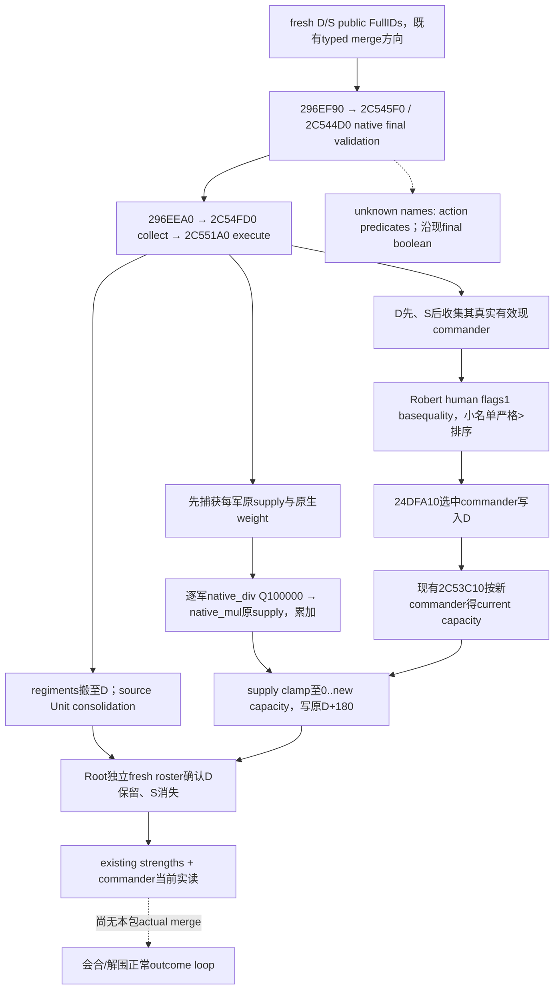

# CK3 1.20.0.3：会合、合军补给继承与沿途军需观测

2026-10-04 / ISO2026-W40。冻结源码目录 `Z:/g51`、HEAD `1c67491f8217a389bfdea75a9914afff70b44a05`，marker attempt **v47**；Root 当前运行上下文为 **R24 / PID32372**。artifact目录 `meeting-resupply-v51` 不代表runtime版本。游戏 exact CK3 **1.20.0.3 / Steam25652598**，EXE SHA-256 `94B55397ABB687A3DCD436805A5D885E6BE90FA6C693FEB44A9E3BBEEADE02A6`。

本包三个独立纯文件工作面复用已闭合供给、补员、军队操控、统帅和解围专题；新增研究限于当前会合决策需要的合军继承路径。没有SDK、游戏/窗口输入、共享source/Git/fullbuild、旧GREEN重复或新hire/merge实机信用。新合军语义为 **research / exact static-confirmed**；现口组合是recipe-ready，不能冒充新的production loop。

Root分派基线：Robert29829普通战役 `native-29829-2bc2d599f7f9`，normal date53241096、累计正常保存4032日；main2259人/39regiments、supply120/capacity300/attrition0，在8754移动向2640。2618新军基线123人，company **514** 的1647人、正常报价420尚未由本包取得hire证据。1770以及4029是计划兵数，并非本包实读、已合军人数或原生供给权重。

## 随后收到的实际合军军需结果（唯一owner消费）

本包封口前，`army_reinforcement_raise` 已唯一消费 v47 `actual-merge-local-reinforcements-01/007` strengths与009commander，并转发decoded摘要；本包不再读两份原raw。新的destination **public167772189 / CArmy83886088** 已实际1770/1770、7regiments，stored supply raw9999900/Q100000=**99.999**，capacity raw10000000=**100**，current Province2618月贡献 raw2000000=**+20**，attrition raw0=**0**；not_gathering、ready=true。current commander **34867** available，base quality28，movement selected context同34867；本包不把can_assign=false推成具体原因。

同一public3/native13/date53241096的old main83886367/CArmy50331794为2259/2460、39regiments，supply120/capacity300、current monthly contribution **0**、attrition0。因此1770现在是其owner的新实际军需primitive，4029仍是下一会合计划数。99.999与下述两阶段fixed中间截断相容，但没有本次紧邻premerge两军supply/精确native weights，不人为拼成因果算式。新军各regiment补员chunks的实际coverage未在本次decoded摘要中提供，不沿用旧v43 26/40覆盖。

唯一owner封包 [runtime-v47-postmerge-strength-commander-consumption/ROOT-DELIVERY.json](Z:/ck3_mod_rewrite_process_assets/g2-resume-20261003/army-reinforcement-raise/runtime-v47-postmerge-strength-commander-consumption/ROOT-DELIVERY.json)，owner提供 SHA-256 `08f9260d550af7bd64cd6a064dfd099eb204feb08d653e13530f1d5a031da103`。merge action/membership004005011由Root已有owner消费，不重复；本包仅链接新增生产primitive证据，自己的SDK/游戏日/窗口信用仍0。

## 原生输入先行与既有观测覆盖

| 当前所需输入 | 既有发布情况 | 当前最小处理 |
|---|---|---|
| 实际军队soldiers、存量补给、容量、月贡献、当前损耗 | 已有 `ck3_query_army_strengths`；capacity是军队库存容量 | 复用Root当前fresh叶；真实hire/merge/换省后查当前保留unit。 |
| 当前Province/owner/route、当前统帅 | fresh snapshot；existing commander candidates/assignment projection | 按实际public fullCUnitID及revision消费。123与1647是兵数，514是companyID。 |
| 目标或eligible holding的fort/garrison/occupation/siege | `objective_province_states` 和 `ck3_query_war_occupation_targets_v1` 已有相关字段 | 复用同holding实际行。2640共享goal仍是一个物理围城。 |
| 已提交2640路线的到达日/当前接触时限 | 已advertised route-contact-horizon读取stored path | 复用当前路线，不重复move；`h-N`中的N是敌军ID数。 |
| Province supply limit 与native aggregate usage | **未发布**；不是army capacity，也不是scope内stack数量 | 当前monthly getter已消费两原生入口；需要数值比较时沿同一Strength口施工。 |
| 合军后补给/统帅/容量 | 原生继承路径本包新闭合；既有查询可实读结果 | 不做客户端预测；实际merge后fresh roster → strengths → commander。 |

前置原生专题：[当前容量/损耗/月供给](army-current-supply-capacity-attrition-12003.md)、[补员首记录与reserve边界](army-regiment-replenishment-raised-reserve-12003.md)、[原生解围与围城输入](war-relief-siege-native-ai-12003.md)、[动员与合军现口](war-mobilization-12003.md)、[统帅当前质量与指派](commander-candidates-and-assignment-12003.md)。本包不新增分兵门槛或普通会合/移动的补给等待条件。

## exact .3 合军执行树

Canonical descriptor使用 `destination_army_id=D` 和 `source_army_id=S` 两个实际public fullCUnitID；现有 `merge_armies_step(D,S)` formatter生成 `merge-armies-D-with-S`，再由 `ck3_execute_step` 提交。native packet destination UnitID `+0x24=D`，source array `+0x28=[S]`。existing最终validator `0x296EF90 → 0x2C545F0` 和pair `0x2C544D0` 消费当前same Province、实际owner、fleet/action条件；使用真实native结果，不据未命名action字段人工复制许可政策。

真正execute回链为 `0x296EEA0 → 0x2C54FD0 → 0x2C551A0`。它保留指定destination原CArmy，把eligible source regiment IDs转入destination，并经 `0x24ADD60(source_Unit,destination_Unit)` consolidate source Unit。command ACK仍不是该实际状态变化。

Supply是absolute supply-unit raw，不是各自capacity百分比。destination weight为 `*0x24E0160(D,out,0) + *0x24E02A0(D,out)`（Q100000）；source weight为 `0x2A95740(source_regiment_array,flags=0) * 100000`。前者包含原生角色/definition-tag过滤，不能直接把所有public current_soldiers称为恒等权重。

普通正weight路径依次算每项 `q_i=native_div(w_i,total_weight)`，然后累加 `native_mul(q_i,original_supply_i)`；两阶段fixed中间截断不能简化为一次浮点加权平均。`0x2C55FDE` 调用既有capacity getter，再于 `0x2C560DD` 把clamp后的值写回同一destination CArmy+0x180。供给不是sum，capacities不sum/平均；月贡献也不继承相加，合后沿当前Province重新读现getter。

选将先收destination commander，后收source commanders；两者原生候选条件分开：D调用 `0x289E9F0 >=3`，S使用Character tag/FullID和 `+0x1C8/+0x1C0/+0x1B8` 任一component非null条件。Robert human分支flags1使用既有base quality，不带siege-quality bit4；候选<=32时严格更高质量才前移，同分D先稳定。更高quality的source可替换D统帅，其实际modifier因而可改变D容量。质量不会固定等同容量优势，容量直接读native getter。

完整原native树及instruction/span hashes：[TREE.md](Z:/ck3_mod_rewrite_process_assets/g2-resume-20261003/army-supply-attrition/meeting-resupply-v51/native-merge-supply/TREE.md)、[EVIDENCE.md](Z:/ck3_mod_rewrite_process_assets/g2-resume-20261003/army-supply-attrition/meeting-resupply-v51/native-merge-supply/EVIDENCE.md)、[sealed delivery](Z:/ck3_mod_rewrite_process_assets/g2-resume-20261003/army-supply-attrition/meeting-resupply-v51/native-merge-supply/ROOT-DELIVERY.json)。core `0x2C551A0..0x2C561E1` binary SHA-256 `af748088fa849b825cdea16fc45d0cbb2f2821d12323634f1636cf34c05127ee`。这是执行继承树，不声称完整原生AI的会合地点/分兵utility排序已实现。

## 当前最小query recipe

1. 复用Root当前fresh paused snapshot/war state；实际hire、merge后刷新controllable roster，选择存在的保留/新public IDs。旧v40 all8 query曾因outside-scope474整叶RED，不能把merged-away ID塞回strengths。公司514和兵数123/1647均不能作army ID。
2. 用该fresh public revision查询所需army strengths与现commander。每次实际merge后确认D保持、S消失、实际Province/owner，再读current soldiers/regiment、存量supply/capacity/monthly/attrition及真实commander。两次merge中间结果成为第二次实际输入，不能一次猜完1770→4029。
3. 目标2640若是当前goal，用fresh `active_wars[].objective_province_states[]`；非goal/沿途holding用当前war的occupation-target eligible rows，现字段含 `fort_level/garrison_size/besieging_strength/siege_observable/active_siege` 和holding/occupier身份。任意8754/2618不保证已在collection，缺行不合成零。
4. main已移动2640时，复用当前 advertised `query-route-contact-horizon-v1-83886367-to-2640-h-N-<fresh hostile IDs>` 及formatter读取stored route/current edge/arrival dates。最后边projected-contact只给当前目标假设输入；实际抵达再用actual contact/battle-control并独立读holding siege/occupation，arrival不自动算解围成功。

各leaf保留自身public/native revision及date，不把同日期不同native revision拼成假单帧；已有当前需要值就复用，不为本包重复SDK读取。现口详细可执行main参数与会合动态ID模板：[province coverage packet](Z:/ck3_mod_rewrite_process_assets/g2-resume-20261003/army-supply-attrition/meeting-resupply-v51/province-supply-limit/ROOT-DELIVERY.json)、[route/holding recipe](Z:/ck3_mod_rewrite_process_assets/g2-resume-20261003/army-supply-attrition/meeting-resupply-v51/fort-garrison-route/QUERY-RECIPE.md)。

## 必要字段缺口与可施工入口

当前monthly getter的已闭合caller使用 `0x247BEC0(Province,owner,commander,null)` 的limit及 `0x247C5A0(Province,owner,null,null)` 的native aggregate usage。两个leaf的数值return ABI、单位/scale及相关detail/contributor分支尚需独立闭合；caller位置复用 `0x24E51A0`，不重做capacity/monthly既有getter proof。当前owner/Province由fresh snapshot已有，commander由现口已有；scope内dedup CUnit数不能替代native全省usage。

若目标决策必须数值比较实际mergedforce与当地limit，最高优先级增量就是沿同一Strength查询绑定这两个exact leaf、投影当前Province limit/native usage并实机paused实读，不能用长期null的schema代替。需要当前collection外holding的fort/garrison时，最小复用 `native_bridge/src/ck3_12002_province.cpp:126 ReadObjectiveProvince` 及已有holding/rich-siege reader；历史local-siege parser不冒充部署端口。完整record补员覆盖仍沿已有 `0xD14960` data-record stride/遍历入口，首record原生fraction不合成整军净月补兵。

以上缺口是后续实际决策的施工入口；本轮已有health、路线、目标holding与合军后现口回读支持正常会合/移动/解围继续，不因全未来预测、完整AI排序或未采用的质量分支停止实机。按真实outcome再校准，不随意split编组。

## 2026-10-05 R0168：本期完整同日合军数值实证

此前Robert/v47摘要及static-only描述均保留原scope。新增[William33388的R0168专题](army-merge-r0168-no-tick-weighted-supply-12003.md)在同pausedJan20/raw53147376、同省1506实际执行D0←S16777220；pre13+14团、5660/5660与1086/1087，postD6746/6747/27团。独立post保留nativeD0、S从完整roster消失，每团current/max正好等于pre disjoint并集。原生D566000000、S108600000与两军库存8299737/29122808按D先S后两阶段fixed分别贡献6963562/4688189，post11651751完全匹配。D原来无将领，post选27357、实容量30000000；未根据quality或旧cap预测。本例低于容量，没有upperclamp信用。post+188/+190完整64/date/bucket都保留preD端点，与preS不同；不由相等反推隐藏更新/宽限重启。十份原始publicpacket、分析器和exit0report已归档，rawversion/hash的null未补造，Root exact运行绑定另存。媒体/TERM/ABC及剩余upperclamp独立验收。
