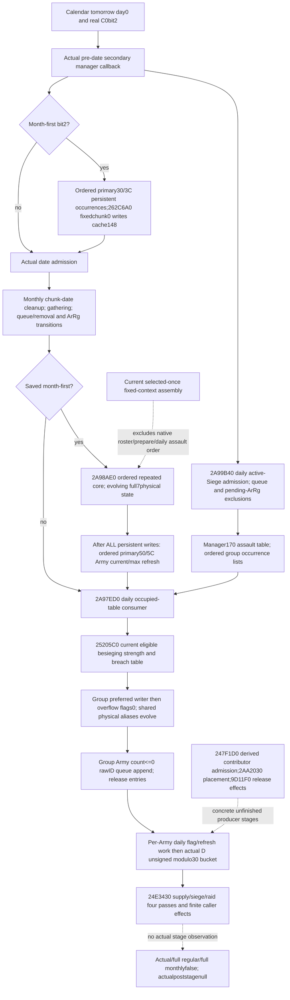

# Actual ArmyManager preparation, ordered refill and daily assault-loss stage — 1.20.0.3

Source-only package created on 2026-10-06 / W41, based on `3c26b87b1c3ecbe40978ddc7555b4a0685695798`. Exact `.3` / Steam25652598 identity and EXE SHA `94b55397abb687a3dcd436805a5d885e6be90fa6c693feb44a9e3bbeeade02a6` are reused. Scope was sealed before source work at `Z:/ck3_mod_rewrite_process_assets/g2-background-round13-20261006/monthly-manager-prepared-order/SOURCE-FIRST-PLAN.md`. No implementation, test, native build, game, SDK, pipe, Steam, UI, process inventory, profile/save or runtime operation occurs in this package.

The [selected current-context assembly](army-monthly-supply-stock-assembly-inputs-12003.md) remains valid within its declared selected-once scope. The actual manager executes additional concrete phases. In particular, **daily active-assault groups can write physical soldiers after regular refill and before the monthly supply/siege/raid four-pass caller**. This is an actual additional consumer of the shared DATA/current state, not a reason to reopen the canceled Army80B-statistics hypothesis or reclassify selected calculations as actual snapshots.

## Receiver and actual source order

`GameState` global `5C68C50` has `+A0=GameData`. The **primary** CArmyManager is `GameData+2A540`; its secondary callback interface is primary+8, therefore `GameData+2A548`. Both pre-date `2A99DC0` and post-date `2A9A590` receive that secondary interface and form the primary receiver by subtracting8. A reference to persistent primary+30/+3C must not accidentally use secondary+30/+3C.

| Ordered source stage | Actual receiver / operation | Required frame distinction |
| --- | --- | --- |
| Calendar pre-command | Existing `229C560` chooses tomorrow calendar day0 and sets `GameState+C0 bit2` | Pre-date current storage, tomorrow date and actual flag are distinct |
| Pre-date callback prefix | `2A99DC0` first calls `2A9A360(primary,tomorrow-date)`, then processes its original CArmy roster and old selected bucket work | Existing lifecycle, commander and gathering/event branches precede prepare; a later observed getter cannot be backdated |
| Daily assault group preparation | Within that original Army roster, `2A9A0A1→2A99B40(primary,Army)` | Executed **before** the month-first flag test; the assault table is daily |
| Calendar-month persistent preparation | `2A9A2E1` tests bit2; secondary+28/+34 = primary+30/+3C is an ordered DWORD persistent FullID roster; every occurrence resolves generation or fallback then calls `262C6A0` | Preserve repetition; fixed first chunk0 controls guarded preparation, not arbitrary DATA ordinal |
| Date admission | Existing daily command admits raw+24 and stores actual absolute day at `GameState+9C` | Do not treat pre-date and post-date observations as one frame |
| Post-date prefix | `2A9A590` processes its command/list prefix; bit2 calls `2A98CB0`; then `2A9AF40` gathering/due work; queue transfer/removal and group/ArRg transitions follow | These actual mutators occur before regular refill; earlier captured predicates or rosters are not automatically their outputs |
| Calendar-month regular core | Only saved bit2 calls `2A98AE0(primary)` at `2A9A8FD` | First consume ALL persistent occurrences; only afterward refresh the independent CArmy roster |
| **Daily assault-loss group consumer** | Unconditional call `2A9A905→2A97ED0(primary)` after the optional regular core | Nonempty prepared group table and the actual assault budget determine writes; not every Army and not every month |
| Per-Army daily work | Original Army roster then resets byte22, copies earlier values, and has source-visible flag/removal/refresh branches | Preserve their late-entry boundary; this package does not invent their output |
| Actual monthly bucket | `2A9AB18..66` chooses **unsigned stored D%30**, then each stored CArmy pointer receives `24E3430(Army,GameState+8)` | Preserve bucket pointer occurrence order; the four-pass initial DATA must be the state after preceding stages |

Existing detailed clock, gathering-anchor and queue/cleanup source is reused from [monthly order](army-monthly-update-order-12003.md) and [loss/caller/helper ledger](army-attrition-soldier-writeback-12003.md). This package adds no ordinary callback-execution or actual preparation claim.

## Exact persistent prepared-stage contract

`262C6A0` writes signed64 `Regi+148` on every ordinary return. If `Regi+138==0` and the definition at `Regi+118` has `+38 != 0x4744624F`, it bypasses the permission call and stores the fresh `262CAD0(Regi,out)` result. Otherwise it calls `262C700(Regi,Regi+18)` on **physical chunk0**: false stores0; true stores the fresh getter. The existing per-DATA `native_can_replenish` on another ordinal cannot substitute for that preparation call. Zero cached fraction and a positive current getter are compatible actual observations.

`2A98AE0` captures primary+30/+3C roster bounds and iterates original FullID occurrences without deduplication. Each occurrence resolves the current generation or native fallback, zeroes a seven-DWORD q buffer, reads `Regi+148`, and calls `262C9D0`. Fraction≤0 returns ALfalse without stores. For positive fraction, nonqualified chunks do not write their q slots. A native `2657F10` true plus signed positive deficit writes q to the **raw chunk+C slot** and sets ALtrue even for roundedq0 or negative signed-overflow q. The entire seven-slot calculation finishes before any physical ADD. Raw ordinal collisions, if observed, overwrite in physical traversal order; physical position and raw ordinal are separate inputs.

ALtrue makes the dispatcher traverse all seven physical chunks and add that completed buffer's raw-ordinal q to current with signed32 wrap. ALfalse skips those writes. Repeated persistent occurrences therefore read the physical state resulting from preceding occurrences; they are not the selected union's one ADD per identity. After ADD, inline pair-clear requires newCurrent≥maximum, raw association+10=−1, byte+14=0, and the resolved raw chunk+8 owner/fallback has +138=0 and definition+38 not ObDG. It clears qword[chunk+0], both maximum/current; it does not write state+18 or add a clamp.

Only after **all** persistent writes, the dispatcher traverses the independent primary+50/+5C CArmy FullID occurrences and calls `24E8120`. That method refreshes every stored Army+38/+44 ArRg through `2633340`, preserving DATA aliases and character1/1. Its excluded80B statistics do not supply the subsequent stock/loss budgets. Persistent and Army rosters cannot be reconstructed from only the public player/war Army query or its associated DATA union.

The cached complete `2657F10` provides an actionable evolving-current predicate recipe. It first rejects maximum0 or current≥maximum; resolves raw chunk+8 Regi/fallback and its origin Province+120; rejects Province+788≠−1; state3 returns current>0. Other states reject Province+73C≠−1. Invalid ArRg magic/ID−1 permits the remaining path; a valid ArRg resolves its Army+140/fallback and requires Army bytes1D4/1EC=0, native `24E8360(Army)` false, resolved Unit+170≤0 and native `24ACAC0(Unit)` true. Those noncurrent operands/predicates must be independently captured for an evolving calculation: a single observed false result can hide an unexecuted later branch. No client-side guessed AND of the independent `262C700` and `2657F10` is introduced.

## Daily assault table admission and consumer

New source `2A99B40..2A99DBD` closes the relevant pre-date producer. In order:

1. `24E8560(Army)` must return true. Resolve Army+124 Unit/fallback, its current Province+20/fallback, then Province+788 Siege FullID through `5D1EC88` or fallback `5D1EC60`.
2. Siege+44C must be nonzero. Army+10 must **not** already occur in primary+68/+74 removal queue.
3. Hash the resolved Siege FullID+8 and call `2AA2030` on primary+170 to obtain its group entry. Append Army+10 to the group+10/+1C DWORD list. This append has no deduplication.
4. Look up this Army in primary+130 pending-ArRg table. Its sentinel controlFF skips the ArRg append loop. Otherwise traverse original Army+38/+44 ArRg IDs; IDs already present in that pending record's +10/+1C list are excluded, all others append to the assault group+28/+34 list in stored order. This group list also preserves repeated admitted occurrences.

The group table is constructed by the **daily pre-date callback**, before the calendar-month preparation check. `2A97ED0` consumes it in the **daily post-date callback**, after the optional monthly refill. It does not recheck Siege+44C or impose a new month-first gate. Thus a current empty table is a valid empty consumer entry; it is not proof that the next pre-date callback will produce no assault group.

The consumer scans occupied physical table entries at primary+178 with stride0x40, using +184 and unsigned byte+188 to form the native end. It skips control byte0; iteration is **physical table order**, not insertion order or sorted Siege IDs. At each entry:

- Resolve entry+8 Siege FullID with generation/fallback and call existing `25205C0`. No additional Siege magic/admission gate exists in this consumer.
- The whole signed32 budget0 skips allocation. Nonzero budget first sums valid group+28 ArRg currents whose definition+2A0≤0. It computes the signed minimum of original budget and that sum, then uses ordered current/remaining low32 multiplication, signed division and `26341B0` writer/refresh. Every writer can change physical chunks shared by subsequent ArRg entries or groups.
- Original budget minus that initial cap, when positive, passes the same group descriptor to `2A95800` with flags0. Unused per-writer remainder is not silently turned into this caller-overflow value.
- Every group+10 CArmy occurrence is resolved again. `2A95740(Army+38,flags0)≤0` appends the **raw group ArmyID** to primary+68. This is a later queue entry, not immediate Army removal.
- After all groups, `9D11F0` releases each occupied entry's record at +10; its control byte becomes0 and manager+180 occupied count decrements. The direct count/control writes are known; the release callee's transitive effects remain an explicit boundary.

`25205C0` is the already published **assault expected-loss getter**, not a supply component or generic monthly-rate scalar. It reads Siege+200 current Province, returns0 for invalid Province magic, nonpositive eligible besieging strength, or breach−1 outside the loaded percentage table. Otherwise it takes `247F1D0(Province)` and the actual loaded breach percentage entry, using its existing signed fixed arithmetic/whole truncation. Its current output cannot be substituted for a post-refill output when eligible besieging current changed. The existing supply-contributor mode0 sum is not this assault-eligible sum.

## Smallest directly useful readonly inputs and producer stages

The next native candidate should extend the **same existing Strength query**, with a shared manager capture reused across requested rows, and independent finite-family readiness. It should not call preparation, table insertion, transfer, writer, removal or any manager mutator.

| Minimum family / operands | Existing versus missing | Independent value and next producer |
| --- | --- | --- |
| Actual current flags/date/rosters | Existing current date/day/bucket/date64 primitives; **missing** raw C0bit2 and ordered primary30/3C persistent plus50/5C Army FullID occurrence lists | Source-defined current scheduling/preparation coverage; preserve raw IDs, resolution/fallback, positions and repeats |
| Full persistent physical cache | Existing associated DATA prepared/fresh fractions and per-selected chunk predicates; **missing** unassociated complete7 chunks, raw chunk+C/8/10/14/state/date1C, persistent138/definitionmagic, fixedchunk0 permission | A current-entry prepared model can write derived148 from explicit guard/permission/fresh getter. Actual pre-date output still needs its proper input frame |
| Evolving chunk eligibility context | Single captured bool exists; **missing** independent origin Province788/73C, exact resolved/fallback references, Army1D4/1EC and native24E8360/Unit170/24ACAC0 operands | Recompute the already closed predicate after prior ADD/pair-clear. Fixed captured context must be stated, not called actual later eligibility |
| Current occupied assault table | **Missing** primary170 table header/control/physical order, each raw/resolved SiegeID, group Army/ArRg occurrence lists and their complete DATA/tier/writer-admission state | Nonzero current-entry group loss can independently reuse the actual writer/residual kernels across shared physical aliases; actual full daily execution remains separate |
| Current assault scalar/context | Existing Province rich assault getter/identity/breach for its limited target scope; **missing** same-Strength group-scoped exact signed25205C0 return, actual Province and loaded casualty table entry/length | Publish the native current whole scalar for an explicit same-entry group model; do not relabel an old scalar post-refill |
| Post-refill assault eligible sum | Existing readonly ABI247F1D0; current supply mode0 is a different sum | **Next narrow source entrance:247F1D0** contributor/admission tree, then a group-Province collector/producer using derived current. Reuse current getter without invoking a mutator; no hypothetical owner/alliance substitution |
| Next prepared group construction | Producer2A99B40 direct body is closed; current table and pending130 lists are absent | Capture actual pre-stage Army roster, current Siege44C, queue68 and pendingArRg lists. Exact future physical table placement/growth requires **2AA2030** source, or an actual populated stage observation; do not sort a logical group dictionary and call it native order |
| Whole actual daily suffix | Existing queue/cleanup primitives are partial; release9D11F0 and per-Army flag branches remain actual source entries | Keep actual/full monthlyfalse; model only source-closed selected phases until these concrete mutable stages provide their next frame |

The minimal first delivery has useful current values even outside month-first: roster preparation coverage, exact fixedchunk0 admission/current fresh versus cached fraction, and current nonzero assault-group budget/request/conditional physical writes. An independently ready empty current table retains a real zero result but provides no future no-assault guarantee. The separately owned [ordered regular-refill plan](army-ordered-regular-refill-projection-plan-12003.md) records the observed-prepared scoped core entrance; this package does not duplicate its implementation or tests.

## Evidence, cost and honest readiness

Reused full source spans: v61 `source-clock-new-spans/army-pre-stage-entry` and `neighbor-manager-daily-entry`; `calendar-bit2-second-army-callee` plus continuation; `ordering-new-spans/persistent-stage-hook-262c6a0` and `persistent-refill-allocation-262c9d0`; `.3` cached replenishment ABI320B `2657F10`; episode03 exact357B `25205C0` with SHA `ea52a17c4d8d092dc8a57a05f88bc294d1a277ad72176ad83c0c434bae26267f`. Existing qualifications and historical live days are reused, never rerun or recredited.

New necessary source is `2A97ED0..2A981F1`801B SHA `7faece64bf87f007bc24237d0f2fcb2a10cbce78fe1155dc6da14b868d1c8de8`, plus the443B continuation of `2A99B40` after its held194B prefix. Complete637B producer SHA `9d4ffe6848ad80c8bff96c277e8a1acdcb02412a2f18c00af7b35562c42b7ab2`. Actual new frozen-file I/O is2289B: unique new code1244B, avoidably repeated already held code357B and metadata688B. The duplicate25205C0 read happened before its pending broader canonical lookup result was inspected; its589B I/O remains recorded and grants no new unique source credit. No old EXE body, full file or prior test was subsequently reread to reconfirm that result.

This package grants **research/source-closed actual ordering, prepare/direct assault consumer and minimum observer/producer plan**. It grants no new runtime observation, pure-model qualification, native candidate or full actual execution. All actual loss/refill/effect flags remainfalse, actual post-stage remainsnull and full regular/full monthly readiness remainsfalse. `SOURCE-*.json`, source-first correction, machine-readable stage/input ledger and Oct6/W41 coordinator fields are sealed in the round13 packet; coordinator owns shared reports and push.
