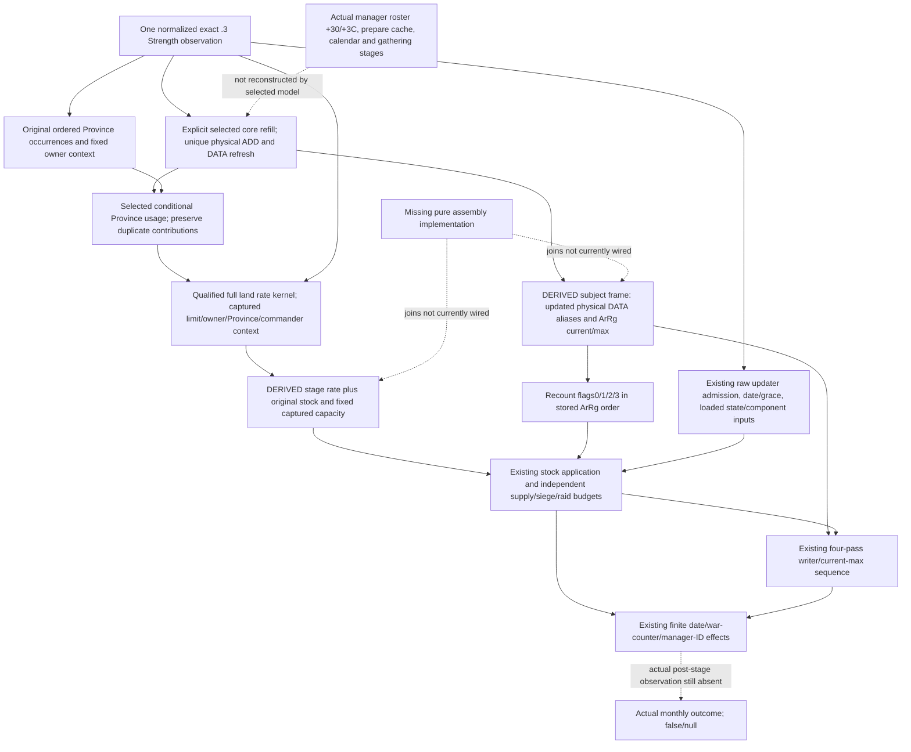
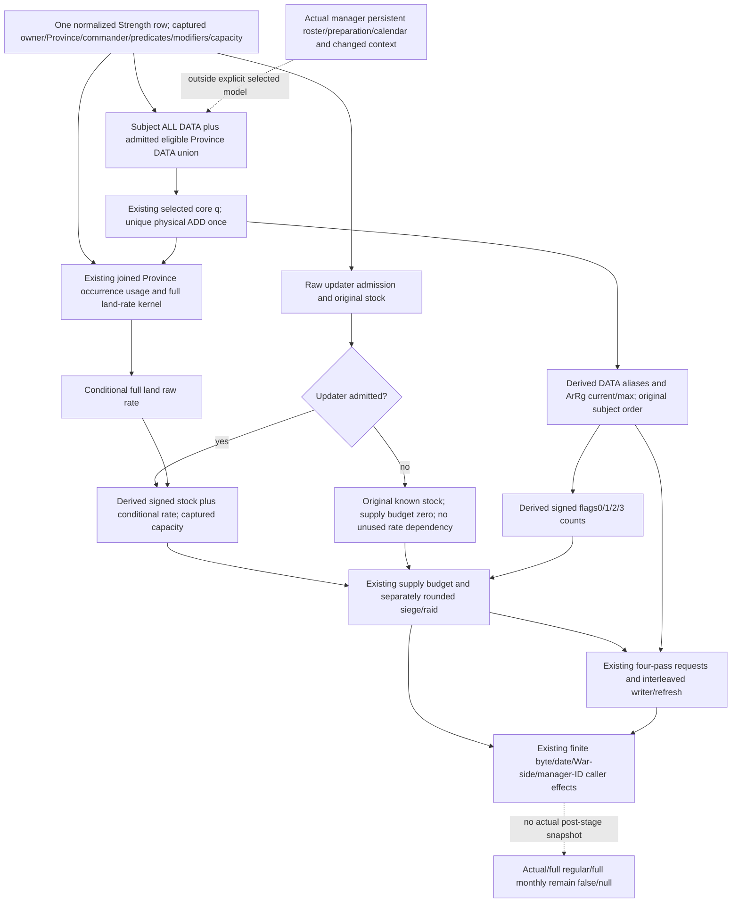

# Selected refill, land rate and monthly supply-stock assembly inputs — 1.20.0.3

This is an **inventory and implementation plan**, based on published source `16f8e01f22ca5221f9094e86aff1dc916783c7bb`, created on 2026-10-06 Asia/Shanghai. The exact-build identity and qualified source contracts are reused from the linked topics. New EXE reads, old source hashes, implementation, tests, native builds and game/runtime operations are all zero. The source-first plan is external at `Z:/ck3_mod_rewrite_process_assets/g2-background-round11-20261006/monthly-stock-capacity-assembly-inventory/SOURCE-FIRST-PLAN.md`.

## Finding and selected scope

The next missing piece is **pure stage assembly**, not another native scalar. All numerical operands for a conditional entry into `24E3430` after the already selected one-core-invocation refill are publishable by the existing exact `.3` same-Strength query. The full land-rate kernel is also source-closed and qualified. It is currently independent: `army_loss_allocation_projection.py` calls the initial-frame budget, associated-refill and Province-usage kernels separately and does not call `project_full_land_supply_rate_v1` or combine their resulting frames.

The permitted calculation scope is explicit: one selected core invocation per observed persistent/cache; original stored Province and Army/ArRg occurrences; captured owner, current Province, commander, admission/eligibility and loaded modifier context held fixed. It can produce a selected-refill/current-context rate, conditional stock, conditional budgets, four-pass current/max and finite caller effects. It does not reconstruct actual manager preparation/order, all other refresh statistics, a future context, actual daily/calendar execution or a newly observed post-stage state.

The observed `current_supply_capacity_raw` may be retained as the capacity scalar **within this explicitly fixed captured context**. It must not be renamed an actual post-refill capacity observation. The `2C53C10` source depends on Army `+120` commander, effective Character properties `1D3/1D4` and loaded FULL_SUPPLY; it does not consume the canceled Army `+130..17F` vector. The selected current/max model changes associated chunk current and ArRg current/max, and does not recompute those context operands. A real native refresh/manager sequence or changed commander/context needs its own relevant observation or producer model.

## Input ledger at published baseline

“Published” below means source-defined native capture and production normalization exist, with the linked fixture/live provenance. It does not claim that a new real paused snapshot contains every value jointly; local game access is prohibited. Null due to a failed selected read or an unused branch is separate from an intentionally unobserved actual post-stage output.

| Stage | Existing observation or pure output | Native receiver / context | Present value versus null | Assembly use |
| --- | --- | --- | --- | --- |
| Subject identity | `army_id`, `native_carmy_id` | public full CUnit ID, Unit `+178` resolved CArmy, Army `+124` backlink | Valid published IDs; unavailable parent remains unavailable | Keep the same subject throughout |
| Current Province/owner | `current_province_supply_contributors_v1` subject IDs, `province_id`, `owner_character_id` | Unit `+20` Province, Unit `+174` actual owner Character | Available typed IDs; unresolved identities remain partial | Rate/usage context join; use original stored occurrences |
| Refill physical inputs | top-level `regiment_replenishment_records_v1`; eligible contributor rows' `replenishment_records_v1` | ArRg `+20/+2C` DATA; Regi seven chunks; prepared fraction `+148` | Full DATA is published, not first-record-only. Partial records stay partial | One physical selected ADD per `(persistent_id, chunk_index)`; repeated DATA remains repeated refresh input |
| Refill output | `project_conditional_associated_refill_current` physical chunks and refreshed current/max | Source `262C9D0`, `2A98BA8`, `2633340` | Associated current/max can be ready even when all seven requests are not observed; no invented zero for missing physical chunks | Build subject post-refill DATA and ArRg frame |
| Province usage | `same_input_conditional_province_supply_usage_v1` / `project_conditional_current_province_supply_usage` | Province `+740/+74C`; same-owner or `2C090F0(owner, other, null)`; `2A956D0` eligible ArRg | Current scalar and conditional usage have separate readiness; legitimate empty roster gives zero | Explicit selected usage passed to full land-rate kernel; do not deduplicate occurrence sums |
| Province limit | `native_supply_limit_soldiers` in contributor family | `247BEC0(Province, owner, commander, null)` | Published signed whole count, including zero | Retain captured same-context limit |
| Full land rate | `current_land_supply_rate_inputs_v1` plus `current_land_resupply_v1`; `project_full_land_supply_rate_v1` | Current actual owner/Province; Army `+120` raw/resolved commander and fallback; Province component and effective `1A9`; loaded slope/min/max/floor/gain | All required raw operands are implemented/qualified. Fleet is `not_land`, missing slot is unavailable; false/component/key/loaded zero are real zero | Replace only the temporary stage's rate with `conditional_full_land_rate_raw` |
| Original stock | `current_supply_raw` | CArmy `+180` | Published signed64 Q100000, including stock above capacity | Start stock application from this raw value, without clipping first |
| Capacity | `current_supply_capacity_raw` | `2C53C10(out, same CArmy, null)` and captured commander/loaded context | Published signed64 Q100000; no new permanent-null field is required | Use as fixed-context capacity scalar; not actual post-stage capacity |
| Updater admission | `monthly_loss_budget_inputs_v1` raw `unit_native_170_raw`, combat/gathering bools, Army `+5C` | Resolved same Unit; `24AC3E0`, `24AC160`, actual signed count | True/false/raw zero published; no substitution by UI unit state/gathering-days label | Preserve source gate order before stock update |
| Clock/grace | `army_update_clock_v1` current date low32, anchor low32, loaded grace; caller family current date64 | GameState `+8/+9C`, Army `+188/+190`, loaded `5C69AA0` | Date/grace zero valid. Current actual bucket may be absent/unreadable separately | Current-frame explicit hypothetical caller date; signed wrapping age/trunc0/strict greater |
| Fleet supply suppression | budget family `native_fleet_supply_loss_suppressed` | `24E8460` fleet/current-Province match; Fleet date, native sentinel/current date | Known false is usable; unavailable read remains null | Independent supply-budget zero branch; not an embarked label |
| Supply state and component | budget loaded ordered levels/fractions; `commander_valid`, modifier ordinal/raw | Actual vector slots `5456498/54564A4`, `5451308/5451314`; captured commander aggregator `+68`, current Province definition ordinal | Full arrays/zero are published. Invalid commander intentionally has null modifier and returns base unclamped | Reuse existing post-stock state/component calculation |
| Post-refill counts | subject `regiment_strengths` current/max, existing eligibility and siege tier; derived refill refresh rows | Army `+38/+44` stored ArRg occurrences; current `+38`, definition tier and native `2A956D0` | Current observations exist. Refreshed aggregate fields have to be computed; they are not missing native slots | Recount flags0/1/2/3 from derived currents in stored order |
| Siege/raid inputs | `loss_application_inputs_v1`: activity, loaded rates | Siege `24E8560` / `5C69618`; raid Army `+1E8` / `5C69098` | Activity false produces independent zero; active uses actual loaded rate | Independently round both against post-refill/pre-loss all-current count |
| Four loss passes | same-order DATA, writer admission, association, tier/eligibility, explicit new budgets | `26341B0` / `2657EA0`, `2633340`, `2A95800` | Existing sequence is qualified for explicit frames; initial DATA cannot be used as post-refill DATA | Feed a copied derived DATA/current/max frame, then let existing sequence reload its own per-pass aliases |
| Finite caller effects | `monthly_caller_effect_inputs_v1` byte/date64, original WarID occurrences and counter cells, manager ID list | `24E3430` date/war-counter/manager-list tail | Native input values exist; side `-1` skips legally. Missing row remains partial | Pass newly constructed budgets and derived loss sequence to existing caller-effect kernel |

There is no permanently-null **required scalar** in this fixed-context numerical scope. Intentional actual outputs (`actual_post_stage_current`, `actual_post_supply_usage_soldiers`, `actual_caller_passed_date_raw64` and corresponding actual-after flags) are not observation DTOs and must remain null/false. `complete_persistent_requests_ready`, full regular/monthly flags and unreadable per-frame inputs still describe their own narrower boundaries; they do not create a new capacity/rate unknown.

## Actual order and the current composition gap

1. `2A98AE0` applies selected persistent q through `2A98BA8`, then `24E8120 → 2633340` refreshes ArRg current/max. The full native manager uses its original primary `+30/+3C` persistent roster, including occurrence order. The already implemented selected model deliberately specifies one core invocation per observed persistent/cache.
2. On an explicit `24E3430` entry, `24E4D10` writes byte22, evaluates raw Unit/combat/gathering/count/grace admission, and on success writes date188, obtains the full same-current-Province land rate and computes signed64 wrapped `stock + rate`. A negative sum becomes zero; otherwise the stored result is signed `min(sum, captured fixed-context capacity)`. There is no divide by30, elapsed-day scaling or pre-clipping of starting stock.
3. Successful update alone invokes `24E32E0` using the resulting stock. Its positive component counts eligible current **after refill but before losses**. Siege and raid are independently constructed from that same pre-loss all-current total and separately rounded before any writer; the sum is not a combined fraction.
4. The four passes use those original whole budgets. Per-pass writer/refresh updates are already interleaved by `army_loss_sequence_replay.py`. War-side accumulation uses original signed `J+S`, and final manager-list append uses original `J+R+S` plus derived final current; physical casualties do not replace those operands.

The existing budget kernel at `army_monthly_loss_budget_projection.py:158` reads `current_supply_change_monthly_raw`, not the selected rate; lines101/237 read the initial `whole_soldiers`/`supply_eligible_soldiers`. Its copied state at line187 passes the original DATA/current into the sequence. The caller-effect kernel is then called with that original-budget result by the allocation wrapper. Merely replacing the monthly rate misses the post-refill counts and physical DATA and gives the writer the wrong initial soldiers.

## Minimum directly implementable next package

Proposed independent entry: `project_selected_refill_monthly_supply_assembly_v1(same_query_strength)`, exposed as `same_input_conditional_selected_refill_monthly_assembly_v1` alongside existing outputs. No new native action, DTO, getter, target or observation gate is required for this selected current-context scope.

1. Retain the normalized observed row unchanged. Derive one union of subject full DATA and admitted eligible Province contributor DATA; select one q per unique physical persistent/chunk and preserve all original DATA and roster occurrences. Reuse the existing refill numeric/refresh helpers. Include subject ineligible ArRg because the siege/raid all-current and later loss sequence need them even though Province supply usage does not.
2. Create a private **derived** subject frame. For every DATA alias replace physical current/max from the selected physical result; recompute effective current as maximum only for state3/current0, preserving state and raw association. Replace ArRg current/max with source refresh results and retain original tier/eligibility/writer-admission metadata. Recount signed wrapped flags0/1/2/3; update the temporary loss-input count fields. Do not normalize this frame as a fresh observed query or create a fake snapshot/revision. Use existing missing-input statuses when a needed DATA/tier/predicate is unavailable; no new cap or policy gate.
3. Count Province usage from that same selected physical state and original occurrence sequence, then call `project_full_land_supply_rate_v1` with the explicit selected usage. Retain the current observed total rate as a comparator; set the temporary frame's rate to the conditional raw. Hold only the captured owner/Province/commander/modifier/capacity context explicitly fixed.
4. Call `construct_conditional_monthly_loss_budgets(derived_frame)`. It already handles updater rejection, signed stock application/capacity, tables, commander/fleet branches, independent rounding and nested four-pass sequence. If updater is rejected, the known stock/supply0 branch need not demand an unused full rate; siege/raid still need their proper post-refill current count. Carry an explicit basis so the nested first stage is labeled derived, including its existing first-pass `observed_initial_stage` label, rather than claiming a new observation.
5. Call `project_conditional_monthly_caller_effects(derived_frame, new_budget_result)`. Expose each stage's readiness and actual missing inputs independently. Actual loss/refill/effects stayfalse, actual post-stage values staynull, and full regular/monthly live readiness staysfalse. The original observed budget, original sequence, date and row remain intact.

The necessary future verification is one **new compound production assembly case** with nonzero selected refill, changed usage/rate, a stock-state crossing, changed eligible/all-current budgets and a first writer that proves it consumes post-refill DATA. Include only relevant partial/rejection branches in that same new case. Do not rerun the qualified refill, land-rate, budget, writer or old compiled-wire cases; no native build is needed unless a genuinely missing capture is discovered during implementation. This plan executes none of those checks.

## Smallest remaining actual-observation entrance

For this numerical selected scope there is **no additional readonly input request**. Full actual regular-month execution still has a separate concrete input family: CArmyManager at GameData `+2A548`, ordered persistent FullID roster at primary `+30/+3C` used by `2A99DC0/2A98AE0`, pre-date `GameState+C0` month-first bit2, exact admitted date and per-roster Regi `+148` prepared cache/full chunk state, then actual gathering/due processing and real pointer bucket membership. The roster must retain repeats; an observed once-per-persistent DATA projection cannot substitute for that manager schedule. Existing clock buckets/date/grace are reusable, and the source entries are already known; this inventory does not call those mutators, add an observer or reopen their scalar internals.

Changed future owner/Province/commander or relation context likewise uses a new same-query capture through the existing provider entrances: `247BEC0` limit, `2C09D30` owner/Province resupply verdict, land raw-input collector, `2C53C10` capacity and the existing post-stock component context. No permanently-null placeholder is proposed. While local game access remains prohibited, the next authorized useful delivery is the pure assembly above, not a new paused claim.

## Evidence reused and readiness

- [Monthly native order and clock](army-monthly-update-order-12003.md): actual pre-cache/month-first/refill/bucket order and manager source entrance.
- [Current capacity and attrition](army-current-supply-capacity-attrition-12003.md): native capacity signature/context and existing current observations.
- [Loss writer, budgets and caller effects](army-attrition-soldier-writeback-12003.md): updated stock/component formulas, per-pass aliases and finite caller effects; canceled80B hypothesis and qualified contributor provider.
- [Full land rate inputs and first qualification](army-land-supply-rate-inputs-12003.md), [land resupply verdict](army-land-resupply-admission-12003.md): all actual raw operands, context/fallback behavior and fixed-current-context kernel.
- Existing cached manager ledger `Z:/ck3_mod_rewrite_process_assets/g2-resume-20261004/army-monthly-update-order-v61/source-clock-new-spans/NATIVE-CLOCK-ENTRY.md`: primary `+30/+3C`, C0bit2 and actual ADD/refresh. No game bytes or cached-body hashes were reread.

This package grants **research/source-closed input inventory and directly implementable pure assembly plan**. Existing component qualifications remain their own static-ready facts. Assembly is not implemented by this package and has no new test, compiled sample or live credit. Actual/full-monthly flags remain false/null. Oct6/2026-W41 fields, machine-readable ledger and source-plan receipt are external in the package named above; coordinator owns shared reports and push.

## Selected assembly implementation and FIRST qualification — 2026-10-06

The inventory above is preserved as the `02d36db` package's historical source-first finding. The missing pure joins are implemented by the subsequent package on baseline `c2241c6adaedb785a646519d35e1ce2fea009ae1`, including the already adopted joined full-land-rate service value. The implementation-first plan is sealed at `Z:/ck3_mod_rewrite_process_assets/g2-background-round12-20261006/selected-refill-monthly-assembly/IMPLEMENTATION-FIRST-PLAN.md`; this package makes no new EXE read, native field, schema, action, strategy, gate, build or game operation.

`army_selected_refill_monthly_assembly.py` exports `project_selected_refill_monthly_supply_assembly_v1`. `GameplayBridgeService.query_army_strengths` adds `same_input_conditional_selected_refill_monthly_assembly_v1` and passes its existing joined land-rate value into the new helper. Observed normalized rows, initial-frame allocation/budgets, native readiness, query date and revision retain their existing meanings.

The selected physical union includes **every subject ArRg DATA snapshot**, plus admitted eligible Province contributor DATA. Subject ineligible regiments therefore receive their selected refill before all-current siege/raid counting. Each physical persistent/chunk receives one selected ADD; repeated DATA records and Province occurrences remain repeated refresh/count contributions. A private derived frame replaces DATA physical current/max and effective current, ArRg current/max and all four flags0/1/2/3 counts. The full conditional land rate replaces the private frame's monthly rate; it is never an observed post-refill rate. The existing stock/budget, four-pass writer/refresh and finite caller-effect kernels then consume this derived frame. The first pass and nested writer are explicitly labeled derived.

Readiness is independent by stage. A known updater rejection retains stock and supply0 without requiring unused land-rate/Province families. Missing required rate preserves selected subject counts and independent siege/raid budgets. Missing ineligible subject DATA preserves ready eligible counts, Province usage, land rate, stock and supply budget; it leaves all-current/siege/raid and the full derived loss sequence partial. Unknown selected current never falls back to the original regiment current. Physical chunk completeness is published separately from the conditional current/max and finite-effect assembly; all seven persistent requests and actual regular manager execution are still separate boundaries.

FIRST production service compound executed once at **2026-10-06 11:49:59.746902 Asia/Shanghai**. It uses the inherited production query, actual production normalizer and all existing/new pure kernels; only snapshot/capabilities/execute-step backend boundaries are memory fixtures. `test_selected_refill_monthly_assembly_service.py` ran **one new test, GREEN**, `0.024 s` unittest time (`3.2408652 s` process receipt). Importing existing fixture constructors did not execute their old cases. No previous case, wire or component test was rerun.

| New scenario in that one compound | Verified conditional result |
| --- | --- |
| Nonzero refill and stock-state crossing | Unique physical current80→90 and50→70 with q10/q20, one ADD each; duplicate DATA remains8 records; subject current210→250, flags0/1/2/3=`250/180/180/180`; duplicate Province usage320→360; land raw rate700000→−50000; stock1040000→990000, state index2; S/J/R=`18/41/12` versus preserved initial-frame `0/35/10` |
| Derived first writer and caller | First supply request reads ArRg180 and first physical writer reads current90; four-pass final aggregate108 and physical delta−71 remain conditional; original S+J=59 adds to the repeated War cell5→64→123; explicit current64 hypothetical caller date is retained, actual passed date stays null |
| Missing required land rate | No old-rate fallback; post-stock/supply unavailable, refreshed all-current250 and independent J/R=`41/12` survive |
| Rejected updater, rate/Province families absent | No unused-rate demand; known stock1040000 and S0, refreshed J/R=`41/12`, sequence and caller independently ready; previous date64 retained |
| Missing ineligible subject DATA | Counts=`null/180/180/180`; selected rate−50000, stock990000 and S18 ready; J/R/current sequence partial and the missing subject current stays null |

Qualification is **bounded static-ready production service assembly**, conditional on the specified selected core invocations and fixed captured context/capacity. This is no new compiled-wire or real paused qualification. `actual_replenishment`, `actual_loss`, `actual_effects`, `full_regular_refill_ready` and `full_monthly_ready` remain false; actual post-stage current/usage remain null. The original allocation's actual loss readiness also remains false. The next concrete actual-monthly entrance remains manager `GameData+2A548`, original primary persistent roster `+30/+3C`, month-first `GameState+C0` preparation and real gathering/due/bucket order; those stages must not be replaced by this selected-once union. FIRST receipt, all four service outputs, machine-readable delivery and Oct6/W41 report fields are external in the round12 package. Coordinator owns shared reports and push.
