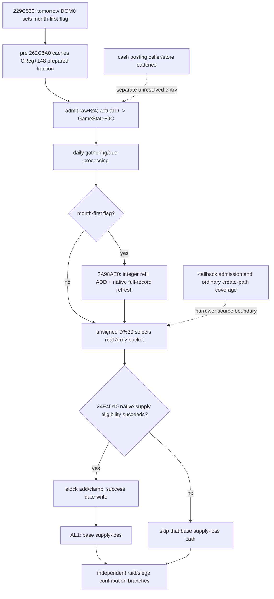

# Army calendar-month refill and independent supply/loss clock — 1.20.0.3

本专题绑定 CK3 1.20.0.3 / Steam 25652598，EXE SHA-256
`94B55397ABB687A3DCD436805A5D885E6BE90FA6C693FEB44A9E3BBEEADE02A6`。
冻结绑定复用；只读取必要新增窄 span，不重新全读/哈希 EXE。状态是
**research：实际调度、更新先后及关键整数计算已闭合**。纯文件时钟为
**static-ready**；新的生产 timing observer 尚未由 Root 部署验收。

## 两套时钟及真实先后

`CDailyTickCommand` pre-stage `29882A0` 在 `298841A` 调用 `229C560`。
它计算 next raw=current+24，
`D=trunc0((int32(next_raw-0x29C55C0))/24)`，normalized D mod365
查原生 day-of-month 表 `444C340`；day=0 时将 GameState+C0 bitmask2置位。
原生月起点为 0/31/59/90/120/151/181/212/243/273/304/334，全年365日，
该表没有闰日。因此 regular 补员发生在日历月首，不是固定30日间隔。

月首 pre-stage `2A99DC0→262C6A0` 先缓存 persistent CRegiment+148 的
signed Q100000 fraction。随后 `22A0D80` 接纳 date+24，`22A0F1E`
把实际新 date 推导的绝对 D 写 GameState+9C。实际 post-day manager 是
GameData+2A548；constructor `2A95FB0`、RTTI `CArmyManager` 和
secondary vtable `477C2E0+18→2A9A590` 已闭合。

该 daily callback 先处理独立 gathering/due 逻辑 `2A9AF40`，再在 bit2
条件下 `2A9A8FD→2A98AE0` 做 regular refill 及兵力刷新。之后
`2A9AB18..66` 以 stored D 的 **unsigned%30** 选择实际 Army bucket，
逐 CArmy/dateptr 调用 `24E3430`。旧构造入口 `24E3425` 已证实为
INT3 padding，不是函数开始。

被选中 Army 的 `24E4D10` 仍受原生日期/资格条件控制；成功后写
Army+188 date64、stock+180 加整月 signed raw、按 capacity clamp，返回 AL1。
wrapper 只有 AL1 才调用 base supply-loss `24E32E0`，该计算读更新后的 stock。
另有 raid/siege contribution 分支，不能把它们揉成唯一供给成功条件。

图表示真实条件和先后，不表示每个 Army 当前都更新、无 attrition 可永久安全，
或每次已采样 final getter 能还原之前实际执行的 prepared inputs。

## Actual bucket registration and smallest current observer

新增 A3 闭合了真实 add writer，证据不限于 removal：registered secondary
vtable+48→`2A99590` 重建 callback 遍历该 manager 的全 CArmy FullID roster，
校验实际 CArmy，`2A998CF..DE` 读取 CArmy+10 完整 ID、取 unsigned%30，
`2A998E2..EA` 选择 secondary+190+24*phase（primary+198）的 bucket，
`2A998F6→880340` 实际 append CArmy* 并 count++。room/grow 两支都已闭。
清 bucket callback 的实际槽是 +38→`2A993A0`。

这里闭合的是注册 virtual reconstruction callback 的完整 roster 写入，
未穷举外部何时调用 +38/+48 或所有普通创建路径。因此最小生产 observer
直接扫描实际30个 bucket，匹配本行 resolved CArmy*，发布实际 membership；
不以 public CUnitID 或猜测 ID 代替该观察。

Root 已因实测两次−36/一次−35损失授权在现 strength query 加 timing optional
子 block：actual bucket、GameState+9C signed D及同帧 date、Army+188实际
successDate64、Army+190 grace/dateanchor、加载的 `5C69AA0` threshold。
这些只是 native clock/资格输入；它们不制造净兵预测、现金 posting 或新门禁。
部署、生产 focused 验证及 paused 实际查询由独立后续包记录。

## Integer refill and real strength refresh

`262C6A0` 的 guarded false 路径缓存 F=0，其他原生许可路径取 `262CAD0`
并写 CReg+148；不写 current chunk。actual `2A98AE0` 用 zero28B int[7]
输出调用 `262C9D0`。每个原生 `2657F10` 允许且存在正 deficit 的 chunk：

`q=trunc0(min(maximum*cachedFraw, deficit*100000)/100000)`。

state3/current0 的 effective current=maximum。ALtrue 可仍得到 q=0。
caller 按 chunk+C ordinal 把 q 加到 persistent chunk+4。闭合的
prepare/allocation/application 路径没有存储跨月分数 carry；不推广为整个游戏
所有生产者都没有 carry，也不合并两个独立 permission bool 成客户端 AND。

随后 `24E8120→2633340` 读取 ArmyReg+20 data pointer/+2C count，实际
DATA record stride0x10、record+8 persistentID、+C chunk ordinal，累计完整
current/max，在 `26338C0/26338C3` 写 ArmyReg+38/+3C，再刷新 Army aggregate。
这闭合 full-record 原生施工入口，不意味着现 MCP 的 first-record detail
已经完整发布。必要增量是 CReg+148 prepared fraction 与这些 full DATA records，
而不是把第一样本月率当作整军净补员率。

剩余 contribution allocator `2A95800` 以 local remaining budget/eligible total
逐行分配整数，调用真实 hard-loss writer `26341B0`；剩余重新分配只在当前调用
内发生，不是跨月 carry，也不引入 battle finalizer 的独立调度。

## Actual inputs, readiness and future clock helper

after39 health sole consumer 的 actual native300/pub2/raw53254992：own
301989997=3585/3884/41（此前3621净−36）、old184549452=3000/3000/24、
enemy268435597=2692/4702/41（此前2539净+153）。当前供给分别300/100/300；
own monthly supply0/attr0.01，old/enemy monthly+20/attr0。
该帧只汇总 avail/unavailable：own28/13、enemy38/3、old24/0，未汇总每项
reason，不倒填旧帧 reason。敌 first persistent1408/chunk0 月率从1275变为
2775/Q100000，当前51/73；不能据此做 constant-rate 历史归因。

随后 fresh8 native335/pub2/raw53255184 的实际 own3550（再−35），enemy2692、
old3000；这次新帧才明确 own13/enemy3 unavailable reason 全为
`army_regiment_first_record_absent`。已授权新 timing 字段尚未部署。
fresh8 receipt 是 movement sole owner `452ca4f24e488cdb0153ea505a8a96d5d01448e6e10ef369fe76a07500349d77`。
Root 的 saved ledger 4619/res1466/Oct4+594 原样引用；本 source/helper 包增加0游戏日。
33日/39日的−36/+80/+153，以及新8日−35仍是观测净变化，未资格为执行原因。

[`ck3_native_army_update_clock.py`](../../tools/ck3_native_army_update_clock.py)
嵌入 exact native 两张365B表；CLI
[`run_ck3_native_army_update_clock.py`](../../tools/run_ck3_native_army_update_clock.py)
仅列未来 admitted dates、month-first 和 actual manager phase，可接受独立
observed bucket；无该输入时 army selection=null，但仍列出真实 phase。
从 actual raw53254992 prospective32 的第28日 raw53255664 为 month_index5/day0、
phase26。这是未来时钟提示，不是已经推进32日。模块不预测兵数、供给量或现金。
两 focused cases 的唯一 GREEN 已封在 pure-clock receipt，覆盖 February 28日边界
与 signed calendar/unsigned bucket/合法0；canonical 文件只将相同表和逻辑搬到
可复用 module/test/runner，没有重复跑旧检查。

现金既有 actor stock/NET/current-vs-all-raised getters 保留其收益；NET 已扣军事费，
不再次扣费、不按战争数重复加 expense，不把 NET*days/30 当作已闭 posting。
cash caller/store 时钟为独立精确施工入口，不阻此 Army observer。

## Sealed evidence and remaining work

证据均在 `Z:/ck3_mod_rewrite_process_assets/g2-resume-20261004/army-monthly-update-order-v61/`：

- FIRST `ROOT-SOURCE-FIRST-DELIVERY.json` SHA `c2e43a81512969ae9ff4dca91aa6c4ef1d673943b4998e4081e0539ef8afb5d5`，保持历史边界。
- SECOND `ROOT-SOURCE-SECOND-DELIVERY.json` SHA `6901b18d56592e208cbea48775bc83bbb074083ba58ad6ad2361332b480a243d`。
- A2 `source-clock-new-spans/ROOT-DELIVERY.json` SHA `6a5b77e5b1ce1f51ccfae9f7b824fd93730df0d046a13daee7b0ee46f3c295f2`。
- B2 `ordering-new-spans/ROOT-DELIVERY.json` SHA `b3c7b9d16267f1c2905dfa7d53e9c14b73cdf88cd6488c46b7ad9cb08782dbb0`。
- A3 `source-clock-registration-increment/ROOT-DELIVERY.json` SHA `ec0308add3968e4d6c111cb0f26e6465494042ce273225b608e26993df2cbd48`。
- pure clock/two-case receipt SHA `79179cda774b5464081d367f5895062c3409efa7a7ccd683cfadccf76b1db9a7`；day table SHA `49cfa7734c595821c26db19fac8d0427fa12adc3e8988e04e0d94198d8f35517`，month table SHA `218539a9f584e576a0912771d97ac39c5042fc9169e2b5d250069a88d1478f0a`。

剩余实际输入采样、timing optional 的生产验证、callback admission/普通 create
覆盖和现金 posting ledger 都明确另包。已有 current health/cash primitives
继续供普通游戏 loop 使用，不因未知分支停止合法动作。
