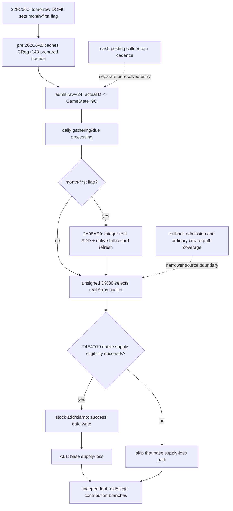
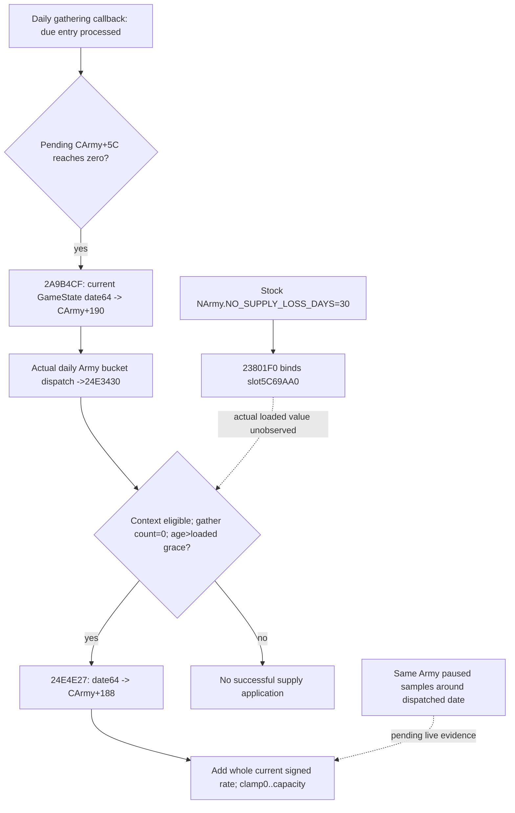
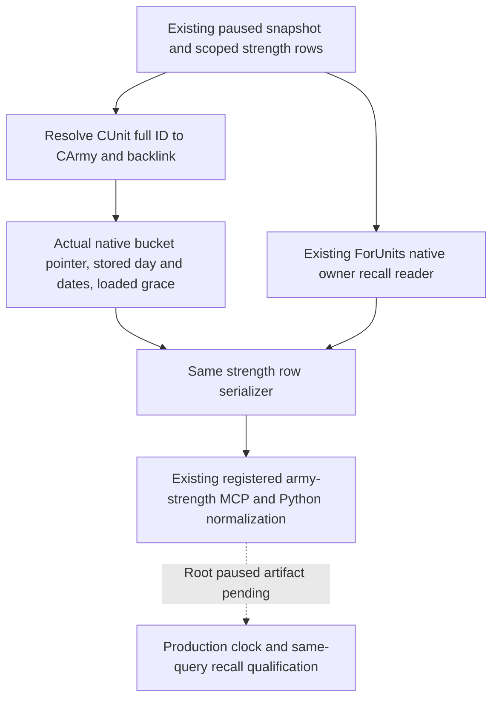
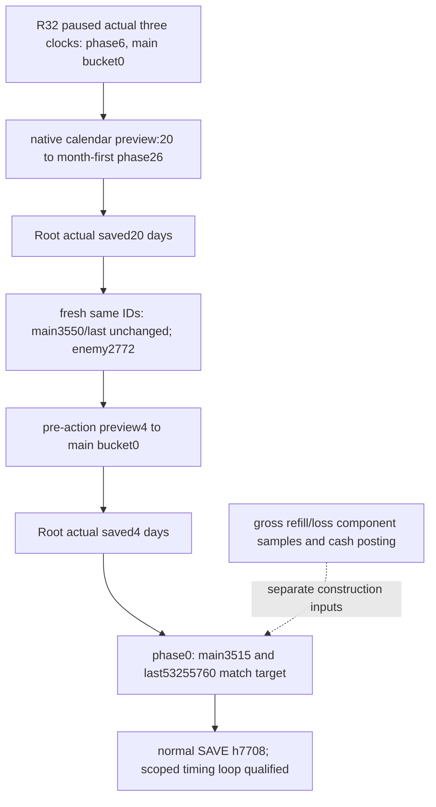

# Army calendar-month refill and independent supply/loss clock — 1.20.0.3

本专题绑定 CK3 1.20.0.3 / Steam 25652598，EXE SHA-256
`94B55397ABB687A3DCD436805A5D885E6BE90FA6C693FEB44A9E3BBEEADE02A6`。
冻结绑定复用；只读取必要新增窄 span，不重新全读/哈希 EXE。状态是
**research：实际调度、更新先后及关键整数计算已闭合**。纯文件时钟为
**static-ready**；新的生产 timing observer 尚未由 Root 部署验收。

## 两套时钟及真实先后

`CDailyTickCommand` pre-stage `29882A0` 在 `298841A` 调用 `229C560`。
它计算 next raw=current+24，
`D=trunc0((int32(next_raw-0x29C55C0))/24)`，normalized D mod365
查原生 day-of-month 表 `444C340`；day=0 时将 GameState+C0 bitmask2置位。
原生月起点为 0/31/59/90/120/151/181/212/243/273/304/334，全年365日，
该表没有闰日。因此 regular 补员发生在日历月首，不是固定30日间隔。

月首 pre-stage `2A99DC0→262C6A0` 先缓存 persistent CRegiment+148 的
signed Q100000 fraction。随后 `22A0D80` 接纳 date+24，`22A0F1E`
把实际新 date 推导的绝对 D 写 GameState+9C。实际 post-day manager 是
GameData+2A548；constructor `2A95FB0`、RTTI `CArmyManager` 和
secondary vtable `477C2E0+18→2A9A590` 已闭合。

该 daily callback 先处理独立 gathering/due 逻辑 `2A9AF40`，再在 bit2
条件下 `2A9A8FD→2A98AE0` 做 regular refill 及兵力刷新。之后
`2A9AB18..66` 以 stored D 的 **unsigned%30** 选择实际 Army bucket，
逐 CArmy/dateptr 调用 `24E3430`。旧构造入口 `24E3425` 已证实为
INT3 padding，不是函数开始。

被选中 Army 的 `24E4D10` 仍受原生日期/资格条件控制；成功后写
Army+188 date64、stock+180 加整月 signed raw、按 capacity clamp，返回 AL1。
wrapper 只有 AL1 才调用 base supply-loss `24E32E0`，该计算读更新后的 stock。
另有 raid/siege contribution 分支，不能把它们揉成唯一供给成功条件。

图表示真实条件和先后，不表示每个 Army 当前都更新、无 attrition 可永久安全，
或每次已采样 final getter 能还原之前实际执行的 prepared inputs。

## Actual bucket registration and smallest current observer

新增 A3 闭合了真实 add writer，证据不限于 removal：registered secondary
vtable+48→`2A99590` 重建 callback 遍历该 manager 的全 CArmy FullID roster，
校验实际 CArmy，`2A998CF..DE` 读取 CArmy+10 完整 ID、取 unsigned%30，
`2A998E2..EA` 选择 secondary+190+24*phase（primary+198）的 bucket，
`2A998F6→880340` 实际 append CArmy* 并 count++。room/grow 两支都已闭。
清 bucket callback 的实际槽是 +38→`2A993A0`。

这里闭合的是注册 virtual reconstruction callback 的完整 roster 写入，
未穷举外部何时调用 +38/+48 或所有普通创建路径。因此最小生产 observer
直接扫描实际30个 bucket，匹配本行 resolved CArmy*，发布实际 membership；
不以 public CUnitID 或猜测 ID 代替该观察。

Root 已因实测两次−36/一次−35损失授权在现 strength query 加 timing optional
子 block：actual bucket、GameState+9C signed D及同帧 date、Army+188实际
successDate64、Army+190 grace/dateanchor、加载的 `5C69AA0` threshold。
这些只是 native clock/资格输入；它们不制造净兵预测、现金 posting 或新门禁。
部署、生产 focused 验证及 paused 实际查询由独立后续包记录。

## Integer refill and real strength refresh

`262C6A0` 的 guarded false 路径缓存 F=0，其他原生许可路径取 `262CAD0`
并写 CReg+148；不写 current chunk。actual `2A98AE0` 用 zero28B int[7]
输出调用 `262C9D0`。每个原生 `2657F10` 允许且存在正 deficit 的 chunk：

`q=trunc0(min(maximum*cachedFraw, deficit*100000)/100000)`。

state3/current0 的 effective current=maximum。ALtrue 可仍得到 q=0。
caller 按 chunk+C ordinal 把 q 加到 persistent chunk+4。闭合的
prepare/allocation/application 路径没有存储跨月分数 carry；不推广为整个游戏
所有生产者都没有 carry，也不合并两个独立 permission bool 成客户端 AND。

随后 `24E8120→2633340` 读取 ArmyReg+20 data pointer/+2C count，实际
DATA record stride0x10、record+8 persistentID、+C chunk ordinal，累计完整
current/max，在 `26338C0/26338C3` 写 ArmyReg+38/+3C，再刷新 Army aggregate。
这闭合 full-record 原生施工入口，不意味着现 MCP 的 first-record detail
已经完整发布。必要增量是 CReg+148 prepared fraction 与这些 full DATA records，
而不是把第一样本月率当作整军净补员率。

剩余 contribution allocator `2A95800` 以 local remaining budget/eligible total
逐行分配整数，调用真实 hard-loss writer `26341B0`；剩余重新分配只在当前调用
内发生，不是跨月 carry，也不引入 battle finalizer 的独立调度。

## Actual inputs, readiness and future clock helper

after39 health sole consumer 的 actual native300/pub2/raw53254992：own
301989997=3585/3884/41（此前3621净−36）、old184549452=3000/3000/24、
enemy268435597=2692/4702/41（此前2539净+153）。当前供给分别300/100/300；
own monthly supply0/attr0.01，old/enemy monthly+20/attr0。
该帧只汇总 avail/unavailable：own28/13、enemy38/3、old24/0，未汇总每项
reason，不倒填旧帧 reason。敌 first persistent1408/chunk0 月率从1275变为
2775/Q100000，当前51/73；不能据此做 constant-rate 历史归因。

随后 fresh8 native335/pub2/raw53255184 的实际 own3550（再−35），enemy2692、
old3000；这次新帧才明确 own13/enemy3 unavailable reason 全为
`army_regiment_first_record_absent`。已授权新 timing 字段尚未部署。
fresh8 receipt 是 movement sole owner `452ca4f24e488cdb0153ea505a8a96d5d01448e6e10ef369fe76a07500349d77`。
Root 的 saved ledger 4619/res1466/Oct4+594 原样引用；本 source/helper 包增加0游戏日。
33日/39日的−36/+80/+153，以及新8日−35仍是观测净变化，未资格为执行原因。

[`ck3_native_army_update_clock.py`](../../tools/ck3_native_army_update_clock.py)
嵌入 exact native 两张365B表；CLI
[`run_ck3_native_army_update_clock.py`](../../tools/run_ck3_native_army_update_clock.py)
仅列未来 admitted dates、month-first 和 actual manager phase，可接受独立
observed bucket；无该输入时 army selection=null，但仍列出真实 phase。
从 actual raw53254992 prospective32 的第28日 raw53255664 为 month_index5/day0、
phase26。这是未来时钟提示，不是已经推进32日。模块不预测兵数、供给量或现金。
两 focused cases 的唯一 GREEN 已封在 pure-clock receipt，覆盖 February 28日边界
与 signed calendar/unsigned bucket/合法0；canonical 文件只将相同表和逻辑搬到
可复用 module/test/runner，没有重复跑旧检查。

现金既有 actor stock/NET/current-vs-all-raised getters 保留其收益；NET 已扣军事费，
不再次扣费、不按战争数重复加 expense，不把 NET*days/30 当作已闭 posting。
cash caller/store 时钟为独立精确施工入口，不阻此 Army observer。

## Sealed evidence and remaining work

证据均在 `Z:/ck3_mod_rewrite_process_assets/g2-resume-20261004/army-monthly-update-order-v61/`：

- FIRST `ROOT-SOURCE-FIRST-DELIVERY.json` SHA `c2e43a81512969ae9ff4dca91aa6c4ef1d673943b4998e4081e0539ef8afb5d5`，保持历史边界。
- SECOND `ROOT-SOURCE-SECOND-DELIVERY.json` SHA `6901b18d56592e208cbea48775bc83bbb074083ba58ad6ad2361332b480a243d`。
- A2 `source-clock-new-spans/ROOT-DELIVERY.json` SHA `6a5b77e5b1ce1f51ccfae9f7b824fd93730df0d046a13daee7b0ee46f3c295f2`。
- B2 `ordering-new-spans/ROOT-DELIVERY.json` SHA `b3c7b9d16267f1c2905dfa7d53e9c14b73cdf88cd6488c46b7ad9cb08782dbb0`。
- A3 `source-clock-registration-increment/ROOT-DELIVERY.json` SHA `ec0308add3968e4d6c111cb0f26e6465494042ce273225b608e26993df2cbd48`。
- pure clock/two-case receipt SHA `79179cda774b5464081d367f5895062c3409efa7a7ccd683cfadccf76b1db9a7`；day table SHA `49cfa7734c595821c26db19fac8d0427fa12adc3e8988e04e0d94198d8f35517`，month table SHA `218539a9f584e576a0912771d97ac39c5042fc9169e2b5d250069a88d1478f0a`。

剩余实际输入采样、timing optional 的生产验证、callback admission/普通 create
覆盖和现金 posting ledger 都明确另包。已有 current health/cash primitives
继续供普通游戏 loop 使用，不因未知分支停止合法动作。

## 2026-10-04 Episode04 increment — gathering grace anchor and real sampling

This increment is **static-confirmed / research**, with zero new gameplay days, SDK queries or footage. CK3 exact identity remains `1.20.0.3 / Steam25652598`, EXE SHA-256 `94b55397abb687a3dcd436805a5d885e6be90fa6c693feb44a9e3bbeeade02a6`. The explicit interpreter is `D:/workspace/ck3_eternal_recurrence/tools/.venv/Scripts/python.exe`, Python3.14.7, pefile2024.8.26, capstone5.0.9. `open_kaishek` is not-applicable: this question concerns compiled CArmy scheduling, field producers and native eligibility, outside its parser/script IR/runtime semantics; no CK3 acceptance or gameplay action was performed.

Reuse [army-monthly-update-order-12003.md](army-monthly-update-order-12003.md) for the already-closed real clock: regular refill uses calendar month-first; actual supply/loss dispatch uses the daily callback's stored GameState+9C unsigned modulo30 and **actual ArmyManager bucket membership**. The display forecast's30-day grid is a separate producer. `0x24E3425` is INT3 padding; the actual wrapper starts at `0x24E3430` and calls the updater at `0x24E3450`. The scheduler is no longer a new research gap; actual current membership/phase and loaded values remain observation work.

The previously unresolved grace anchor has a concrete production writer. `0x2A9AF40` takes CArmyManager and the admitted date pointer; its roster resolves full CArmy identity to r13. In the selected gathering path, a pending entry is processed when its due date is not after the current date (`0x2A9B0E8..EC`). After the processed entry is removed, `0x2A9B418` decrements CArmy+0x5C. If pending count is still nonzero, `0x2A9B429` skips the anchor write. When it becomes zero, `0x2A9B4C4..CF` loads GameState through global `0x5C68C50`, reads the current date64 from GameState+8, and writes that value to **CArmy+0x190**. This is the gathering-completion grace anchor, rather than the last successful supply update.

The two dates remain distinct. Successful updater `0x24E4D10` writes its passed date64 to **CArmy+0x188** at `0x24E4E27`. Before that write it requires gathering count+0x5C=0 and the selected Province/context eligibility branches to pass, then requires `trunc0(int32(date.low32-anchor.low32)/24) > loaded_signed_grace`. The comparison at `0x24E4E18` reads the signed32 define slot `0x5C69AA0`. At or below grace, this selected path skips the **entire** rate application, including a positive current rate; “no supply loss” is the define's name, not a promise that gains are posted during grace.

Define registration `0x23801F0` binds the `0x5C69AA0` destination to exact strings `NO_SUPPLY_LOSS_DAYS` at `0x4716718` and `NArmy` at `0x4716D68`. Installed `game/common/defines/00_defines.txt:660` declares `NO_SUPPLY_LOSS_DAYS = 30` with the after-gathering comment; file SHA-256 `8e430d77eb6e8767030f34b1c53d5dae84277fb354bd73cc42f93dc500be8982`. This closes the slot's name and stock source contract. It does **not** read a running process's loaded value or exclude mod overrides. The destination is in PE virtual zero-fill space; an empty on-disk read is not a runtime zero.

Consequently “first update is on the31st day after gathering” is too strong. The age must exceed the loaded grace, the actual30-bucket must be selected, and current eligibility must pass. Supplies can remain unchanged because of grace, because this army was not dispatched, because the rate is zero, or because a successful positive-rate application was clamped at capacity. A successful-date change is the clean discriminator for the last case.

Identity/lifecycle reuse: the .3 half-split clone `0x296B6E0` copies source CArmy+0x188/+0x180/+0x190 into the sibling at `0x296B948..96B`; a new ArmyID therefore does not by itself imply a fresh grace anchor. This is an exact clone-path fact, not proof that every split/merge/raise path shares identical lifetime behavior. The split owner retains its independent bytes proof and actual split remains separate.

For production observation, extend the existing `ck3_query_army_strengths` optional timing block already authorized by the monthly-order topic, retaining its exact build/same-frame identity: actual bucket membership (scan the30 pointer buckets against resolved CArmy*, not only FullID%30), GameState+9C signed D with date_raw, CArmy+188 successDate64, CArmy+190 graceAnchorDate64, and loaded signed32 grace from5C69AA0. No new named action/tool is necessary. Current stock/capacity/monthly-rate/attrition getters remain reused production primitives. Implementation/focused fixture/runtime deployment are separate facts; this file claims none.

Episode04 P0-SUPPLY filming uses the same army and same commander/province/compiled inputs, before a chosen real dispatch and immediately after one admitted day. Keep stock, capacity and current rate raw Q100000, date64, commander, ArmyID/CUnitID, full regiment identities, state, actual bucket/D/last-success/anchor/grace where available, paused revision, loading content and save SHA. After the boundary, require an independent query rather than an action ACK. During the grace edge and capacity edge, film the native tooltip and exact changed or unchanged stock in continuous footage. If timing fields are unavailable, basic natural stock-change footage can still be collected, but unchanged stock cannot establish a successful clamp or exact eligibility cause.

Use `tools/run_ck3_native_army_update_clock.py --current-raw <fresh> --days <bounded> --observed-army-bucket <actual>` to select the date; the CLI writes a prospective clock only and does not run CK3. Without an observed bucket omit the option and leave army selection unknown. Root freezes the actual subject, save and natural runtime window before executing the separately bound plan. Stop after the first discriminating boundary pair; if grace edge is specifically needed, at most61 admitted days from a fresh gathering-completion baseline is a bounded search for two potential bucket selections under stock30, subject to unchanged eligibility. A zero-change window excludes no mechanism by itself; preserve it and record which fields or conditions were absent. This is a small observation recipe, not a new gameplay gate.

New bytes are retained at `D:/ck3-war-episode04-research-20261004-a01/supply-clock/`. The gathering span `[2A9AF40,2A9B592)` SHA-256 is `27b16dfc3ab56e1088c7a24676433317a7f86b8ecf82c6108b6b3468aec706e8`; updater slice SHA-256 matches existing `a6214a58f3b8a1ff58fff6148ecf121688ccdaf1a5317f0865991a5367d183f4`; registration function `[23801F0,2380447)` SHA-256 `d7c5bcb41c03e53475f2661fe7171647852e7636109e88cb985ad9207e01b3d3`. The bound plan, generated graph and `ROOT-DELIVERY.json` enumerate actual paths and file hashes. Root integrates this candidate append; this lane does not modify Git refs or canonical repository files.

## Same-query army update clock and native owner recall inputs — 2026-10-04

The existing paused `ck3_query_army_strengths` now has two optional siblings on each row. This increment preserves its current public CUnit/native CArmy identities, revision checks, supply, attrition, monthly supply, gathering, movement and first-record replenishment observations.

`army_update_clock_v1` reads the exact .3 resolved CArmy after its public CUnit backlink matches. It publishes `current_date_raw`, the stored signed `native_day_index`, native unsigned-modulo `selected_bucket_phase`, and `observed_army_bucket_phase` from the actual pointer in the CArmyManager's 30 buckets. It also keeps the CDate64 storage and low32 operands separate: `last_supply_update_date_storage_raw64`/`last_supply_update_date_raw` at CArmy+188, `grace_anchor_date_storage_raw64`/`grace_anchor_date_raw` at +190, plus the exact-build loaded `loaded_grace_days` at RVA5C69AA0. Successful stock-update date and grace anchor are distinct observations. No last-success date, troop refill, loss, cash posting or future phase is inferred from IDs or monthly labels.

The object has `status`, `ready`, and nullable `unavailable_reason`. Pointer-matched membership is `available`; a complete readable scan with no matching pointer is `not_registered`, remains `ready=true`, and retains a null observed bucket phase. An unreadable binding/header is `unavailable`; the parent strength row retains its independent status. Date, phase and grace zero are valid. The unchanged .2 binder omits this exact .3 sibling.

`native_owner_recall_inputs_v1` uses the already published AI leaf's `ForUnits`, serializer and Python normalizer. The backend reuses its one paused snapshot after reading strengths and passes each row's full public CUnit ID; no second snapshot or strength sample occurs. Its owner matrix can contain the full owned roster, so the matrix is not limited to one unit per strength row. `raw_inputs_ready` describes the raw owner/army inputs. The native scheduler context prefix remains independently unobserved and `native_selection_ready` is not promoted by this attachment. These values explain inputs without submitting a native AI action or proving ordinary target score/threat causes.

The two new focused production-reader/serializer cases passed once: pointer-matched phase/date/grace zero and readable missing membership with distinct CDate64 high words. Their unchanged wires passed the real registered MCP, service, driver and normalizer once under Python `-O`. Native checks use explicit `Require`. This is `static-ready`, not a live clock sample; the earlier AI leaf fixtures are reused and were not rerun. Root owns the final build, paused sample, source adoption, commit/push and report merge. The frozen A native-leaf receipt remains unchanged; only the integration projection adds the DTO equality required by `ArmyStrengthSnapshot`'s existing default equality.

Source adoption: Root adopted and pushed this frozen 15-path increment as `b148719256a92b1d0fe014f9f62f659e44f0d105`; g64/v59 full strict build and actual paused query remain Root-owned subsequent milestones. This append credits zero game days and no new production-live sample.

## R32 actual clock primitive and bounded 20+4-day loop

Actual gameplay completed on 2026-10-04 / W40. This documentation is finalized
on 2026-10-04 / W40. Native and Python source were frozen g64 at
`b148719256a92b1d0fe014f9f62f659e44f0d105`; R32 used the ordinary Robert 29829
campaign. The sole original-query owners produced cached FIELDS; this clock
consumer read each of the three new caches once, never the original014/004 JSON.
Rows are associated by `army_id`, including the changed guard/main row order.

The first actual paused query at raw53255184/D393966/selected phase6 returned
`army_update_clock_v1.status=available, ready=true` for all three armies. Main
301989997/native CArmy201326670 had actual bucket0, last successful stock-update
date53255040, grace anchor53251464 and loaded grace30. Guard184549452/CArmy167772208
had bucket28/last53254992/anchor53251272; enemy268435597/CArmy184549476 had
bucket6/last53255184/anchor53249376. The actual elapsed-from-anchor operands
were155/163/242 days, each strictly greater than30. Native64 storage values are
preserved in the cache alongside the distinct low32 date operands; they are not
reinterpreted as calendar raw dates.

This qualifies **production-live primitive** for real membership, day, successful
update date and grace observations. The decision used the native calendar table
to preview20 admitted days to month-first raw53255664/phase26, then4 days to the
actual main bucket0. Root executed each plan with ordinary saved-day progression,
independently queried the same fresh three IDs and retained normal SAVE evidence.

| Actual saved stage | Date / D / selected phase | Main301989997: current / last success | Guard184549452: current / last success | Enemy268435597: current / last success |
| --- | --- | --- | --- | --- |
| Start | 53255184 / 393966 / 6 | 3550 / 53255040 | 3000 / 53254992 | 2692 / 53255184 |
| Month-first +20 | 53255664 / 393986 / 26 | 3550 / 53255040 | 3000 / 53254992 | 2772 / 53255184 |
| Main bucket +24 | 53255760 / 393990 / 0 | 3515 / 53255760 | 3000 / 53255712 | 2772 / 53255184 |

All nine clock observations are available/ready. Actual buckets remain0/28/6,
the anchors and grace30 remain unchanged. Maxima/regiments remain3884/41 for
main,3000/24 for guard,4702/41 for enemy. Supplies/caps remain300/300,100/100,
300/300; final attrition fractions remain0.01/0/0, monthly supply0/+20/+20,
and all three are not gathering with that state independently ready.

At month-first the main has no observed net troop change; the enemy gains80 while
its last supply-success timestamp is unchanged. At actual phase0 the main's
last-success timestamp advances to the pre-action predicted53255760 and current
soldiers decline35. This net difference is compatible with integer truncation
of3550*0.01; it is not an independently sampled breakdown of every loss producer
or gross refill. The guard's phase28 timestamp advances to53255712 within the
same four-day segment. The enemy's next phase6 has not been executed in this
24-day loop. No fixed NET*days/30, cash posting, global replenishment attribution
or unobserved component credit follows from these dates.

Readiness is **production-live loop within this finite army-update timing scope**:
observe actual clock inputs -> preview20/4 -> execute normal saved days -> verify
the date/phase/timestamps and troop observations. It does not mean complete army
recovery policy, every callback/create path, whole-game OODA or cash affordability.
The same-query `native_owner_recall_inputs_v1` remains **missing in these R32
queries**, despite the query being GREEN; it has no actual publication credit
here. Its separately diagnosed SHA translation fix is a later source/runtime
milestone and is not retroactively applied to these frozen g64 packets.

Final Root normal checkpoint: h7708,96687892 bytes, environment6061,
SHA-256 `627fd721864a4e2de3f8754b9de465a4810e29da28692123511a38cb4ef6ca83`.
Root cumulative ledger is4643 global/resume1490/Oct4+618, including exactly24
new normal saved days in this loop. This consumer advanced0days. The CI runner's
separate missing timing-TU failure and its Oct4 upstream fix/local affected-step
verification retain their own failure and source receipts.
