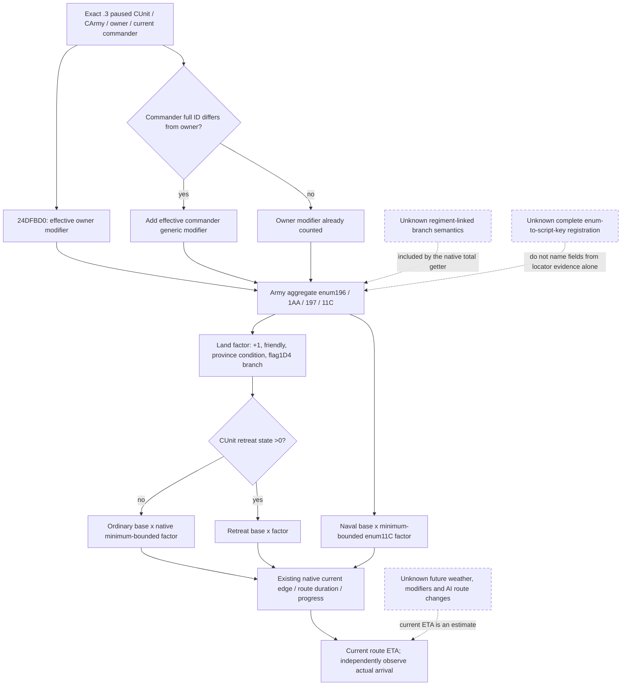
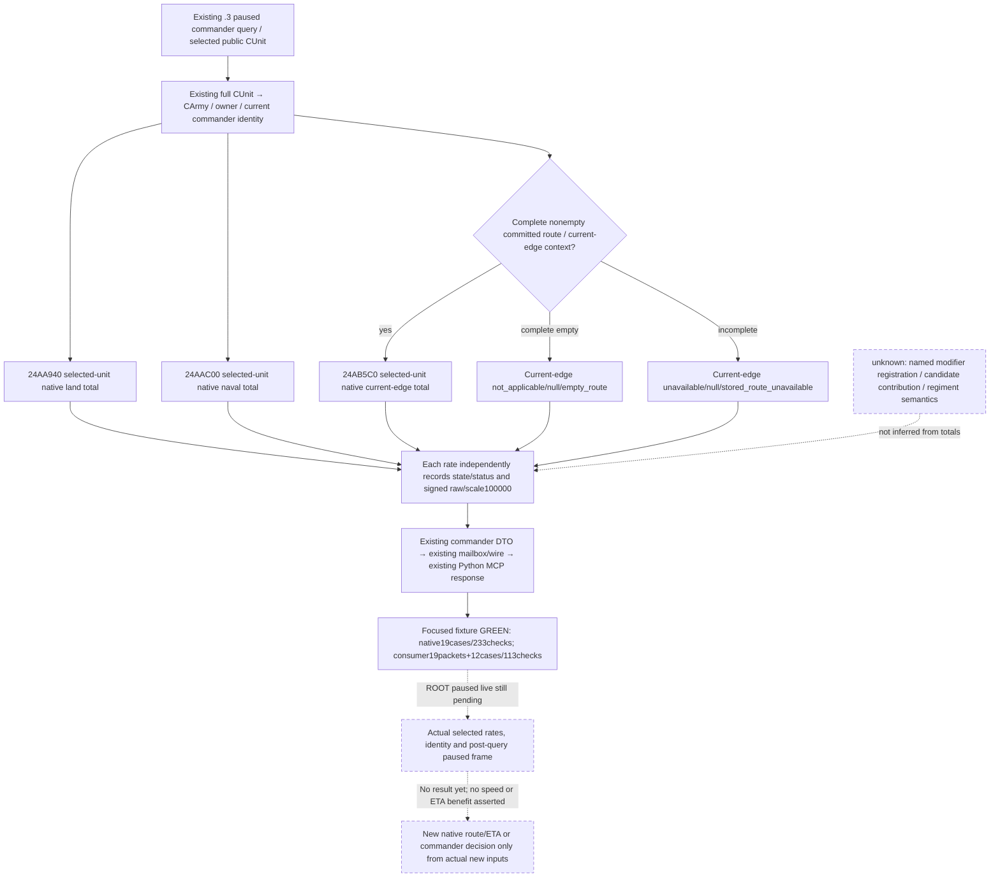

# CK3 1.20.0.3: native army movement speed and commander inputs

Initial native research2026-10-03; selected-unit observation extension2026-10-04. Exact CK3 **1.20.0.3 / Steam25652598**, EXE SHA-256
`94B55397ABB687A3DCD436805A5D885E6BE90FA6C693FEB44A9E3BBEEADE02A6`.
The closed Oct3 native tree and span pins are reused; they are not re-reversed or
retested here. The Oct4 implementation extends the **existing commander query**
with selected CUnit land/naval/current-edge total rates. Candidate movement fields
and named modifier sources from the historical proposal below are outside this
minimal construction. The source baseline is read-only `Z:/g49`; independent
native/wire/Python/fixture lanes provide the concrete implementation receipts.
ROOT owns game/SDK, source adoption, final verification and Git. This documentation
lane adds zero game calls, actions or days. Actual paused validation of the new
selected-rate fields remains pending until ROOT supplies its frozen result.

The existing [march timing tree](army-march-remaining-timeline-12003.md),
[route ABI](ck3-1.20.0.2-routes-migration.md),
[.3 ABI reuse ledger](../../ck3_autonomous_player/native_bridge/research/ck3_1_20_0_3_abi_reuse.json)
and [commander candidates](army-commander-candidates-observation-12003.md) remain
the input contracts. The old [army controller](army-controller.md) is bound to
1.19.0.6; its destination scoring is not newly verified here.

## Native speed tree, before any counter-policy

All arithmetic below is signed native fixed point with scale **100000**. Native
integer multiply/divide includes its larger-value branches. A speed is a native
movement-weight rate, not a distance in kilometres or a number of route hops.

| Branch | Exact .3 evidence | Closed meaning |
|---|---|---|
| Resolve movement subject | `0x24AA940..0x24AA9E7` | CUnit kind0 resolves CArmy through full ID at `+0x178`; carrier branch uses CFleet `+0x17C` then its CArmy `+0x1C` |
| General land modifier | `0x24AAA02..0x24AAA20` | Call `0x24DFBD0(CArmy,out,0x196)`, add raw100000 |
| Friendly-area addition | `0x24AAA27..0x24AAA37`; `0x24ACAC0..0x24ACB93` | Current province, owner and native holder/relationship predicate determine whether the loaded additive bonus is applied |
| Current-province conditional addition | `0x24AAA37..0x24AAA62`; predicate `0xC6AF20..0xC6AF77` | Province `+0x860` is compared with loaded thresholds; if the predicate is true, add native army modifier `0x1AA` |
| Army flag conditional addition | `0x24AAAA5..0x24AAAF2` | If the resolved unit army's byte `+0x1D4` is nonzero, add native army modifier `0x197` and sparse modifier `0x197` from `CArmy+0x1D8+0x280` |
| Retreat base | `0x24AAAF5..0x24AAB45` | CUnit `+0x170 >0` selects the loaded retreat base, multiplied by the accumulated factor |
| Ordinary base and lower bound | `0x24AAB4A..0x24AABEB` | Other units use the loaded ordinary base and clamp the accumulated factor to the native loaded minimum before multiplication |
| Naval rate | `0x24AACB9..0x24AAD98` | Loaded naval base times the native minimum-bounded `(100000 + ArmyModifier(0x11C))` factor |
| Current edge and ETA | Existing `0x24AB5C0` and `0x24AADA0` | Current edge selects medium; remaining native route duration includes stored edge progress and current speed |

For a valid ordinary army, the observed code composition is:

```text
Q = 100000
factor = Q + ArmyModifier(0x196)
factor += friendly_predicate ? loaded_friendly_bonus : 0
factor += current_province_predicate ? ArmyModifier(0x1AA) : 0
factor += army_flag_1D4 ? ArmyModifier(0x197) + ArmySparse197 : 0
land_rate = QMultiply(loaded_ordinary_base, max(factor, loaded_minimum))
retreat_rate = QMultiply(loaded_retreat_base, factor)
```

Native `ArmyModifier`, **0x24DFBD0..0x24E015E**, first obtains the unit owner via
`CArmy+0x124 -> CUnit+0x174`, then the assigned commander at `CArmy+0x120`.
It adds each valid character's effective generic modifier. The owner and commander
are counted **once when their full CharacterIDs match** (`0x24DFD1F..0x24DFD22`).
It then iterates CArmy's regiment IDs and includes a further regiment-linked
modifier branch. The field identities and multiplicity of that branch remain
**unknown**; do not replace it with a guessed soldier weighting or slowest troop
rule. Calling the native total speed getter retains that branch automatically.

The character path is closed:
`0x28C3AE0(character) -> effective aggregator -> 0x2C4D550(...,enum,0,100000,0)
-> 0x24389A0(...,enum,mode0) -> 0x2303700(aggregator+0x68,out,enum)`.
The mode0 branch at `0x24389C2..0x24389DE` reads the generic sparse subtable.
This is the same receiver already used by the current commander siege field.
An absent native sparse key is a legitimate raw0; an unavailable character or
aggregator is unavailable, not zero.



Current stock `NArmy` declares ordinary movement3, retreat4.5 and friendly bonus0.2
at `common/defines/00_defines.txt:632`. These are nominal stock values; this lane
does not read the actual loaded runtime globals. Current stock organizer declares
movement_speed0.1 plus distinct XP/conditional clauses; organized_retreat_perk
declares movement_speed0.15. Those declarations are not actual Robert or candidate
modifiers. Exact string locators were retained, but the complete enum196/197/1AA/
11C registration mapping is **unknown**. Operation-based field names avoid relying
on that mapping. The current-province conditional is consistent with winter
threshold logic, and flag1D4 with raiding, but those names remain **inference** here.

## Current frozen tactical input and existing MCP recipe

Root's frozen `RESEARCH-CONTEXT.json` consumes compact source SHA
`f0c1d9ed39927ac96617942ace73d71216ffbba5edec43f7ff404bf244ca822e`.
The **before-day** native route query at raw53240904 projects86days to2640,
effective locked-edge origin8754. Its remaining provinces are
`[8754,2613,8752,2628,2626,2627,2633,2634,2640]`. That ETA is not relabelled as a
new final-frame query. The **after-day** paused frame is raw53240928/native15/
public5, with player CUnit83886367 still moving at2616, and a second player army
167772189 gathering at2618. At the after frame, Siege318767158 in2640 has95.451%
work and native remaining estimate17days. Two war rows reference that one siege.
Neither arrival nor enemy siege clearance is observed.

Current registered reads already provide:

- `ck3_take_snapshot()` for current public revision, unit identity, route and state.
- `ck3_query_army_commander_candidates_v1(army_id=83886367, expected_revision=<fresh>)`
  for current commander, full candidate set, mode1 CanAssign, combat quality and
  siege-phase modifier. **It currently lacks effective movement modifiers.**
- `ck3_execute_step(step="query-route-contact-horizon-v1-83886367-to-2640-h-6-473-16777683-50331920-67109295-83886484-251658381", expected_revision=<fresh>)`
  for a newly read native route/ETA. Derive the complete fresh hostile set before
  forming the literal. h6 denotes six hostile IDs; it is a one-day contact window.

The current route implementation already calls native land/naval speed internally
at `ck3_12002_routes.cpp:335`; it does not serialize those speeds or their inputs.
The existing reinforcement signal can retain first-edge Q100000 duration, but
requires an actual coordinator/subunit binding. It cannot be promised for this
manually controlled army and does not solve candidate movement ranking.

## 2026-10-03 historical construction proposal

The actual86/17 mismatch motivated the following Oct3 proposal. The **Oct4
construction supersedes its candidate-modifier portion**: publish selected-unit
native total rates first. It introduces no candidate speed/modifier fields,
named modifier fields, new flags, new capability or new MCP tool. The numbered
proposal below is retained as dated research history, not a current requirement:

1. Add nullable signed Q100000 candidate fields
   `native_land_movement_modifier_raw` (effective generic enum0x196) and
   `native_conditional_movement_modifier_raw` (enum0x1AA), including the current
   commander. Use the existing `0x28C3AE0` and `0x2303700(aggregator+0x68,...)`
   bindings and observed-vs-null rules.
2. Add a top-level `current_movement_speed` object bound to the selected public
   CUnit, internal CArmy, actual owner/commander, date and native/public revisions.
   Read native total `land_rate_raw` via existing `0x24AA940` and `naval_rate_raw`
   via `0x24AAC00`; while a complete nonempty route is present, read
   `current_edge_rate_raw` via `0x24AB5C0`. Scale100000. Do not synthesize a zero
   edge rate for an empty route. No army-AI assignment is required.
3. Publish the candidate observation fields through the existing C++ DTO,
   commander serializer, native driver and registered MCP response. Existing
   collector and mode1 CanAssign remain the action eligibility input.

Exact construction locations are `ck3_12003_commander.hpp:21`,
`ck3_12003_commander.cpp:203` and its existing mailbox serialization. RouteBindings
already defines the exact two-argument UnitSpeed ABI:
`int64_t* (CUnit* RCX, int64_t* out RDX)`, returning the same caller-owned out pointer.
No shared file has been changed in this lane.

The next focused fixture should exercise the **actual extended commander reader**
with its existing fake character aggregator/sparse table: enum196/1AA positive,
negative, legitimate missing-key0 and unavailable aggregator, plus the three
selected-unit speed callbacks and empty-route unavailability. The native byte
pins below bind those callback RVAs and the mode0 receiver. The fixture should
not merely test a duplicate percentage formula. No fixture was run here.

After fresh effective fields, Root can select a legally assignable candidate with
an actually better applicable contribution, perform the existing typed commander
assignment if useful, then read the native route again. Only that recomputed ETA
can assess whether the new march fits the siege horizon.86/17 is approximately5.06
under a constant-speed comparison; a nominal10% or15% clause cannot be promoted
to a promised relief. Terrain, route alternatives, secondary gathering and sea
options remain the other lanes' inputs. No counter-policy was implemented here.

The lane-owned plan and generated graph are `research-plan.json` and
`research-graph.md`; `NATIVE-SPEED-PINS.json` indexes exact span hashes and source
pins. `ROOT-DELIVERY.json` and `REPORT-FIELDS.json` carry adoption and progress
fields. The plan check proves record structure and file integrity only.

## 2026-10-04: selected native rate observation before further movement decisions

The new input is the selected public CUnit's **current effective total rate**,
using the native composition already closed above. Land `0x24AA940`, naval
`0x24AAC00` and current edge `0x24AB5C0` use the existing UnitSpeed ABI
`int64_t* (CUnit*, int64_t* caller_owned_out)`. The native getter must return that
same out pointer before its signed integer is observable. Calling these totals
retains owner/commander equality handling, conditional composition and the
unresolved regiment-linked branch without inventing a named contribution.

The three reads are independent. Every rate has its own observation state /
status and nullable signed fixed-point value with scale **100000**. Failure or
unavailable current-edge context stays unavailable/null; a successfully read
raw0 stays observed zero. A complete empty route supplies no committed current
edge. No missing rate is fabricated from another rate or a stock constant.



This extension reads the current totals; it does not predict candidate totals,
rank movement commanders, assign a commander, alter route, change speed or
recompute ETA. Existing commander collection/final player eligibility and
quality fields retain their contracts. The supplied sibling implementation and focused GREEN
fixture receipt below establish `static-ready`; ROOT's independent paused query
remains required for
`production-live primitive` of these new fields.

Parent-supplied latest v46 tactical context: main83886367 at2616 moving toward2640,
2259/2460soldiers; secondary167772189 at2618 gathering, current0/max0 and
remaining7days. This lane has not read that new actual packet and labels these
values as parent context. They are not new speed observations, and are separate
from the Oct3 pre-day86day route and later17day siege estimates above.

The original plan, generated research graph and exact native pins remain in
`Z:/ck3_mod_rewrite_process_assets/g2-resume-20261003/war-movement-speed-v46/speed-composition/`
with their existing checks. This is continuation of that closed native topic,
not a new sampling plan or a reason to rerun its research checks. New implementation
receipts, current field names and Oct4 daily/week merge fields belong to
`Z:/ck3_mod_rewrite_process_assets/g2-resume-20261004/war-movement-speed-v49/topic-report/`.

### Frozen additive response contract

The existing response gains `army_commander_candidates.current_movement_speed`.
Its schema is `ck3_12003_army_current_movement_speed_v1` and source is
`native_selected_cunit_movement_rates`. Context is explicit through
`context_observable`, native `snapshot_revision`, `date_raw`, `public_cunit_id`,
`native_carmy_id`, `owner_character_id`, nullable `current_commander_character_id`,
`current_province_id`, `move_target_province_id`, `route_source_count`,
`army_state_code`, `army_state`, `in_combat`, `retreating`, and `route_read_status`.
These are selected-unit observations, not candidate projections.

The independent `land`, `naval`, and `current_edge` objects each contain
`status`, nullable signed-int64 `raw`, `scale=100000`, nullable
`unavailable_reason`, and fixed `native_getter_rva` provenance. Successful native
pointer-return reads produce `status="available"`, including a legal `raw=0`.
A missing or failed callback leaves its own value null while retaining any
successful other rates. `complete_empty` supplies `current_edge.status=
"not_applicable"`, `raw=null`, reason `empty_route`; incomplete route observation
leaves the edge unavailable/null with `stored_route_unavailable`. Both differ
from a successfully observed zero.

The Python extension is additive at the existing
`normalize_army_commander_candidates_v1` consumer. Historical frozen payloads
without `current_movement_speed` remain compatible. The present object must
retain its typed status/value/provenance and selected-unit/frame identity; a
malformed current object cannot be normalized into an invented rate.
Candidate collection, final CanAssign and current commander availability stay
independent of rate availability. Native provider, serializer and Python code
receipts will pin the final implementation below; this frozen contract alone
does not claim a passing fixture or a live read.


### Actual Oct4 implementation receipt

The supplied source baseline is `Z:/g49` at
`9772958a55e5182ef78562c74e43d72ba3f2302e`. Four existing source paths have external
projections: commander header/reader, commander mailbox, and the Python commander
normalizer. Exact preimage/projection hashes and sibling receipt hashes are in
`Z:/ck3_mod_rewrite_process_assets/g2-resume-20261004/war-movement-speed-v49/topic-report/IMPLEMENTATION-RECEIPT-FIELDS.json`.

| Layer | Concrete construction | Supplied receipt |
|---|---|---|
| Native DTO/provider | Header rate/context DTOs at39/46, top-level member75, UnitSpeed callback type85. Reader helper51, selected context68, getter bindings149/152/155, read200 before remaining candidate gates. | `native-provider/ROOT-DELIVERY.json` |
| Existing mailbox | `SerializeArmyCommanderCandidates` calls `SerializeCurrentMovementSpeed` then three `SerializeMovementRate` objects. Frame binding and nullable selected context are explicit. | `native-wire/ROOT-DELIVERY.json` and `WIRE-SCHEMA.json` |
| Existing Python consumer | `normalize_army_commander_candidates_v1` preserves legal signed rates/zero and independent unavailable states; validates the enclosing mailbox date/native revision and observed selected identity. Older payloads without the extension remain accepted. | `python-consumer/ROOT-DELIVERY.json` |

Those receipt paths are relative to the same external Oct4
`war-movement-speed-v49/` package. The registered service, native driver, MCP
signature and runtime flags are unchanged. Native reads after selected player/unit
identity and before later candidate gates can retain a rate even when the
commander candidate collection is unavailable. A failed rate does not degrade
the existing candidate classification.

The minimal read remains the existing tool:

```text
ck3_query_army_commander_candidates_v1(army_id=83886367, expected_revision=<fresh public revision>)
```

ROOT must inspect the response's selected identity and native frame plus each
`current_movement_speed` status/raw/scale/provenance. The extension observes the
current selected unit; it supplies no candidate movement contribution or speed
comparison. If a later decision changes commander or route, only a fresh native
route/timeline can establish its new ETA. The old86day value above remains bound
to its historic pre-day frame.

**Validation at final handoff: `static-ready` from the supplied new focused
GREEN receipt.** The production native reader/serializer ran once:19cases,
233checks. Registered MCP → service → production normalizer replay covered the
same19native packets plus12consumer/frame cases,113checks. The native fixture
was not rerun for the Python import repair. Rates in these fixtures are
synthetic; they are not new paused-game speed observations.

The failed link harness attempts01–03 and run04's initial Python sandbox tools
import RED remain retained. These are harness failures, with no capability RED;
the final repaired consumer replay is GREEN. The exact final receipt is
`Z:/ck3_mod_rewrite_process_assets/g2-resume-20261004/war-movement-speed-v49/focused-fixture/ROOT-DELIVERY.json`,
pinned in `IMPLEMENTATION-RECEIPT-FIELDS.json` and this lane's `ROOT-DELIVERY.json`.

ROOT's full integrated build and paused selected-rate read remain pending. A
fixture GREEN cannot establish `production-live primitive` or a movement
benefit. This documentation lane ran no tests or builds, sampled no game state
and adds no live speed/ETA benefit, actions or days. ROOT merges the final
fixture and later paused result into the Oct4 daily and W40 report.
