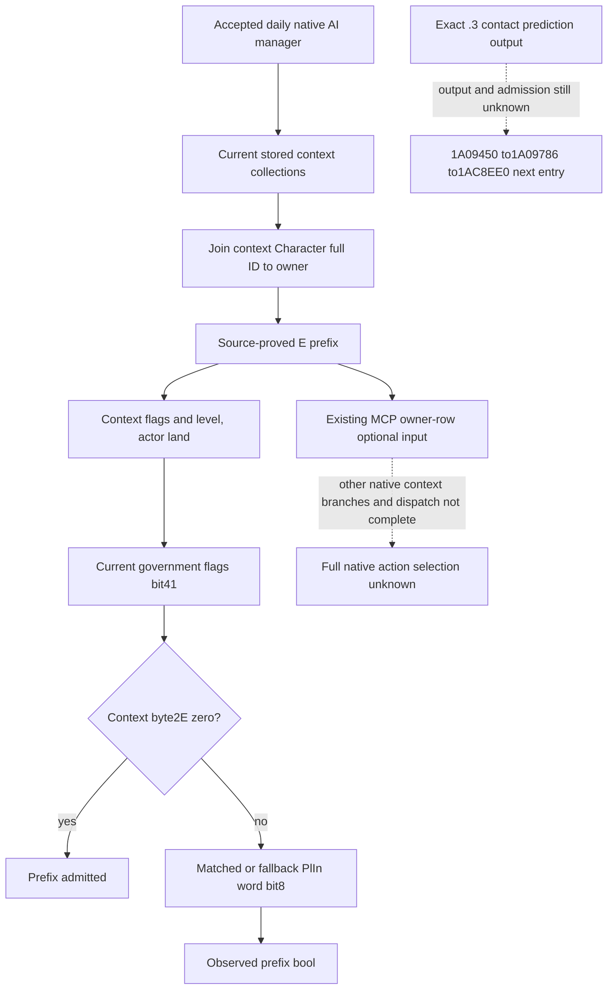
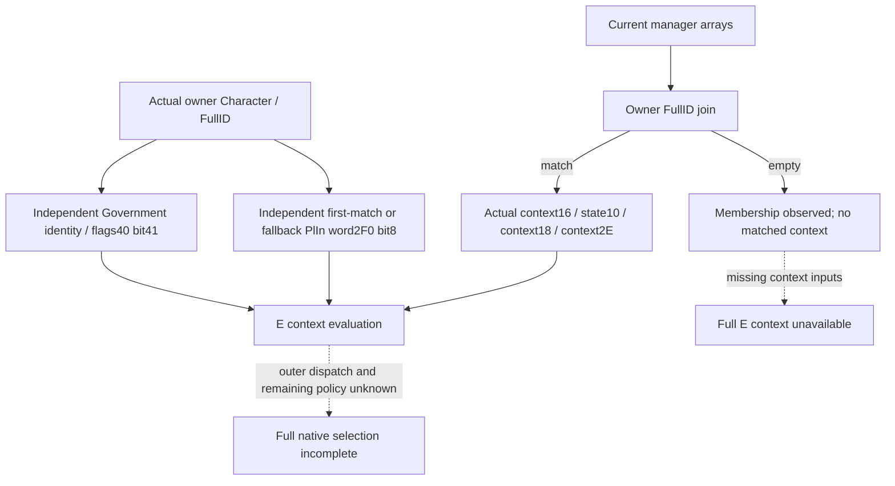

# Native activity context E-prefix observation (CK3 1.20.0.3)

Exact build: Steam25652598, EXE SHA `94B55397ABB687A3DCD436805A5D885E6BE90FA6C693FEB44A9E3BBEEADE02A6`. The selected observation fills one concrete input gap in the existing native owner recall leaf: the current owner-matched activity context and the source-proved E-prefix condition at `1A781A0`. The source is closed for readonly construction. The reader, shared serializer and production Python normalizer are **static-ready** after two affected production translation units, a new fixture driver and one uncalled link dependency compiled and linked, two new native cases ran once with seven frames, and the production normalizer accepted those same frozen frames. The first Python loader attempt retained a harness import error; fixing that loader did not rerun the native cases. The new context field has no live credit.

The existing leaf already exposes current Army activity bytes, the owner native mission-list count and the title-derived home Province. These facts do not identify which current activity context is associated with that owner. The new observation reads the native manager's context collections and joins each context's Character full ID to the existing owner row. It preserves stored order and multiple matching contexts. An empty matching collection is an observed result, distinct from failed or missing bytes. The collection and source prefix branch remain explicit. Native dispatch order is fallback_d8 before mission_90. Both have source-proved E-wrapper paths; mission_90 also has a separate C-wrapper that this field does not evaluate.

The accepted daily AI pass supplies `GameData+2D50` to `1A31EE0`; the proved receiver adjustment places the manager base at `GameData+2D48`. GameState comes from slot `5C68C50`, and its `+A0` supplies GameData. The manager's `+90/+9C` and `+D8/+E4` pairs are context-pointer arrays and native counts. Context `+18` points to its Character; Character `+18` carries the full owner identity. Those are current input collections rather than a transcript of natural commands.

`1A781A0` requires context byte `+16` bit1, signed level `+10 >= 2`, an actor with non-null `+1C0`, and native government flags bit41. If context byte `+2E` is zero, the predicate then returns true. Otherwise it requires the selected player-interface word `+2F0` bit8. Government bit41 and interface bit8 retain raw native identities; this observation does not rename them as a general engage or retreat threshold.

The government getter `28C2E10` has an existing `.3` county-conversion binding. Its E-prefix operand can be reproduced through raw fields: Character `+1D0` deathData, when present, supplies government at `+88`; otherwise Character `+1C0` supplies the object whose `+3F8` is government. A null result uses the actual fallback pointer slot `5D1E2A8`. Government magic `+38` is `4744624F`; its flags are a uint64 at `+40`. The readonly implementation does not invoke that getter or its diagnostic call.

The player-interface search reads GameData `+22340/+2234C` with pointer stride8 and selects the first stored-order object whose `+B0` matches the full Character ID. It then validates magic `+DC=506C496E` and full interface ID `+D8 != -1`, and reads word `+2F0`. No match selects the actual fallback slot `5D29008` before the same validity and permission check. It cannot be replaced with a fixed false. Native invalid magic/ID produces raw5, whose bit8 is zero; unread bytes remain a typed observation failure.

This primitive may be ready while full native selection remains false. It does not invoke a planner, change a mission, submit a command or enumerate natural AI actions. It does not fill future `action_selected=false` or supply Monte Carlo odds. The actual contact prediction ratio remains a separate source gap: the existing `.3` candidate path's AL return proves full path acceptance, not an independent prediction ratio. Old `1.19.0.6` contact thresholds cannot be used as `.3` evidence.

Source receipts: [prefix bindings](Z:/ck3_mod_rewrite_process_assets/g2-resume-20261004/battle-regular-army-engage-input-v65/prefix-binding/ROOT-DELIVERY.json), [single observation choice](Z:/ck3_mod_rewrite_process_assets/g2-resume-20261004/battle-regular-army-engage-input-v65/SINGLE-OBSERVATION-CHOICE.json), and [deferred contact prediction entry](Z:/ck3_mod_rewrite_process_assets/g2-resume-20261004/battle-regular-army-engage-input-v65/source-selection/ROOT-DELIVERY.json). The new government getter source span is 237 bytes, SHA `c2c90483b681a9b6b86f979b691a9446151544d7729b28b60f05c3894d6f2895`; no older EXE code was reread.

The optional owner-row key is `native_activity_context_v1`. It reports status and `membership_observed`, then `matched_contexts_in_native_order`; each matching record preserves collection, stored index, actor full ID and `prefix_kind=e_1a781a0`, with nullable `e_prefix_admitted` and the operands actually read. Native short circuits can produce a known false without reading later operands. Required unread operands retain null and an unavailable reason. Successful enumeration with no matches remains an observed empty list. The existing top-level native selection fields remain unchanged; the new E predicate is an independent input domain.

The current R34 registered query separately demonstrated the older raw recall leaf at native3/public2/date53256120: all three rows were present, available and raw-input ready; full native selection remained false. The new context field was not deployed in that frame. R33 unavailable remains retained, and recovery does not establish the stage-string change as its cause. [R34 actual input receipt](Z:/ck3_mod_rewrite_process_assets/g2-resume-20261005/battle-native-owner-recall-r34-actual-consumption/ACTUAL-R34-OWNER-RECALL-FIELDS.json).

## R35 paused readback: current owner membership primitive

At native3/public2/date53256456, the R0035 registered army-strength query actually published `owner.native_activity_context_v1` for all three requested rows. Each block was `status=available`, `membership_observed=true`, and `matched_contexts_in_native_order=[]`. Robert29829's two rows and enemy35991's row therefore provide a **production-live primitive for current owner-context membership**, with zero matching contexts. This is an observed empty result rather than a false admission or a required-operand read failure.

No matched record exists in this frame, so it does not cover an actor/context example, `e_prefix_admitted` true or false, or government/PlIn raw values. Those matched predicate and operand paths retain their static production-path qualification. The top-level scheduler status remains `unobserved_scheduler_context`, admitted remains null, and `native_selection_ready` remains false. This observation does not establish dispatcher selection, a natural AI command census, or a future `action_selected=false`.

The native query's version and executable SHA fields remain null exactly as emitted. The separate Root binding is R0035/PID110044/g67/source091bb268; it is outer provenance and is not inserted into those null fields. The army leaf is GREEN independently of the same SDK batch's third death-query argument harness RED. The original army packet SHA is `5e3625acec6b7ee6a6c2e1e94f55b0c6c7c2626ab899981c25583662ff7d372d`: its owner decoded the original buffer once, and this observer consumed only the sealed AI cache once, then shared derived fields with two report lanes. R33's unavailable query and g66's unobserved scheduler remain retained history.

The query and this report add zero saved game days. Its corresponding normalSAVE017 is h7811/date53256456/96643154 bytes; Root reported SHA prefix `be877d06` and suffix `ce980`, without a full hash in this observer receipt. The subsequent character retry h7813 and ordinary first-failure h7815 are separate anchors and do not replace this query's save association. Formal totals are4672/resume1519/Oct5+14, referenced without repeating their prior day credit.

[Actual R35 receipt](Z:/ck3_mod_rewrite_process_assets/g2-resume-20261005/native-owner-activity-context-r35-actual-consumption/ROOT-DELIVERY.json) and [Oct5/W41 fields](Z:/ck3_mod_rewrite_process_assets/g2-resume-20261005/native-owner-activity-context-r35-actual-consumption/OCT5-W41-FIELDS.json). Future matched-context coverage can use an ordinary Root-owned paused frame; no native context, planner call or extra query is manufactured here.

## ?? owner Government / PlIn ???exact 1.20.0.3?2026-10-05?

R35 ?? owner ? `matched_contexts_in_native_order=[]` ?????? manager ???? owner FullID ????????? E(context)?????????????? context ? `+16.bit1`???? `+10 >= 2`?`+18 Character` ? Character `+1C0`???? Government `+40.bit41`??? context `+2E != 0` ????? selected/fallback PlIn `+2F0.bit8`?Government ??? context ?????????

???????? `native_activity_context_v1.owner_prefix_inputs` ???? owner ?????????Government ????????? owner Character ? death-data `+1D0/+88` ? land-data `+1C0/+3F8`?null government ???? native fallback?PlIn ??? owner FullID ? GameData ? stored-order ?????? `+B0` ????????? native fallback??????? activity context??????? E?planner?RNG ? submit?

?????? land presence?Government identity/flags40/bit41?PlIn first-match/fallback identity/word2F0/bit8???? operand ? typed availability??? invalid identity ?????? required bytes ?????????PlIn invalid identity ???? literal 5 ? bit8=false??????? raw word=0?Government ????????????? E(context) ????? context16/state10/2E?

?????? observed-empty ??????????? ForUnits reader ? shared serializer ? Python normalizer??? manager ?? count=0?Government flags40=0 / bit41=false / owner ????=false??? first-match PlIn word2F0=256 / bit8=true????? PlIn ???? Government ??? false ????? membership=true / contexts=[]??? admitted=null / selection=false ???4 ???/?????????? GREEN???? 1 ?? case?1 ??1 ???? case?????? `static-ready`?Root ???? paused same-MCP ??????? block ???????????? `production-live primitive`?R35 ? membership ????????????? `native_context_prefix_admitted`?`native_selection_ready` ? matched-context E ?????????????? native source null ?????
