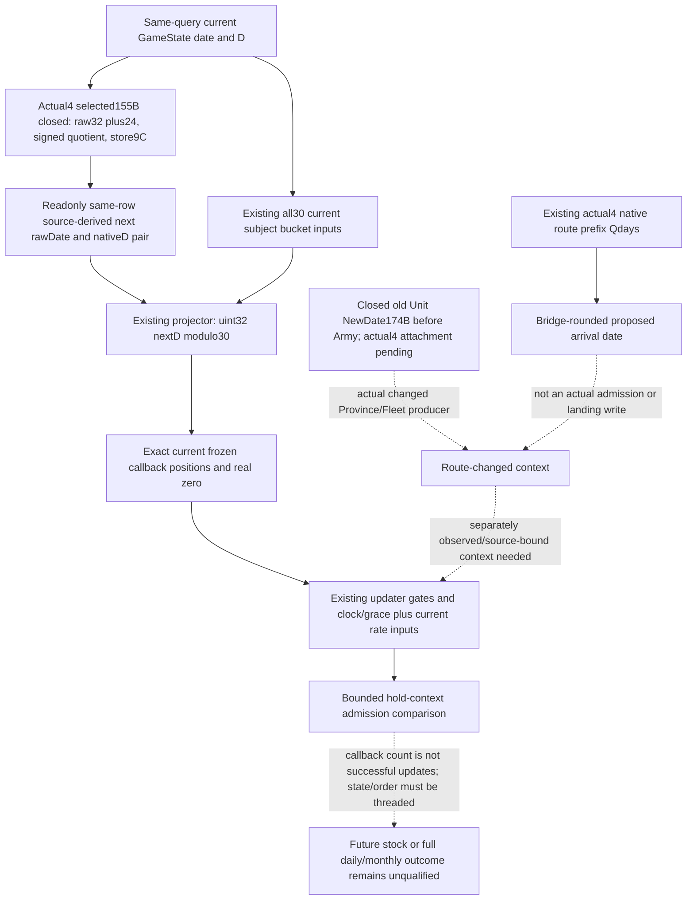

# Next admitted Army supply tick: exact4 input frontier

2026-10-07 / 2026-W41. Root's current G2 context is H9638, raw date53288448, saved cumulative6005, Robert29829. The next low32/date-D construction is **source-closed and offline whole-fixture qualified**. Root adopted the package onto immutable Source23 `ff93e7b8cd58c41242c28a5a92d5f8fbff94e6f6`, compiled the required24 production owners plus1 fixture, and authorized the new native/consumer first execution. Exact installed build is CK3 1.20.0.4 / Steam25734779 / inherited EXE SHA `98702f88a547cde2eaf29a85f93b85f68ee4cf8148336a4f7afaeb75319dd518`. Local game/SDK/input remain banned; this owner read no CK3 EXE or process. Side R68 supplies no G2 credit.

The highest-value gap was the pair that the next native date stage constructs for **low32 date and stored dispatcher D**. Current all30 phase inputs, updater predicates and native route duration already exist. The existing Service supplied no prospective pair. The new readonly same-row leaf supplies the source-derived next pair and joins it to unchanged observed bucket membership. It does not observe a future admitted date stage or tomorrow's actual mutated bucket. Neither `currentD+1` nor a rounded route ETA supplies the native assignment rule.

## Existing inputs and real consumption

| Required input | Exact existing source / publisher | Reuse boundary |
| --- | --- | --- |
| Current GameState date64, low32 date, stored signed32 D, date anchors and loaded grace | `army_update_clock_v1`; all30 collector independently reads GameState+8/+9C | Date and D remain distinct; phase selection is `uint32(D)%30`. |
| All30 original signed counts, subject pointer-match positions and repeated occurrences | `future_daily_supply_schedule_inputs_v1`; `ReadFutureDailySupplyScheduleInputs12004`; original6/a876 | Current frozen schedule only, independently ready phases and real empty0 preserved. Original package qualification is not advanced by this review. |
| Unit170, native combat/gathering, CArmy gathering count | `monthly_loss_budget_inputs_v1.unit_native_170_raw`, `native_unit_in_combat`, `native_unit_gathering`, `army_gathering_count_raw` | Actual4 updater24E4CF0/full463B and getters24AC3C0/full93B,24AC140/full80B already mapped; no duplicate observer. |
| Current Fleet date gate/modifiers, land branch, owner/Province resupply and full current rate operands | Existing current Fleet, land resupply/gain/rate siblings | Hold context explicitly; they do not observe a changed route landing. |
| Native committed-route remaining time | `current_movement_progress.committed_route_timeline`, `ReadCommittedRouteTimeline`, actual4 prefix getter24AAD80 | Retain unrounded Q100000 days. `RouteDurationToDate` is bridge rounding, not actual Unit NewDate/landing admission. |

The existing complete query path is registered `ck3_query_army_strengths` or `ck3_execute_step(step="query-army-strengths-v1")` → `GameplayBridgeService.query_army_strengths` → real native Army collector/whole serializer → strict `normalize_army_strengths` → selected Service rows → existing schedule projector. In the held a876 source, Service line4661 passes no prospective frames. Its signature line4484 and existing MCP signature line2600 contain no future date/D argument. The next input should be produced from that same native clock seed; this work invents no public tool or caller parameter.

## Concrete daily date writer recovered from sealed source

The previously sealed exact `.3` complete daily-date body `[22A0D80,22A232D)`/5549B is held as text at `Z:/ck3_mod_rewrite_process_assets/g2-resume-20261004/battle-calendar-admission-v57/pause-source/evidence/daily-date-stage-22a0d80-primary.asm.txt`. Its existing pin is `DAILY-DATE-12003-SPAN-PINS.json`, SHA `a6c98746b9272fb80168bcf3ea6ba34a5ddc3ddaf50a3cf54de12cf3712068e5`. This task read only selected decoded instructions, with no binary or EXE read.

| Exact old instruction interval | Source-proven role |
| --- | --- |
| `[22A0DA4,22A0DA7)`/3B | `mov rsi,rcx`: retain the daily-stage receiver. |
| `22A0E8D`/4B | Add24 to receiver+8 low DWORD, modulo32. |
| `[22A0E91,22A0EB1)`/32B | Read the resulting raw32, add `FD63AA40` (-43800000), signed multiply/shift/correction, producing `r9d=trunc0(signed32(next_raw-43800000)/24)`. |
| `[22A0EB1,22A0F1E)` | Calendar field reconstruction retains that r9d until the store; table contents are not needed to identify the low32/D pair. |
| `[22A0F1E,22A0F25)`/7B | Store r9d to receiver+9C, the dispatcher D operand. |

Retained old/new `.pdata` ordinal118687 pairs old `[22A0D80,22A232D)` with actual4 `[22A0D60,22A230D)`, each5549B; unwind523A548→523A63C. This concrete metadata row supplied the candidate. No global RVA delta was assumed. Root then performed the single selected frozen-file extraction: actual4 `[22A0D84,22A0D87)`/3B and `[22A0E6D,22A0F05)`/152B. The final actual4 store is22A0EFE. Receiver1 and date/D42 instructions completely decoded and normalized equal, retaining constants/member offsets/registers/order and local branch topology. Receipt `actual4-selected-writer-root-first01/ROOT-SELECTED-WRITER-RECEIPT.json` is GREEN with155B/2reads, old EXE/header/hash/process/game/SDK/input0.

The closed readonly arithmetic is `nextRaw = signed32(uint32(currentRaw)+24)` and `nextD = trunc0(signed32(uint32(nextRaw)-43800000)/24)`. C++ unsigned arithmetic plus `std::bit_cast<int32_t>` preserves both DWORD wraps and division truncation. With the supplied G2 seed53288448, the source-derived pair is53288472/395353, selecting phase13 through `uint32(D)%30`. This is an independent value construction: upper CDate fields/RIP-backed calendar table contents, the full5549B function, native future admission and future effects are not qualified.

## Unit NewDate and route branch

The sealed old `.3` daily stage calls GameData+2A508/virtual18 at22A1D61, Combat at22A1D75 and Army at22A1D89, after the date/D assignment. The old Unit target is now independently closed: CUnitManager secondary+8 vtable477EFC8/slot18 → `[2AD6700,2AD67AE)`/174B; stored UnitID occurrences are validated and invoke24AB6D0 before tail2A98E50. Its source is `.../army-supply-tick/followups/disembark-entry-follow-on/unit-manager-daily-2ad6700.asm.txt`. The actual4 type/slot/body attachment is a separately bounded central dependency, not an unknown old target.

The existing route prefix getter provides a proposed arrival duration. It does not supply actual nextDate movement admission, changed Province20 or Fleet12C association, or incoming target usage. A hold comparison can reuse current context explicitly. A landing comparison additionally needs the source-bound actual Unit movement/association stage; a route ACK or rounded ETA cannot supply that result. This does not add a gate to current oneDay execution.

## Same Army query implementation and first qualification

`BindSourceDerivedNextDailySupplyFrame12004` binds only the inherited actual4 identity. The existing `ReadArmyStrengthsForScope` first collects the same Unit/CArmy current schedule seed, then calls `BuildSourceDerivedNextDailySupplyFrameInputs12004` over that captured value. `AppendArmyStrengthV1` adds the optional `source_derived_next_daily_supply_frame_inputs_v1` sibling. No second memory read, native writer call or GameState store occurs. Pair readiness remains independent of an unrelated unavailable bucket. All six actual-future/effect/full-transition flags are false.

The existing whole normalizer validates the optional native leaf and same-row identities. The Service feeds its source-derived pair into the existing schedule projector and labels the resulting prospective context as source-derived/conditional. The public query signature stays unchanged. Repeated positions are callback opportunities; they do not report successful updates or stock. Future admission, changed Province/Fleet context and state/order transitions remain concrete follow-on work rather than a gate on publishing the closed pair.

The new sole scene passed true `ReadArmyStrengthsForScope12004` whole `AppendArmyStrengthV1`/actual4-rendered command_result through the actual `NativeHeadlessGameplayDriver`, registered Army query and Service. Native FIRST exited0 in0.4980632s; the final sole compound exited0 in3.0554476s. Final execution is1 method/1 registered call/1 Service call/1 execute-step request. The original whole/context remain preserved; neither native body nor future inputs were rewritten by the consumer.

Fixture-owned current date53288448/currentD12/QWORD upper7 are synthetic inputs, not a new G2 D observation. The production reader produced next53288472/D395353, with phase13 original matching positions[1,3]/2 opportunities, while current phase12 is empty and phase4 remains unavailable from signed count-1. Pair readiness and selected conditional opportunities survive the unrelated partial phase. All future-stage/callback/full-CDate64/stock/full-daily/monthly flags remain false.

Two consumer harness RED attempts are retained. FIRST1 omitted `owner_character_id` from its synthetic current Army row, so `normalize_armies` rejected the semantic snapshot. Fix02 supplied the already compiled context actor29829; registered/Service business succeeded, then the harness raised `KeyError('binding')` because this existing Army query publishes `source` and `queried_snapshot_id/revision/native_revision`. Fix03 checks those actual Driver/Service provenance fields plus outgoing native expected_revision; all assertions pass. Native ran once, consumer ran3 times only for these necessary repairs. No runtime/provider/serializer rebuild or old Army/Fleet replay occurred. Existing two-scene fragment/memory-driver GREEN remains historical without promotion.

External packets, original FIRST1 raw wire/context, both RED consumer attempts, final `consumer-only-r23-fix03` compound receipt and Oct7/W41 fields are under `Z:/ck3_mod_rewrite_process_assets/g2-parallel-20261007/army-supply-next-tick-12004/`. Root owns adoption and shared reports. Repository integration uses rebase/cherry-pick, without merge or owner push. This is static-ready with an offline synthetic-memory whole fixture and production-path consumer; no paused live artifact, actual future frame or OODA completion is claimed.
