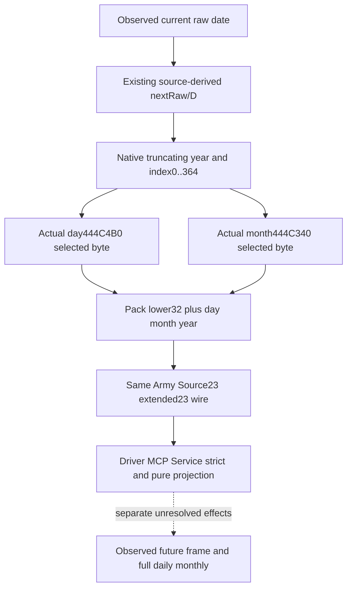

# Source-derived next full CDate64 on CK3 1.20.0.4

The existing Source23 Army query derives nextRaw/D from the genuine daily writer. This package retains that query and adds the packed native CDate upper word from two selected, loaded calendar bytes. It produces a source-derived clock input for route and supply modeling; it does not observe a future frame or execute daily/monthly effects.

The exact target is Steam build25734779, CK3 1.20.0.4, EXE SHA-256 `98702F88A547CDE2EAF29A85F93B85F68EE4CF8148336A4F7AFAEB75319DD518`. The candidate source baseline is `05e7ef5b08be07afd9cd747d5d60965c3c2aee5b`; earlier Source23 and selected-writer receipts retain their own frozen source/runtime pins. The previous Source23 whole Native → Driver → MCP → Service FIRST GREEN is reused, without replay. This new full64 producer and consumer are source prepared and FIRST NOTRUN.

## Genuine writer and exact table operands

The held whole daily source is `Z:/ck3_mod_rewrite_process_assets/g2-resume-20261004/battle-calendar-admission-v57/pause-source/evidence/daily-date-stage-22a0d80-primary.asm.txt`. Its entry RCX is retained in RSI. CDate is `RSI+8`: low DWORD `+8`, day BYTE `+C`, month BYTE `+D`, year WORD `+E`. The independent D day key is DWORD `+9C`. There is no `+94` field operand; `22A0E94` is an instruction RVA.

The existing actual4 selected-writer evidence under `Z:/ck3_mod_rewrite_process_assets/g2-parallel-20261007/army-supply-next-tick-12004/actual4-selected-writer-root-first01/` closes year WORD store `22A0ECA`, month BYTE `22A0EDF`, day BYTE `22A0EFB`, and D DWORD `22A0EFE`. Day LEA `22A0EF0` resolves to actual4 `444C4B0`.

The missing month-base reaching instruction was old `22A0E0B`, `lea r10,[rip+21AB69E]`, whose RIP-next `22A0E12` resolves to old `444C4B0`. R10 remains unchanged until old month load `22A0EFA`. The old seven bytes `4C8D159EB61A02` are reconstructed from the held decoded ASM: **`captured_raw=false`**, with no old EXE byte read. Cached runtime-function ordinal118687 and the instruction's offset8B locate the actual4 candidate `22A0DEB`.

Root executed the unique seven-byte read once. Actual bytes `4C8D154EB51A02` decode `lea r10,[rip+21AB54E]`; RIP-next `22A0DF2` resolves to **actual4 month table `444C340`**. Receipt: `Z:/ck3_mod_rewrite_process_assets/g2-parallel-20261007/army-cdate-upper-calendar-12004/month-r10-first01/FAMILY-MAP.json`, with `calendar_month_table_r10_lea-DETAIL.json`. Cost: new7B/one actual read; old reference is an ASM reconstruction, not an actual raw-pair capture. Normalized equality cannot strengthen that old provenance.

## Readonly arithmetic and same-query wire

The source's arithmetic is:

```text
nextRaw = uint32(currentRaw + 24)
days = trunc0(int32(nextRaw - 43800000) / 24)
year = trunc0(days / 365)
index = days - year * 365
if index < 0: index += 365
packed = uint32(nextRaw)
       | uint64(dayTable[index]) << 32
       | uint64(monthTable[index]) << 40
       | uint64(uint16(year)) << 48
native_signed_storage = bit_cast<int64>(packed)
```

The negative-remainder correction changes only the index, without decrementing the stored year. Index0–364 is the native consumption footprint and arithmetic period, not proof of an array descriptor length. The readonly collector loads exactly the selected day and month bytes; it neither dumps either table nor calls the daily writer or a date mutator.

`ck3_12004_cdate_calendar.hpp` exposes the two actual RVAs and `ReadSourceDerivedNextCDateCalendar12004(nextRaw, nextD, day_table, month_table)`. `BindSourceDerivedNextDailySupplyFrame12004` binds these pointers only under its existing exact4 identity admission. The same Army row's `source_derived_next_daily_supply_frame_inputs_v1` becomes23 keys with four additions:

| Field | Native/wire meaning |
| --- | --- |
| `source_derived_next_date_storage_raw64` | Signed64 native packed storage as a decimal JSON integer, preserved by Python |
| `source_derived_next_calendar_day_u8` | Selected loaded day byte |
| `source_derived_next_calendar_month_u8` | Selected loaded month byte |
| `source_derived_full_cdate64_ready` | Both selected loaded bytes and packed value available |

The strict consumer accepts the earlier exact19-key shape and the extended exact23-key shape. It preserves native values; it does not calculate or invent the packed result. The pure projection exposes those values on the prospective next frame and sets `full_future_cdate64_reconstructed` only from the new native readiness flag. A manually enabled binding without calendar pointers still provides the prior nextRaw/D pair with full64false. The earlier low/D fixture clears its new pointers because its fake image base has no calendar storage; it is not replayed or requalified here.



## One new whole qualification recipe

Root registers only `include(cmake/source_derived_next_full_cdate64_whole_12004.cmake)`. Target `xar_ck3_12004_source_derived_next_full_cdate64_whole_test` uses the genuine `ReadArmyStrengthsForScope12004` → existing whole serializer → actual4 identity renderer. Caller-owned calendar bytes and five callback stubs are explicit fixture inputs; no EXE native callback or game is invoked. The one whole scene preserves full IDs, duplicate ordered regiments, existing native pair inputs, query sequence, and frame context. Its next index58 selects day28/month1/year1083, so full64 differs from simply adding24 to the captured current64.

Producer invocation: `xar_ck3_12004_source_derived_next_full_cdate64_whole_test.exe --wire-dir <fresh-directory>`. It emits `01-source-derived-next-full-cdate64.json`, matching `01-source-derived-next-full-cdate64-native-context.json`, and `PRODUCER-RECEIPT.json`.

The sole new consumer is `test_source_derived_next_full_cdate64_whole_service_12004.py`, method `SourceDerivedNextFullCdate64WholeService12004Tests.test_first_native_full_cdate64_reaches_execute_and_direct_service`. Arguments: `--source-root <frozen-root> --native-wire <fresh-whole-file> --output-dir <fresh-consumer-directory>`, launched using `Z:/ck3_mod_rewrite/tools/.venv/Scripts/python.exe -B -X utf8`. One compound consumes the unchanged whole body through actual registered execute-step and direct Army routes in two fresh drivers; endpoint/frame correlation is explicitly fixture transport context. It checks the full packed value, preserved native inputs, both production routes and old19 normalization compatibility. Root owns its first run.

`actual_future_frame_observed`, native stage future observation, full daily/monthly completion, effect-chain completion, route/supply simulation and production-day credit remain false. A successful fixture will qualify transport of this source-derived clock value; it will not credit an actual future game day.
