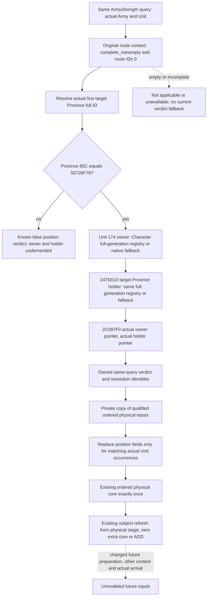

# Next-route replenishment position condition — CK3 1.20.0.4

Source closure on 2026-10-08 (Asia/Shanghai), ISO week 41. Candidate capability and its sole FIRST qualification are authored, not run. Root owns compilation, native fixture execution, registered MCP consumption and game observation.

The missing numerical input is the selected Unit's replenishment position verdict at the **actual stored first route Province**, while all other ordered refill operands remain captured current inputs. Moving state 7 alone is not a no-refill rule in this predicate. This is a conditional projection, not an observed arrival, a new prepared cache, or a full future monthly troop forecast.

Exact build: Steam 25734779, 1.20.0.4, EXE SHA-256 `98702f88a547cde2eaf29a85f93b85f68ee4cf8148336a4f7afaeb75319dd518`. Source base is Source31/32 `2ae0fbd8a80fd28970f7f441f17037ebb60c8a1c`. The already closed current wrapper is `[24ACAA0,24ACB73)` (211 B). It uses Unit+20 or the loaded Province fallback, checks Province+85C against `50726F76`, resolves Unit+174 owner and the result of Province-holder getter `247D010` through the Character registry/fallback, then calls `2C097F0(owner,holder)`. Character full IDs at +18 are compared, not just their low indices. No Unit or cache writes occur here.

Root's sole finite mapper call completed in 0.5290583 s. The actual4 `[2C097F0,2C099C1)` 465 B body was reused from held cache: **0 new EXE bytes, 0 new capture calls**, complete instruction-span normalized equality. Receipt: `Z:/ck3_mod_rewrite_process_assets/g2-background-20261008/future-replenishment-condition-source/actual4-owner-holder-first01/FAMILY-MAP.json`. The helper first admits equal owner/holder full IDs. Its remaining directional predicates and actual War-side participant checks are retained as a native read-only Boolean; their opaque names are not relabeled as generic military access. The actual holder-to-participant/owner direction is preserved. These callee bodies need no recapture to observe the whole verdict.

The source construction keeps requested owner/holder IDs absent when a missing registry causes the native path to skip those loads. Full ID 0 is legal. A resolved native fallback is a recorded operand, not a failed read. An invalid target Province type is a valid false verdict with no political predicate call. Missing bindings, an incomplete route or an unresolved target remain distinct from false.

The proposed optional `next_route_replenishment_position_inputs_v1` is sampled inside existing Strength after the original route context is captured. It publishes actual Unit identity, current and first-target Province identities, Province type, raw demanded owner/holder full IDs, actual resolved identities/fallback choices, the independent native Boolean and a read status/reason. It does not reread another query's route, synthesize a Unit, mutate Unit+20 or call the mutating preparation entry `262C6A0`.

The independent Service result `next_route_position_scoped_ordered_refill_v1` consumes the normalized leaf and qualified `scoped_ordered_refill_inputs_v1`. It retains observed prepared148 and all other physical/context operands. It substitutes the position triple only for chunks whose associated Unit full ID matches the sampled Unit, then calls the shared physical core once and its subject refresh adapter. Missing demanded destination permission cannot borrow a current true verdict. Existing current and explicit fixed-chunk0 outputs retain their meanings.

The new fixture target and CTest are `xar_ck3_12004_next_route_replenishment_position_whole_test`. Root adds only the exclusive `native_bridge/cmake/next_route_replenishment_position_whole_12004.cmake` include; the reader and factory are inline, with no new runtime TU. This fixture uses the genuine exact4 Army factory and `ReadArmyStrengthsForScope12004` → existing Strength/Route/new sampler → `AppendArmyStrengthV1` → `Render12004BuildIdentity`. All objects and Boolean callbacks are fixture-owned. The other qualified full7 and subject DATA operands are explicitly supplied as typed fixture inputs after the whole read; this test does **not** requalify their old native collectors and does not claim EXE callback execution.

The sole new consumer is `tests/unit/test_next_route_replenishment_position_whole_service_12004.py`, requiring immutable `--source-root`, newly compiled aggregate `--native-wire`, and a unique `--output-dir`. It uses actual `NativeHeadlessGameplayDriver` → Service strict normalization → registered `ck3_query_army_strengths`, with an in-process endpoint delivering unchanged compiled rows. The ten NEW scenes cover a useful q-buffer witness (maximum 100/current 80/prepared 10000: current position false gives zero, first-target true gives q=10 and 90), legal false, missing demanded permission, invalid Province, legal full ID 0, native fallback, a different associated Unit held at 80 while the selected Unit reaches 90, an empty route, and the early zero/negative preparation branches with missing permission. It verifies one physical call per new conditional alternative, one zero-core subject refresh adapter, unchanged input DTOs, and no actual arrival/cache-write/full-month claim. Existing current and destination outputs are independent alternatives; their arithmetic is never chained or added together.

Implementation and all qualification recipes are **AUTHORED_NOTRUN**. This source task performed no production Python imports, tests, native builds, game/SDK/process/pipe reads, EXE captures or hashes. It reused the already closed211 B wrapper and Root's cached465 B mapped callee. One source-interface read initially used the wrong Git object database, failed, and was corrected to Source32's separate repository without rereading the mapped body. No readiness credit is taken for that tooling correction or the authored fixture.
